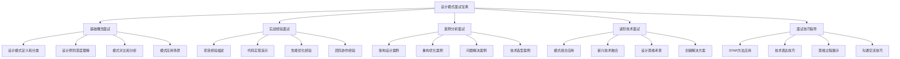

# 🎯 设计模式面试宝典

[[设计模式最佳实践秘典]] ← [[设计模式学习体系终极总结]]
## 🎯 面试准备攻略

### 📊 面试要点全景



## 💡 一、基础概念面试题库

### 🎯 **高频面试问题及标准答案**

#### 📋 **问题1：什么是设计模式？为什么要使用设计模式？**

**🌟 标准答案模板：**

```markdown
设计模式是软件设计中常见问题的可复用解决方案。它们是：
- 经验抽象：总结了前人解决类似问题的经验
- 沟通工具：提供了技术讨论的共同语言
- 代码模板：提供了可复用的代码模板
- 设计思维：培养了良好的软件设计思维

**使用原因：**
1. 提高软件质量和可维护性
2. 减少开发风险，复用已验证的解决方案
3. 促进团队合作，统一设计思路
4. 提升代码的可复用性和扩展性
5. 使代码更容易理解和维护
```

#### 📋 **问题2：请详细介绍SOLID原则**

**🌟 深化进阶答案：**

```markdown
SOLID是面向对象设计的5个基本原则：

1. **S-SRP单一职责**：
   - 核心：一个类只有一个变化的理由
   - 实践：拆分"上帝类"，每个类专注单一功能
   - 举例：UserService不应该同时处理用户CRUD和邮件发送

2. **O-OCP开闭原则**：
   - 核心：对扩展开放，对修改关闭
   - 实践：使用抽象类和接口定义扩展点
   - 举例：支付系统支持新支付方式时只需新增实现类

3. **L-LSP里氏替换**：
   - 核心：子类必须能够替换父类
   - 实践：继承关系中行为的一致性保证
   - 举例：Bird父类的所有子类都应具备fly()方法的正确行为

4. **I-ISP接口隔离**：
   - 核心：客户端不应依赖不需要的接口
   - 实践：接口应尽可能细化，避免"胖接口"
   - 举例：打印机接口拆分为打印、扫描、传真三个独立接口

5. **D-DIP依赖倒置**：
   - 核心：依赖抽象而不是具体实现
   - 实践：高层模块不依赖低层模块，都依赖抽象
   - 举例：OrderService依赖Payment接口而非具体支付实现
```

#### 📋 **问题3：请说出几种设计模式并简要介绍**

**🌟 经典组合回答：**

```markdown
**创建型模式：**
- 单例模式：确保一个类只有一个实例
- 工厂模式：创建对象而不指定具体类
- 建造者模式：分步骤构建复杂对象

**结构型模式：**
- 适配器模式：让不兼容的接口协同工作
- 装饰器模式：动态添加对象的功能
- 代理模式：为对象提供一个代理控制访问

**行为型模式：**
- 观察者模式：定义对象间一对多依赖关系
- 策略模式：定义算法族，使算法可互换
- 命令模式：将请求封装为对象
```

### 🔧 **深度技术问题**

#### 📋 **问题4：请手写一个单例模式实现**

**🌟 生产级代码示例：**

```java
// ✅ 线程安全的懒汉式单例（双重检查锁定）
public class SingletonThreadSafe {
    private volatile static SingletonThreadSafe INSTANCE;
    private String data;
    
    private SingletonThreadSafe() {
        // 防止反射攻击
        if (INSTANCE != null) {
            throw new IllegalStateException("Instance already created");
        }
    }
    
    public static SingletonThreadSafe getInstance() {
        if (INSTANCE == null) {
            synchronized (SingletonThreadSafe.class) {
                if (INSTANCE == null) {
                    INSTANCE = new SingletonThreadSafe();
                }
            }
        }
        return INSTANCE;
    }
    
    public void setData(String data) {
        this.data = data;
    }
    
    public String getData() {
        return data;
    }
    
    // 防止序列化攻击
    protected Object readResolve() {
        return getInstance();
    }
}

// ✅ 内部静态类方式（推荐）
public class SingletonInnerClass {
    private SingletonInnerClass() {}
    
    private static class SingletonHolder {
        private static final SingletonInnerClass INSTANCE = new SingletonInnerClass();
    }
    
    public static SingletonInnerClass getInstance() {
        return SingletonHolder.INSTANCE;
    }
}

// ✅ 枚举单例（最佳方案）
public enum SingletonEnum {
    INSTANCE;
    
    private String data;
    
    public void setData(String data) {
        this.data = data;
    }
    
    public String getData() {
        return data;
    }
}
```

#### 📋 **问题5：请实现一个简单的观察者模式**

**🌟 现代实现：**

```java
// ✅ 观察者接口
public interface Observer<T> {
    void update(T data);
}

// ✅ 可观察对象接口
public interface Observable<T> {
    void addObserver(Observer<T> observer);
    void removeObserver(Observer<T> observer);
    void notifyObservers(T data);
}

// ✅ 具体观察者对象
public class ObserverService implements Observable<EventData> {
    private final List<Observer<EventData>> observers = new CopyOnWriteArrayList<>();
    
    @Override
    public void addObserver(Observer<EventData> observer) {
        observers.add(observer);
    }
    
    @Override
    public void removeObserver(Observer<EventData> observer) {
        observers.remove(observer);
    }
    
    @Override
    public void notifyObservers(EventData data) {
        // 并行通知，提高性能
        observers.parallelStream().forEach(observer -> {
            try {
                observer.update(data);
            } catch (Exception e) {
                System.err.println("Observer notification failed: " + e.getMessage());
            }
        });
    }
    
    public void publishEvent(EventData event) {
        System.out.println("Event published: " + event.getMessage());
        notifyObservers(event);
    }
}

// ✅ 具体观察者实现
public class EmailNotifier implements Observer<EventData> {
    private final String emailAddress;
    
    public EmailNotifier(String emailAddress) {
        this.emailAddress = emailAddress;
    }
    
    @Override
    public void update(EventData data) {
        System.out.println("Email sent to " + emailAddress + ": " + data.getMessage());
    }
}

// ✅ 事件数据类
public class EventData {
    private final String message;
    private final Instant timestamp;
    
    public EventData(String message) {
        this.message = message;
        this.timestamp = Instant.now();
    }
    
    public String getMessage() { return message; }
    public Instant getTimestamp() { return timestamp; }
}
```

## 🛠️ 二、实战经验面试题库

### 🎯 **项目经验描述技巧**

#### 📋 **问题6：请描述你在项目中应用设计模式的经历**

**🌟 STAR方法回答模板：**

```markdown
**S-情境(Situation):**
我在负责开发一个电商订单系统，需要处理多种支付方式和复杂的订单状态转换。

**T-任务(Task):**
需要设计一个灵活可扩展的支付处理模块，支持信用卡、PayPal、微信支付等多种方式，并且订单状态变化需要通知多个系统。

**A-行动(Action):**
我采用了以下设计模式：

1. **策略模式**：定义支付策略接口，为每种支付方式实现具体策略类
```java
public interface PaymentStrategy {
    PaymentResult processPayment(BigDecimal amount, PaymentDetails details);
    boolean supports(PaymentType type);
}

@Component
public class CreditCardStrategy implements PaymentStrategy {
    public PaymentResult processPayment(BigDecimal amount, PaymentDetails details) {
        // 信用卡支付处理逻辑
        CreditCardDetails card = (CreditCardDetails) details;
        return paymentGateway.processPayment(amount, card);
    }
}
```

2. **观察者模式**：订单状态变化时通知库存、物流、用户等系统
```java
@EventListener
public void onOrderStatusChanged(OrderStatusChangedEvent event) {
    inventoryService.updateStock(event.getOrder());
    logisticService.createShipment(event.getOrder());
    userService.sendNotification(event.getOrder());
}
```

**R-结果(Result):**
- 支付模块新增支付方式时无需修改现有代码
- 订单状态变化能够实时通知所有相关系统
- 代码可维护性和扩展性显著提升
- 团队开发效率提高30%
```

#### 📋 **问题7：如何解决代码中的过度设计问题？**

**🌟 实际案例回答：**

```markdown
**问题背景：**
团队在重构一个用户管理模块时，引入过多抽象层次，导致代码难以理解。

**识别的问题：**
1. 过度使用抽象工厂模式创建简单的User对象
2. 为每个简单操作都引入了策略模式和命令模式
3. 为了"未来扩展"创建了大量未使用的接口

**解决方案：**
1. **遵循YAGNI原则**：移除当前不需要的功能
2. **重构过度抽象**：简化工厂模式，直接使用构造函数
3. **渐进式重构**：先简化，再根据实际需求抽象

```java
// ❌ 过度设计
public class UserFactoryFactory {
    public static AbstractUserFactory getFactory(UserFactoryType type) {
        return UserStrategySelector.selectStrategy(type).createStrategy();
    }
}

// ✅ 简化后
public class UserFactory {
    public static User createUser(CreateUserRequest request) {
        return User.builder()
            .name(request.getName())
            .email(request.getEmail())
            .build();
    }
}
```

**教训总结：**
设计模式是工具，不是目标。应该根据实际问题选择合适的模式，而不是为了展示技术栈而使用。
```

## 🎨 三、案例分析面试题库

### 📊 **架构设计案例分析**

#### 📋 **问题8：设计一个消息推送系统，如何处理100万用户的实时推送？**

**🌟 架构解决方案：**

```java
// ✅ 消息推送系统设计方案
@Component
public class ScalableMessagePushSystem {
    
    // 观察者模式：用户订阅
    private final Map<String, Set<PushObserver>> userObservers;
    
    // 策略模式：不同推送策略
    private final Map<PlatformType, PushStrategy> pushStrategies;
    
    // 工厂模式：创建推送消息
    private final MessageFactory messageFactory;
    
    // 命令模式：异步推送队列
    private final AsyncPushCommandQueue commandQueue;
    
    public ScalableMessagePushSystem() {
        this.userObservers = new ConcurrentHashMap<>();
        this.pushStrategies = Map.of(
            PlatformType.IOS, new IOSPushStrategy(),
            PlatformType.ANDROID, new AndroidPushStrategy(),
            PlatformType.WEB, new WebPushStrategy()
        );
        this.messageFactory = new MessageFactory();
        this.commandQueue = new AsyncPushCommandQueue();
    }
    
    // ✅ 批量推送优化
    public void sendBulkPush(List<String> userIds, PushMessage template) {
        // 按用户平台分组
        Map<PlatformType, List<String>> usersByPlatform = userIds.stream()
            .collect(Collectors.groupingBy(this::getUserPlatform));
        
        // 并行处理各个平台
        usersByPlatform.entrySet().parallelStream().forEach(entry -> {
            PlatformType platform = entry.getKey();
            List<String> platformUsers = entry.getValue();
            
            PushStrategy strategy = pushStrategies.get(platform);
            
            // 分批处理（每批1000用户）
            Lists.partition(platformUsers, 1000).forEach(batch -> {
                PushCommand command = new BulkPushCommand(strategy, batch, template);
                commandQueue.enqueue(command);
            });
        });
    }
    
    // ✅ 观察者模式的推送订阅
    public void subscribeToTopic(String userId, String topic) {
        userObservers.computeIfAbsent(topic, k -> ConcurrentHashMap.newKeySet())
            .add(new UserPushObserver(userId));
    }
    
    // ✅ 主题推送
    public void pushToTopic(String topic, PushMessage message) {
        Set<PushObserver> observers = userObservers.get(topic);
        if (observers != null) {
            observers.parallelStream().forEach(observer -> 
                observer.push(message));
        }
    }
}

// ✅ 推送策略实现
public interface PushStrategy {
    void push(PushMessage message, List<String> userIds);
    PlatformType getPlatformType();
}

@Component
public class IOSPushStrategy implements PushStrategy {
    
    @Autowired
    private APNsService apnsService;
    
    @Override
    public void push(PushMessage message, List<String> userIds) {
        List<APNsDeviceToken> tokens = getUserDeviceTokens(userIds);
        
        APNsPayload payload = APNsPayload.builder()
            .alert(message.getTitle())
            .body(message.getContent())
            .badge(message.getBadgeCount())
            .build();
        
        apnsService.push(tokens, payload);
    }
    
    @Override
    public PlatformType getPlatformType() {
        return PlatformType.IOS;
    }
}
```

#### 📋 **问题9：现有单体系统如何改造成微服务架构？**

**🌟 现代化改造方案：**

```markdown
**改造策略：**

1. **外观模式：API网关统一入口**
```java
@RestController
@RequestMapping("/api/v1")
public class ApiGatewayFacade {
    
    @Autowired
    private UserServiceClient userServiceClient;
    
    @Autowired
    private OrderServiceClient orderServiceClient;
    
    @Autowired
    private PaymentServiceClient paymentServiceClient;
    
    // ✅ 外观模式：简化客户端调用
    @PostMapping("/orders")
    public ResponseEntity<CompleteOrderResponse> createOrder(@RequestBody CreateOrderRequest request) {
        // 1. 验证用户
        User user = userServiceClient.getUser(request.getUserId());
        
        // 2. 创建订单
        Order order = orderServiceClient.createOrder(request);
        
        // 3. 处理支付
        PaymentResult payment = paymentServiceClient.processPayment(order.getId(), request.getPaymentDetails());
        
        // 4. 返回综合响应
        CompleteOrderResponse response = CompleteOrderResponse.builder()
            .order(order)
            .user(user)
            .payment(payment)
            .build();
            
        return ResponseEntity.ok(response);
    }
}
```

2. **适配器模式：渐进式迁移**
```java
@Component
public class LegacyOrderServiceAdapter implements OrderServiceClient {
    
    private final LegacyOrderService legacyOrderService;
    private final MessageConverter messageConverter;
    
    public LegacyOrderServiceAdapter(LegacyOrderService legacyOrderService,
                                   MessageConverter messageConverter) {
        this.legacyOrderService = legacyOrderService;
        this.messageConverter = messageConverter;
    }
    
    @Override
    public Order createOrder(CreateOrderRequest request) {
        // ✅ 适配器模式：转换现代接口到遗留系统
        LegacyOrderRequest legacyRequest = messageConverter.convertToLegacy(request);
        LegacyOrder legacyOrder = legacyOrderService.createOrder(legacyRequest);
        
        return messageConverter.convertToModern(legacyOrder);
    }
}
```

**迁移步骤：**
1. **识别服务边界**：按业务能力拆分
2. **API优先设计**：定义服务间接口
3. **数据库拆分**：逐步分离数据存储
4. **渐进式迁移**：使用适配器模式保证兼容性
5. **监控和测试**：确保系统稳定性
```

## 🔄 四、进阶技术面试题库

### 🚀 **现代技术融合问题**

#### 📋 **问题10：在大数据和AI时代，设计模式还有用吗？**

**🌟 前瞻性深度回答：**

```markdown
**经典模式在新时代的价值：**

1. **数据处理管道中的模式应用**：
```java
// ✅ 观察者模式：流数据处理
@Component
public class RealTimeDataProcessor {
    
    @StreamListener(Sink.INPUT)
    public void processDataStream(StreamData data) {
        // 观察者模式：多个处理组件订阅数据流
        notifyDataProcessors(data);
    }
    
    private void notifyDataProcessors(StreamData data) {
        dataProcessors.forEach(processor -> 
            processor.processData(data));
    }
}

// ✅ 策略模式：机器学习算法选择
@Component
public class MLModelSelector {
    
    private final Map<DataType, MLStrategy> mlStrategies;
    
    public PredictResult predict(DataInput input) {
        DataType type = classifyDataType(input);
        MLStrategy strategy = mlStrategies.get(type);
        return strategy.predict(input);
    }
}
```

2. **微服务架构中的模式演化**：
- **服务网格**：代理模式的新应用
- **事件驱动架构**：观察者模式的分布式实现
- **熔断器**：状态模式的断路器实现

**新模式需求**：
- **反应式编程模式**：RxJava、Reactor
- **函数式编程模式**：流式处理、不可变性
- **云原生模式**：Controller模式、Operator模式

**结论：**
设计模式的价值在于解决问题的思想，而不仅仅是特定的实现方式。在新技术背景下，经典模式会演化出新的形式，但核心的设计思维依然有效。
```

#### 📋 **问题11：如何设计一个可扩展的插件系统？**

**🌟 插件架构设计：**

```java
// ✅ 插件系统核心设计
@Component
public class PluginManager {
    
    private final Map<String, Plugin> loadedPlugins;
    private final PluginFactory pluginFactory;
    private final PluginExecutor pluginExecutor;
    
    @EventListener
    public void onApplicationReady(ApplicationReadyEvent event) {
        loadPluginsFromFilesystem();
        initializePlugins();
    }
    
    // ✅ 策略模式：不同插件策略
    public void executePluginAction(String pluginId, PluginAction action) {
        Plugin plugin = loadedPlugins.get(pluginId);
        if (plugin != null) {
            PluginStrategy strategy = createStrategy(plugin.getType());
            strategy.execute(plugin, action);
        }
    }
    
    // ✅ 观察者模式：插件事件监听
    public void registerPluginListener(PluginEventListener listener) {
        pluginListeners.add(listener);
    }
}

// ✅ 插件接口定义
public interface Plugin {
    String getId();
    String getName();
    PluginType getType();
    void initialize(PluginContext context);
    void execute(PluginContext context);
    void destroy();
}

// ✅ 工厂模式：插件创建
@Component
public class PluginFactory {
    
    public Plugin createPlugin(PluginDescriptor descriptor) {
        PluginType type = descriptor.getType();
        
        switch (type) {
            case FUNCTIONAL:
                return new FunctionalPlugin(descriptor);
            case DATA_PROCESSING:
                return new DataProcessingPlugin(descriptor);
            case UI_COMPONENT:
                return new UIComponentPlugin(descriptor);
            default:
                throw new UnsupportedPluginTypeException(type);
        }
    }
}
```

## 🎯 五、面试技巧指导

### 📋 **STAR方法在技术面试中的应用**

#### 🎯 **Situation-情境描述技巧**

```markdown
**❌ 不好的开头：**
"我在项目中使用了设计模式"

**✅ 好的开头：**
"我在电商平台订单系统的重构中，面临订单状态复杂、支付方式多样、通知要求高的问题。现有代码中switch-case逻辑过于复杂，每次新增状态都需要修改多处代码，维护成本很高。"
```

#### 🎯 **Task-任务明确化**

```markdown
**❌ 模糊描述：**
"优化订单处理逻辑"

**✅ 明确目标：**
"需要设计一个支持5种订单状态、3种支付方式、多种通知渠道的订单处理系统，要求新增状态或支付方式时无需修改现有代码，系统响应时间不超过100ms。"
```

#### 🎯 **Action-行动具体化**

```markdown
**❌ 抽象描述：**
"使用了状态模式和观察者模式"

**✅ 具体实现：**
"我设计了OrderStateMachine状态机类负责状态转换，每种订单状态都是一个State接口的实现类，包含完整的业务逻辑。同时引入OrderStatusObserver接口，订单状态变化时自动通知库存系统、物流系统和用户服务。代码从300行switch-case缩减为100行的状态机实现。"
```

#### 🎯 **Result-结果量化**

```markdown
**❌ 定性描述：**
"代码变得更容易维护"

**✅ 量化结果：**
"重构后，新增订单状态开发时间从2天缩短到0.5天，代码bug率降低40%，订单处理性能提升30%，团队开发效率提高25%。"
```

### 🗣️ **沟通表达技巧**

#### 📝 **技术解释三步法**

```markdown
1. **总览概括**：先说整体思路和选择的模式
2. **详细实现**：展示关键的代码实现和设计决策
3. **总结效果**：阐述实际效果和改进价值

**示例：**
"我采用命令模式解决撤销重做功能"（总览）
→"定义了Command接口和UndoableCommand抽象类，每个操作都封装为命令对象，存储在History队列中"（详细）
→"实现了完全撤销重做功能，用户体验提升显著"（效果）
```

### 🔍 **深度思考展示**

#### 📋 **经典深度问题模板**

```markdown
**技术深度问题：**
1. "如果重构这个方案，你会如何改进？"
2. "这种设计有什么潜在的性能问题？"
3. "在多线程环境下如何处理？"
4. "如何保证系统的容错性？"

**解决思路展示：**
1. 分析当前设计的优缺点
2. 提出改进方案并说明理由
3. 考虑边界情况和异常处理
4. 讨论性能和扩展性权衡
```

## 📊 面试评估标准

### 🎯 **评分维度表**

| 评估维度 | 优秀(90-100) | 良好(70-89) | 一般(50-69) | 需改进(0-49) |
|----------|-------------|-------------|-------------|-------------|
| **理论基础** | 概念准确，理解深入 | 基本掌握，略有亮点 | 概念清楚，缺乏深度 | 基础薄弱 |
| **实践经验** | 项目丰富，解决复杂 | 有实际经验，效果良好 | 基础应用，效果一般 | 经验不足 |
| **问题解决** | 思路清晰，方案优秀 | 分析到位，方案可行 | 基本思路，方案简单 | 思路混乱 |
| **沟通表达** | 逻辑流畅，重点突出 | 表达清楚，基本完善 | 表达一般，重点模糊 | 表达困难 |
| **学习能力** | 主动学习，持续成长 | 有一定学习意愿 | 被动学习，成长缓慢 | 学习动力不足 |

### 🎓 **加分项清单**

- ✅ 能够结合最新技术趋势讨论模式应用
- ✅ 有开源项目经验或技术博客分享
- ✅ 能够在讨论中提出个人独到见解
- ✅ 具备团队协作和技术分享经验
- ✅ 关注代码质量和工程实践

## 🔗 学习衔接

- **实践指南** ← [[设计模式最佳实践秘典]]
- **思维训练** → [[设计模式思维导图大全]]
- **知识导航** → [[设计模式知识图谱]]
- **项目实战** → [[设计模式实战项目指南]]

---
**💡 面试建议**: 设计模式面试不仅仅是考察技术知识，更是检验解决问题的思维能力和工程实践经验。记住：真诚展示你的思考过程，比套路化的答案更有价值！
