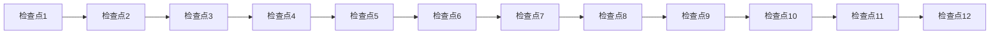

# 学习检查点

## 🎯 检查点设计原则

基于**费曼学习法**和**刻意练习**理论，每个检查点都包含：
- **概念理解**：能否用简单语言解释核心概念
- **知识应用**：能否运用知识解决实际问题
- **知识关联**：能否建立不同知识点间的联系
- **实践能力**：能否进行相关计算和分析

## 📋 检查点清单

### 检查点1：金融学概述
**完成时间：** 第1周末
**检查内容：** [[01-基础理论/金融学概述/金融学定义与研究对象|金融学概述]]模块

#### 概念理解检查
- [ ] **金融学定义**：能否用一句话解释什么是金融学？
- [ ] **金融体系功能**：能否列举金融体系的5个基本功能？
- [ ] **金融学发展**：能否简述金融学发展的3个主要阶段？

#### 知识应用检查
- [ ] **案例分析**：能否分析一个简单的金融现象？
- [ ] **概念辨析**：能否区分金融学与经济学的关系？

#### 关联性检查
- [ ] **学科联系**：能否说明金融学与其他学科的关系？
- [ ] **历史脉络**：能否将金融史重要事件按时间排序？

**自评分数：** ___/10
**需要改进：** 

---

### 检查点2：货币与信用
**完成时间：** 第3周末
**检查内容：** [[01-基础理论/货币与信用/货币本质与职能|货币与信用]]模块

#### 概念理解检查
- [ ] **货币职能**：能否解释货币的5个基本职能？
- [ ] **信用工具**：能否列举3种主要信用工具？
- [ ] **利率理论**：能否解释利率决定的基本原理？

#### 知识应用检查
- [ ] **货币计算**：能否计算简单的货币乘数？
- [ ] **利率分析**：能否分析利率变化的影响因素？

#### 关联性检查
- [ ] **货币与信用**：能否说明货币与信用的关系？
- [ ] **利率与投资**：能否解释利率如何影响投资决策？

**自评分数：** ___/10
**需要改进：** 

---

### 检查点3：金融市场基础
**完成时间：** 第4周末
**检查内容：** [[01-基础理论/金融市场基础/金融市场概述|金融市场基础]]模块

#### 概念理解检查
- [ ] **市场分类**：能否按不同标准对金融市场进行分类？
- [ ] **市场功能**：能否解释金融市场的价格发现功能？
- [ ] **市场效率**：能否解释有效市场假说的含义？

#### 知识应用检查
- [ ] **市场分析**：能否分析某个金融市场的特点？
- [ ] **价格形成**：能否解释金融产品价格的形成机制？

#### 关联性检查
- [ ] **市场与机构**：能否说明金融市场与金融机构的关系？
- [ ] **市场与监管**：能否解释市场失灵与监管的关系？

**自评分数：** ___/10
**需要改进：** 

---

### 检查点4：金融机构
**完成时间：** 第6周末
**检查内容：** [[02-机构与监管/金融机构/中央银行|金融机构]]模块

#### 概念理解检查
- [ ] **央行职能**：能否解释中央银行的3个基本职能？
- [ ] **银行体系**：能否说明商业银行的主要业务？
- [ ] **其他机构**：能否列举3种非银行金融机构？

#### 知识应用检查
- [ ] **机构分析**：能否分析某类金融机构的作用？
- [ ] **业务理解**：能否解释银行的主要业务模式？

#### 关联性检查
- [ ] **机构与市场**：能否说明金融机构与金融市场的关系？
- [ ] **机构与监管**：能否解释金融机构需要监管的原因？

**自评分数：** ___/10
**需要改进：** 

---

### 检查点5：金融监管
**完成时间：** 第7周末
**检查内容：** [[02-机构与监管/金融监管/金融监管理论基础|金融监管]]模块

#### 概念理解检查
- [ ] **监管目标**：能否解释金融监管的3个主要目标？
- [ ] **监管工具**：能否列举3种主要监管工具？
- [ ] **监管原则**：能否说明金融监管的基本原则？

#### 知识应用检查
- [ ] **监管分析**：能否分析某个监管政策的效果？
- [ ] **风险识别**：能否识别金融体系的主要风险？

#### 关联性检查
- [ ] **监管与创新**：能否解释监管与金融创新的关系？
- [ ] **国际监管**：能否说明国际金融监管合作的重要性？

**自评分数：** ___/10
**需要改进：** 

---

### 检查点6：投资学
**完成时间：** 第8周末
**检查内容：** [[03-投资学/投资基础/投资组合理论|投资学]]模块

#### 概念理解检查
- [ ] **投资理论**：能否解释马科维茨投资组合理论？
- [ ] **CAPM模型**：能否解释资本资产定价模型？
- [ ] **风险收益**：能否说明风险与收益的关系？

#### 知识应用检查
- [ ] **组合构建**：能否构建简单的投资组合？
- [ ] **风险计算**：能否计算投资组合的风险？

#### 关联性检查
- [ ] **理论与市场**：能否说明投资理论与市场实践的关系？
- [ ] **投资与公司**：能否解释投资决策对公司的影响？

**自评分数：** ___/10
**需要改进：** 

---

### 检查点7：公司金融
**完成时间：** 第12周末
**检查内容：** [[04-公司金融/价值评估/现金流折现模型|公司金融]]模块

#### 概念理解检查
- [ ] **估值方法**：能否解释DCF估值模型？
- [ ] **资本结构**：能否说明MM理论的基本内容？
- [ ] **公司治理**：能否解释代理问题的含义？

#### 知识应用检查
- [ ] **企业估值**：能否进行简单的企业估值？
- [ ] **融资决策**：能否分析企业的融资选择？

#### 关联性检查
- [ ] **估值与投资**：能否说明企业估值与投资决策的关系？
- [ ] **治理与价值**：能否解释公司治理对企业价值的影响？

**自评分数：** ___/10
**需要改进：** 

---

### 检查点8：国际金融
**完成时间：** 第15周末
**检查内容：** [[05-国际金融/汇率理论/汇率决定理论|国际金融]]模块

#### 概念理解检查
- [ ] **汇率理论**：能否解释购买力平价理论？
- [ ] **国际收支**：能否说明国际收支平衡表的结构？
- [ ] **汇率制度**：能否区分固定汇率与浮动汇率？

#### 知识应用检查
- [ ] **汇率分析**：能否分析汇率变化的影响因素？
- [ ] **国际投资**：能否分析国际投资的风险？

#### 关联性检查
- [ ] **汇率与贸易**：能否说明汇率与国际贸易的关系？
- [ ] **国际金融与国内**：能否解释国际金融对国内经济的影响？

**自评分数：** ___/10
**需要改进：** 

---

### 检查点9：金融创新
**完成时间：** 第16周末
**检查内容：** [[06-金融创新/金融创新/金融创新动因|金融创新]]模块

#### 概念理解检查
- [ ] **创新动因**：能否解释金融创新的主要动因？
- [ ] **金融科技**：能否说明金融科技的主要应用？
- [ ] **数字货币**：能否解释数字货币的特点？

#### 知识应用检查
- [ ] **创新分析**：能否分析某个金融创新的影响？
- [ ] **风险评估**：能否评估金融创新的风险？

#### 关联性检查
- [ ] **创新与监管**：能否说明金融创新与监管的关系？
- [ ] **创新与发展**：能否解释金融创新对金融发展的作用？

**自评分数：** ___/10
**需要改进：** 

---

### 检查点10：数学工具
**完成时间：** 第18周末
**检查内容：** [[07-数学工具/金融数学基础/概率论与统计学|数学工具]]模块

#### 概念理解检查
- [ ] **概率统计**：能否解释概率论在金融中的应用？
- [ ] **时间序列**：能否说明时间序列分析的基本方法？
- [ ] **回归分析**：能否解释回归分析在金融建模中的作用？

#### 知识应用检查
- [ ] **计算能力**：能否进行基本的金融计算？
- [ ] **软件应用**：能否使用Excel或Python进行金融分析？

#### 关联性检查
- [ ] **数学与金融**：能否说明数学工具对金融分析的重要性？
- [ ] **工具与理论**：能否解释数学工具如何支持金融理论？

**自评分数：** ___/10
**需要改进：** 

---

### 检查点11：实践应用
**完成时间：** 第21周末
**检查内容：** [[08-实践应用/案例分析/经典案例分析|实践应用]]模块

#### 概念理解检查
- [ ] **案例分析**：能否分析经典金融案例？
- [ ] **计算练习**：能否完成相关计算练习？
- [ ] **模拟交易**：能否进行模拟交易操作？

#### 知识应用检查
- [ ] **综合分析**：能否综合运用所学知识分析问题？
- [ ] **决策能力**：能否做出合理的金融决策？

#### 关联性检查
- [ ] **理论与实践**：能否将理论知识与实践相结合？
- [ ] **知识整合**：能否整合不同模块的知识？

**自评分数：** ___/10
**需要改进：** 

---

### 检查点12：综合提升
**完成时间：** 第24周末
**检查内容：** [[09-综合提升/跨领域整合/金融与宏观经济|综合提升]]模块

#### 概念理解检查
- [ ] **跨领域整合**：能否整合金融学与其他学科的知识？
- [ ] **前沿研究**：能否理解金融学的前沿发展？
- [ ] **个人思考**：能否形成独立的金融思维？

#### 知识应用检查
- [ ] **综合分析**：能否进行复杂的金融分析？
- [ ] **创新思维**：能否提出创新的金融观点？

#### 关联性检查
- [ ] **知识体系**：能否构建完整的金融知识体系？
- [ ] **未来发展**：能否规划未来的学习和发展方向？

**自评分数：** ___/10
**需要改进：** 

## 📊 检查点评估标准

### 评分标准
- **9-10分**：优秀 - 完全掌握，能够灵活应用
- **7-8分**：良好 - 基本掌握，能够应用
- **5-6分**：及格 - 部分掌握，需要加强
- **3-4分**：不及格 - 掌握不足，需要重新学习
- **1-2分**：很差 - 基本未掌握，需要从基础开始

### 改进建议
- **9-10分**：可以进入下一阶段学习
- **7-8分**：需要加强练习，巩固知识
- **5-6分**：需要重新学习相关概念
- **3-4分**：需要回到基础理论重新学习
- **1-2分**：需要从最基础的概念开始学习

## 🔄 检查点使用指南

### 使用时机
- 每个模块学习完成后
- 每周学习结束时
- 遇到学习困难时
- 准备进入下一阶段时

### 使用方法
1. **诚实自评**：客观评估自己的掌握程度
2. **记录问题**：详细记录不理解的地方
3. **制定计划**：根据评估结果制定改进计划
4. **持续跟踪**：定期回顾和更新评估结果

### 改进策略
- **概念不清**：回到原始材料重新学习
- **应用困难**：增加练习和案例分析
- **关联性差**：加强知识点间的联系
- **实践不足**：增加实际操作和模拟练习

## 📈 学习进度跟踪

### 总体进度
| 检查点 | 完成时间 | 自评分数 | 改进计划 | 完成状态 |
|--------|----------|----------|----------|----------|
| 检查点1 | | | | ⏳ |
| 检查点2 | | | | ⏳ |
| 检查点3 | | | | ⏳ |
| 检查点4 | | | | ⏳ |
| 检查点5 | | | | ⏳ |
| 检查点6 | | | | ⏳ |
| 检查点7 | | | | ⏳ |
| 检查点8 | | | | ⏳ |
| 检查点9 | | | | ⏳ |
| 检查点10 | | | | ⏳ |
| 检查点11 | | | | ⏳ |
| 检查点12 | | | | ⏳ |

### 学习曲线

## 💡 费曼学习法应用

### 检查点设计理念
每个检查点都基于费曼学习法的四个步骤：
1. **选择概念**：选择核心金融概念
2. **教授他人**：用简单语言解释概念
3. **识别盲点**：发现知识漏洞
4. **简化表达**：用类比重新组织知识

### 刻意练习要素
- **明确目标**：每个检查点都有具体目标
- **专注练习**：集中注意力在薄弱环节
- **及时反馈**：通过自评获得反馈
- **走出舒适区**：挑战更复杂的问题
