# 学习路径图

## 🎯 学习目标
掌握金融学核心理论体系，具备金融分析、投资决策和风险管理能力

## 📚 学习路径（金字塔模型）

### 第一层：认知层（Foundation）
**目标：** 建立金融学基础认知框架
- [[01-基础理论/金融学概述/金融学定义与研究对象|金融学定义与研究对象]]
- [[01-基础理论/货币与信用/货币本质与职能|货币本质与职能]]
- [[01-基础理论/金融市场基础/金融市场概述|金融市场概述]]

### 第二层：理解层（Comprehension）
**目标：** 深入理解金融机制和关系
- [[02-机构与监管/金融机构/中央银行|中央银行]]
- [[03-投资学/投资基础/投资组合理论|投资组合理论]]
- [[04-公司金融/价值评估/现金流折现模型|现金流折现模型]]

### 第三层：应用层（Application）
**目标：** 掌握金融工具和实践技能
- [[07-数学工具/金融数学基础/概率论与统计学|概率论与统计学]]
- [[08-实践应用/案例分析/经典案例分析|经典案例分析]]
- [[08-实践应用/计算练习/估值计算练习|估值计算练习]]

### 第四层：综合层（Synthesis）
**目标：** 整合知识，形成系统性思维
- [[09-综合提升/跨领域整合/金融与宏观经济|金融与宏观经济]]
- [[09-综合提升/前沿研究/金融学研究前沿|金融学研究前沿]]

## 🗺️ 学习地图

```mermaid
graph TD
    A[金融学学习] --> B[基础理论]
    A --> C[机构与监管]
    A --> D[投资学]
    A --> E[公司金融]
    A --> F[国际金融]
    A --> G[金融创新]
    
    B --> B1[金融学概述]
    B --> B2[货币与信用]
    B --> B3[金融市场基础]
    
    C --> C1[金融机构]
    C --> C2[金融监管]
    
    D --> D1[投资基础]
    D --> D2[证券分析]
    D --> D3[风险管理]
    
    E --> E1[价值评估]
    E --> E2[资本结构]
    E --> E3[公司治理]
    
    F --> F1[汇率理论]
    F --> F2[国际金融市场]
    
    G --> G1[金融创新]
    G --> G2[金融发展]
    
    H[数学工具] --> H1[金融数学基础]
    H --> H2[量化方法]
    H --> H3[软件工具]
    
    I[实践应用] --> I1[案例分析]
    I --> I2[计算练习]
    I --> I3[模拟交易]
    
    J[综合提升] --> J1[跨领域整合]
    J --> J2[前沿研究]
    J --> J3[个人思考]
```

## 📈 学习进度追踪

| 阶段 | 模块 | 预计时间 | 完成状态 | 学习检查点 |
|------|------|----------|----------|------------|
| 1 | [[01-基础理论/金融学概述/金融学定义与研究对象|金融学概述]] | 1周 | ⏳ | [[00-学习导航/学习检查点|检查点1]] |
| 2 | [[01-基础理论/货币与信用/货币本质与职能|货币与信用]] | 2周 | ⏳ | [[00-学习导航/学习检查点|检查点2]] |
| 3 | [[01-基础理论/金融市场基础/金融市场概述|金融市场基础]] | 2周 | ⏳ | [[00-学习导航/学习检查点|检查点3]] |
| 4 | [[02-机构与监管/金融机构/中央银行|金融机构]] | 2周 | ⏳ | [[00-学习导航/学习检查点|检查点4]] |
| 5 | [[02-机构与监管/金融监管/金融监管理论基础|金融监管]] | 1周 | ⏳ | [[00-学习导航/学习检查点|检查点5]] |
| 6 | [[03-投资学/投资基础/投资组合理论|投资学]] | 3周 | ⏳ | [[00-学习导航/学习检查点|检查点6]] |
| 7 | [[04-公司金融/价值评估/现金流折现模型|公司金融]] | 3周 | ⏳ | [[00-学习导航/学习检查点|检查点7]] |
| 8 | [[05-国际金融/汇率理论/汇率决定理论|国际金融]] | 2周 | ⏳ | [[00-学习导航/学习检查点|检查点8]] |
| 9 | [[06-金融创新/金融创新/金融创新动因|金融创新]] | 1周 | ⏳ | [[00-学习导航/学习检查点|检查点9]] |
| 10 | [[07-数学工具/金融数学基础/概率论与统计学|数学工具]] | 2周 | ⏳ | [[00-学习导航/学习检查点|检查点10]] |
| 11 | [[08-实践应用/案例分析/经典案例分析|实践应用]] | 3周 | ⏳ | [[00-学习导航/学习检查点|检查点11]] |
| 12 | [[09-综合提升/跨领域整合/金融与宏观经济|综合提升]] | 2周 | ⏳ | [[00-学习导航/学习检查点|检查点12]] |

## 🎯 学习里程碑

### 阶段一：基础建立（1-4周）
- [ ] 完成金融学基础理论学习
- [ ] 掌握货币与信用机制
- [ ] 了解金融市场基本结构

### 阶段二：核心掌握（5-8周）
- [ ] 完成金融机构与监管学习
- [ ] 掌握投资学核心理论
- [ ] 理解公司金融基本原理

### 阶段三：深度应用（9-12周）
- [ ] 完成国际金融学习
- [ ] 掌握金融创新趋势
- [ ] 熟练运用数学工具

### 阶段四：综合提升（13-16周）
- [ ] 完成实践应用训练
- [ ] 形成系统性金融思维
- [ ] 具备独立分析能力

## 🔄 费曼学习法应用

### 1. 选择概念
每次学习选择1-2个核心概念深入理解

### 2. 教授他人
用简单语言向他人解释复杂概念

### 3. 识别盲点
发现知识漏洞，回到原始材料

### 4. 简化表达
用类比和简单语言重新组织知识

## 💡 刻意练习策略

### 1. 明确目标
每次练习都有具体的学习目标

### 2. 专注练习
集中注意力在薄弱环节

### 3. 及时反馈
通过[[00-学习导航/学习检查点|检查点]]获得反馈

### 4. 走出舒适区
挑战更复杂的金融问题

## 📝 学习记录模板

### 每日学习记录
- **日期：** 
- **学习内容：** 
- **核心概念：** 
- **理解程度：** ⭐⭐⭐⭐⭐
- **疑问点：** 
- **明日计划：** 

### 每周总结
- **本周完成：** 
- **主要收获：** 
- **存在问题：** 
- **下周重点：** 
