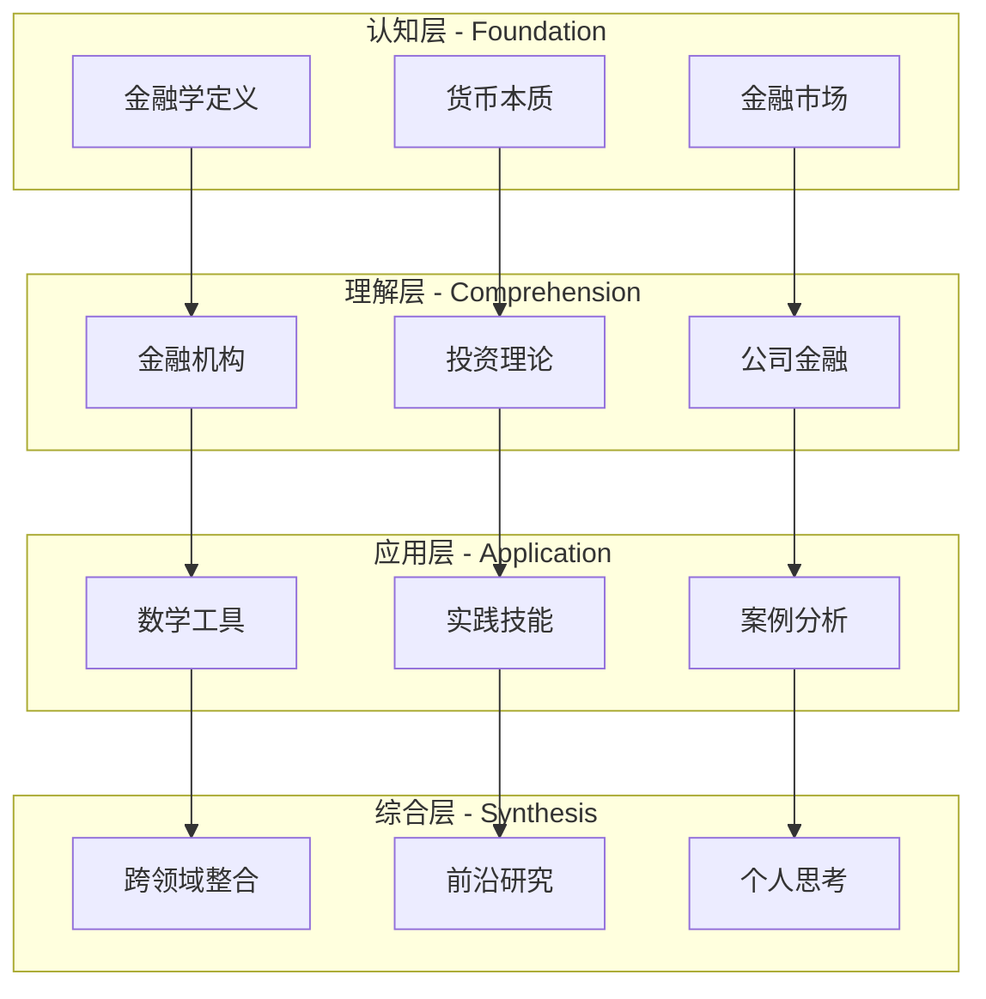

# 知识体系总览

## 🏗️ 金融学知识架构

金融学是一个多层次、多维度的知识体系，遵循金字塔学习模型，从基础概念到高级应用，层层递进。

## 📊 知识体系图谱

## 🎯 核心模块详解

### 1. 基础理论模块
**目标：** 建立金融学基础认知框架

| 子模块 | 核心内容 | 关键概念 | 学习重点 |
|--------|----------|----------|----------|
| [[01-基础理论/金融学概述/金融学定义与研究对象|金融学概述]] | 学科定义、研究对象、研究方法 | 金融体系、金融功能 | 建立整体认知 |
| [[01-基础理论/货币与信用/货币本质与职能|货币与信用]] | 货币理论、信用机制、利率理论 | 货币职能、信用工具、利率决定 | 理解货币机制 |
| [[01-基础理论/金融市场基础/金融市场概述|金融市场基础]] | 市场分类、交易机制、价格发现 | 市场效率、价格形成 | 掌握市场原理 |

### 2. 机构与监管模块
**目标：** 理解金融体系运行机制

| 子模块 | 核心内容 | 关键概念 | 学习重点 |
|--------|----------|----------|----------|
| [[02-机构与监管/金融机构/中央银行|金融机构]] | 各类金融机构功能与业务 | 央行职能、银行体系 | 理解机构作用 |
| [[02-机构与监管/金融监管/金融监管理论基础|金融监管]] | 监管理论、监管体系、风险管理 | 监管目标、监管工具 | 掌握监管逻辑 |

### 3. 投资学模块
**目标：** 掌握投资决策与风险管理

| 子模块 | 核心内容 | 关键概念 | 学习重点 |
|--------|----------|----------|----------|
| [[03-投资学/投资基础/投资组合理论|投资基础]] | 投资理论、资产定价、组合管理 | CAPM、APT、有效前沿 | 理解投资原理 |
| [[03-投资学/证券分析/基本面分析|证券分析]] | 基本面分析、技术分析、行为金融 | 估值方法、技术指标 | 掌握分析方法 |
| [[03-投资学/风险管理/风险识别与度量|风险管理]] | 风险识别、度量、控制 | VaR、压力测试、对冲 | 学会风险管理 |

### 4. 公司金融模块
**目标：** 理解企业金融决策

| 子模块 | 核心内容 | 关键概念 | 学习重点 |
|--------|----------|----------|----------|
| [[04-公司金融/价值评估/现金流折现模型|价值评估]] | 企业估值、DCF模型、相对估值 | 现金流、折现率、估值倍数 | 掌握估值方法 |
| [[04-公司金融/资本结构/资本结构理论|资本结构]] | 资本结构理论、融资决策 | MM理论、WACC、股利政策 | 理解融资逻辑 |
| [[04-公司金融/公司治理/公司治理结构|公司治理]] | 治理结构、代理问题、激励机制 | 治理机制、代理成本 | 了解治理机制 |

### 5. 国际金融模块
**目标：** 掌握国际金融运作

| 子模块 | 核心内容 | 关键概念 | 学习重点 |
|--------|----------|----------|----------|
| [[05-国际金融/汇率理论/汇率决定理论|汇率理论]] | 汇率决定、汇率制度、国际收支 | 购买力平价、利率平价 | 理解汇率机制 |
| [[05-国际金融/国际金融市场/国际资本市场|国际金融市场]] | 国际资本市场、货币体系 | 国际资本流动、汇率风险 | 掌握国际金融 |

### 6. 金融创新模块
**目标：** 了解金融发展趋势

| 子模块 | 核心内容 | 关键概念 | 学习重点 |
|--------|----------|----------|----------|
| [[06-金融创新/金融创新/金融创新动因|金融创新]] | 创新动因、创新工具、金融科技 | 金融科技、数字货币 | 了解创新趋势 |
| [[06-金融创新/金融发展/金融发展与经济增长|金融发展]] | 金融发展理论、金融稳定 | 金融深化、金融稳定 | 理解发展规律 |

## 🔗 知识关联网络

### 核心关联关系
1. **货币 → 利率 → 投资决策**
   - [[01-基础理论/货币与信用/货币本质与职能|货币本质]] → [[01-基础理论/货币与信用/利率理论|利率理论]] → [[03-投资学/投资基础/投资组合理论|投资组合理论]]

2. **金融市场 → 金融机构 → 金融监管**
   - [[01-基础理论/金融市场基础/金融市场概述|金融市场]] → [[02-机构与监管/金融机构/中央银行|金融机构]] → [[02-机构与监管/金融监管/金融监管理论基础|金融监管]]

3. **投资理论 → 公司金融 → 风险管理**
   - [[03-投资学/投资基础/投资组合理论|投资组合理论]] → [[04-公司金融/价值评估/现金流折现模型|价值评估]] → [[03-投资学/风险管理/风险识别与度量|风险管理]]

## 📈 学习路径优化

### 推荐学习顺序
1. **基础建立**：金融学概述 → 货币与信用 → 金融市场基础
2. **体系理解**：金融机构 → 金融监管 → 投资基础
3. **技能掌握**：证券分析 → 价值评估 → 风险管理
4. **应用实践**：数学工具 → 案例分析 → 模拟交易
5. **综合提升**：跨领域整合 → 前沿研究 → 个人思考

### 学习检查点
每个模块完成后，通过[[00-学习导航/学习检查点|学习检查点]]验证掌握程度

## 🎯 学习目标层次

### Level 1: 认知（Know）
- 能够识别和定义金融学基本概念
- 理解金融体系的基本构成和功能

### Level 2: 理解（Understand）
- 能够解释金融现象和机制
- 理解不同金融理论之间的关系

### Level 3: 应用（Apply）
- 能够运用金融理论分析实际问题
- 掌握基本的金融计算和分析方法

### Level 4: 分析（Analyze）
- 能够分析复杂的金融问题
- 识别问题的关键因素和影响因素

### Level 5: 综合（Synthesize）
- 能够整合不同领域的知识
- 形成独立的金融分析框架

### Level 6: 评价（Evaluate）
- 能够评价金融理论和实践
- 形成批判性思维和独立判断

## 📚 学习资源整合

### 理论学习
- [[99-资源库/参考资料/推荐书目|推荐书目]]
- [[99-资源库/参考资料/学术论文|学术论文]]

### 实践应用
- [[08-实践应用/案例分析/经典案例分析|案例分析]]
- [[08-实践应用/计算练习/估值计算练习|计算练习]]

### 工具支持
- [[99-资源库/公式汇总/金融学公式大全|公式汇总]]
- [[99-资源库/术语词典/金融学术语词典|术语词典]]

## 🔄 持续学习机制

### 知识更新
- 定期关注[[09-综合提升/前沿研究/金融学研究前沿|前沿研究]]
- 跟踪[[06-金融创新/金融创新/金融科技|金融科技]]发展

### 实践应用
- 参与[[08-实践应用/模拟交易/股票模拟交易|模拟交易]]
- 完成[[08-实践应用/计算练习/投资组合计算|计算练习]]

### 反思总结
- 记录[[09-综合提升/个人思考/学习心得|学习心得]]
- 制定[[09-综合提升/个人思考/未来学习规划|学习规划]]
