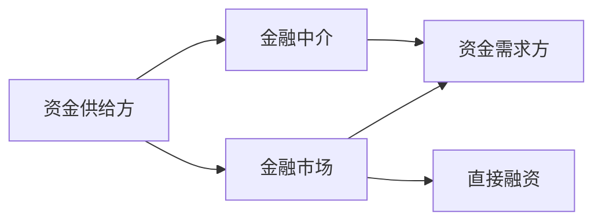
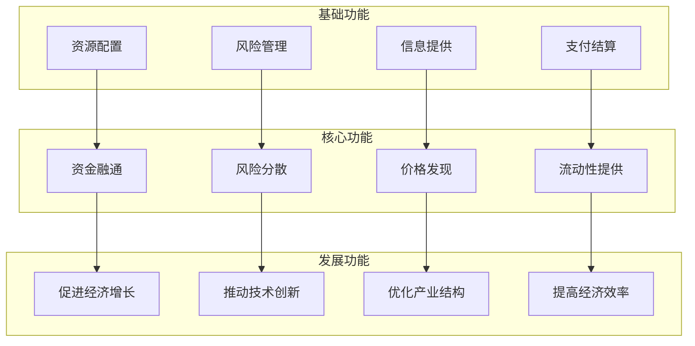

# 金融体系功能

## 🎯 核心概念

### 金融体系的定义
**金融体系**是由金融机构、金融市场、金融工具和金融制度组成的有机整体，负责资金在时间和空间上的配置。

> **费曼解释**：金融体系就像一个城市的交通系统，金融机构是车站，金融市场是道路，金融工具是车辆，金融制度是交通规则。

## 🏗️ 金融体系的基本功能

### 1. 资源配置功能
**定义**：将资金从盈余部门转移到赤字部门

**机制**：
- **直接融资**：通过金融市场直接配置
- **间接融资**：通过金融机构中介配置

**重要性**：
- 提高资金使用效率
- 促进经济增长
- 优化产业结构

**关联学习**：[[01-基础理论/金融市场基础/金融市场概述|金融市场概述]]

### 2. 风险管理功能
**定义**：分散、转移和降低金融风险

**机制**：
- **风险分散**：投资组合多样化
- **风险转移**：保险、衍生品
- **风险对冲**：期货、期权

**重要性**：
- 保护投资者利益
- 维护金融稳定
- 促进经济发展

**关联学习**：[[03-投资学/风险管理/风险识别与度量|风险识别与度量]]

### 3. 支付结算功能
**定义**：提供安全、高效的支付和结算服务

**机制**：
- **支付系统**：银行间支付
- **结算系统**：证券结算
- **清算系统**：资金清算

**重要性**：
- 降低交易成本
- 提高交易效率
- 维护市场秩序

### 4. 信息提供功能
**定义**：收集、处理和传递金融信息

**机制**：
- **价格发现**：市场价格反映信息
- **信息披露**：公开透明
- **信用评级**：风险评估

**重要性**：
- 降低信息不对称
- 提高市场效率
- 促进公平竞争

## 🔄 金融体系的核心功能

### 1. 资金融通
**定义**：连接资金供给方和需求方

**过程**：

**关联学习**：[[02-机构与监管/金融机构/商业银行|商业银行]]

### 2. 价格发现
**定义**：通过市场交易形成合理的价格

**机制**：
- **竞价机制**：买卖双方竞争
- **做市商制度**：提供流动性
- **信息传递**：价格反映信息

**重要性**：
- 反映真实价值
- 指导资源配置
- 提供投资信号

### 3. 流动性提供
**定义**：提供资产的变现能力

**机制**：
- **市场深度**：大额交易能力
- **市场广度**：交易品种丰富
- **市场弹性**：价格恢复能力

**关联学习**：[[01-基础理论/金融市场基础/市场微观结构|市场微观结构]]

### 4. 风险分散
**定义**：通过多样化降低整体风险

**机制**：
- **投资组合**：分散投资
- **保险机制**：风险转移
- **对冲工具**：风险对冲

**关联学习**：[[03-投资学/投资基础/投资组合理论|投资组合理论]]

## 🌱 金融体系的发展功能

### 1. 促进经济增长
**机制**：
- **资本积累**：增加投资
- **技术进步**：支持创新
- **效率提升**：优化配置

**证据**：
- 金融发展与经济增长正相关
- 金融深化促进经济发展
- 金融创新推动技术进步

**关联学习**：[[06-金融创新/金融发展/金融发展与经济增长|金融发展与经济增长]]

### 2. 推动技术创新
**机制**：
- **风险投资**：支持初创企业
- **资本市场**：提供融资渠道
- **金融科技**：技术创新

**重要性**：
- 支持新兴产业
- 促进产业升级
- 提高竞争力

### 3. 优化产业结构
**机制**：
- **资金引导**：向高效部门配置
- **市场选择**：优胜劣汰
- **政策支持**：产业政策

**效果**：
- 提高资源配置效率
- 促进产业升级
- 增强经济竞争力

### 4. 提高经济效率
**机制**：
- **降低交易成本**
- **提高信息效率**
- **优化资源配置**

**表现**：
- 交易成本下降
- 信息传递加快
- 资源配置优化

## 📊 金融体系功能层次

## 🔗 功能间的相互关系

### 1. 互补关系
- **资源配置** ↔ **风险管理**：有效配置需要风险管理
- **价格发现** ↔ **信息提供**：价格反映信息
- **资金融通** ↔ **流动性提供**：融通需要流动性

### 2. 制约关系
- **效率** ↔ **稳定**：效率与稳定性平衡
- **创新** ↔ **监管**：创新与监管协调
- **发展** ↔ **风险**：发展与风险控制

### 3. 协同关系
- **基础功能**支撑**核心功能**
- **核心功能**实现**发展功能**
- **发展功能**促进**基础功能**完善

## 🌍 国际比较

### 发达国家金融体系
| 特征 | 美国 | 德国 | 日本 |
|------|------|------|------|
| **主导模式** | 市场主导 | 银行主导 | 银行主导 |
| **主要功能** | 价格发现 | 资金融通 | 资金融通 |
| **创新程度** | 高 | 中 | 中 |

### 发展中国家金融体系
| 特征 | 中国 | 印度 | 巴西 |
|------|------|------|------|
| **发展阶段** | 快速发展 | 稳步发展 | 波动发展 |
| **主要挑战** | 金融深化 | 普惠金融 | 金融稳定 |
| **发展重点** | 金融科技 | 数字金融 | 风险管理 |

## 🎯 学习目标层次

### Level 1: 认知（Know）
- 能够列举金融体系的基本功能
- 理解各功能的基本含义
- 掌握功能分类方法

### Level 2: 理解（Understand）
- 能够解释各功能的作用机制
- 理解功能间的关系
- 掌握功能的重要性

### Level 3: 应用（Apply）
- 能够分析金融体系功能
- 掌握功能评估方法
- 能够提出功能改进建议

## 💡 费曼学习法应用

### 1. 选择概念
选择"金融体系功能"作为核心概念

### 2. 教授他人
用简单语言向他人解释：
> "金融体系就像一个城市的交通系统，它的功能就是让资金能够安全、高效地流动，就像交通系统让人员和货物流动一样。"

### 3. 识别盲点
- 是否真正理解各功能的作用？
- 能否说明功能间的关系？
- 是否掌握功能的评估方法？

### 4. 简化表达
用类比重新组织知识：
- 资源配置 = 交通调度
- 风险管理 = 安全保障
- 支付结算 = 收费站
- 信息提供 = 路况信息

## 🔄 刻意练习

### 练习1：功能识别
**题目**：分析某个金融市场的功能
**答案要点**：
- 识别主要功能
- 分析功能实现机制
- 评估功能效果

### 练习2：关系分析
**题目**：说明金融体系各功能间的关系
**答案要点**：
- 互补关系
- 制约关系
- 协同关系

### 练习3：比较分析
**题目**：比较不同国家金融体系功能
**答案要点**：
- 功能特点
- 实现机制
- 效果差异

## 📈 学习检查点

完成本模块学习后，请回答以下问题：

1. **概念理解**：能否列举金融体系的5个基本功能？
2. **知识应用**：能否分析某个金融市场的功能？
3. **关联性**：能否说明各功能间的关系？

**自评分数**：___/10
**需要改进**：___

## 🔗 相关链接

- [[01-基础理论/金融学概述/金融学定义与研究对象|金融学定义与研究对象]]
- [[01-基础理论/金融市场基础/金融市场概述|金融市场概述]]
- [[02-机构与监管/金融机构/中央银行|中央银行]]
- [[00-学习导航/学习检查点|学习检查点]]
