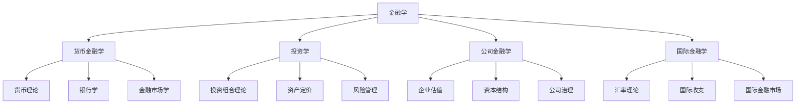

# 金融学定义与研究对象

## 🎯 核心概念

### 金融学的定义
**金融学**是研究货币、信用、银行、金融市场、金融机构以及金融活动规律的一门学科。

> **费曼解释**：如果把经济比作人体的血液循环系统，那么金融就是心脏和血管，负责资金的流动和分配。

### 金融学的本质特征
1. **资金融通性**：研究资金在不同主体间的流动
2. **时间价值性**：考虑资金的时间价值
3. **风险收益性**：分析风险与收益的关系
4. **制度约束性**：在特定制度框架下运行

## 📚 研究对象

### 1. 货币（Money）
- **定义**：一般等价物，具有价值尺度、流通手段等职能
- **研究内容**：货币本质、货币制度、货币供求
- **关联学习**：[[01-基础理论/货币与信用/货币本质与职能|货币本质与职能]]

### 2. 信用（Credit）
- **定义**：以偿还为条件的价值运动
- **研究内容**：信用形式、信用工具、信用风险
- **关联学习**：[[01-基础理论/货币与信用/信用与信用工具|信用与信用工具]]

### 3. 银行（Banking）
- **定义**：经营货币信用业务的金融机构
- **研究内容**：银行业务、银行管理、银行监管
- **关联学习**：[[02-机构与监管/金融机构/商业银行|商业银行]]

### 4. 金融市场（Financial Markets）
- **定义**：资金供求双方进行交易的场所
- **研究内容**：市场结构、交易机制、价格形成
- **关联学习**：[[01-基础理论/金融市场基础/金融市场概述|金融市场概述]]

### 5. 金融机构（Financial Institutions）
- **定义**：从事金融业务的中介机构
- **研究内容**：机构类型、业务模式、风险管理
- **关联学习**：[[02-机构与监管/金融机构/中央银行|中央银行]]

## 🔬 研究方法

### 1. 理论分析法
**特点**：通过逻辑推理建立理论模型
- **演绎法**：从一般到特殊
- **归纳法**：从特殊到一般
- **比较法**：横向和纵向比较

### 2. 实证研究法
**特点**：通过数据验证理论假设
- **计量经济学方法**
- **统计分析**
- **案例研究**

### 3. 历史研究法
**特点**：通过历史发展分析规律
- **制度变迁分析**
- **历史事件研究**
- **发展轨迹追踪**

## 🌐 金融学体系结构

## 🔗 与其他学科的关系

### 与经济学的关系
| 方面 | 经济学 | 金融学 |
|------|--------|--------|
| **研究对象** | 资源配置 | 资金配置 |
| **研究重点** | 生产、消费、分配 | 资金融通、风险管理 |
| **理论基础** | 微观经济学、宏观经济学 | 货币理论、投资理论 |

**关联学习**：[[01-基础理论/金融学概述/金融学与其他学科关系|金融学与其他学科关系]]

### 与数学的关系
- **概率论**：风险度量、期权定价
- **统计学**：数据分析、模型验证
- **微积分**：最优化问题、动态分析

**关联学习**：[[07-数学工具/金融数学基础/概率论与统计学|概率论与统计学]]

### 与会计学的关系
- **财务会计**：财务报表分析
- **管理会计**：成本分析、预算管理
- **审计学**：风险识别、内部控制

**关联学习**：[[09-综合提升/跨领域整合/金融与会计|金融与会计]]

## 📊 金融学发展脉络

### 古代金融思想
- **古希腊**：亚里士多德的货币理论
- **古罗马**：银行制度雏形
- **中国古代**：货币制度、信用活动

### 近代金融理论
- **17-18世纪**：银行制度建立
- **19世纪**：中央银行制度
- **20世纪初**：现代金融理论萌芽

### 现代金融学
- **1950年代**：马科维茨投资组合理论
- **1960年代**：CAPM模型
- **1970年代**：期权定价理论
- **1980年代**：行为金融学兴起

**关联学习**：[[01-基础理论/金融学概述/金融学发展历程|金融学发展历程]]

## 🎯 学习目标层次

### Level 1: 认知（Know）
- 能够定义金融学的基本概念
- 理解金融学的研究对象
- 掌握金融学的基本特征

### Level 2: 理解（Understand）
- 能够解释金融学与其他学科的关系
- 理解金融学的研究方法
- 掌握金融学的发展脉络

### Level 3: 应用（Apply）
- 能够运用金融学理论分析实际问题
- 掌握基本的金融分析方法
- 能够进行简单的金融计算

## 💡 费曼学习法应用

### 1. 选择概念
选择"金融学定义"作为核心概念

### 2. 教授他人
用简单语言向他人解释：
> "金融学就是研究钱怎么流动、怎么投资、怎么管理风险的学问。就像研究水怎么流动一样，金融学研究资金怎么流动。"

### 3. 识别盲点
- 是否真正理解金融学的本质？
- 能否区分金融学与经济学？
- 是否掌握金融学的研究方法？

### 4. 简化表达
用类比重新组织知识：
- 金融学 = 资金流动的学问
- 货币 = 血液
- 金融机构 = 心脏
- 金融市场 = 血管网络

## 🔄 刻意练习

### 练习1：概念辨析
**题目**：金融学与经济学的主要区别是什么？
**答案要点**：
- 研究对象不同
- 研究重点不同
- 理论基础不同

### 练习2：体系构建
**题目**：构建金融学的知识体系框架
**答案要点**：
- 货币金融学
- 投资学
- 公司金融学
- 国际金融学

### 练习3：方法应用
**题目**：如何运用金融学理论分析现实问题？
**答案要点**：
- 理论分析
- 实证研究
- 案例研究

## 📈 学习检查点

完成本模块学习后，请回答以下问题：

1. **概念理解**：能否用一句话解释什么是金融学？
2. **知识应用**：能否分析一个简单的金融现象？
3. **关联性**：能否说明金融学与其他学科的关系？

**自评分数**：___/10
**需要改进**：___

## 🔗 相关链接

- [[01-基础理论/金融学概述/金融体系功能|金融体系功能]]
- [[01-基础理论/金融学概述/金融学发展历程|金融学发展历程]]
- [[01-基础理论/金融学概述/金融学与其他学科关系|金融学与其他学科关系]]
- [[00-学习导航/学习检查点|学习检查点]]
