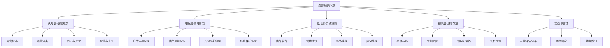

# 露营知识体系总览

## 🎯 学习目标
通过系统化的知识体系，从零基础到专业级，全面掌握露营技能与理念。

## 📚 知识金字塔结构

## 🔄 学习路径设计

| 层级 | 学习重点 | 预期时间 | 评估方式 |
|------|----------|----------|----------|
| **认知层** | 建立基础概念框架 | 2-3周 | 概念测试 |
| **理解层** | 掌握原理机制 | 3-4周 | 原理分析 |
| **应用层** | 实践技能训练 | 4-6周 | 技能考核 |
| **创新层** | 进阶发展 | 6-8周 | 综合评估 |
| **实践评估** | 技能验证 | 持续进行 | 实战检验 |

## 🎓 费曼学习法应用

### 第一步：选择概念
- 从[[01-认知层-基础概念/01-露营概述/01-露营定义与内涵|露营定义]]开始
- 逐步深入到[[02-理解层-原理机制/01-户外生存原理/01-人体生理适应|生存原理]]

### 第二步：教授他人
- 向朋友解释露营的基本概念
- 制作知识卡片进行自我测试

### 第三步：回顾简化
- 识别知识盲点
- 重新学习薄弱环节

### 第四步：组织优化
- 建立知识连接
- 形成完整体系

## 🏃‍♂️ 刻意练习策略

### 技能分解
1. **基础技能**：[[03-应用层-实践技能/01-装备准备/03-帐篷搭建技巧|帐篷搭建]]
2. **进阶技能**：[[03-应用层-实践技能/03-野外生存/01-方向识别技能|方向识别]]
3. **高级技能**：[[04-创新层-进阶发展/01-高级技巧/01-极端环境露营|极端环境应对]]

### 练习方法
- **重复练习**：每个技能至少练习10次
- **反馈修正**：记录每次练习的问题
- **逐步提升**：从简单环境到复杂环境

## 🔗 知识连接网络

### 核心概念连接
- [[01-认知层-基础概念/01-露营概述/01-露营定义与内涵|露营定义]] → [[02-理解层-原理机制/04-环境保护理念/03-无痕山林原则|无痕山林]]
- [[02-理解层-原理机制/03-安全防护机制/01-风险评估体系|风险评估]] → [[03-应用层-实践技能/04-应急处理/01-常见伤病处理|应急处理]]
- [[03-应用层-实践技能/02-营地建设/01-营地选址原则|营地选址]] → [[04-创新层-进阶发展/01-高级技巧/01-极端环境露营|极端环境]]

## 📈 学习进度追踪

### 学习里程碑
- [ ] 完成认知层学习
- [ ] 通过理解层测试
- [ ] 完成应用层实践
- [ ] 达到创新层标准
- [ ] 获得实践认证

### 技能等级
- **初级**：掌握基础技能
- **中级**：独立完成露营
- **高级**：应对复杂环境
- **专业**：指导他人学习

## 🎯 下一步行动
1. 阅读[[露营/00-总览与索引/01-学习路径指南|学习路径指南]]
2. 查看[[02-知识地图|知识地图]]
3. 开始[[01-认知层-基础概念/01-露营概述/01-露营定义与内涵|认知层学习]]
