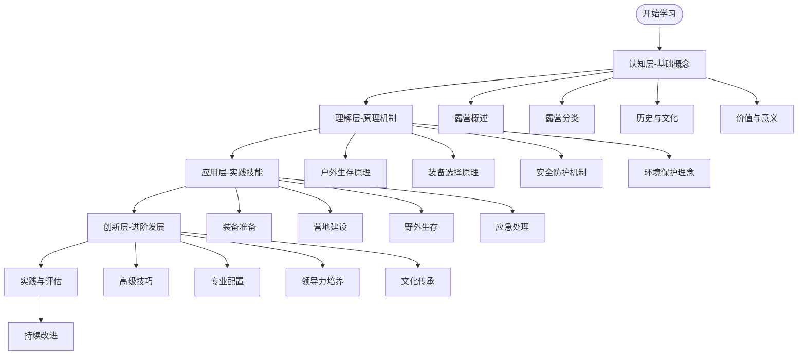

# 学习路径指南

## 🗺️ 学习地图概览

## 📅 学习时间规划

### 第一阶段：认知层（2-3周）
| 周次 | 学习内容 | 学习目标 | 评估方式 |
|------|----------|----------|----------|
| **第1周** | [[01-认知层-基础概念/01-露营概述|露营概述]] | 建立基础概念 | 概念测试 |
| **第2周** | [[01-认知层-基础概念/02-露营分类|露营分类]] | 理解分类体系 | 分类练习 |
| **第3周** | [[01-认知层-基础概念/03-历史与文化|历史与文化]] | 了解文化背景 | 文化分析 |

### 第二阶段：理解层（3-4周）
| 周次 | 学习内容 | 学习目标 | 评估方式 |
|------|----------|----------|----------|
| **第4周** | [[02-理解层-原理机制/01-户外生存原理|户外生存原理]] | 掌握生存机制 | 原理分析 |
| **第5周** | [[02-理解层-原理机制/02-装备选择原理|装备选择原理]] | 理解装备逻辑 | 装备分析 |
| **第6周** | [[02-理解层-原理机制/03-安全防护机制|安全防护机制]] | 建立安全意识 | 风险评估 |
| **第7周** | [[02-理解层-原理机制/04-环境保护理念|环境保护理念]] | 培养环保意识 | 环保实践 |

### 第三阶段：应用层（4-6周）
| 周次 | 学习内容 | 学习目标 | 评估方式 |
|------|----------|----------|----------|
| **第8-9周** | [[03-应用层-实践技能/01-装备准备|装备准备]] | 掌握装备技能 | 装备实操 |
| **第10-11周** | [[03-应用层-实践技能/02-营地建设|营地建设]] | 学会营地建设 | 营地实践 |
| **第12-13周** | [[03-应用层-实践技能/03-野外生存|野外生存]] | 掌握生存技能 | 生存测试 |
| **第14周** | [[03-应用层-实践技能/04-应急处理|应急处理]] | 学会应急处理 | 应急演练 |

## 🎯 学习策略

### 费曼学习法四步法
1. **选择概念**：选择一个要学习的概念
2. **教授他人**：用简单的语言向他人解释
3. **回顾简化**：识别知识盲点，重新学习
4. **组织优化**：建立知识连接，形成体系

### 刻意练习三要素
- **明确目标**：每次练习都有具体目标
- **专注练习**：全神贯注于练习过程
- **及时反馈**：获得练习结果的反馈

## 📚 学习资源

### 必读材料
- [[01-认知层-基础概念/01-露营概述/01-露营定义与内涵|露营定义与内涵]]
- [[02-理解层-原理机制/03-安全防护机制/01-风险评估体系|风险评估体系]]
- [[03-应用层-实践技能/04-应急处理/01-常见伤病处理|常见伤病处理]]

### 实践项目
- **初级项目**：[[03-应用层-实践技能/01-装备准备/03-帐篷搭建技巧|帐篷搭建]]练习
- **中级项目**：[[03-应用层-实践技能/02-营地建设/01-营地选址原则|营地选址]]实践
- **高级项目**：[[04-创新层-进阶发展/01-高级技巧/01-极端环境露营|极端环境]]挑战

## 🔄 学习循环

### 每日学习循环
1. **预习**：浏览今日学习内容
2. **学习**：深入学习核心概念
3. **练习**：进行相关技能练习
4. **复习**：回顾学习内容
5. **反思**：记录学习心得

### 每周学习循环
1. **周一**：新知识学习
2. **周二-周四**：技能练习
3. **周五**：知识整合
4. **周末**：实践应用

## 📊 学习评估

### 自我评估工具
- [[05-实践与评估/01-技能评估体系/01-自我评估清单|自我评估清单]]
- [[05-实践与评估/03-持续改进/01-学习反思模板|学习反思模板]]

### 评估标准
- **知识掌握度**：概念理解程度
- **技能熟练度**：实际操作能力
- **应用能力**：问题解决能力
- **创新思维**：知识迁移能力

## 🎯 学习建议

### 针对INTJ学习者的建议
1. **结构化学习**：按照知识体系有序学习
2. **深度思考**：不满足于表面理解
3. **系统整合**：建立知识间的连接
4. **实践验证**：通过实践验证理论

### 学习效率提升
- **番茄工作法**：25分钟专注学习
- **间隔重复**：定期复习已学内容
- **主动回忆**：不看书回忆知识点
- **知识连接**：建立知识点间的联系

## 🚀 进阶路径

### 专业发展方向
- **户外教练**：[[04-创新层-进阶发展/03-领导力培养|领导力培养]]
- **装备专家**：[[04-创新层-进阶发展/02-专业配置|专业配置]]
- **环保倡导者**：[[04-创新层-进阶发展/04-文化传承|文化传承]]
- **救援专家**：[[03-应用层-实践技能/04-应急处理|应急处理]]

## 📝 学习记录

### 学习日志模板
- **日期**：学习日期
- **内容**：学习的具体内容
- **收获**：学到的新知识
- **疑问**：遇到的问题
- **计划**：下一步学习计划

## 🔗 相关链接
- [[00-露营知识体系总览|知识体系总览]]
- [[02-知识地图|知识地图]]
- [[04-学习进度追踪|学习进度追踪]]
