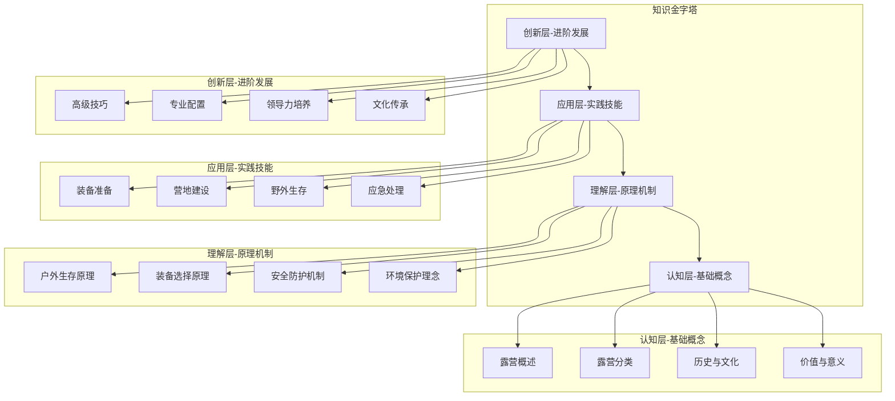
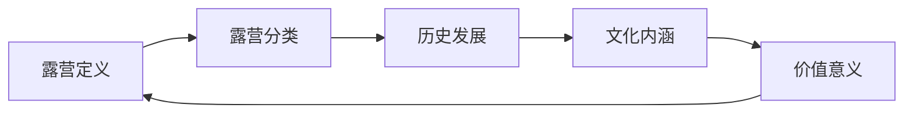
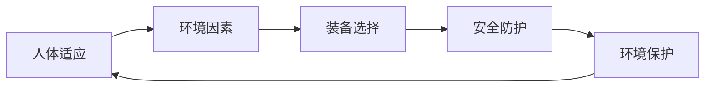
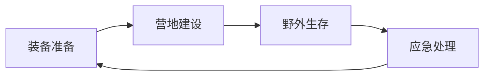
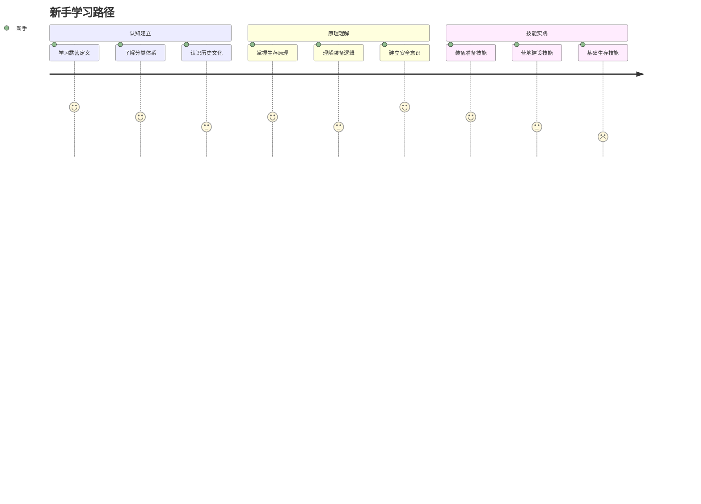
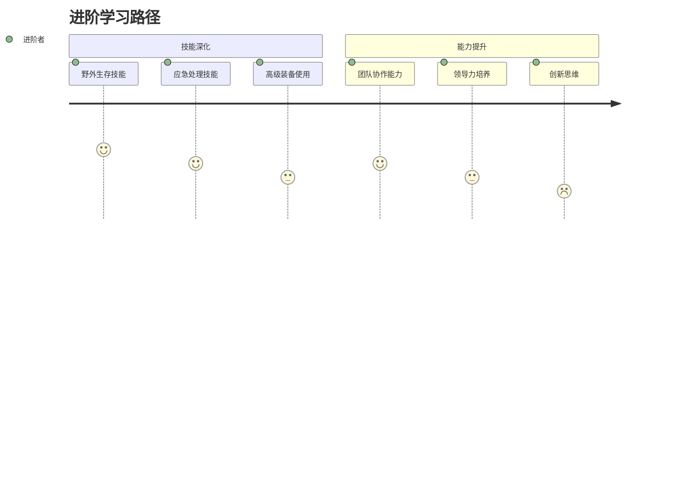
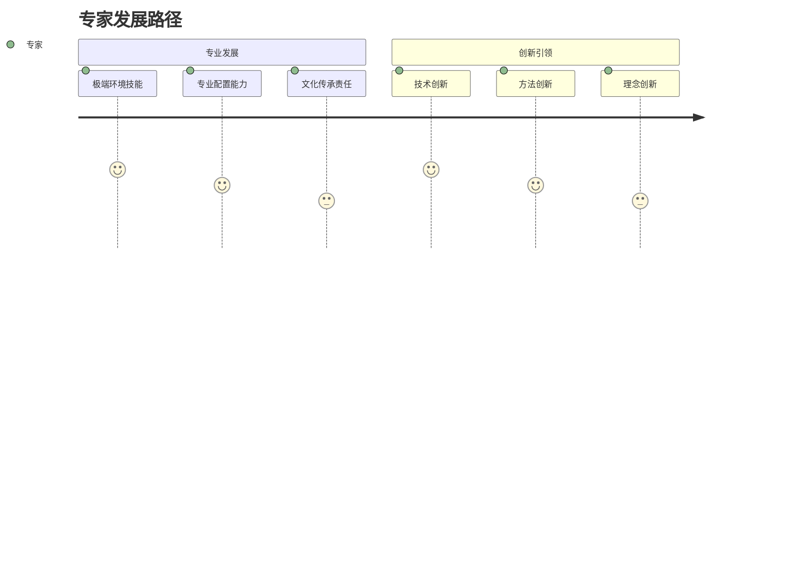
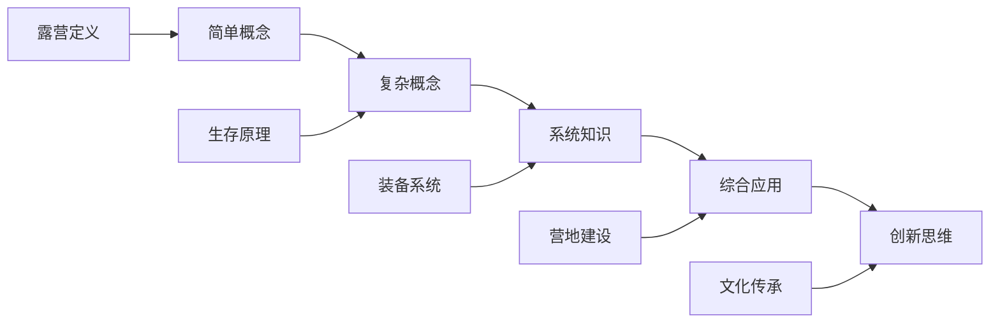
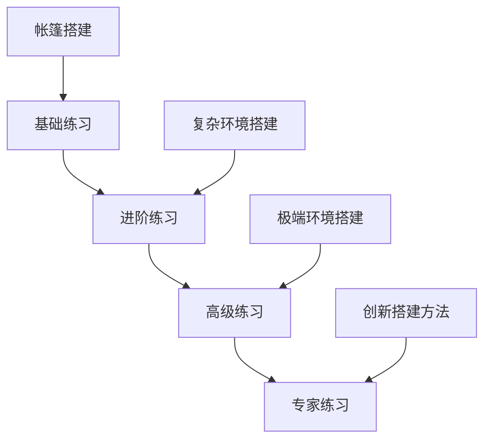
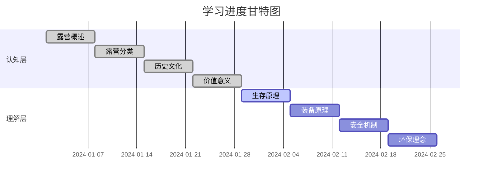

# 知识地图

## 🗺️ 知识体系全景图

### 知识层次结构

## 🔗 核心知识连接网络

### 基础概念连接

### 原理机制连接

### 实践技能连接

## 📊 知识密度分布

| 知识领域 | 认知层 | 理解层 | 应用层 | 创新层 | 总权重 |
|----------|--------|--------|--------|--------|--------|
| **装备技术** | 15% | 25% | 40% | 20% | 100% |
| **生存技能** | 20% | 30% | 35% | 15% | 100% |
| **安全防护** | 25% | 35% | 30% | 10% | 100% |
| **环保理念** | 30% | 25% | 25% | 20% | 100% |
| **团队协作** | 10% | 15% | 30% | 45% | 100% |

## 🎯 学习路径映射

### 新手路径（0-6个月）

### 进阶路径（6个月-2年）

### 专家路径（2年以上）

## 🔍 知识检索系统

### 按技能检索
- **基础技能**：[[03-应用层-实践技能/01-装备准备|装备准备]] → [[03-应用层-实践技能/02-营地建设|营地建设]]
- **生存技能**：[[03-应用层-实践技能/03-野外生存/01-方向识别技能|方向识别]] → [[03-应用层-实践技能/03-野外生存/02-水源寻找与净化|水源净化]]
- **应急技能**：[[03-应用层-实践技能/04-应急处理/01-常见伤病处理|伤病处理]] → [[03-应用层-实践技能/04-应急处理/02-恶劣天气应对|天气应对]]

### 按环境检索
- **山地环境**：[[01-认知层-基础概念/02-露营分类/01-按环境分类|山地露营]] → [[04-创新层-进阶发展/01-高级技巧/01-极端环境露营|极端环境]]
- **水域环境**：[[01-认知层-基础概念/02-露营分类/01-按环境分类|水域露营]] → [[03-应用层-实践技能/03-野外生存/02-水源寻找与净化|水源管理]]
- **沙漠环境**：[[01-认知层-基础概念/02-露营分类/01-按环境分类|沙漠露营]] → [[03-应用层-实践技能/04-应急处理/02-恶劣天气应对|高温应对]]

### 按难度检索
- **初级难度**：[[01-认知层-基础概念/02-露营分类/04-按难度分类|初级露营]] → [[03-应用层-实践技能/01-装备准备|基础装备]]
- **中级难度**：[[01-认知层-基础概念/02-露营分类/04-按难度分类|中级露营]] → [[03-应用层-实践技能/03-野外生存|野外生存]]
- **高级难度**：[[01-认知层-基础概念/02-露营分类/04-按难度分类|高级露营]] → [[04-创新层-进阶发展/01-高级技巧|高级技巧]]

## 🧠 认知负荷管理

### 学习复杂度分析

### 认知负荷控制策略
| 学习阶段 | 认知负荷 | 控制策略 | 学习时间 |
|----------|----------|----------|----------|
| **认知层** | 低 | 概念记忆 | 2-3周 |
| **理解层** | 中 | 原理分析 | 3-4周 |
| **应用层** | 高 | 技能分解 | 4-6周 |
| **创新层** | 极高 | 项目导向 | 6-8周 |

## 🎓 费曼学习法应用地图

### 概念解释路径
1. **选择概念** → [[01-认知层-基础概念/01-露营概述/01-露营定义与内涵|露营定义]]
2. **教授他人** → 用简单语言解释给朋友
3. **回顾简化** → [[02-理解层-原理机制/01-户外生存原理/01-人体生理适应|生存原理]]
4. **组织优化** → [[03-应用层-实践技能/01-装备准备/01-基础装备清单|装备清单]]

### 技能掌握路径
1. **选择技能** → [[03-应用层-实践技能/01-装备准备/03-帐篷搭建技巧|帐篷搭建]]
2. **分解步骤** → 搭建准备 → 选址 → 搭建 → 固定
3. **实践验证** → 实际搭建帐篷
4. **优化改进** → [[04-创新层-进阶发展/01-高级技巧/04-高级装备使用|高级技巧]]

## 🏃‍♂️ 刻意练习地图

### 技能练习层次

### 练习强度梯度
| 技能等级 | 练习频率 | 练习时长 | 复杂度 | 反馈频率 |
|----------|----------|----------|--------|----------|
| **初级** | 每日 | 30分钟 | 低 | 即时 |
| **中级** | 每周3次 | 1小时 | 中 | 每日 |
| **高级** | 每周2次 | 2小时 | 高 | 每周 |
| **专家** | 每月1次 | 4小时 | 极高 | 每月 |

## 🔄 知识更新机制

### 版本控制
- **V1.0**：基础知识体系建立
- **V1.1**：实践技能完善
- **V1.2**：高级技巧补充
- **V2.0**：创新层发展

### 更新触发条件
- 新技术出现
- 安全标准更新
- 环保理念发展
- 用户反馈积累

## 📈 学习效果追踪

### 知识掌握度指标
- **概念理解度**：0-100%
- **技能熟练度**：0-100%
- **应用能力**：0-100%
- **创新能力**：0-100%

### 学习进度可视化

## 🎯 个性化学习路径

### INTJ学习者特点
- **结构化思维**：偏好系统化知识组织
- **深度思考**：不满足于表面理解
- **独立学习**：喜欢自主探索
- **创新导向**：追求知识创新应用

### 个性化建议
1. **从系统开始**：先建立整体框架
2. **深度优先**：深入理解核心概念
3. **实践验证**：通过实践验证理论
4. **创新应用**：将知识创新应用

## 🔗 相关链接
- [[00-露营知识体系总览|知识体系总览]]
- [[露营/00-总览与索引/01-学习路径指南|学习路径指南]]
- [[03-资源索引|资源索引]]
- [[04-学习进度追踪|学习进度追踪]]