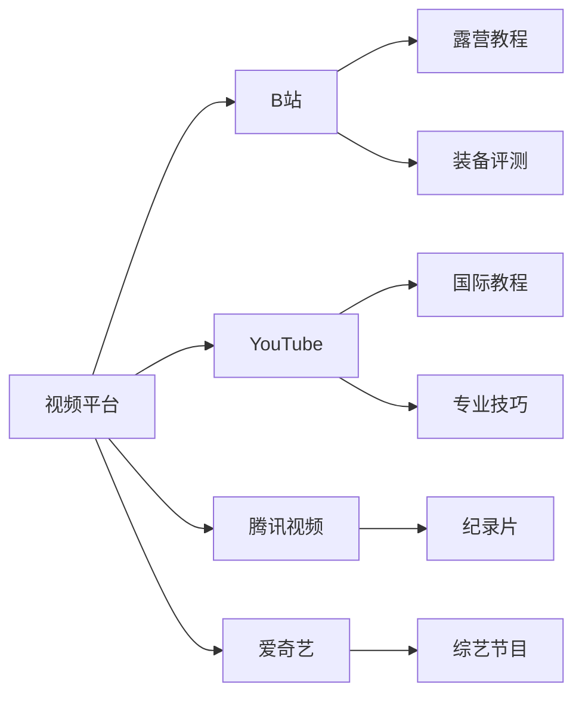
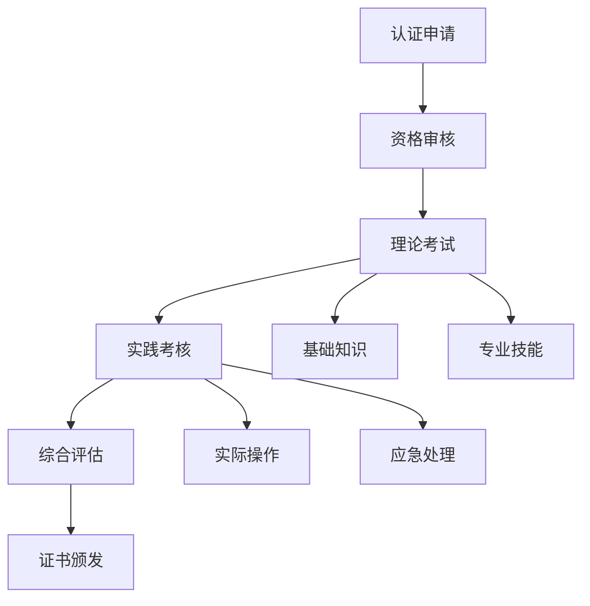
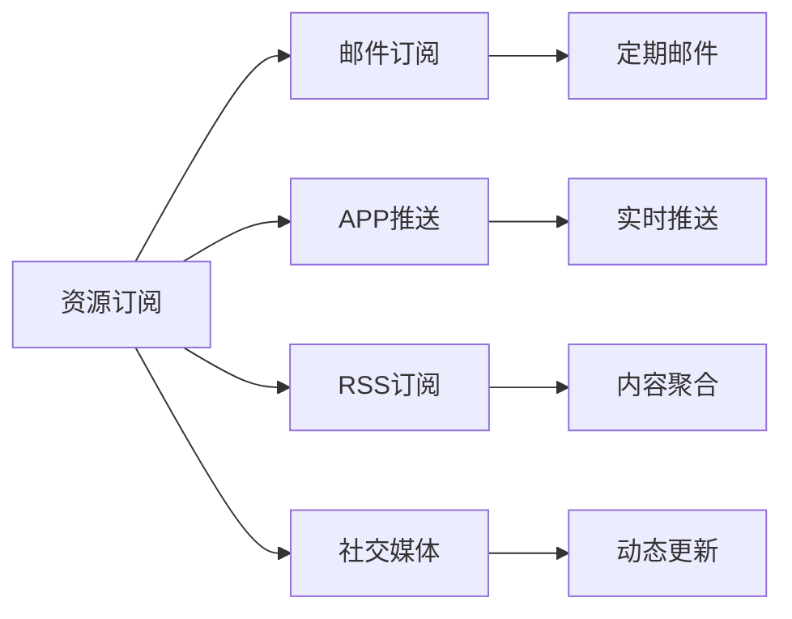

# 资源索引

## 📚 学习资源分类

### 📖 核心教材
| 资源类型 | 资源名称 | 适用层次 | 推荐指数 | 获取方式 |
|----------|----------|----------|----------|----------|
| **基础教材** | 《露营完全手册》 | 认知层-应用层 | ⭐⭐⭐⭐⭐ | 购买/图书馆 |
| **技术指南** | 《野外生存技能》 | 理解层-应用层 | ⭐⭐⭐⭐⭐ | 购买/在线 |
| **安全手册** | 《户外安全指南》 | 理解层-应用层 | ⭐⭐⭐⭐⭐ | 免费下载 |
| **环保指南** | 《无痕山林原则》 | 理解层-创新层 | ⭐⭐⭐⭐ | 免费下载 |

### 🎥 视频资源
| 资源类型 | 资源名称 | 平台 | 适用层次 | 推荐指数 |
|----------|----------|------|----------|----------|
| **基础教程** | 露营入门系列 | B站/YouTube | 认知层-应用层 | ⭐⭐⭐⭐⭐ |
| **技能演示** | 帐篷搭建技巧 | B站/YouTube | 应用层 | ⭐⭐⭐⭐⭐ |
| **安全培训** | 户外安全培训 | 专业平台 | 理解层-应用层 | ⭐⭐⭐⭐⭐ |
| **高级技巧** | 极端环境露营 | YouTube | 创新层 | ⭐⭐⭐⭐ |

### 🛠️ 实践工具
| 工具类型 | 工具名称 | 用途 | 价格区间 | 推荐指数 |
|----------|----------|------|----------|----------|
| **基础装备** | 入门帐篷套装 | 实践练习 | 500-1000元 | ⭐⭐⭐⭐ |
| **专业装备** | 专业帐篷 | 进阶实践 | 2000-5000元 | ⭐⭐⭐⭐⭐ |
| **安全装备** | 急救包 | 安全防护 | 100-300元 | ⭐⭐⭐⭐⭐ |
| **测量工具** | GPS设备 | 导航定位 | 500-2000元 | ⭐⭐⭐⭐ |

### 📱 应用软件
| 应用类型 | 应用名称 | 平台 | 主要功能 | 推荐指数 |
|----------|----------|------|----------|----------|
| **导航应用** | 奥维互动地图 | iOS/Android | 地图导航 | ⭐⭐⭐⭐⭐ |
| **天气应用** | 中国天气 | iOS/Android | 天气预报 | ⭐⭐⭐⭐⭐ |
| **学习应用** | 户外技能学习 | iOS/Android | 技能学习 | ⭐⭐⭐⭐ |
| **社区应用** | 户外社区 | iOS/Android | 经验分享 | ⭐⭐⭐⭐ |

## 🏛️ 权威机构资源

### 🏢 官方机构
| 机构名称 | 资源类型 | 主要内容 | 获取方式 |
|----------|----------|----------|----------|
| **中国登山协会** | 培训课程 | 专业认证培训 | 官网报名 |
| **国家体育总局** | 安全标准 | 户外运动安全标准 | 官网下载 |
| **环保部** | 环保指南 | 户外环保规范 | 官网下载 |
| **气象局** | 天气数据 | 专业天气预报 | 官网API |

### 🎓 教育机构
| 机构名称 | 课程类型 | 适用对象 | 学习方式 |
|----------|----------|----------|----------|
| **体育院校** | 户外运动专业 | 专业学习者 | 全日制/在职 |
| **职业培训** | 户外教练培训 | 从业者 | 短期培训 |
| **在线教育** | 户外技能课程 | 爱好者 | 在线学习 |
| **社区大学** | 户外兴趣班 | 初学者 | 业余学习 |

## 🌐 在线资源平台

### 📺 视频平台

### 📚 知识平台
| 平台名称 | 资源类型 | 特色内容 | 推荐指数 |
|----------|----------|----------|----------|
| **知乎** | 问答社区 | 经验分享、问题解答 | ⭐⭐⭐⭐⭐ |
| **小红书** | 图文分享 | 装备推荐、经验分享 | ⭐⭐⭐⭐ |
| **豆瓣** | 书评影评 | 书籍推荐、影评 | ⭐⭐⭐⭐ |
| **简书** | 文章平台 | 深度文章、经验总结 | ⭐⭐⭐⭐ |

### 🛒 装备平台
| 平台名称 | 平台类型 | 主要特色 | 推荐指数 |
|----------|----------|----------|----------|
| **天猫/京东** | 综合电商 | 品牌齐全、质量保证 | ⭐⭐⭐⭐⭐ |
| **户外专营** | 专业平台 | 专业装备、专业服务 | ⭐⭐⭐⭐⭐ |
| **二手平台** | 二手交易 | 性价比高、环保 | ⭐⭐⭐⭐ |
| **海淘平台** | 海外购物 | 国际品牌、最新产品 | ⭐⭐⭐⭐ |

## 🎯 专业认证资源

### 🏆 认证体系
| 认证类型 | 认证机构 | 认证等级 | 适用对象 |
|----------|----------|----------|----------|
| **户外指导员** | 中国登山协会 | 初级-高级 | 从业者 |
| **急救员** | 红十字会 | 基础-专业 | 所有人 |
| **环保志愿者** | 环保组织 | 志愿者-专家 | 环保爱好者 |
| **装备专家** | 品牌方 | 产品专家 | 装备爱好者 |

### 📋 认证要求

## 🔬 研究资源

### 📊 学术资源
| 资源类型 | 资源名称 | 主要内容 | 获取方式 |
|----------|----------|----------|----------|
| **学术论文** | CNKI/万方 | 户外运动研究 | 数据库检索 |
| **研究报告** | 体育总局 | 行业分析报告 | 官网下载 |
| **统计数据** | 统计局 | 户外运动数据 | 官网查询 |
| **标准规范** | 国标委 | 行业标准 | 官网下载 |

### 🔍 研究方法
| 研究方法 | 适用场景 | 研究目标 | 实施难度 |
|----------|----------|----------|----------|
| **问卷调查** | 用户需求调研 | 了解用户需求 | 低 |
| **实地调研** | 环境评估 | 评估环境影响 | 中 |
| **实验研究** | 装备测试 | 测试装备性能 | 高 |
| **案例研究** | 经验总结 | 总结成功经验 | 中 |

## 🎨 创意资源

### 🎬 影视资源
| 资源类型 | 资源名称 | 主要内容 | 推荐指数 |
|----------|----------|----------|----------|
| **纪录片** | 《荒野求生》 | 生存技能展示 | ⭐⭐⭐⭐⭐ |
| **电影** | 《127小时》 | 户外安全意识 | ⭐⭐⭐⭐ |
| **综艺** | 《向往的生活》 | 户外生活体验 | ⭐⭐⭐⭐ |
| **动画** | 《露营动画》 | 轻松学习 | ⭐⭐⭐ |

### 📸 图片资源
| 资源类型 | 资源平台 | 主要内容 | 使用场景 |
|----------|----------|----------|----------|
| **装备图片** | 品牌官网 | 产品展示 | 装备选择 |
| **环境图片** | 摄影网站 | 环境展示 | 环境认知 |
| **技巧图解** | 教程网站 | 操作步骤 | 技能学习 |
| **案例图片** | 社区平台 | 实际案例 | 经验学习 |

## 🔄 资源更新机制

### 📅 更新频率
| 资源类型 | 更新频率 | 更新内容 | 更新方式 |
|----------|----------|----------|----------|
| **教材资源** | 年度 | 内容修订 | 版本更新 |
| **视频资源** | 月度 | 新内容 | 平台推送 |
| **装备资源** | 季度 | 新品发布 | 官网更新 |
| **安全资源** | 实时 | 安全提醒 | 紧急推送 |

### 🔔 订阅机制

## 📊 资源质量评估

### ⭐ 评估标准
| 评估维度 | 权重 | 评估标准 | 评分范围 |
|----------|------|----------|----------|
| **准确性** | 30% | 信息准确性 | 1-5星 |
| **时效性** | 20% | 内容更新频率 | 1-5星 |
| **实用性** | 25% | 实际应用价值 | 1-5星 |
| **权威性** | 15% | 来源权威性 | 1-5星 |
| **易用性** | 10% | 使用便利性 | 1-5星 |

### 📈 质量监控
- **定期评估**：每季度评估一次
- **用户反馈**：收集用户使用反馈
- **专家评审**：邀请专家评审
- **持续改进**：根据评估结果改进

## 🎯 资源使用建议

### 📚 学习资源使用
1. **基础学习**：从权威教材开始
2. **技能提升**：结合视频教程
3. **实践验证**：使用实践工具
4. **持续更新**：关注最新资源

### 🔧 工具资源使用
1. **按需选择**：根据学习阶段选择
2. **质量优先**：选择质量可靠的资源
3. **成本考虑**：平衡质量与成本
4. **持续维护**：定期更新和维护

## 🔗 相关链接
- [[00-露营知识体系总览|知识体系总览]]
- [[露营/00-总览与索引/01-学习路径指南|学习路径指南]]
- [[02-知识地图|知识地图]]
- [[04-学习进度追踪|学习进度追踪]]