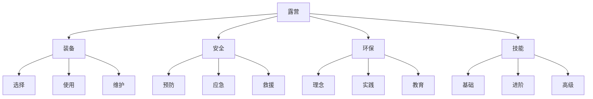
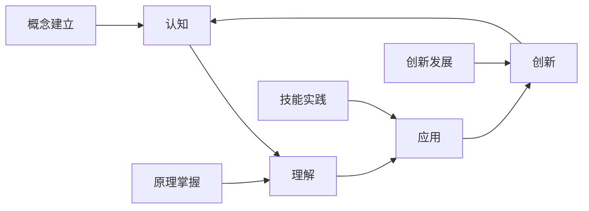
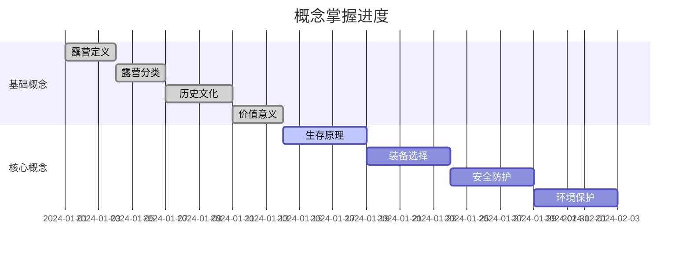

# 关键概念速查

## 🔍 概念检索系统

### 📚 按字母顺序检索
| 概念 | 定义 | 相关层次 | 快速链接 |
|------|------|----------|----------|
| **A** | | | |
| 安全防护 | 户外活动中的安全保护措施 | 理解层-应用层 | [[02-理解层-原理机制/03-安全防护机制|安全防护]] |
| **B** | | | |
| 背包选择 | 根据活动需求选择合适的背包 | 应用层 | [[03-应用层-实践技能/01-装备准备/01-基础装备清单|装备清单]] |
| **C** | | | |
| 帐篷搭建 | 搭建帐篷的基本技能和技巧 | 应用层 | [[03-应用层-实践技能/01-装备准备/03-帐篷搭建技巧|帐篷搭建]] |
| 炊具使用 | 户外烹饪工具的使用方法 | 应用层 | [[03-应用层-实践技能/01-装备准备/04-炊具使用技能|炊具使用]] |
| **D** | | | |
| 定向导航 | 在野外确定方向的方法 | 应用层 | [[03-应用层-实践技能/03-野外生存/01-方向识别技能|方向识别]] |
| **E** | | | |
| 应急处理 | 户外紧急情况的处理方法 | 应用层 | [[03-应用层-实践技能/04-应急处理|应急处理]] |
| **F** | | | |
| 服装选择 | 根据环境选择合适的服装 | 应用层 | [[03-应用层-实践技能/01-装备准备/02-服装选择与搭配|服装选择]] |
| **G** | | | |
| 篝火建设 | 搭建和管理篝火的方法 | 应用层 | [[03-应用层-实践技能/01-装备准备/05-篝火建设与管理|篝火建设]] |
| **H** | | | |
| 环境保护 | 户外活动中的环保理念和实践 | 理解层-创新层 | [[02-理解层-原理机制/04-环境保护理念|环境保护]] |
| **J** | | | |
| 急救技能 | 户外伤病的基本处理方法 | 应用层 | [[03-应用层-实践技能/04-应急处理/01-常见伤病处理|伤病处理]] |
| **K** | | | |
| 露营分类 | 不同类型露营的分类标准 | 认知层 | [[01-认知层-基础概念/02-露营分类|露营分类]] |
| **L** | | | |
| 领导力 | 团队管理和领导能力 | 创新层 | [[04-创新层-进阶发展/03-领导力培养|领导力培养]] |
| **M** | | | |
| 迷路自救 | 迷路时的自救方法 | 应用层 | [[03-应用层-实践技能/04-应急处理/03-迷路自救方法|迷路自救]] |
| **N** | | | |
| 无痕山林 | 户外环保的基本原则 | 理解层 | [[02-理解层-原理机制/04-环境保护理念/03-无痕山林原则|无痕山林]] |
| **P** | | | |
| 评估体系 | 技能和能力的评估方法 | 实践层 | [[05-实践与评估/01-技能评估体系|评估体系]] |
| **Q** | | | |
| 求生技能 | 野外生存的基本技能 | 应用层 | [[03-应用层-实践技能/03-野外生存|野外生存]] |
| **R** | | | |
| 风险评估 | 户外活动的风险识别和评估 | 理解层 | [[02-理解层-原理机制/03-安全防护机制/01-风险评估体系|风险评估]] |
| **S** | | | |
| 生存原理 | 人体在户外环境中的适应机制 | 理解层 | [[02-理解层-原理机制/01-户外生存原理|生存原理]] |
| **T** | | | |
| 团队协作 | 团队合作和协调能力 | 创新层 | [[04-创新层-进阶发展/03-领导力培养/01-团队管理技能|团队管理]] |
| **W** | | | |
| 文化传承 | 露营文化的传承和发展 | 创新层 | [[04-创新层-进阶发展/04-文化传承|文化传承]] |
| 无痕露营 | 环保露营的理念和实践 | 理解层-应用层 | [[02-理解层-原理机制/04-环境保护理念/02-可持续露营|可持续露营]] |
| **X** | | | |
| 心理适应 | 户外环境中的心理调节 | 理解层 | [[02-理解层-原理机制/01-户外生存原理/04-心理适应机制|心理适应]] |
| **Y** | | | |
| 野外生存 | 在野外环境中的生存技能 | 应用层 | [[03-应用层-实践技能/03-野外生存|野外生存]] |
| **Z** | | | |
| 装备选择 | 根据需求选择合适的装备 | 理解层-应用层 | [[02-理解层-原理机制/02-装备选择原理|装备选择]] |

## 🎯 按层次分类检索

### 📖 认知层概念
| 概念 | 核心内容 | 学习重点 | 实践应用 |
|------|----------|----------|----------|
| **露营定义** | 户外住宿活动的基本概念 | 理解内涵和外延 | 区分不同户外活动 |
| **露营分类** | 按环境、方式、目的分类 | 掌握分类标准 | 选择合适类型 |
| **历史发展** | 露营活动的发展历程 | 了解发展脉络 | 理解文化背景 |
| **文化内涵** | 露营活动的文化意义 | 认识文化价值 | 传承文化理念 |

### 🔬 理解层概念
| 概念 | 核心内容 | 学习重点 | 实践应用 |
|------|----------|----------|----------|
| **生存原理** | 人体户外适应机制 | 理解生理心理适应 | 制定适应策略 |
| **装备原理** | 装备选择和使用原理 | 掌握选择逻辑 | 优化装备配置 |
| **安全机制** | 安全防护的原理和方法 | 建立安全意识 | 实施安全措施 |
| **环保理念** | 环境保护的理念和实践 | 培养环保意识 | 践行环保行为 |

### 🛠️ 应用层概念
| 概念 | 核心内容 | 学习重点 | 实践应用 |
|------|----------|----------|----------|
| **装备准备** | 装备的选择和准备 | 掌握装备技能 | 完成装备准备 |
| **营地建设** | 营地的选址和建设 | 学会建设技能 | 建设安全营地 |
| **野外生存** | 野外生存的基本技能 | 掌握生存技能 | 应对生存挑战 |
| **应急处理** | 紧急情况的处理方法 | 学会应急技能 | 处理紧急情况 |

### 🚀 创新层概念
| 概念 | 核心内容 | 学习重点 | 实践应用 |
|------|----------|----------|----------|
| **高级技巧** | 高级技能和创新方法 | 掌握高级技能 | 创新应用技能 |
| **专业配置** | 专业级装备和系统配置 | 学会专业配置 | 实现专业配置 |
| **领导力** | 团队领导和管理能力 | 培养领导力 | 领导团队活动 |
| **文化传承** | 文化传承和发展 | 承担传承责任 | 传承发展文化 |

## 🔗 概念关系网络

### 🌐 核心概念关系图


### 🔄 概念循环关系


## 📊 概念重要性矩阵

### 🎯 重要性评估
| 概念 | 基础性 | 实用性 | 创新性 | 综合评分 | 学习优先级 |
|------|--------|--------|--------|----------|------------|
| **安全防护** | 9 | 10 | 6 | 8.3 | 最高 |
| **装备选择** | 8 | 9 | 7 | 8.0 | 高 |
| **野外生存** | 7 | 9 | 8 | 8.0 | 高 |
| **环境保护** | 6 | 8 | 9 | 7.7 | 高 |
| **团队协作** | 5 | 7 | 9 | 7.0 | 中 |
| **文化传承** | 4 | 6 | 10 | 6.7 | 中 |

### 📈 学习难度评估
| 概念 | 理论难度 | 实践难度 | 综合难度 | 学习建议 |
|------|----------|----------|----------|----------|
| **露营定义** | 2 | 1 | 1.5 | 轻松掌握 |
| **装备选择** | 5 | 6 | 5.5 | 需要实践 |
| **野外生存** | 6 | 8 | 7.0 | 重点练习 |
| **领导力** | 7 | 8 | 7.5 | 系统学习 |
| **文化传承** | 8 | 7 | 7.5 | 深度理解 |

## 🎓 费曼学习法应用

### 📝 概念解释模板
```
概念名称：[概念名称]
简单定义：[用一句话解释]
详细说明：[详细解释概念]
实际例子：[举出具体例子]
常见误区：[指出常见错误理解]
```

### 🔄 概念学习循环
1. **选择概念** → 从重要概念开始
2. **教授他人** → 用简单语言解释
3. **回顾简化** → 识别理解盲点
4. **组织优化** → 建立概念连接

## 🏃‍♂️ 刻意练习应用

### 🎯 概念掌握练习
| 练习类型 | 练习方法 | 练习频率 | 预期效果 |
|----------|----------|----------|----------|
| **概念记忆** | 制作概念卡片 | 每日 | 快速回忆 |
| **概念理解** | 解释给他人听 | 每周 | 深度理解 |
| **概念应用** | 解决实际问题 | 每月 | 灵活应用 |
| **概念创新** | 创新应用场景 | 每季度 | 创新发展 |

### 📊 练习效果追踪


## 🔍 快速查找技巧

### 📚 查找策略
1. **按字母查找**：使用字母索引快速定位
2. **按层次查找**：根据学习层次选择概念
3. **按重要性查找**：优先学习重要概念
4. **按关系查找**：通过概念关系网络查找

### 🎯 使用建议
- **初学者**：从基础概念开始
- **进阶者**：重点关注核心概念
- **专家级**：深入理解创新概念
- **教学者**：建立完整概念体系

## 📋 概念掌握检查清单

### ✅ 基础概念掌握
- [ ] 能够定义露营的基本概念
- [ ] 理解露营的分类体系
- [ ] 了解露营的历史发展
- [ ] 认识露营的文化价值

### ✅ 核心概念掌握
- [ ] 理解户外生存原理
- [ ] 掌握装备选择逻辑
- [ ] 建立安全防护意识
- [ ] 培养环境保护理念

### ✅ 应用概念掌握
- [ ] 掌握装备准备技能
- [ ] 学会营地建设方法
- [ ] 具备野外生存能力
- [ ] 能够处理紧急情况

### ✅ 创新概念掌握
- [ ] 掌握高级技能技巧
- [ ] 具备专业配置能力
- [ ] 培养团队领导力
- [ ] 承担文化传承责任

## 🔗 相关链接
- [[00-露营知识体系总览|知识体系总览]]
- [[露营/00-总览与索引/01-学习路径指南|学习路径指南]]
- [[02-知识地图|知识地图]]
- [[03-资源索引|资源索引]]