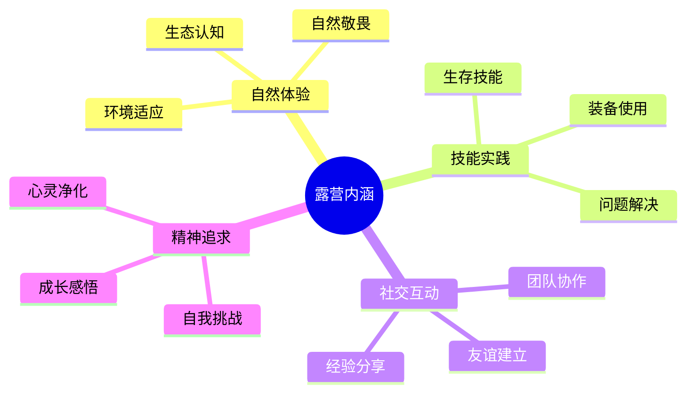

# 露营定义与内涵

## 🎯 核心定义

### 基本定义
**露营**是指在户外环境中，使用帐篷等临时住所进行过夜活动的户外运动形式。

### 扩展定义
露营是一种集**户外生活**、**自然体验**、**技能实践**于一体的综合性户外活动，强调与自然的和谐共处。

## 📚 内涵解析

### 四个核心维度

### 1. 自然体验维度
- **环境适应**：学会在不同自然环境中生存
- **生态认知**：了解自然规律和生态平衡
- **自然敬畏**：培养对自然的尊重和保护意识

### 2. 技能实践维度
- **生存技能**：掌握野外生存的基本技能
- **装备使用**：熟练使用各种户外装备
- **问题解决**：培养独立解决问题的能力

### 3. 社交互动维度
- **团队协作**：学会与他人合作完成任务
- **经验分享**：交流户外经验和技巧
- **友谊建立**：在共同经历中建立深厚友谊

### 4. 精神追求维度
- **自我挑战**：突破个人舒适圈
- **心灵净化**：远离城市喧嚣，回归内心
- **成长感悟**：在挑战中获得人生感悟

## 🔗 与其他户外活动的区别

| 活动类型 | 主要特点 | 与露营的关系 |
|----------|----------|--------------|
| **徒步旅行** | 以行走为主，不过夜 | 露营是徒步的住宿方式 |
| **登山运动** | 以攀登为主，技术性强 | 露营是登山的后勤保障 |
| **野餐活动** | 短时间户外用餐 | 露营包含野餐，但更全面 |
| **房车旅行** | 使用房车，舒适度高 | 都是户外过夜，方式不同 |

## 🎓 费曼学习法应用

### 第一步：选择概念
选择"露营定义"作为学习概念

### 第二步：教授他人
用简单语言向朋友解释：
> "露营就是在野外搭帐篷过夜，体验自然生活，学会野外技能，和朋友一起享受户外时光的活动。"

### 第三步：回顾简化
- **核心**：户外过夜 + 自然体验
- **要素**：帐篷、技能、团队、环境
- **目的**：体验自然、挑战自我、建立友谊

### 第四步：组织优化
建立与其他概念的连接：
- [[02-露营的基本要素|基本要素]]
- [[03-露营vs其他户外活动|与其他活动区别]]
- [[04-露营的核心理念|核心理念]]

## 🏃‍♂️ 刻意练习要点

### 概念理解练习
1. **定义复述**：不看书复述露营定义
2. **内涵分析**：分析露营的四个维度
3. **区别对比**：对比露营与其他户外活动
4. **实际应用**：解释为什么选择露营

### 实践验证
- **观察体验**：观察一次露营活动
- **参与实践**：参与一次简单露营
- **反思总结**：记录露营体验和感受

## 📊 学习检查清单

### 概念掌握度
- [ ] 能准确说出露营定义
- [ ] 理解露营的四个内涵维度
- [ ] 能区分露营与其他户外活动
- [ ] 能解释露营的核心价值

### 应用能力
- [ ] 能向他人介绍露营
- [ ] 能分析露营活动的特点
- [ ] 能评估露营活动的价值
- [ ] 能制定露营学习计划

## 🔗 相关链接
- [[02-露营的基本要素|基本要素]]
- [[03-露营vs其他户外活动|与其他活动区别]]
- [[04-露营的核心理念|核心理念]]
- [[02-理解层-原理机制/04-环境保护理念/03-无痕山林原则|无痕山林原则]]
