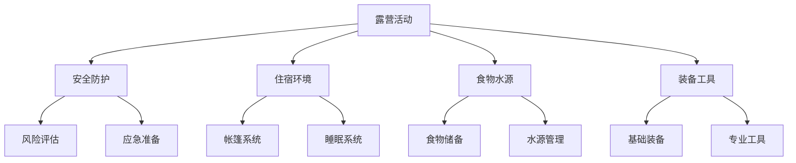

# 露营的基本要素

## 🏗️ 四大核心要素

### 1. 安全的住宿环境
- **帐篷系统**：[[03-应用层-实践技能/01-装备准备/03-帐篷搭建技巧|搭建技巧]]
- **睡袋系统**：保暖与舒适
- **防潮垫**：隔离地面湿气
- **天幕**：遮阳防雨

### 2. 充足的食物和水源
- **食物储备**：[[03-应用层-实践技能/02-营地建设/04-食物储存方法|储存方法]]
- **水源管理**：[[03-应用层-实践技能/03-野外生存/02-水源寻找与净化|水源净化]]
- **炊具系统**：[[03-应用层-实践技能/01-装备准备/04-炊具使用技能|炊具使用]]
- **营养搭配**：能量与营养平衡

### 3. 适当的装备和工具
- **基础装备**：[[03-应用层-实践技能/01-装备准备/01-基础装备清单|装备清单]]
- **照明工具**：[[03-应用层-实践技能/01-装备准备/05-照明与电源|照明装备]]
- **维修工具**：[[03-应用层-实践技能/01-装备准备/06-工具与维修|工具维修]]
- **安全装备**：应急与防护

### 4. 必要的安全防护
- **风险评估**：[[02-理解层-原理机制/03-安全防护机制/01-风险评估体系|风险评估]]
- **应急准备**：[[03-应用层-实践技能/04-应急处理|应急处理]]
- **保险保障**：[[02-理解层-原理机制/03-安全防护机制/04-保险与法律|保险法律]]
- **团队协作**：相互照应

## 🌍 环境要素

### 地理环境
- **地形条件**：平坦、排水良好
- **植被覆盖**：防风、遮阳
- **水源距离**：便利但不危险
- **交通便利**：便于到达和撤离

### 气候条件
- **温度适宜**：避免极端温度
- **风力适中**：避免强风区域
- **降水考虑**：防雨准备
- **季节选择**：适合的季节

## 📊 要素重要性矩阵

| 要素 | 重要性 | 紧急程度 | 准备难度 |
|------|--------|----------|----------|
| **安全防护** | ⭐⭐⭐⭐⭐ | ⭐⭐⭐⭐⭐ | ⭐⭐⭐ |
| **住宿环境** | ⭐⭐⭐⭐⭐ | ⭐⭐⭐⭐ | ⭐⭐⭐⭐ |
| **食物水源** | ⭐⭐⭐⭐ | ⭐⭐⭐⭐⭐ | ⭐⭐⭐ |
| **装备工具** | ⭐⭐⭐⭐ | ⭐⭐⭐ | ⭐⭐⭐⭐ |

## 🔗 要素间关系

## 🎯 要素配置策略

### 新手配置
- **安全第一**：重点配置安全防护
- **基础为主**：选择基础装备
- **简单实用**：避免复杂装备
- **团队协作**：依靠团队支持

### 进阶配置
- **功能完善**：全面配置各要素
- **质量提升**：选择优质装备
- **个性化**：根据需求定制
- **独立能力**：减少对外依赖

## 📋 检查清单

### 出发前检查
- [ ] 安全防护措施完备
- [ ] 住宿装备齐全
- [ ] 食物水源充足
- [ ] 装备工具正常
- [ ] 环境条件适宜

### 现场检查
- [ ] 营地安全评估
- [ ] 装备功能测试
- [ ] 食物储存检查
- [ ] 水源质量确认
- [ ] 应急准备验证

## 🔗 相关链接
- [[01-露营定义与内涵|露营定义]]
- [[03-应用层-实践技能/01-装备准备|装备准备]]
- [[02-理解层-原理机制/03-安全防护机制|安全防护]]
- [[03-应用层-实践技能/02-营地建设/01-营地选址原则|营地选址]]
