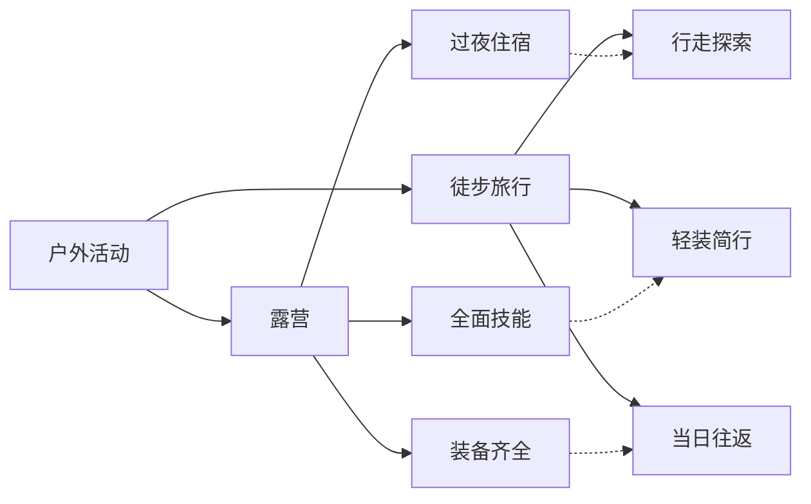
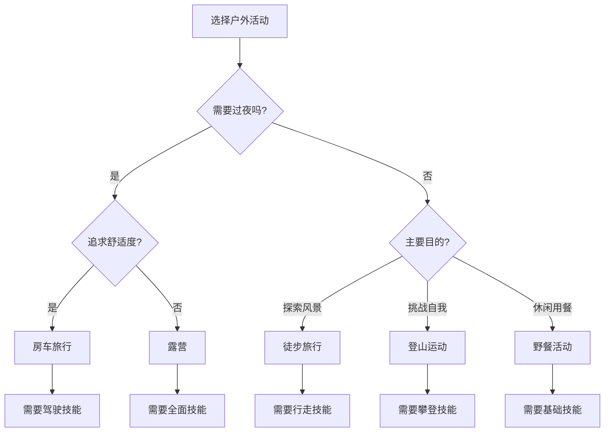

# 露营vs其他户外活动

## 🔍 核心区别分析

### 活动特征对比

| 特征维度 | 露营 | 徒步旅行 | 登山运动 | 野餐活动 | 房车旅行 |
|----------|------|----------|----------|----------|----------|
| **主要目的** | 户外过夜体验 | 行走探索 | 攀登挑战 | 户外用餐 | 舒适旅行 |
| **时间长度** | 1-7天 | 几小时-数天 | 1-数天 | 几小时 | 数天-数周 |
| **住宿方式** | 帐篷/简易住所 | 不过夜/简单 | 帐篷/山屋 | 不过夜 | 房车 |
| **技能要求** | 中等 | 低-中等 | 高 | 低 | 低 |
| **装备需求** | 全面 | 基础 | 专业 | 简单 | 复杂 |
| **环境适应** | 中等 | 中等 | 高 | 低 | 低 |

## 🎯 深度对比分析

### 1. 露营 vs 徒步旅行

**共同点**：
- 都在户外环境进行
- 都需要基础户外技能
- 都强调与自然接触

**区别点**：
- **住宿需求**：露营必须过夜，徒步可当日往返
- **装备复杂度**：露营需要完整住宿装备，徒步装备相对简单
- **技能要求**：露营需要更多生存技能，徒步主要需要行走技能

### 2. 露营 vs 登山运动

**共同点**：
- 都需要户外生存技能
- 都面临自然环境挑战
- 都需要专业装备

**区别点**：
- **技术难度**：登山技术要求更高，露营更注重生活技能
- **风险等级**：登山风险更高，露营相对安全
- **装备专业度**：登山装备更专业，露营装备更全面

### 3. 露营 vs 野餐活动

**共同点**：
- 都在户外进行
- 都涉及户外用餐
- 都是休闲活动

**区别点**：
- **时间长度**：野餐几小时，露营数天
- **技能要求**：野餐技能要求低，露营需要综合技能
- **装备需求**：野餐装备简单，露营装备复杂

### 4. 露营 vs 房车旅行

**共同点**：
- 都是户外过夜
- 都需要户外生活技能
- 都是旅行方式

**区别点**：
- **住宿方式**：露营用帐篷，房车用车辆
- **舒适度**：房车更舒适，露营更原始
- **成本投入**：房车成本更高，露营成本较低

## 🎓 费曼学习法应用

### 第一步：选择概念
选择"露营与其他户外活动的区别"作为学习概念

### 第二步：教授他人
用简单语言解释：
> "露营是户外过夜活动，需要搭帐篷、准备食物、学会野外生活技能。徒步主要是走路探索，登山是攀登挑战，野餐是简单用餐，房车是舒适旅行。"

### 第三步：回顾简化
- **核心区别**：过夜 vs 不过夜
- **技能要求**：综合技能 vs 专项技能
- **装备需求**：全面装备 vs 专项装备
- **风险等级**：中等风险 vs 不同风险

### 第四步：组织优化
建立知识连接：
- [[01-露营定义与内涵|露营定义]]
- [[02-露营的基本要素|基本要素]]
- [[02-露营分类/02-按方式分类|按方式分类]]

## 🏃‍♂️ 刻意练习要点

### 对比分析练习
1. **特征对比**：制作对比表格
2. **场景分析**：分析不同活动适用场景
3. **选择决策**：根据需求选择合适活动
4. **技能迁移**：分析技能间的关联性

### 实践验证
- **体验对比**：参与不同类型的户外活动
- **技能应用**：在不同活动中应用相关技能
- **装备对比**：比较不同活动的装备需求

## 📊 活动选择决策树

## 🎯 技能迁移分析

### 露营技能对其他活动的帮助
- **徒步旅行**：方向识别、装备管理、环境适应
- **登山运动**：风险评估、应急处理、团队协作
- **野餐活动**：食物准备、环境选择、安全防护
- **房车旅行**：营地选择、资源管理、生活技能

### 其他活动技能对露营的帮助
- **徒步技能**：负重行走、路线规划、体力管理
- **登山技能**：风险评估、应急处理、心理素质
- **野餐技能**：食物准备、环境适应、社交互动
- **房车技能**：资源管理、生活规划、问题解决

## 📋 学习检查清单

### 概念掌握度
- [ ] 能区分露营与其他户外活动
- [ ] 理解各活动的核心特征
- [ ] 掌握活动选择决策方法
- [ ] 了解技能迁移关系

### 应用能力
- [ ] 能根据需求选择合适活动
- [ ] 能分析活动的优缺点
- [ ] 能制定活动参与计划
- [ ] 能指导他人选择活动

## 🔗 相关链接
- [[01-露营定义与内涵|露营定义]]
- [[02-露营的基本要素|基本要素]]
- [[02-露营分类/02-按方式分类|按方式分类]]
- [[02-露营分类/03-按目的分类|按目的分类]]
