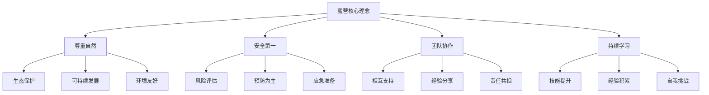

# 露营的核心理念

## 🎯 四大核心理念

### 1. 尊重自然
- **生态保护**：[[02-理解层-原理机制/04-环境保护理念/03-无痕山林原则|无痕山林原则]]
- **可持续发展**：[[02-理解层-原理机制/04-环境保护理念/02-可持续露营|可持续露营]]
- **环境友好**：最小化对自然的影响
- **生态平衡**：维护自然生态系统的完整性

### 2. 安全第一
- **风险评估**：[[02-理解层-原理机制/03-安全防护机制/01-风险评估体系|风险评估体系]]
- **预防为主**：[[02-理解层-原理机制/03-安全防护机制/02-预防措施原理|预防措施原理]]
- **应急准备**：[[03-应用层-实践技能/04-应急处理|应急处理]]
- **团队协作**：相互照应，共同安全

### 3. 团队协作
- **相互支持**：在困难时刻相互帮助
- **经验分享**：分享知识和技能
- **责任共担**：共同承担安全责任
- **友谊建立**：在合作中建立深厚友谊

### 4. 持续学习
- **技能提升**：不断学习新的户外技能
- **经验积累**：从每次活动中总结经验
- **知识更新**：跟上户外技术发展
- **自我挑战**：不断突破个人极限

## 🌟 理念层次结构

## 📊 理念重要性矩阵

| 理念 | 重要性 | 紧急程度 | 影响范围 |
|------|--------|----------|----------|
| **安全第一** | ⭐⭐⭐⭐⭐ | ⭐⭐⭐⭐⭐ | 个人+团队 |
| **尊重自然** | ⭐⭐⭐⭐⭐ | ⭐⭐⭐⭐ | 环境+社会 |
| **团队协作** | ⭐⭐⭐⭐ | ⭐⭐⭐⭐ | 团队+个人 |
| **持续学习** | ⭐⭐⭐⭐ | ⭐⭐⭐ | 个人+长期 |

## 🎓 费曼学习法应用

### 第一步：选择概念
选择"露营的核心理念"作为学习概念

### 第二步：教授他人
用简单语言解释：
> "露营有四个核心理念：安全第一是基础，尊重自然是责任，团队协作是保障，持续学习是动力。这四个理念相互支撑，缺一不可。"

### 第三步：回顾简化
- **安全第一**：生命至上，预防为主
- **尊重自然**：保护环境，可持续发展
- **团队协作**：相互支持，共同成长
- **持续学习**：技能提升，自我挑战

### 第四步：组织优化
建立理念间的连接：
- 安全第一 → 风险评估 → 应急处理
- 尊重自然 → 无痕山林 → 环保装备
- 团队协作 → 沟通技巧 → 领导力
- 持续学习 → 技能评估 → 经验总结

## 🏃‍♂️ 刻意练习要点

### 理念内化练习
1. **理念理解**：深入理解每个理念的内涵
2. **行为对照**：检查自己的行为是否符合理念
3. **决策应用**：在决策中应用核心理念
4. **传播推广**：向他人传播核心理念

### 实践验证
- **安全实践**：在每次活动中践行安全理念
- **环保实践**：在每次活动中践行环保理念
- **协作实践**：在团队中践行协作理念
- **学习实践**：在每次活动中践行学习理念

## 🔗 理念与技能的关系

### 安全第一 → 技能要求
- **风险评估技能**：[[02-理解层-原理机制/03-安全防护机制/01-风险评估体系|风险评估]]
- **应急处理技能**：[[03-应用层-实践技能/04-应急处理|应急处理]]
- **预防技能**：[[02-理解层-原理机制/03-安全防护机制/02-预防措施原理|预防措施]]

### 尊重自然 → 技能要求
- **环保技能**：[[02-理解层-原理机制/04-环境保护理念|环境保护]]
- **无痕技能**：[[02-理解层-原理机制/04-环境保护理念/03-无痕山林原则|无痕山林]]
- **可持续技能**：[[02-理解层-原理机制/04-环境保护理念/02-可持续露营|可持续露营]]

### 团队协作 → 技能要求
- **沟通技能**：[[04-创新层-进阶发展/03-领导力培养/04-沟通协调技巧|沟通协调]]
- **领导技能**：[[04-创新层-进阶发展/03-领导力培养|领导力培养]]
- **管理技能**：[[04-创新层-进阶发展/03-领导力培养/01-团队管理技能|团队管理]]

### 持续学习 → 技能要求
- **学习技能**：[[05-实践与评估/03-持续改进/01-学习反思模板|学习反思]]
- **评估技能**：[[05-实践与评估/01-技能评估体系|技能评估]]
- **总结技能**：[[05-实践与评估/03-持续改进/03-经验总结方法|经验总结]]

## 📋 理念践行检查清单

### 安全第一
- [ ] 每次活动前进行风险评估
- [ ] 准备充分的应急装备
- [ ] 制定详细的应急预案
- [ ] 确保团队成员了解安全措施

### 尊重自然
- [ ] 选择对环境影响最小的营地
- [ ] 使用环保装备和用品
- [ ] 遵循无痕山林原则
- [ ] 参与环保公益活动

### 团队协作
- [ ] 主动帮助团队成员
- [ ] 分享自己的知识和经验
- [ ] 承担团队责任
- [ ] 维护团队和谐氛围

### 持续学习
- [ ] 每次活动后总结经验
- [ ] 学习新的户外技能
- [ ] 关注户外技术发展
- [ ] 挑战自己的舒适圈

## 🎯 理念冲突处理

### 常见冲突场景
1. **安全 vs 冒险**：如何在安全前提下挑战自我
2. **环保 vs 便利**：如何在环保和便利间平衡
3. **个人 vs 团队**：如何处理个人需求与团队需要
4. **学习 vs 享受**：如何在学习和享受间平衡

### 冲突解决原则
- **安全优先**：安全永远是第一位的
- **平衡发展**：在冲突中寻找平衡点
- **沟通协商**：通过沟通解决分歧
- **持续改进**：从冲突中学习成长

## 🔗 相关链接
- [[01-露营定义与内涵|露营定义]]
- [[02-露营的基本要素|基本要素]]
- [[02-理解层-原理机制/03-安全防护机制|安全防护]]
- [[02-理解层-原理机制/04-环境保护理念|环境保护]]
