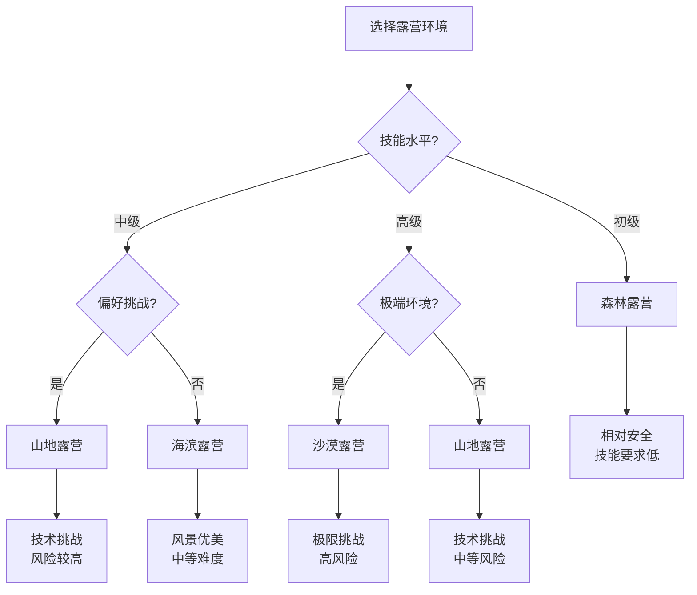

# 按环境分类

## 🌍 四大环境类型

### 1. 山地露营
- **环境特点**：高海拔、地形复杂、气候多变
- **技术要求**：高海拔适应、复杂地形处理
- **装备需求**：专业登山装备、保暖装备
- **安全考虑**：[[02-理解层-原理机制/03-安全防护机制/01-风险评估体系|风险评估]]、高海拔反应

### 2. 森林露营
- **环境特点**：植被茂密、野生动物、水源丰富
- **技术要求**：方向识别、野生动物应对
- **装备需求**：防虫装备、砍伐工具
- **安全考虑**：[[03-应用层-实践技能/04-应急处理/01-常见伤病处理|伤病处理]]、防火安全

### 3. 沙漠露营
- **环境特点**：极端温度、水源稀缺、地形开阔
- **技术要求**：水源管理、温度调节
- **装备需求**：防晒装备、储水设备
- **安全考虑**：[[03-应用层-实践技能/03-野外生存/02-水源寻找与净化|水源管理]]、中暑防护

### 4. 海滨露营
- **环境特点**：海风影响、潮汐变化、盐分腐蚀
- **技术要求**：潮汐预测、海风应对
- **装备需求**：防盐装备、防风设备
- **安全考虑**：[[03-应用层-实践技能/04-应急处理/02-恶劣天气应对|恶劣天气]]、潮汐安全

## 📊 环境特征对比

| 环境类型 | 温度范围 | 湿度 | 风力 | 水源 | 植被 | 野生动物 |
|----------|----------|------|------|------|------|----------|
| **山地** | -10°C~25°C | 低-中 | 强 | 稀缺 | 稀少 | 少 |
| **森林** | 5°C~30°C | 高 | 弱 | 丰富 | 茂密 | 多 |
| **沙漠** | -5°C~50°C | 极低 | 中-强 | 极缺 | 稀少 | 少 |
| **海滨** | 10°C~35°C | 高 | 强 | 丰富 | 中等 | 中等 |

## 🎯 环境选择决策树

## 🎓 费曼学习法应用

### 第一步：选择概念
选择"按环境分类的露营"作为学习概念

### 第二步：教授他人
用简单语言解释：
> "露营按环境分为四种：山地露营需要登山技能，森林露营相对安全，沙漠露营挑战极限，海滨露营风景优美。每种环境都有不同的特点和挑战。"

### 第三步：回顾简化
- **山地**：高海拔、技术挑战
- **森林**：安全、技能要求低
- **沙漠**：极端、高风险
- **海滨**：风景、中等难度

### 第四步：组织优化
建立环境与技能的联系：
- 山地 → [[04-创新层-进阶发展/01-高级技巧/01-极端环境露营|极端环境]]
- 森林 → [[03-应用层-实践技能/02-营地建设/01-营地选址原则|营地选址]]
- 沙漠 → [[03-应用层-实践技能/03-野外生存/02-水源寻找与净化|水源管理]]
- 海滨 → [[03-应用层-实践技能/04-应急处理/02-恶劣天气应对|恶劣天气]]

## 🏃‍♂️ 刻意练习要点

### 环境识别练习
1. **特征识别**：识别不同环境的关键特征
2. **风险评估**：评估不同环境的风险等级
3. **装备选择**：为不同环境选择合适的装备
4. **技能匹配**：匹配环境与所需技能

### 实践验证
- **环境体验**：体验不同类型的露营环境
- **技能应用**：在不同环境中应用相关技能
- **装备测试**：测试装备在不同环境中的表现
- **风险评估**：评估不同环境的安全风险

## 🔗 环境与技能的关系

### 山地环境技能
- **高海拔适应**：[[02-理解层-原理机制/01-户外生存原理/01-人体生理适应|生理适应]]
- **复杂地形处理**：[[03-应用层-实践技能/03-野外生存/01-方向识别技能|方向识别]]
- **恶劣天气应对**：[[03-应用层-实践技能/04-应急处理/02-恶劣天气应对|恶劣天气]]

### 森林环境技能
- **方向识别**：[[03-应用层-实践技能/03-野外生存/01-方向识别技能|方向识别]]
- **野生动物应对**：[[03-应用层-实践技能/04-应急处理/01-常见伤病处理|伤病处理]]
- **防火安全**：[[03-应用层-实践技能/02-营地建设/03-篝火建设与管理|篝火管理]]

### 沙漠环境技能
- **水源管理**：[[03-应用层-实践技能/03-野外生存/02-水源寻找与净化|水源管理]]
- **温度调节**：[[02-理解层-原理机制/01-户外生存原理/01-人体生理适应|生理适应]]
- **防晒保护**：[[03-应用层-实践技能/04-应急处理/01-常见伤病处理|伤病处理]]

### 海滨环境技能
- **潮汐预测**：[[03-应用层-实践技能/03-野外生存/07-跨学科知识整合|跨学科知识]]
- **海风应对**：[[03-应用层-实践技能/04-应急处理/02-恶劣天气应对|恶劣天气]]
- **盐分防护**：[[03-应用层-实践技能/01-装备准备/06-工具与维修|装备维护]]

## 📋 环境选择检查清单

### 技能评估
- [ ] 评估自己的技能水平
- [ ] 了解不同环境的技能要求
- [ ] 选择匹配的技能环境
- [ ] 制定技能提升计划

### 装备准备
- [ ] 了解不同环境的装备需求
- [ ] 准备适合的装备
- [ ] 测试装备在环境中的表现
- [ ] 准备应急装备

### 安全考虑
- [ ] 评估环境的安全风险
- [ ] 制定安全防护措施
- [ ] 准备应急预案
- [ ] 了解救援资源

## 🎯 环境适应策略

### 渐进式适应
1. **从简单开始**：从森林环境开始
2. **逐步提升**：逐步挑战更复杂环境
3. **技能积累**：在每种环境中积累经验
4. **风险评估**：每次活动前评估风险

### 环境转换
- **森林→山地**：增加高海拔适应训练
- **山地→沙漠**：增加水源管理技能
- **沙漠→海滨**：增加潮汐预测技能
- **海滨→森林**：增加野生动物应对技能

## 🔗 相关链接
- [[02-按方式分类|按方式分类]]
- [[03-按目的分类|按目的分类]]
- [[04-按难度分类|按难度分类]]
- [[03-应用层-实践技能/02-营地建设/01-营地选址原则|营地选址]]
