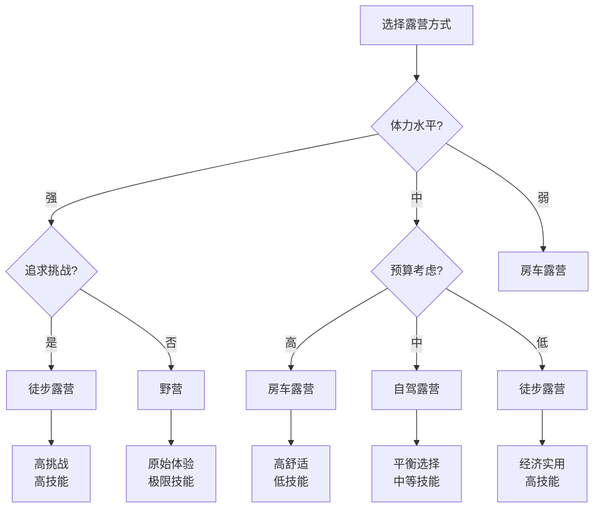

# 按方式分类

## 🚶‍♂️ 四大露营方式

### 1. 徒步露营
- **特点**：负重行走、路线规划、体力要求
- **装备**：轻量化装备、背包系统
- **技能**：[[03-应用层-实践技能/03-野外生存/01-方向识别技能|方向识别]]、负重行走
- **适合人群**：体力好、喜欢挑战的户外爱好者

### 2. 自驾露营
- **特点**：车辆运输、装备丰富、舒适度高
- **装备**：完整装备、车载系统
- **技能**：[[03-应用层-实践技能/02-营地建设/01-营地选址原则|营地选址]]、装备管理
- **适合人群**：家庭、追求舒适的露营者

### 3. 房车露营
- **特点**：移动住所、设施完善、便利性强
- **装备**：房车系统、生活设施
- **技能**：[[04-创新层-进阶发展/02-专业配置/01-专业装备推荐|专业配置]]、系统管理
- **适合人群**：追求舒适、长期旅行的露营者

### 4. 野营
- **特点**：原始环境、技能要求、挑战性强
- **装备**：基础装备、生存工具
- **技能**：[[03-应用层-实践技能/03-野外生存|野外生存]]、应急处理
- **适合人群**：技能熟练、追求原始体验的露营者

## 📊 方式特征对比

| 方式 | 装备重量 | 舒适度 | 技能要求 | 成本 | 灵活性 | 挑战性 |
|------|----------|--------|----------|------|--------|--------|
| **徒步** | 重 | 低 | 高 | 低 | 高 | 高 |
| **自驾** | 轻 | 高 | 中 | 中 | 中 | 中 |
| **房车** | 无 | 最高 | 低 | 高 | 低 | 低 |
| **野营** | 中 | 低 | 最高 | 低 | 最高 | 最高 |

## 🎯 方式选择决策树

## 🎓 费曼学习法应用

### 第一步：选择概念
选择"按方式分类的露营"作为学习概念

### 第二步：教授他人
用简单语言解释：
> "露营按方式分为四种：徒步露营要背装备走路，自驾露营开车带装备，房车露营住车里，野营用最少装备挑战极限。每种方式适合不同的人。"

### 第三步：回顾简化
- **徒步**：负重行走、高技能
- **自驾**：车辆运输、中等技能
- **房车**：移动住所、低技能
- **野营**：原始体验、最高技能

### 第四步：组织优化
建立方式与技能的联系：
- 徒步 → [[03-应用层-实践技能/03-野外生存/01-方向识别技能|方向识别]]
- 自驾 → [[03-应用层-实践技能/02-营地建设/01-营地选址原则|营地选址]]
- 房车 → [[04-创新层-进阶发展/02-专业配置|专业配置]]
- 野营 → [[03-应用层-实践技能/03-野外生存|野外生存]]

## 🏃‍♂️ 刻意练习要点

### 方式体验练习
1. **方式对比**：体验不同露营方式
2. **技能匹配**：匹配方式与所需技能
3. **装备选择**：为不同方式选择装备
4. **成本分析**：分析不同方式的成本

### 实践验证
- **方式体验**：体验不同类型的露营方式
- **技能应用**：在不同方式中应用相关技能
- **装备测试**：测试装备在不同方式中的表现
- **成本评估**：评估不同方式的成本效益

## 🔗 方式与技能的关系

### 徒步露营技能
- **负重行走**：体力管理、行走技巧
- **路线规划**：[[03-应用层-实践技能/03-野外生存/01-方向识别技能|方向识别]]
- **轻量化**：[[02-理解层-原理机制/02-装备选择原理/03-重量与便携性|重量便携]]
- **应急处理**：[[03-应用层-实践技能/04-应急处理|应急处理]]

### 自驾露营技能
- **营地选择**：[[03-应用层-实践技能/02-营地建设/01-营地选址原则|营地选址]]
- **装备管理**：[[03-应用层-实践技能/01-装备准备|装备准备]]
- **车辆维护**：[[03-应用层-实践技能/01-装备准备/06-工具与维修|工具维修]]
- **团队协作**：[[04-创新层-进阶发展/03-领导力培养/01-团队管理技能|团队管理]]

### 房车露营技能
- **系统管理**：[[04-创新层-进阶发展/02-专业配置/03-技术装备集成|技术集成]]
- **生活规划**：[[04-创新层-进阶发展/02-专业配置/02-定制化配置|定制配置]]
- **维护保养**：[[04-创新层-进阶发展/02-专业配置/04-维护保养体系|维护保养]]
- **成本控制**：[[04-创新层-进阶发展/02-专业配置/06-成本效益分析|成本分析]]

### 野营技能
- **生存技能**：[[03-应用层-实践技能/03-野外生存|野外生存]]
- **应急处理**：[[03-应用层-实践技能/04-应急处理|应急处理]]
- **心理素质**：[[02-理解层-原理机制/01-户外生存原理/04-心理适应机制|心理适应]]
- **风险评估**：[[02-理解层-原理机制/03-安全防护机制/01-风险评估体系|风险评估]]

## 📋 方式选择检查清单

### 个人条件评估
- [ ] 评估体力水平
- [ ] 评估技能水平
- [ ] 评估预算情况
- [ ] 评估时间安排

### 方式匹配
- [ ] 选择匹配的露营方式
- [ ] 了解方式的特点和要求
- [ ] 准备相应的装备和技能
- [ ] 制定详细的计划

### 实践准备
- [ ] 进行相关技能训练
- [ ] 准备必要的装备
- [ ] 制定应急预案
- [ ] 了解相关法规

## 🎯 方式转换策略

### 技能提升路径
1. **房车→自驾**：增加营地建设技能
2. **自驾→徒步**：增加负重行走技能
3. **徒步→野营**：增加野外生存技能
4. **野营→专业**：增加专业配置技能

### 装备升级路径
- **基础装备**：[[03-应用层-实践技能/01-装备准备/01-基础装备清单|基础装备]]
- **专业装备**：[[04-创新层-进阶发展/02-专业配置/01-专业装备推荐|专业装备]]
- **定制装备**：[[04-创新层-进阶发展/02-专业配置/02-定制化配置|定制配置]]
- **技术装备**：[[04-创新层-进阶发展/02-专业配置/03-技术装备集成|技术集成]]

## 🔗 相关链接
- [[01-按环境分类|按环境分类]]
- [[03-按目的分类|按目的分类]]
- [[04-按难度分类|按难度分类]]
- [[03-应用层-实践技能/01-装备准备|装备准备]]
