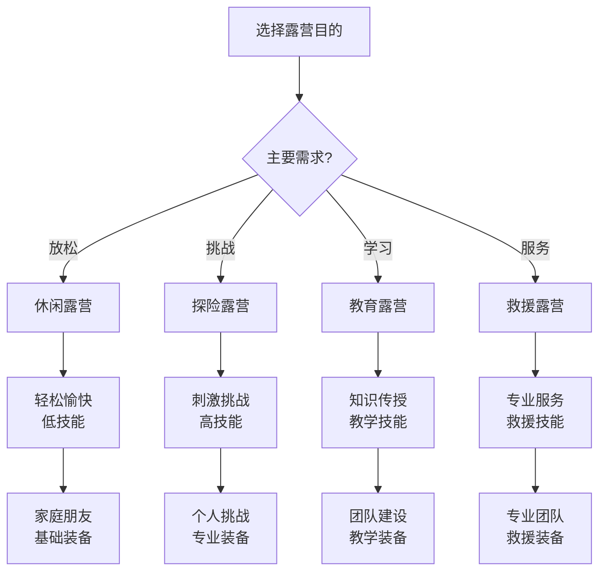

# 按目的分类

## 🎯 四大露营目的

### 1. 休闲露营
- **目的**：放松身心、家庭聚会、朋友聚会
- **特点**：轻松愉快、舒适为主、社交导向
- **技能要求**：基础技能、[[03-应用层-实践技能/02-营地建设|营地建设]]
- **适合人群**：家庭、朋友、初学者

### 2. 探险露营
- **目的**：挑战极限、探索未知、技能提升
- **特点**：刺激体验、技术挑战、个人成长
- **技能要求**：高级技能、[[04-创新层-进阶发展/01-高级技巧|高级技巧]]
- **适合人群**：经验丰富、追求挑战的户外爱好者

### 3. 教育露营
- **目的**：学习技能、团队建设、品格培养
- **特点**：知识传授、技能培训、人格塑造
- **技能要求**：教学技能、[[04-创新层-进阶发展/03-领导力培养|领导力培养]]
- **适合人群**：教育工作者、培训师、家长

### 4. 救援露营
- **目的**：应急响应、专业训练、服务他人
- **特点**：专业性强、社会责任、技能要求高
- **技能要求**：专业技能、[[03-应用层-实践技能/04-应急处理|应急处理]]
- **适合人群**：救援人员、志愿者、专业人士

## 📊 目的特征对比

| 目的类型 | 技能要求 | 风险等级 | 时间长度 | 团队规模 | 装备需求 | 学习价值 |
|----------|----------|----------|----------|----------|----------|----------|
| **休闲** | 低 | 低 | 短 | 大 | 基础 | 低 |
| **探险** | 高 | 高 | 长 | 小 | 专业 | 高 |
| **教育** | 中 | 中 | 中 | 中 | 教学 | 中 |
| **救援** | 最高 | 最高 | 不定 | 专业 | 专业 | 最高 |

## 🎯 目的选择决策树

## 🎓 费曼学习法应用

### 第一步：选择概念
选择"按目的分类的露营"作为学习概念

### 第二步：教授他人
用简单语言解释：
> "露营按目的分为四种：休闲露营是为了放松和聚会，探险露营是为了挑战和刺激，教育露营是为了学习和成长，救援露营是为了帮助他人。"

### 第三步：回顾简化
- **休闲**：放松、聚会、低技能
- **探险**：挑战、刺激、高技能
- **教育**：学习、成长、教学技能
- **救援**：服务、专业、救援技能

### 第四步：组织优化
建立目的与技能的联系：
- 休闲 → [[03-应用层-实践技能/02-营地建设|营地建设]]
- 探险 → [[04-创新层-进阶发展/01-高级技巧|高级技巧]]
- 教育 → [[04-创新层-进阶发展/03-领导力培养|领导力培养]]
- 救援 → [[03-应用层-实践技能/04-应急处理|应急处理]]

## 🏃‍♂️ 刻意练习要点

### 目的明确练习
1. **目的分析**：分析不同露营目的的特点
2. **技能匹配**：匹配目的与所需技能
3. **装备选择**：为不同目的选择装备
4. **团队组建**：根据目的组建团队

### 实践验证
- **目的体验**：体验不同类型的露营目的
- **技能应用**：在不同目的中应用相关技能
- **团队协作**：在不同目的中练习团队协作
- **价值实现**：验证不同目的的价值实现

## 🔗 目的与技能的关系

### 休闲露营技能
- **基础技能**：[[03-应用层-实践技能/01-装备准备|装备准备]]
- **营地建设**：[[03-应用层-实践技能/02-营地建设|营地建设]]
- **社交技能**：[[04-创新层-进阶发展/03-领导力培养/04-沟通协调技巧|沟通协调]]
- **安全技能**：[[02-理解层-原理机制/03-安全防护机制|安全防护]]

### 探险露营技能
- **高级技能**：[[04-创新层-进阶发展/01-高级技巧|高级技巧]]
- **生存技能**：[[03-应用层-实践技能/03-野外生存|野外生存]]
- **应急技能**：[[03-应用层-实践技能/04-应急处理|应急处理]]
- **心理技能**：[[02-理解层-原理机制/01-户外生存原理/04-心理适应机制|心理适应]]

### 教育露营技能
- **教学技能**：[[04-创新层-进阶发展/03-领导力培养/05-培训指导方法|培训指导]]
- **管理技能**：[[04-创新层-进阶发展/03-领导力培养/01-团队管理技能|团队管理]]
- **沟通技能**：[[04-创新层-进阶发展/03-领导力培养/04-沟通协调技巧|沟通协调]]
- **评估技能**：[[05-实践与评估/01-技能评估体系|技能评估]]

### 救援露营技能
- **救援技能**：[[03-应用层-实践技能/04-应急处理|应急处理]]
- **医疗技能**：[[03-应用层-实践技能/04-应急处理/01-常见伤病处理|伤病处理]]
- **通信技能**：[[03-应用层-实践技能/03-野外生存/06-信号与求救|信号求救]]
- **组织技能**：[[04-创新层-进阶发展/03-领导力培养/03-危机处理领导|危机处理]]

## 📋 目的选择检查清单

### 需求分析
- [ ] 明确个人或团队的主要需求
- [ ] 分析期望达到的目标
- [ ] 评估可投入的时间和资源
- [ ] 考虑团队成员的技能水平

### 目的匹配
- [ ] 选择匹配的露营目的
- [ ] 了解目的的特点和要求
- [ ] 准备相应的技能和装备
- [ ] 制定详细的实施计划

### 价值实现
- [ ] 设定明确的价值目标
- [ ] 制定价值实现路径
- [ ] 建立价值评估标准
- [ ] 持续跟踪价值实现情况

## 🎯 目的转换策略

### 技能提升路径
1. **休闲→探险**：增加挑战技能
2. **探险→教育**：增加教学技能
3. **教育→救援**：增加专业救援技能
4. **救援→专业**：增加专业配置技能

### 价值实现路径
- **个人价值**：技能提升、个人成长
- **团队价值**：团队建设、协作能力
- **社会价值**：环保意识、社会责任
- **专业价值**：专业能力、行业贡献

## 🔗 目的与价值观的关系

### 休闲露营价值观
- **享受生活**：追求快乐和放松
- **家庭和谐**：增进家庭关系
- **友谊建立**：建立深厚友谊
- **生活品质**：提升生活品质

### 探险露营价值观
- **挑战自我**：突破个人极限
- **探索精神**：追求未知和刺激
- **个人成长**：提升个人能力
- **成就感**：获得成就满足

### 教育露营价值观
- **知识传承**：传播知识和技能
- **人格塑造**：培养良好品格
- **团队建设**：提升团队能力
- **社会责任**：承担教育责任

### 救援露营价值观
- **服务他人**：帮助需要帮助的人
- **社会责任**：承担社会责任
- **专业精神**：追求专业 excellence
- **生命至上**：尊重和珍惜生命

## 🔗 相关链接
- [[01-按环境分类|按环境分类]]
- [[02-按方式分类|按方式分类]]
- [[04-按难度分类|按难度分类]]
- [[04-创新层-进阶发展/03-领导力培养|领导力培养]]
