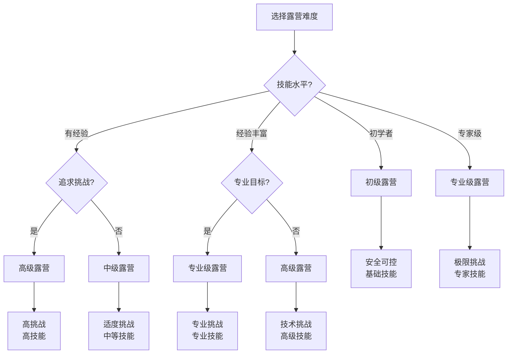
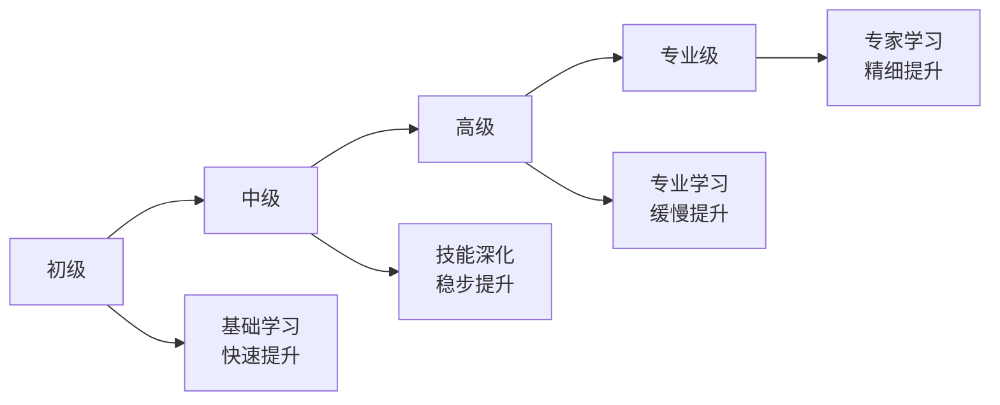

# 按难度分类

## 📈 四级难度体系

### 1. 初级露营
- **特点**：基础技能、简单环境、装备齐全、安全可控
- **技能要求**：[[03-应用层-实践技能/01-装备准备|装备准备]]、基础搭建
- **环境要求**：成熟营地、良好天气、便利交通
- **适合人群**：初学者、家庭、儿童

### 2. 中级露营
- **特点**：技能提升、环境复杂、装备优化、挑战增加
- **技能要求**：[[03-应用层-实践技能/02-营地建设|营地建设]]、环境适应
- **环境要求**：半开发区域、变化天气、中等距离
- **适合人群**：有经验者、技能提升者

### 3. 高级露营
- **特点**：专业技能、极端环境、装备专业、风险较高
- **技能要求**：[[03-应用层-实践技能/03-野外生存|野外生存]]、应急处理
- **环境要求**：原始环境、恶劣天气、偏远地区
- **适合人群**：经验丰富者、挑战爱好者

### 4. 专业级露营
- **特点**：专家水平、极限环境、顶级装备、极高风险
- **技能要求**：[[04-创新层-进阶发展/01-高级技巧|高级技巧]]、专业配置
- **环境要求**：极限环境、极端天气、无人区域
- **适合人群**：专业人士、极限挑战者

## 📊 难度特征对比

| 难度等级 | 技能要求 | 环境复杂度 | 风险等级 | 装备需求 | 时间长度 | 团队规模 |
|----------|----------|------------|----------|----------|----------|----------|
| **初级** | 低 | 低 | 低 | 基础 | 短 | 大 |
| **中级** | 中 | 中 | 中 | 优化 | 中 | 中 |
| **高级** | 高 | 高 | 高 | 专业 | 长 | 小 |
| **专业级** | 最高 | 最高 | 最高 | 顶级 | 最长 | 最小 |

## 🎯 难度选择决策树

## 🎓 费曼学习法应用

### 第一步：选择概念
选择"按难度分类的露营"作为学习概念

### 第二步：教授他人
用简单语言解释：
> "露营按难度分为四级：初级露营最简单安全，中级露营有适度挑战，高级露营技术难度高，专业级露营是极限挑战。选择难度要看自己的技能水平。"

### 第三步：回顾简化
- **初级**：安全、基础技能
- **中级**：适度挑战、中等技能
- **高级**：高挑战、高技能
- **专业级**：极限挑战、专家技能

### 第四步：组织优化
建立难度与技能的联系：
- 初级 → [[03-应用层-实践技能/01-装备准备|装备准备]]
- 中级 → [[03-应用层-实践技能/02-营地建设|营地建设]]
- 高级 → [[03-应用层-实践技能/03-野外生存|野外生存]]
- 专业级 → [[04-创新层-进阶发展/01-高级技巧|高级技巧]]

## 🏃‍♂️ 刻意练习要点

### 难度提升练习
1. **技能评估**：评估当前技能水平
2. **难度选择**：选择匹配的难度等级
3. **技能训练**：针对性地训练相关技能
4. **渐进提升**：逐步提升难度等级

### 实践验证
- **难度体验**：体验不同难度的露营
- **技能应用**：在不同难度中应用技能
- **风险评估**：评估不同难度的风险
- **能力提升**：通过实践提升能力

## 🔗 难度与技能的关系

### 初级露营技能
- **基础装备**：[[03-应用层-实践技能/01-装备准备/01-基础装备清单|基础装备]]
- **简单搭建**：[[03-应用层-实践技能/01-装备准备/03-帐篷搭建技巧|帐篷搭建]]
- **基础安全**：[[02-理解层-原理机制/03-安全防护机制/01-风险评估体系|风险评估]]
- **团队协作**：[[04-创新层-进阶发展/03-领导力培养/04-沟通协调技巧|沟通协调]]

### 中级露营技能
- **营地建设**：[[03-应用层-实践技能/02-营地建设|营地建设]]
- **环境适应**：[[02-理解层-原理机制/01-户外生存原理/02-环境因素影响|环境因素]]
- **装备优化**：[[02-理解层-原理机制/02-装备选择原理/04-性价比评估|性价比评估]]
- **应急准备**：[[03-应用层-实践技能/04-应急处理|应急处理]]

### 高级露营技能
- **野外生存**：[[03-应用层-实践技能/03-野外生存|野外生存]]
- **应急处理**：[[03-应用层-实践技能/04-应急处理|应急处理]]
- **心理适应**：[[02-理解层-原理机制/01-户外生存原理/04-心理适应机制|心理适应]]
- **专业装备**：[[04-创新层-进阶发展/02-专业配置/01-专业装备推荐|专业装备]]

### 专业级露营技能
- **高级技巧**：[[04-创新层-进阶发展/01-高级技巧|高级技巧]]
- **专业配置**：[[04-创新层-进阶发展/02-专业配置|专业配置]]
- **领导力**：[[04-创新层-进阶发展/03-领导力培养|领导力培养]]
- **文化传承**：[[04-创新层-进阶发展/04-文化传承|文化传承]]

## 📋 难度选择检查清单

### 技能评估
- [ ] 评估当前技能水平
- [ ] 了解各难度等级的技能要求
- [ ] 识别技能差距
- [ ] 制定技能提升计划

### 风险承受
- [ ] 评估个人风险承受能力
- [ ] 了解各难度等级的风险
- [ ] 制定风险控制措施
- [ ] 准备应急预案

### 资源准备
- [ ] 评估可投入的时间
- [ ] 评估可投入的金钱
- [ ] 评估可投入的精力
- [ ] 制定资源分配计划

## 🎯 难度提升策略

### 渐进式提升
1. **技能积累**：在低难度中积累经验
2. **技能提升**：针对性提升关键技能
3. **难度挑战**：逐步挑战更高难度
4. **能力验证**：通过实践验证能力

### 技能发展路径
- **初级→中级**：增加营地建设技能
- **中级→高级**：增加野外生存技能
- **高级→专业级**：增加高级技巧技能
- **专业级→专家**：增加专业配置技能

## 🔗 难度与学习的关系

### 学习曲线

### 学习重点
- **初级**：基础概念、基本技能
- **中级**：技能应用、环境适应
- **高级**：专业技能、应急处理
- **专业级**：高级技巧、专业配置

## 🔗 相关链接
- [[01-按环境分类|按环境分类]]
- [[02-按方式分类|按方式分类]]
- [[03-按目的分类|按目的分类]]
- [[05-实践与评估/01-技能评估体系/02-技能等级标准|技能等级标准]]
