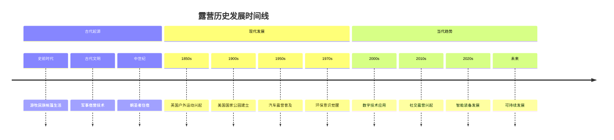

# 露营历史发展

## 📜 历史发展脉络

### 古代起源（史前-19世纪）
- **游牧民族**：帐篷生活、迁徙文化
- **军事需要**：行军宿营、战术需求
- **生存技能**：野外生存、传统智慧
- **文化传承**：口耳相传、经验积累

### 现代发展（19世纪-20世纪）
- **19世纪兴起**：工业革命、城市化进程
- **20世纪普及**：汽车普及、中产阶级兴起
- **装备现代化**：新材料、新技术应用
- **理念更新**：环保意识、可持续发展

### 当代趋势（21世纪至今）
- **技术融合**：数字化、智能化装备
- **环保理念**：无痕山林、生态保护
- **个性化需求**：定制化、专业化
- **社交属性**：社区化、分享文化

## 📊 历史发展阶段

| 时期 | 主要特点 | 技术发展 | 社会背景 | 文化影响 |
|------|----------|----------|----------|----------|
| **古代** | 生存必需 | 传统工艺 | 游牧社会 | 实用主义 |
| **19世纪** | 休闲兴起 | 工业技术 | 城市化 | 中产阶级 |
| **20世纪** | 大众普及 | 现代材料 | 消费社会 | 生活方式 |
| **21世纪** | 技术融合 | 数字技术 | 信息社会 | 环保理念 |

## 🎯 关键历史节点

## 🎓 费曼学习法应用

### 第一步：选择概念
选择"露营历史发展"作为学习概念

### 第二步：教授他人
用简单语言解释：
> "露营历史分为三个阶段：古代是生存必需，19世纪开始变成休闲活动，21世纪融合了技术和环保理念。每个阶段都有不同的特点和技术发展。"

### 第三步：回顾简化
- **古代**：生存必需、传统技能
- **现代**：休闲活动、技术发展
- **当代**：技术融合、环保理念

### 第四步：组织优化
建立历史与现状的联系：
- 古代技能 → [[03-应用层-实践技能/03-野外生存|野外生存]]
- 现代装备 → [[03-应用层-实践技能/01-装备准备|装备准备]]
- 当代理念 → [[02-理解层-原理机制/04-环境保护理念|环境保护]]

## 🏃‍♂️ 刻意练习要点

### 历史理解练习
1. **时间线梳理**：梳理露营发展的时间线
2. **阶段对比**：对比不同发展阶段的特点
3. **技术分析**：分析技术发展的影响
4. **文化理解**：理解文化背景的影响

### 实践验证
- **传统技能**：学习传统露营技能
- **现代装备**：使用现代露营装备
- **环保实践**：践行环保露营理念
- **文化传承**：传承露营文化

## 🔗 历史与技能的关系

### 古代技能传承
- **传统工艺**：手工制作、自然材料
- **生存智慧**：经验积累、口耳相传
- **环境适应**：因地制宜、就地取材
- **团队协作**：集体生活、相互帮助

### 现代技能发展
- **装备使用**：[[03-应用层-实践技能/01-装备准备|装备准备]]
- **营地建设**：[[03-应用层-实践技能/02-营地建设|营地建设]]
- **安全防护**：[[02-理解层-原理机制/03-安全防护机制|安全防护]]
- **环保实践**：[[02-理解层-原理机制/04-环境保护理念|环境保护]]

### 当代技能创新
- **技术应用**：[[04-创新层-进阶发展/02-专业配置/03-技术装备集成|技术集成]]
- **专业配置**：[[04-创新层-进阶发展/02-专业配置|专业配置]]
- **领导力**：[[04-创新层-进阶发展/03-领导力培养|领导力培养]]
- **文化传承**：[[04-创新层-进阶发展/04-文化传承|文化传承]]

## 📋 历史学习检查清单

### 知识掌握
- [ ] 了解露营发展的历史脉络
- [ ] 理解不同发展阶段的特点
- [ ] 掌握关键历史节点
- [ ] 认识技术发展的影响

### 文化理解
- [ ] 理解文化背景的影响
- [ ] 认识社会发展的作用
- [ ] 掌握文化传承的意义
- [ ] 了解当代发展趋势

## 🎯 历史启示

### 发展规律
1. **技术驱动**：技术进步推动露营发展
2. **社会需求**：社会需求决定发展方向
3. **文化传承**：文化传承保持核心价值
4. **持续创新**：持续创新适应时代变化

### 现代启示
- **传统价值**：保持传统技能的价值
- **技术融合**：合理运用现代技术
- **环保理念**：坚持可持续发展
- **文化传承**：传承和发扬露营文化

## 🔗 相关链接
- [[02-各国露营文化|各国露营文化]]
- [[03-露营名人故事|露营名人故事]]
- [[04-现代露营趋势|现代露营趋势]]
- [[02-理解层-原理机制/04-环境保护理念/02-可持续露营|可持续露营]]
