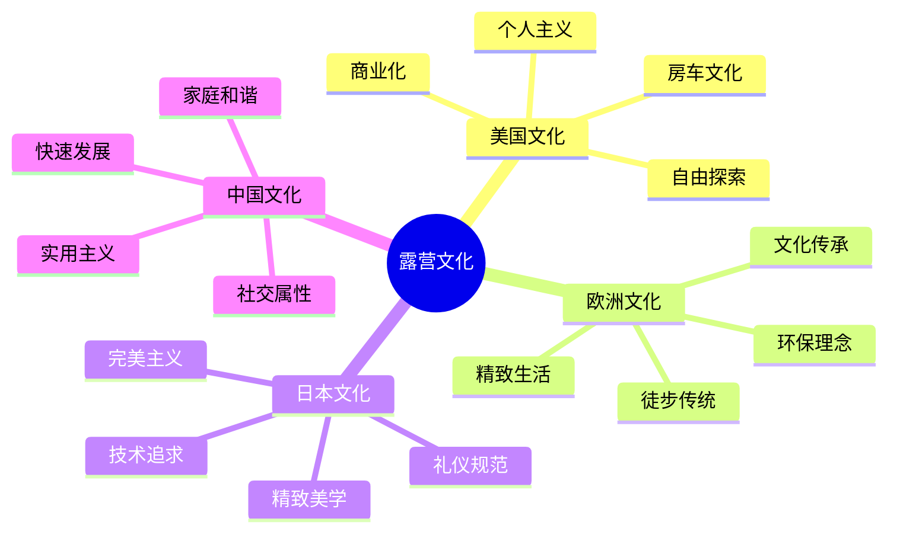

# 各国露营文化

## 🌍 四大文化体系

### 1. 美国露营文化
- **文化特点**：国家公园体系、房车文化、家庭传统
- **核心理念**：自由探索、个人主义、冒险精神
- **装备特色**：大型房车、豪华装备、便利设施
- **社会影响**：商业化发达、产业链完整

### 2. 欧洲露营文化
- **文化特点**：徒步传统、环保理念、精致装备
- **核心理念**：可持续发展、文化底蕴、精致生活
- **装备特色**：轻量化装备、环保材料、设计感强
- **社会影响**：环保意识强、文化传承好

### 3. 日本露营文化
- **文化特点**：精致美学、细节关注、技术装备
- **核心理念**：完美主义、礼仪规范、技术追求
- **装备特色**：精致装备、技术先进、细节完美
- **社会影响**：技术领先、品质追求

### 4. 中国露营文化
- **文化特点**：快速发展、多样化、本土化
- **核心理念**：实用主义、家庭和谐、社交属性
- **装备特色**：性价比高、功能实用、本土品牌
- **社会影响**：市场巨大、发展迅速

## 📊 文化特征对比

| 文化类型 | 核心理念 | 装备特点 | 社交方式 | 环保意识 | 技术追求 |
|----------|----------|----------|----------|----------|----------|
| **美国** | 自由探索 | 大型豪华 | 个人主义 | 中等 | 实用 |
| **欧洲** | 可持续发展 | 轻量环保 | 文化传承 | 强 | 设计 |
| **日本** | 完美主义 | 精致技术 | 礼仪规范 | 强 | 技术 |
| **中国** | 实用主义 | 性价比高 | 家庭社交 | 提升中 | 实用 |

## 🎯 文化影响分析

## 🎓 费曼学习法应用

### 第一步：选择概念
选择"各国露营文化"作为学习概念

### 第二步：教授他人
用简单语言解释：
> "不同国家的露营文化不同：美国追求自由探索，欧洲注重环保和精致，日本追求完美和技术，中国注重实用和家庭。每种文化都有其特色和优势。"

### 第三步：回顾简化
- **美国**：自由、个人主义、商业化
- **欧洲**：环保、精致、文化传承
- **日本**：完美、技术、礼仪
- **中国**：实用、家庭、社交

### 第四步：组织优化
建立文化与技能的联系：
- 美国文化 → [[04-创新层-进阶发展/02-专业配置|专业配置]]
- 欧洲文化 → [[02-理解层-原理机制/04-环境保护理念|环境保护]]
- 日本文化 → [[04-创新层-进阶发展/02-专业配置/03-技术装备集成|技术集成]]
- 中国文化 → [[04-创新层-进阶发展/03-领导力培养|领导力培养]]

## 🏃‍♂️ 刻意练习要点

### 文化理解练习
1. **文化对比**：对比不同文化的特点
2. **理念分析**：分析核心理念的差异
3. **装备研究**：研究不同文化的装备特色
4. **实践体验**：体验不同文化的露营方式

### 实践验证
- **文化体验**：体验不同文化的露营方式
- **理念实践**：实践不同文化的核心理念
- **装备使用**：使用不同文化的装备
- **文化交流**：与不同文化背景的人交流

## 🔗 文化与技能的关系

### 美国文化技能
- **自由探索**：[[04-创新层-进阶发展/01-高级技巧/01-极端环境露营|极端环境]]
- **个人主义**：[[04-创新层-进阶发展/03-领导力培养/06-责任与担当|责任担当]]
- **商业化**：[[04-创新层-进阶发展/02-专业配置/06-成本效益分析|成本分析]]
- **房车文化**：[[04-创新层-进阶发展/02-专业配置|专业配置]]

### 欧洲文化技能
- **环保理念**：[[02-理解层-原理机制/04-环境保护理念|环境保护]]
- **文化传承**：[[04-创新层-进阶发展/04-文化传承|文化传承]]
- **精致生活**：[[04-创新层-进阶发展/02-专业配置/02-定制化配置|定制配置]]
- **徒步传统**：[[03-应用层-实践技能/03-野外生存|野外生存]]

### 日本文化技能
- **精致美学**：[[04-创新层-进阶发展/02-专业配置/01-专业装备推荐|专业装备]]
- **技术追求**：[[04-创新层-进阶发展/02-专业配置/03-技术装备集成|技术集成]]
- **礼仪规范**：[[04-创新层-进阶发展/03-领导力培养/04-沟通协调技巧|沟通协调]]
- **完美主义**：[[04-创新层-进阶发展/02-专业配置/04-维护保养体系|维护保养]]

### 中国文化技能
- **实用主义**：[[03-应用层-实践技能/01-装备准备|装备准备]]
- **家庭和谐**：[[04-创新层-进阶发展/03-领导力培养/01-团队管理技能|团队管理]]
- **社交属性**：[[04-创新层-进阶发展/03-领导力培养/04-沟通协调技巧|沟通协调]]
- **快速发展**：[[05-实践与评估/03-持续改进|持续改进]]

## 📋 文化学习检查清单

### 文化理解
- [ ] 了解不同文化的核心理念
- [ ] 理解文化背景的影响
- [ ] 掌握文化特色的差异
- [ ] 认识文化发展的趋势

### 实践应用
- [ ] 体验不同文化的露营方式
- [ ] 实践不同文化的核心理念
- [ ] 使用不同文化的装备
- [ ] 参与不同文化的交流

## 🎯 文化融合策略

### 文化借鉴
1. **美国自由**：借鉴自由探索精神
2. **欧洲环保**：借鉴环保理念
3. **日本精致**：借鉴精致追求
4. **中国实用**：借鉴实用主义

### 文化创新
- **理念融合**：融合不同文化的核心理念
- **装备创新**：结合不同文化的装备特色
- **技能发展**：发展跨文化的技能
- **文化交流**：促进不同文化的交流

## 🔗 文化发展趋势

### 全球化趋势
- **文化融合**：不同文化相互融合
- **技术共享**：技术在全球范围内共享
- **理念传播**：环保理念全球传播
- **装备标准化**：装备标准逐渐统一

### 本土化趋势
- **文化特色**：保持本土文化特色
- **需求适应**：适应本土需求
- **装备本土化**：装备适应本土环境
- **理念本土化**：理念适应本土文化

## 🔗 相关链接
- [[01-露营历史发展|露营历史发展]]
- [[03-露营名人故事|露营名人故事]]
- [[04-现代露营趋势|现代露营趋势]]
- [[02-理解层-原理机制/04-环境保护理念/02-可持续露营|可持续露营]]
