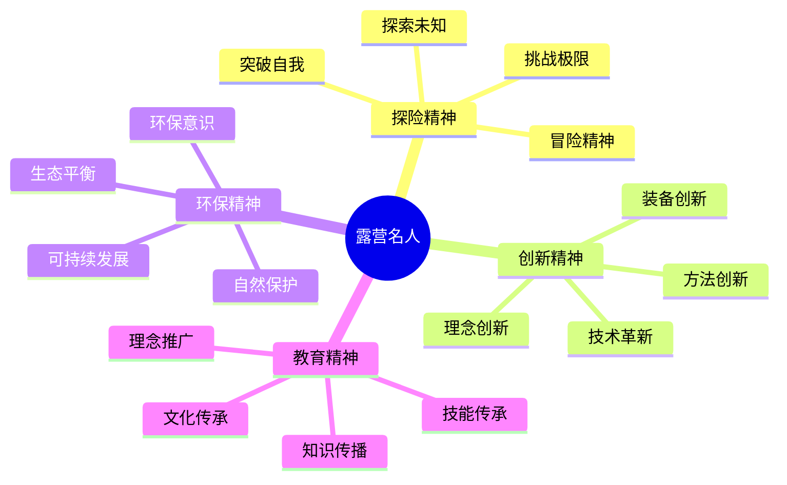

# 露营名人故事

## 🌟 历史名人

### 早期探险家
- **约翰·缪尔**：美国国家公园之父，环保运动先驱
- **西奥多·罗斯福**：美国总统，户外运动倡导者
- **罗伯特·巴登-鲍威尔**：童子军创始人，户外教育先驱
- **埃德蒙·希拉里**：珠峰首登者，登山传奇

### 装备发明者
- **劳伦斯·克拉克**：帐篷技术革新者
- **比尔·约翰逊**：睡袋技术专家
- **汤姆·马修斯**：炉具技术先驱
- **杰克·沃尔夫**：背包技术革新者

### 理念倡导者
- **雷切尔·卡森**：环保理念传播者
- **大卫·布劳尔**：环保组织创始人
- **约翰·缪尔**：自然保护理念倡导者
- **奥尔多·利奥波德**：生态伦理学家

## 🏆 现代名人

### 户外达人
- **贝尔·格里尔斯**：生存专家，电视节目主持人
- **莱斯·斯特劳德**：加拿大生存专家
- **科迪·伦丁**：美国户外达人
- **乔·罗根**：播客主持人，户外爱好者

### 装备设计师
- **伊冯·乔伊纳德**：Patagonia创始人
- **道格·汤普金斯**：The North Face创始人
- **雷·贾丁**：Arc'teryx创始人
- **汤姆·马修斯**：MSR创始人

### 环保倡导者
- **大卫·阿滕伯勒**：自然纪录片制作人
- **简·古道尔**：环保活动家
- **王石**：中国企业家，环保倡导者
- **马云**：中国企业家，自然保护支持者

## 📊 名人影响分析

| 名人类型 | 代表人物 | 主要贡献 | 影响领域 | 启发意义 |
|----------|----------|----------|----------|----------|
| **探险家** | 埃德蒙·希拉里 | 极限挑战 | 登山运动 | 挑战精神 |
| **发明家** | 劳伦斯·克拉克 | 技术革新 | 装备发展 | 创新精神 |
| **环保者** | 约翰·缪尔 | 理念传播 | 环保运动 | 环保意识 |
| **教育家** | 罗伯特·巴登-鲍威尔 | 教育创新 | 户外教育 | 教育理念 |

## 🎯 名人精神分析

## 🎓 费曼学习法应用

### 第一步：选择概念
选择"露营名人故事"作为学习概念

### 第二步：教授他人
用简单语言解释：
> "露营历史上有许多名人：探险家挑战极限，发明家创新装备，环保者保护自然，教育家传播知识。他们的故事激励我们追求卓越。"

### 第三步：回顾简化
- **探险家**：挑战极限、探索未知
- **发明家**：技术革新、装备创新
- **环保者**：保护自然、传播理念
- **教育家**：知识传播、技能传承

### 第四步：组织优化
建立名人与技能的联系：
- 探险家 → [[04-创新层-进阶发展/01-高级技巧|高级技巧]]
- 发明家 → [[04-创新层-进阶发展/02-专业配置|专业配置]]
- 环保者 → [[02-理解层-原理机制/04-环境保护理念|环境保护]]
- 教育家 → [[04-创新层-进阶发展/03-领导力培养|领导力培养]]

## 🏃‍♂️ 刻意练习要点

### 名人学习练习
1. **故事学习**：学习名人的成长故事
2. **精神分析**：分析名人的精神品质
3. **技能研究**：研究名人的技能特点
4. **理念实践**：实践名人的核心理念

### 实践验证
- **精神实践**：实践名人的精神品质
- **技能学习**：学习名人的技能方法
- **理念应用**：应用名人的核心理念
- **文化传承**：传承名人的文化精神

## 🔗 名人与技能的关系

### 探险家技能
- **极限挑战**：[[04-创新层-进阶发展/01-高级技巧/01-极端环境露营|极端环境]]
- **探索精神**：[[04-创新层-进阶发展/01-高级技巧/02-长期野外生存|长期生存]]
- **突破自我**：[[02-理解层-原理机制/01-户外生存原理/04-心理适应机制|心理适应]]
- **冒险精神**：[[04-创新层-进阶发展/01-高级技巧/06-领导力实践|领导力实践]]

### 发明家技能
- **技术革新**：[[04-创新层-进阶发展/02-专业配置/03-技术装备集成|技术集成]]
- **装备创新**：[[04-创新层-进阶发展/02-专业配置/01-专业装备推荐|专业装备]]
- **理念创新**：[[04-创新层-进阶发展/02-专业配置/02-定制化配置|定制配置]]
- **方法创新**：[[04-创新层-进阶发展/02-专业配置/05-升级优化策略|升级优化]]

### 环保者技能
- **自然保护**：[[02-理解层-原理机制/04-环境保护理念|环境保护]]
- **生态平衡**：[[02-理解层-原理机制/04-环境保护理念/01-生态影响评估|生态评估]]
- **可持续发展**：[[02-理解层-原理机制/04-环境保护理念/02-可持续露营|可持续露营]]
- **环保意识**：[[02-理解层-原理机制/04-环境保护理念/03-无痕山林原则|无痕山林]]

### 教育家技能
- **知识传播**：[[04-创新层-进阶发展/03-领导力培养/05-培训指导方法|培训指导]]
- **技能传承**：[[04-创新层-进阶发展/04-文化传承/02-新手指导方法|新手指导]]
- **理念推广**：[[04-创新层-进阶发展/04-文化传承/01-露营文化推广|文化推广]]
- **文化传承**：[[04-创新层-进阶发展/04-文化传承|文化传承]]

## 📋 名人学习检查清单

### 故事理解
- [ ] 了解名人的成长故事
- [ ] 理解名人的精神品质
- [ ] 掌握名人的技能特点
- [ ] 认识名人的核心理念

### 精神实践
- [ ] 实践名人的精神品质
- [ ] 学习名人的技能方法
- [ ] 应用名人的核心理念
- [ ] 传承名人的文化精神

## 🎯 名人启示

### 精神品质
1. **挑战精神**：勇于挑战极限
2. **创新精神**：持续创新改进
3. **环保精神**：保护自然环境
4. **教育精神**：传播知识技能

### 现代启示
- **个人成长**：从名人故事中学习成长
- **技能发展**：学习名人的技能方法
- **理念实践**：实践名人的核心理念
- **文化传承**：传承名人的文化精神

## 🔗 名人文化传承

### 文化价值
- **历史价值**：记录历史发展
- **精神价值**：传承精神品质
- **技能价值**：传承技能方法
- **理念价值**：传承核心理念

### 传承方式
- **故事传承**：通过故事传播
- **技能传承**：通过技能教学
- **理念传承**：通过理念传播
- **文化传承**：通过文化活动

## 🔗 相关链接
- [[01-露营历史发展|露营历史发展]]
- [[02-各国露营文化|各国露营文化]]
- [[04-现代露营趋势|现代露营趋势]]
- [[04-创新层-进阶发展/04-文化传承|文化传承]]
