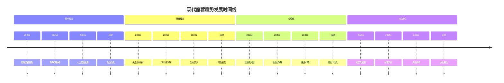

# 现代露营趋势

## 🚀 四大发展趋势

### 1. 技术融合趋势
- **智能装备**：物联网、人工智能、大数据
- **数字化管理**：APP管理、云端存储、数据分析
- **虚拟现实**：VR体验、AR导航、沉浸式学习
- **自动化设备**：智能帐篷、自动炉具、智能照明

### 2. 环保理念趋势
- **无痕山林**：[[02-理解层-原理机制/04-环境保护理念/03-无痕山林原则|无痕山林原则]]
- **可持续发展**：[[02-理解层-原理机制/04-环境保护理念/02-可持续露营|可持续露营]]
- **生态保护**：[[02-理解层-原理机制/04-环境保护理念/01-生态影响评估|生态影响评估]]
- **绿色装备**：环保材料、可回收设计、低碳生产

### 3. 个性化需求趋势
- **定制化装备**：[[04-创新层-进阶发展/02-专业配置/02-定制化配置|定制化配置]]
- **专业化发展**：[[04-创新层-进阶发展/02-专业配置|专业配置]]
- **细分市场**：不同人群、不同需求、不同场景
- **个性化服务**：定制路线、专属装备、个人指导

### 4. 社交属性趋势
- **社区化**：露营社区、经验分享、技能交流
- **分享文化**：社交媒体、视频分享、经验传播
- **团队建设**：[[04-创新层-进阶发展/03-领导力培养/01-团队管理技能|团队管理]]
- **文化传承**：[[04-创新层-进阶发展/04-文化传承|文化传承]]

## 📊 趋势特征分析

| 趋势类型 | 技术特点 | 理念特点 | 市场特点 | 社会影响 |
|----------|----------|----------|----------|----------|
| **技术融合** | 智能化 | 效率优先 | 高端市场 | 技术驱动 |
| **环保理念** | 绿色化 | 可持续发展 | 环保市场 | 环保意识 |
| **个性化** | 定制化 | 个性需求 | 细分市场 | 消费升级 |
| **社交属性** | 社区化 | 分享文化 | 社交市场 | 文化传播 |

## 🎯 趋势发展预测

## 🎓 费曼学习法应用

### 第一步：选择概念
选择"现代露营趋势"作为学习概念

### 第二步：教授他人
用简单语言解释：
> "现代露营有四大趋势：技术融合让装备更智能，环保理念让露营更绿色，个性化需求让装备更定制，社交属性让露营更社区化。"

### 第三步：回顾简化
- **技术融合**：智能化、自动化
- **环保理念**：绿色化、可持续
- **个性化**：定制化、专业化
- **社交属性**：社区化、分享化

### 第四步：组织优化
建立趋势与技能的联系：
- 技术融合 → [[04-创新层-进阶发展/02-专业配置/03-技术装备集成|技术集成]]
- 环保理念 → [[02-理解层-原理机制/04-环境保护理念|环境保护]]
- 个性化 → [[04-创新层-进阶发展/02-专业配置/02-定制化配置|定制配置]]
- 社交属性 → [[04-创新层-进阶发展/03-领导力培养|领导力培养]]

## 🏃‍♂️ 刻意练习要点

### 趋势理解练习
1. **趋势分析**：分析不同趋势的特点
2. **技术研究**：研究相关技术的发展
3. **市场观察**：观察市场的变化
4. **实践应用**：应用趋势到实践中

### 实践验证
- **技术应用**：使用新技术装备
- **环保实践**：践行环保理念
- **个性化实践**：实践个性化需求
- **社交实践**：参与社交活动

## 🔗 趋势与技能的关系

### 技术融合技能
- **智能装备**：[[04-创新层-进阶发展/02-专业配置/03-技术装备集成|技术集成]]
- **数字化管理**：[[04-创新层-进阶发展/02-专业配置/05-升级优化策略|升级优化]]
- **虚拟现实**：[[04-创新层-进阶发展/01-高级技巧/07-跨学科知识整合|跨学科知识]]
- **自动化设备**：[[04-创新层-进阶发展/02-专业配置/04-维护保养体系|维护保养]]

### 环保理念技能
- **无痕山林**：[[02-理解层-原理机制/04-环境保护理念/03-无痕山林原则|无痕山林]]
- **可持续发展**：[[02-理解层-原理机制/04-环境保护理念/02-可持续露营|可持续露营]]
- **生态保护**：[[02-理解层-原理机制/04-环境保护理念/01-生态影响评估|生态评估]]
- **绿色装备**：[[02-理解层-原理机制/02-装备选择原理/02-材质与性能|材质性能]]

### 个性化技能
- **定制化装备**：[[04-创新层-进阶发展/02-专业配置/02-定制化配置|定制配置]]
- **专业化发展**：[[04-创新层-进阶发展/02-专业配置|专业配置]]
- **细分市场**：[[04-创新层-进阶发展/02-专业配置/06-成本效益分析|成本分析]]
- **个性化服务**：[[04-创新层-进阶发展/03-领导力培养/05-培训指导方法|培训指导]]

### 社交属性技能
- **社区化**：[[04-创新层-进阶发展/03-领导力培养/01-团队管理技能|团队管理]]
- **分享文化**：[[04-创新层-进阶发展/04-文化传承/01-露营文化推广|文化推广]]
- **团队建设**：[[04-创新层-进阶发展/03-领导力培养|领导力培养]]
- **文化传承**：[[04-创新层-进阶发展/04-文化传承|文化传承]]

## 📋 趋势学习检查清单

### 趋势理解
- [ ] 了解现代露营的主要趋势
- [ ] 理解趋势的特点和影响
- [ ] 掌握趋势的发展方向
- [ ] 认识趋势对技能的要求

### 实践应用
- [ ] 应用新技术到露营实践
- [ ] 践行环保理念
- [ ] 满足个性化需求
- [ ] 参与社交活动

## 🎯 趋势应对策略

### 技术融合应对
1. **技能更新**：学习新技术技能
2. **装备升级**：使用智能装备
3. **管理优化**：使用数字化管理
4. **持续学习**：跟上技术发展

### 环保理念应对
- **理念内化**：内化环保理念
- **行为改变**：改变环保行为
- **装备选择**：选择环保装备
- **文化传播**：传播环保文化

### 个性化应对
- **需求分析**：分析个人需求
- **装备定制**：定制个人装备
- **服务个性化**：提供个性化服务
- **市场细分**：细分目标市场

### 社交属性应对
- **社区建设**：建设露营社区
- **文化传播**：传播露营文化
- **经验分享**：分享露营经验
- **技能交流**：交流露营技能

## 🔗 趋势发展机遇

### 技术机遇
- **装备创新**：智能装备市场
- **服务创新**：数字化服务
- **管理创新**：智能化管理
- **体验创新**：沉浸式体验

### 环保机遇
- **绿色装备**：环保装备市场
- **生态服务**：生态保护服务
- **文化传播**：环保文化传播
- **政策支持**：环保政策支持

### 个性化机遇
- **定制市场**：定制化装备市场
- **专业服务**：专业化服务
- **细分市场**：细分市场机会
- **品牌建设**：个性化品牌

### 社交机遇
- **社区经济**：社区经济模式
- **文化经济**：文化经济模式
- **分享经济**：分享经济模式
- **教育经济**：教育经济模式

## 🔗 相关链接
- [[01-露营历史发展|露营历史发展]]
- [[02-各国露营文化|各国露营文化]]
- [[03-露营名人故事|露营名人故事]]
- [[02-理解层-原理机制/04-环境保护理念/02-可持续露营|可持续露营]]
