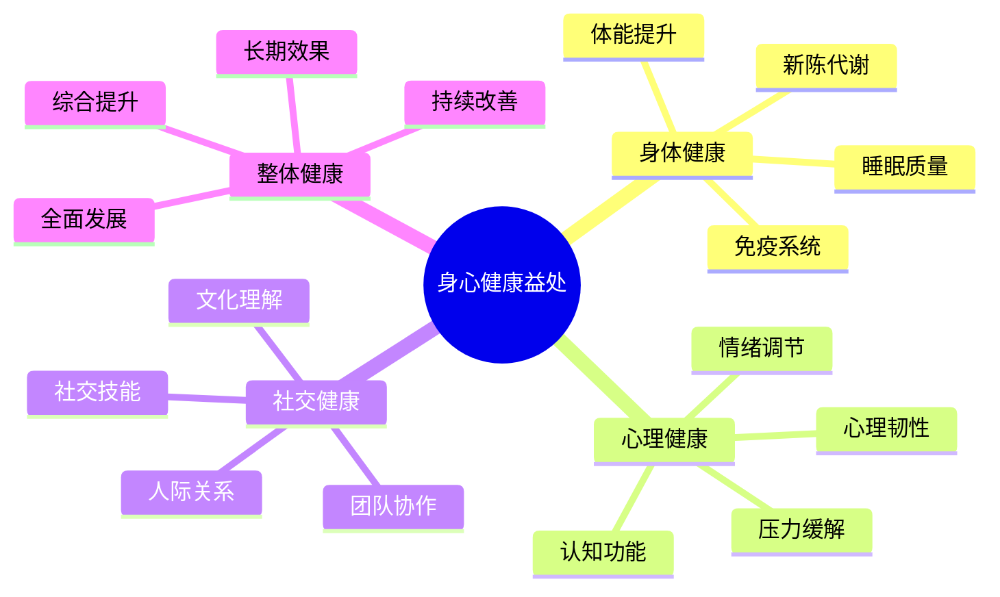

# 身心健康益处

## 💪 身体健康益处

### 1. 体能提升
- **心肺功能**：有氧运动、呼吸训练
- **肌肉力量**：负重行走、搭建活动
- **耐力训练**：长时间活动、持续运动
- **协调能力**：平衡训练、精细动作

### 2. 免疫系统
- **自然接触**：接触自然环境、微生物
- **阳光照射**：维生素D合成、免疫调节
- **新鲜空气**：空气质量改善、呼吸系统
- **压力缓解**：心理压力减少、免疫增强

### 3. 睡眠质量
- **自然节律**：日出日落、生物钟调节
- **环境安静**：远离噪音、深度睡眠
- **空气清新**：氧气充足、睡眠质量
- **运动疲劳**：适度疲劳、快速入睡

### 4. 新陈代谢
- **运动消耗**：卡路里燃烧、体重管理
- **营养均衡**：户外饮食、营养搭配
- **水分补充**：充足饮水、新陈代谢
- **消化功能**：规律饮食、消化改善

## 🧠 心理健康益处

### 1. 压力缓解
- **环境转换**：远离城市、压力释放
- **自然疗法**：绿色环境、心理放松
- **活动转移**：注意力转移、压力分散
- **社交互动**：人际交流、情感支持

### 2. 情绪调节
- **多巴胺释放**：运动刺激、快乐激素
- **内啡肽分泌**：自然奖励、愉悦感
- **血清素提升**：阳光照射、情绪稳定
- **皮质醇降低**：压力激素、情绪改善

### 3. 认知功能
- **注意力集中**：自然环境、专注力提升
- **创造力激发**：开放环境、思维活跃
- **问题解决**：挑战任务、思维能力
- **记忆增强**：新体验、记忆巩固

### 4. 心理韧性
- **挑战应对**：困难克服、韧性提升
- **自我效能**：技能掌握、信心增强
- **适应能力**：环境适应、心理适应
- **成长心态**：持续学习、积极心态

## 👥 社交健康益处

### 1. 团队协作
- **共同目标**：团队任务、协作能力
- **相互支持**：困难帮助、支持系统
- **沟通技巧**：有效沟通、表达能力
- **领导能力**：团队领导、管理技能

### 2. 人际关系
- **友谊建立**：共同经历、深厚友谊
- **信任培养**：相互依赖、信任关系
- **冲突解决**：分歧处理、解决能力
- **情感支持**：情感交流、支持网络

### 3. 社交技能
- **表达能力**：想法表达、沟通技巧
- **倾听能力**：他人倾听、理解能力
- **同理心**：他人理解、情感共鸣
- **包容性**：差异接受、包容心态

### 4. 文化理解
- **多元文化**：不同背景、文化理解
- **价值观交流**：价值分享、观念更新
- **经验分享**：知识分享、经验交流
- **文化融合**：文化融合、视野拓展

## 📊 健康益处对比

| 健康类型 | 主要益处 | 实现方式 | 持续时间 | 影响程度 |
|----------|----------|----------|----------|----------|
| **身体健康** | 体能提升 | 运动锻炼 | 长期 | 高 |
| **心理健康** | 压力缓解 | 环境转换 | 短期+长期 | 高 |
| **社交健康** | 团队协作 | 人际互动 | 长期 | 中高 |
| **整体健康** | 综合提升 | 全面体验 | 长期 | 最高 |

## 🎯 健康益处机制

## 🎓 费曼学习法应用

### 第一步：选择概念
选择"身心健康益处"作为学习概念

### 第二步：教授他人
用简单语言解释：
> "露营对身心健康有很多好处：身体方面能提升体能、增强免疫、改善睡眠；心理方面能缓解压力、调节情绪、提升认知；社交方面能促进协作、建立友谊、提升技能。"

### 第三步：回顾简化
- **身体健康**：体能提升、免疫增强、睡眠改善
- **心理健康**：压力缓解、情绪调节、认知提升
- **社交健康**：团队协作、人际关系、技能提升

### 第四步：组织优化
建立健康与技能的联系：
- 身体健康 → [[03-应用层-实践技能/03-野外生存|野外生存]]
- 心理健康 → [[02-理解层-原理机制/01-户外生存原理/04-心理适应机制|心理适应]]
- 社交健康 → [[04-创新层-进阶发展/03-领导力培养|领导力培养]]

## 🏃‍♂️ 刻意练习要点

### 健康提升练习
1. **体能训练**：针对性体能训练
2. **心理调节**：心理调节技巧练习
3. **社交技能**：社交技能训练
4. **综合提升**：综合健康提升

### 实践验证
- **身体体验**：体验身体健康的改善
- **心理体验**：体验心理健康的提升
- **社交体验**：体验社交健康的增强
- **综合体验**：体验整体健康的提升

## 🔗 健康与技能的关系

### 身体健康技能
- **体能训练**：[[03-应用层-实践技能/03-野外生存|野外生存]]
- **运动技能**：[[03-应用层-实践技能/01-装备准备|装备准备]]
- **健康管理**：[[02-理解层-原理机制/01-户外生存原理/01-人体生理适应|生理适应]]
- **营养管理**：[[03-应用层-实践技能/03-野外生存/03-食物获取技能|食物获取]]

### 心理健康技能
- **压力管理**：[[02-理解层-原理机制/01-户外生存原理/04-心理适应机制|心理适应]]
- **情绪调节**：[[04-创新层-进阶发展/03-领导力培养/04-沟通协调技巧|沟通协调]]
- **认知训练**：[[04-创新层-进阶发展/01-高级技巧/07-跨学科知识整合|跨学科知识]]
- **心理韧性**：[[04-创新层-进阶发展/01-高级技巧/06-领导力实践|领导力实践]]

### 社交健康技能
- **团队协作**：[[04-创新层-进阶发展/03-领导力培养/01-团队管理技能|团队管理]]
- **沟通技巧**：[[04-创新层-进阶发展/03-领导力培养/04-沟通协调技巧|沟通协调]]
- **领导能力**：[[04-创新层-进阶发展/03-领导力培养|领导力培养]]
- **文化理解**：[[04-创新层-进阶发展/04-文化传承|文化传承]]

## 📋 健康益处检查清单

### 身体健康
- [ ] 体验体能提升
- [ ] 感受免疫增强
- [ ] 享受睡眠改善
- [ ] 观察新陈代谢改善

### 心理健康
- [ ] 感受压力缓解
- [ ] 体验情绪调节
- [ ] 提升认知功能
- [ ] 增强心理韧性

### 社交健康
- [ ] 提升团队协作能力
- [ ] 建立良好人际关系
- [ ] 发展社交技能
- [ ] 增进文化理解

## 🎯 健康提升策略

### 身体提升策略
1. **规律运动**：建立规律运动习惯
2. **营养均衡**：保持营养均衡饮食
3. **充足睡眠**：保证充足睡眠时间
4. **健康监测**：定期健康监测

### 心理提升策略
- **压力管理**：学习压力管理技巧
- **情绪调节**：掌握情绪调节方法
- **认知训练**：进行认知功能训练
- **心理韧性**：培养心理韧性

### 社交提升策略
- **主动交流**：主动与他人交流
- **团队参与**：积极参与团队活动
- **技能学习**：学习社交技能
- **文化体验**：体验不同文化

## 🔗 相关链接
- [[02-技能培养价值|技能培养价值]]
- [[03-社交与团队建设|社交与团队建设]]
- [[04-环保意识培养|环保意识培养]]
- [[02-理解层-原理机制/01-户外生存原理/04-心理适应机制|心理适应机制]]
