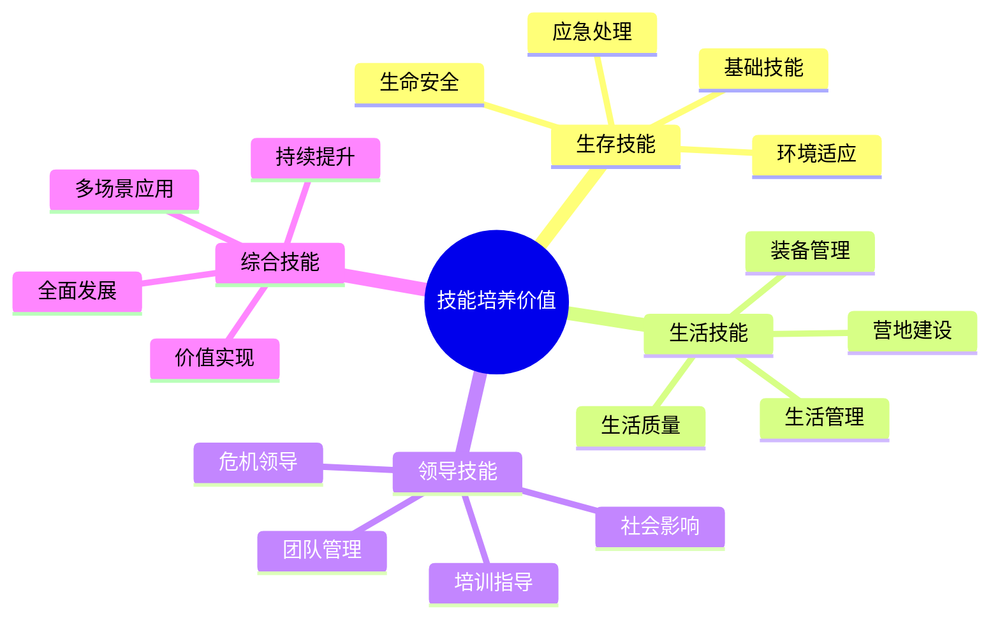

# 技能培养价值

## 🛠️ 生存技能培养

### 1. 基础生存技能
- **方向识别**：[[03-应用层-实践技能/03-野外生存/01-方向识别技能|方向识别]]
- **水源管理**：[[03-应用层-实践技能/03-野外生存/02-水源寻找与净化|水源寻找与净化]]
- **食物获取**：[[03-应用层-实践技能/03-野外生存/03-食物获取技能|食物获取技能]]
- **生火技术**：[[03-应用层-实践技能/03-野外生存/04-生火技术|生火技术]]

### 2. 应急处理技能
- **伤病处理**：[[03-应用层-实践技能/04-应急处理/01-常见伤病处理|常见伤病处理]]
- **恶劣天气应对**：[[03-应用层-实践技能/04-应急处理/02-恶劣天气应对|恶劣天气应对]]
- **信号与求救**：[[03-应用层-实践技能/03-野外生存/06-信号与求救|信号与求救]]
- **危机处理**：[[04-创新层-进阶发展/03-领导力培养/03-危机处理领导|危机处理领导]]

### 3. 环境适应技能
- **生理适应**：[[02-理解层-原理机制/01-户外生存原理/01-人体生理适应|人体生理适应]]
- **心理适应**：[[02-理解层-原理机制/01-户外生存原理/04-心理适应机制|心理适应机制]]
- **环境因素**：[[02-理解层-原理机制/01-户外生存原理/02-环境因素影响|环境因素影响]]
- **能量管理**：[[02-理解层-原理机制/01-户外生存原理/03-能量消耗与补充|能量消耗与补充]]

## 🏠 生活技能培养

### 1. 装备管理技能
- **装备选择**：[[02-理解层-原理机制/02-装备选择原理|装备选择原理]]
- **装备使用**：[[03-应用层-实践技能/01-装备准备|装备准备]]
- **装备维护**：[[04-创新层-进阶发展/02-专业配置/04-维护保养体系|维护保养体系]]
- **装备优化**：[[04-创新层-进阶发展/02-专业配置/05-升级优化策略|升级优化策略]]

### 2. 营地建设技能
- **营地选址**：[[03-应用层-实践技能/02-营地建设/01-营地选址原则|营地选址原则]]
- **帐篷搭建**：[[03-应用层-实践技能/02-营地建设/02-帐篷搭建技术|帐篷搭建技术]]
- **篝火管理**：[[03-应用层-实践技能/02-营地建设/03-篝火建设与管理|篝火建设与管理]]
- **营地布局**：[[03-应用层-实践技能/02-营地建设/04-营地布局与规划|营地布局与规划]]

### 3. 生活管理技能
- **时间管理**：[[04-创新层-进阶发展/03-领导力培养/02-时间管理技能|时间管理技能]]
- **资源管理**：[[04-创新层-进阶发展/02-专业配置/06-成本效益分析|成本效益分析]]
- **风险管理**：[[02-理解层-原理机制/03-安全防护机制/01-风险评估体系|风险评估体系]]
- **健康管理**：[[01-认知层-基础概念/04-价值与意义/01-身心健康益处|身心健康益处]]

## 👑 领导技能培养

### 1. 团队管理技能
- **团队组建**：[[04-创新层-进阶发展/03-领导力培养/01-团队管理技能|团队管理技能]]
- **沟通协调**：[[04-创新层-进阶发展/03-领导力培养/04-沟通协调技巧|沟通协调技巧]]
- **冲突解决**：[[04-创新层-进阶发展/03-领导力培养/02-时间管理技能|时间管理技能]]
- **决策制定**：[[04-创新层-进阶发展/03-领导力培养/06-责任与担当|责任与担当]]

### 2. 培训指导技能
- **技能传授**：[[04-创新层-进阶发展/03-领导力培养/05-培训指导方法|培训指导方法]]
- **经验分享**：[[04-创新层-进阶发展/04-文化传承/02-新手指导方法|新手指导方法]]
- **文化传承**：[[04-创新层-进阶发展/04-文化传承|文化传承]]
- **理念传播**：[[04-创新层-进阶发展/04-文化传承/01-露营文化推广|露营文化推广]]

### 3. 危机领导技能
- **危机识别**：[[02-理解层-原理机制/03-安全防护机制/01-风险评估体系|风险评估体系]]
- **应急响应**：[[03-应用层-实践技能/04-应急处理|应急处理]]
- **团队协调**：[[04-创新层-进阶发展/03-领导力培养/03-危机处理领导|危机处理领导]]
- **责任担当**：[[04-创新层-进阶发展/03-领导力培养/06-责任与担当|责任与担当]]

## 📊 技能价值对比

| 技能类型 | 核心价值 | 应用场景 | 培养难度 | 社会价值 |
|----------|----------|----------|----------|----------|
| **生存技能** | 生命安全 | 野外环境 | 高 | 极高 |
| **生活技能** | 生活质量 | 日常生活 | 中 | 高 |
| **领导技能** | 社会影响 | 团队管理 | 高 | 极高 |
| **综合技能** | 全面发展 | 多场景 | 最高 | 最高 |

## 🎯 技能培养机制

## 🎓 费曼学习法应用

### 第一步：选择概念
选择"技能培养价值"作为学习概念

### 第二步：教授他人
用简单语言解释：
> "露营能培养三种技能：生存技能让你在野外活下去，生活技能让你过得更好，领导技能让你能带领团队。这些技能在生活和工作中都很有用。"

### 第三步：回顾简化
- **生存技能**：生命安全、野外生存
- **生活技能**：生活质量、日常管理
- **领导技能**：团队管理、社会影响

### 第四步：组织优化
建立技能与价值的关系：
- 生存技能 → [[03-应用层-实践技能/03-野外生存|野外生存]]
- 生活技能 → [[03-应用层-实践技能/02-营地建设|营地建设]]
- 领导技能 → [[04-创新层-进阶发展/03-领导力培养|领导力培养]]

## 🏃‍♂️ 刻意练习要点

### 技能培养练习
1. **技能分解**：将复杂技能分解为简单步骤
2. **重复练习**：重复练习关键技能
3. **场景应用**：在不同场景中应用技能
4. **持续改进**：持续改进技能水平

### 实践验证
- **技能测试**：测试技能掌握程度
- **场景应用**：在真实场景中应用技能
- **效果评估**：评估技能应用效果
- **持续提升**：持续提升技能水平

## 🔗 技能与价值的关系

### 生存技能价值
- **生命安全**：[[02-理解层-原理机制/03-安全防护机制|安全防护]]
- **应急能力**：[[03-应用层-实践技能/04-应急处理|应急处理]]
- **环境适应**：[[02-理解层-原理机制/01-户外生存原理|户外生存原理]]
- **心理韧性**：[[02-理解层-原理机制/01-户外生存原理/04-心理适应机制|心理适应]]

### 生活技能价值
- **生活质量**：[[03-应用层-实践技能/02-营地建设|营地建设]]
- **效率提升**：[[04-创新层-进阶发展/02-专业配置/05-升级优化策略|升级优化]]
- **资源管理**：[[04-创新层-进阶发展/02-专业配置/06-成本效益分析|成本分析]]
- **健康管理**：[[01-认知层-基础概念/04-价值与意义/01-身心健康益处|身心健康]]

### 领导技能价值
- **团队协作**：[[04-创新层-进阶发展/03-领导力培养/01-团队管理技能|团队管理]]
- **沟通能力**：[[04-创新层-进阶发展/03-领导力培养/04-沟通协调技巧|沟通协调]]
- **决策能力**：[[04-创新层-进阶发展/03-领导力培养/06-责任与担当|责任担当]]
- **文化传承**：[[04-创新层-进阶发展/04-文化传承|文化传承]]

## 📋 技能培养检查清单

### 生存技能
- [ ] 掌握基础生存技能
- [ ] 具备应急处理能力
- [ ] 能够适应不同环境
- [ ] 具备心理韧性

### 生活技能
- [ ] 掌握装备管理技能
- [ ] 具备营地建设能力
- [ ] 能够管理生活资源
- [ ] 具备健康管理意识

### 领导技能
- [ ] 掌握团队管理技能
- [ ] 具备培训指导能力
- [ ] 能够处理危机情况
- [ ] 具备责任担当精神

## 🎯 技能培养策略

### 渐进式培养
1. **基础技能**：先掌握基础技能
2. **进阶技能**：逐步学习进阶技能
3. **综合技能**：培养综合应用能力
4. **专业技能**：发展专业技能

### 实践导向
- **理论学习**：学习相关理论知识
- **技能练习**：进行技能练习
- **场景应用**：在真实场景中应用
- **持续改进**：持续改进技能水平

## 🔗 技能价值实现

### 个人价值
- **能力提升**：个人能力全面提升
- **信心增强**：自信心显著增强
- **视野拓展**：视野和格局拓展
- **成长加速**：个人成长加速

### 社会价值
- **安全贡献**：为社会安全做贡献
- **文化传承**：传承和发扬文化
- **团队建设**：促进团队建设
- **社会影响**：产生积极社会影响

## 🔗 相关链接
- [[01-身心健康益处|身心健康益处]]
- [[03-社交与团队建设|社交与团队建设]]
- [[04-环保意识培养|环保意识培养]]
- [[03-应用层-实践技能/03-野外生存|野外生存]]
