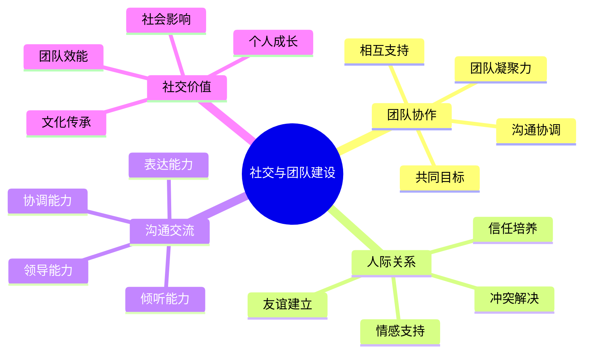

# 社交与团队建设

## 👥 团队协作价值

### 1. 共同目标
- **任务分工**：明确分工、各司其职
- **目标统一**：共同目标、齐心协力
- **责任共担**：责任分担、相互支持
- **成果共享**：成果分享、共同成长

### 2. 相互支持
- **困难帮助**：困难时刻、相互帮助
- **技能互补**：技能互补、优势互补
- **经验分享**：经验分享、知识传递
- **情感支持**：情感支持、心理安慰

### 3. 沟通协调
- **有效沟通**：[[04-创新层-进阶发展/03-领导力培养/04-沟通协调技巧|沟通协调技巧]]
- **冲突解决**：分歧处理、冲突化解
- **决策制定**：集体决策、民主参与
- **信息共享**：信息透明、知识共享

### 4. 团队凝聚力
- **信任建立**：相互信任、关系建立
- **文化认同**：价值观认同、文化融合
- **归属感**：团队归属、身份认同
- **集体荣誉**：集体荣誉、团队自豪

## 🤝 人际关系建设

### 1. 友谊建立
- **共同经历**：共同体验、难忘回忆
- **深度交流**：深度对话、心灵沟通
- **相互了解**：性格了解、价值观认知
- **情感连接**：情感纽带、深厚友谊

### 2. 信任培养
- **可靠表现**：言行一致、可靠表现
- **相互依赖**：相互依赖、信任建立
- **承诺履行**：承诺兑现、信任巩固
- **风险共担**：风险共担、信任深化

### 3. 冲突解决
- **分歧识别**：分歧识别、问题发现
- **沟通协商**：有效沟通、协商解决
- **妥协平衡**：相互妥协、平衡利益
- **关系修复**：关系修复、和谐重建

### 4. 情感支持
- **情感表达**：情感表达、情绪分享
- **倾听理解**：倾听理解、情感共鸣
- **安慰鼓励**：安慰鼓励、心理支持
- **陪伴支持**：陪伴支持、情感陪伴

## 🗣️ 沟通交流技能

### 1. 表达能力
- **清晰表达**：思路清晰、表达准确
- **语言技巧**：语言技巧、表达艺术
- **非语言沟通**：肢体语言、表情动作
- **情感表达**：情感表达、情绪传递

### 2. 倾听能力
- **专注倾听**：专注倾听、全神贯注
- **理解能力**：理解能力、深度理解
- **反馈技巧**：反馈技巧、确认理解
- **同理心**：同理心、情感共鸣

### 3. 协调能力
- **组织协调**：[[04-创新层-进阶发展/03-领导力培养/01-团队管理技能|团队管理技能]]
- **资源整合**：资源整合、优势整合
- **时间协调**：[[04-创新层-进阶发展/03-领导力培养/02-时间管理技能|时间管理技能]]
- **冲突协调**：冲突协调、矛盾化解

### 4. 领导能力
- **领导力培养**：[[04-创新层-进阶发展/03-领导力培养|领导力培养]]
- **决策能力**：[[04-创新层-进阶发展/03-领导力培养/06-责任与担当|责任与担当]]
- **危机处理**：[[04-创新层-进阶发展/03-领导力培养/03-危机处理领导|危机处理领导]]
- **培训指导**：[[04-创新层-进阶发展/03-领导力培养/05-培训指导方法|培训指导方法]]

## 📊 社交价值对比

| 社交类型 | 核心价值 | 实现方式 | 影响范围 | 持续时间 |
|----------|----------|----------|----------|----------|
| **团队协作** | 集体效能 | 分工合作 | 团队 | 长期 |
| **人际关系** | 情感支持 | 深度交流 | 个人 | 长期 |
| **沟通交流** | 信息传递 | 有效沟通 | 多层级 | 持续 |
| **领导能力** | 社会影响 | 领导实践 | 社会 | 长期 |

## 🎯 社交建设机制

## 🎓 费曼学习法应用

### 第一步：选择概念
选择"社交与团队建设"作为学习概念

### 第二步：教授他人
用简单语言解释：
> "露营能培养社交和团队建设能力：团队协作让大家一起完成任务，人际关系建立深厚友谊，沟通交流提升表达能力，领导能力让你能带领团队。"

### 第三步：回顾简化
- **团队协作**：分工合作、集体效能
- **人际关系**：友谊建立、情感支持
- **沟通交流**：信息传递、有效沟通
- **领导能力**：社会影响、团队带领

### 第四步：组织优化
建立社交与技能的关系：
- 团队协作 → [[04-创新层-进阶发展/03-领导力培养/01-团队管理技能|团队管理]]
- 人际关系 → [[04-创新层-进阶发展/03-领导力培养/04-沟通协调技巧|沟通协调]]
- 沟通交流 → [[04-创新层-进阶发展/03-领导力培养/05-培训指导方法|培训指导]]
- 领导能力 → [[04-创新层-进阶发展/03-领导力培养|领导力培养]]

## 🏃‍♂️ 刻意练习要点

### 社交技能练习
1. **主动交流**：主动与他人交流
2. **团队参与**：积极参与团队活动
3. **冲突处理**：学习处理冲突的方法
4. **领导实践**：实践领导技能

### 实践验证
- **团队体验**：体验团队协作
- **人际体验**：体验人际关系建设
- **沟通体验**：体验沟通交流
- **领导体验**：体验领导实践

## 🔗 社交与技能的关系

### 团队协作技能
- **团队管理**：[[04-创新层-进阶发展/03-领导力培养/01-团队管理技能|团队管理]]
- **沟通协调**：[[04-创新层-进阶发展/03-领导力培养/04-沟通协调技巧|沟通协调]]
- **时间管理**：[[04-创新层-进阶发展/03-领导力培养/02-时间管理技能|时间管理]]
- **责任担当**：[[04-创新层-进阶发展/03-领导力培养/06-责任与担当|责任担当]]

### 人际关系技能
- **沟通技巧**：[[04-创新层-进阶发展/03-领导力培养/04-沟通协调技巧|沟通协调]]
- **情感管理**：[[02-理解层-原理机制/01-户外生存原理/04-心理适应机制|心理适应]]
- **冲突解决**：[[04-创新层-进阶发展/03-领导力培养/03-危机处理领导|危机处理]]
- **文化理解**：[[04-创新层-进阶发展/04-文化传承|文化传承]]

### 沟通交流技能
- **表达能力**：[[04-创新层-进阶发展/03-领导力培养/04-沟通协调技巧|沟通协调]]
- **倾听能力**：[[04-创新层-进阶发展/03-领导力培养/05-培训指导方法|培训指导]]
- **协调能力**：[[04-创新层-进阶发展/03-领导力培养/01-团队管理技能|团队管理]]
- **领导能力**：[[04-创新层-进阶发展/03-领导力培养|领导力培养]]

## 📋 社交建设检查清单

### 团队协作
- [ ] 能够有效分工合作
- [ ] 具备相互支持意识
- [ ] 掌握沟通协调技巧
- [ ] 增强团队凝聚力

### 人际关系
- [ ] 建立深厚友谊
- [ ] 培养相互信任
- [ ] 学会冲突解决
- [ ] 提供情感支持

### 沟通交流
- [ ] 提升表达能力
- [ ] 增强倾听能力
- [ ] 发展协调能力
- [ ] 培养领导能力

## 🎯 社交建设策略

### 主动参与策略
1. **主动交流**：主动与他人交流
2. **积极参与**：积极参与团队活动
3. **主动帮助**：主动帮助他人
4. **主动学习**：主动学习社交技能

### 技能提升策略
- **理论学习**：学习社交理论
- **实践练习**：进行社交实践
- **反思总结**：反思社交经验
- **持续改进**：持续改进社交技能

## 🔗 社交价值实现

### 个人价值
- **社交能力**：社交能力显著提升
- **人际关系**：人际关系网络扩大
- **沟通技巧**：沟通技巧明显改善
- **领导能力**：领导能力逐步提升

### 团队价值
- **团队效能**：团队效能显著提升
- **团队凝聚力**：团队凝聚力增强
- **团队文化**：团队文化健康发展
- **团队成长**：团队整体成长

### 社会价值
- **社会网络**：社会网络扩大
- **社会影响**：社会影响力提升
- **文化传承**：文化传承能力增强
- **社会贡献**：社会贡献能力提升

## 🔗 相关链接
- [[01-身心健康益处|身心健康益处]]
- [[02-技能培养价值|技能培养价值]]
- [[04-环保意识培养|环保意识培养]]
- [[04-创新层-进阶发展/03-领导力培养|领导力培养]]
