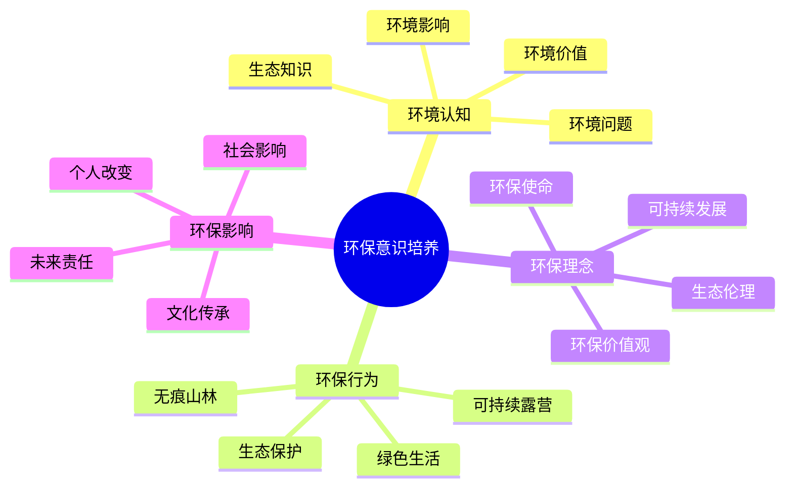

# 环保意识培养

## 🌱 环境认知培养

### 1. 生态知识学习
- **生态系统**：[[02-理解层-原理机制/04-环境保护理念/01-生态影响评估|生态影响评估]]
- **生物多样性**：物种多样性、生态平衡
- **环境循环**：物质循环、能量流动
- **环境脆弱性**：环境敏感、生态脆弱

### 2. 环境问题认知
- **污染问题**：空气污染、水污染、土壤污染
- **资源消耗**：资源枯竭、过度开发
- **气候变化**：全球变暖、极端天气
- **生态破坏**：森林砍伐、生物灭绝

### 3. 环境影响理解
- **人类活动影响**：人类活动对环境的影响
- **露营环境影响**：露营活动对环境的影响
- **累积效应**：长期累积的环境影响
- **连锁反应**：环境问题的连锁反应

### 4. 环境价值认知
- **生态价值**：生态系统的价值
- **经济价值**：环境的经济价值
- **社会价值**：环境的社会价值
- **文化价值**：环境的文化价值

## 🌿 环保行为培养

### 1. 无痕山林实践
- **无痕山林原则**：[[02-理解层-原理机制/04-环境保护理念/03-无痕山林原则|无痕山林原则]]
- **垃圾处理**：垃圾分类、垃圾带走
- **火源管理**：安全用火、火源控制
- **植被保护**：植被保护、不破坏植物

### 2. 可持续露营
- **可持续露营**：[[02-理解层-原理机制/04-环境保护理念/02-可持续露营|可持续露营]]
- **资源节约**：节约用水、节约能源
- **装备环保**：环保装备、绿色装备
- **行为环保**：环保行为、绿色行为

### 3. 生态保护行动
- **生态监测**：环境监测、生态观察
- **保护行动**：参与保护、支持保护
- **教育传播**：环保教育、理念传播
- **社区参与**：社区环保、集体行动

### 4. 绿色生活方式
- **绿色消费**：绿色消费、环保消费
- **低碳生活**：低碳出行、低碳生活
- **循环利用**：资源循环、废物利用
- **生态友好**：生态友好、环境友好

## 💡 环保理念培养

### 1. 可持续发展理念
- **可持续发展**：[[02-理解层-原理机制/04-环境保护理念/02-可持续露营|可持续露营]]
- **代际公平**：代际公平、未来责任
- **系统思维**：系统思维、整体观念
- **长远规划**：长远规划、持续发展

### 2. 生态伦理观念
- **生态伦理**：生态伦理、环境道德
- **自然权利**：自然权利、生物权利
- **环境正义**：环境正义、公平分配
- **责任意识**：环境责任、个人责任

### 3. 环保价值观
- **环保价值**：环保价值、环境价值
- **生命尊重**：生命尊重、自然敬畏
- **和谐共生**：人与自然和谐共生
- **文化传承**：[[04-创新层-进阶发展/04-文化传承|文化传承]]

### 4. 环保使命感
- **环保使命**：环保使命、环境责任
- **行动自觉**：行动自觉、主动参与
- **影响他人**：影响他人、传播理念
- **社会贡献**：社会贡献、环境贡献

## 📊 环保意识对比

| 环保层次 | 认知内容 | 行为表现 | 理念深度 | 影响范围 |
|----------|----------|----------|----------|----------|
| **环境认知** | 生态知识 | 基础行为 | 浅层 | 个人 |
| **环保行为** | 实践行动 | 具体行为 | 中层 | 局部 |
| **环保理念** | 价值观念 | 自觉行为 | 深层 | 广泛 |
| **环保使命** | 责任意识 | 主动行为 | 最高 | 社会 |

## 🎯 环保意识培养机制

## 🎓 费曼学习法应用

### 第一步：选择概念
选择"环保意识培养"作为学习概念

### 第二步：教授他人
用简单语言解释：
> "露营能培养环保意识：环境认知让你了解生态知识，环保行为让你践行无痕山林，环保理念让你树立可持续发展观念，环保使命让你承担环境责任。"

### 第三步：回顾简化
- **环境认知**：生态知识、环境问题
- **环保行为**：无痕山林、可持续露营
- **环保理念**：可持续发展、生态伦理
- **环保使命**：环境责任、社会贡献

### 第四步：组织优化
建立环保与技能的关系：
- 环境认知 → [[02-理解层-原理机制/04-环境保护理念/01-生态影响评估|生态影响评估]]
- 环保行为 → [[02-理解层-原理机制/04-环境保护理念/03-无痕山林原则|无痕山林]]
- 环保理念 → [[02-理解层-原理机制/04-环境保护理念/02-可持续露营|可持续露营]]
- 环保使命 → [[04-创新层-进阶发展/04-文化传承|文化传承]]

## 🏃‍♂️ 刻意练习要点

### 环保意识练习
1. **知识学习**：学习生态知识
2. **行为实践**：实践环保行为
3. **理念内化**：内化环保理念
4. **使命担当**：承担环保使命

### 实践验证
- **认知验证**：验证环境认知
- **行为验证**：验证环保行为
- **理念验证**：验证环保理念
- **影响验证**：验证环保影响

## 🔗 环保与技能的关系

### 环境认知技能
- **生态观察**：[[03-应用层-实践技能/03-野外生存/07-跨学科知识整合|跨学科知识]]
- **环境评估**：[[02-理解层-原理机制/04-环境保护理念/01-生态影响评估|生态评估]]
- **问题分析**：[[04-创新层-进阶发展/01-高级技巧/07-跨学科知识整合|跨学科知识]]
- **价值判断**：[[04-创新层-进阶发展/04-文化传承|文化传承]]

### 环保行为技能
- **无痕技能**：[[02-理解层-原理机制/04-环境保护理念/03-无痕山林原则|无痕山林]]
- **可持续技能**：[[02-理解层-原理机制/04-环境保护理念/02-可持续露营|可持续露营]]
- **保护技能**：[[03-应用层-实践技能/04-应急处理|应急处理]]
- **绿色技能**：[[04-创新层-进阶发展/02-专业配置/01-专业装备推荐|专业装备]]

### 环保理念技能
- **理念传播**：[[04-创新层-进阶发展/04-文化传承/01-露营文化推广|文化推广]]
- **教育技能**：[[04-创新层-进阶发展/03-领导力培养/05-培训指导方法|培训指导]]
- **影响技能**：[[04-创新层-进阶发展/03-领导力培养|领导力培养]]
- **传承技能**：[[04-创新层-进阶发展/04-文化传承|文化传承]]

## 📋 环保意识检查清单

### 环境认知
- [ ] 了解生态知识
- [ ] 认识环境问题
- [ ] 理解环境影响
- [ ] 认知环境价值

### 环保行为
- [ ] 实践无痕山林
- [ ] 践行可持续露营
- [ ] 参与生态保护
- [ ] 选择绿色生活

### 环保理念
- [ ] 树立可持续发展理念
- [ ] 培养生态伦理观念
- [ ] 建立环保价值观
- [ ] 承担环保使命

## 🎯 环保意识培养策略

### 渐进式培养
1. **认知培养**：培养环境认知
2. **行为培养**：培养环保行为
3. **理念培养**：培养环保理念
4. **使命培养**：培养环保使命

### 实践导向
- **理论学习**：学习环保理论
- **实践体验**：体验环保实践
- **反思总结**：反思环保经验
- **持续改进**：持续改进环保行为

## 🔗 环保价值实现

### 个人价值
- **环保意识**：环保意识显著提升
- **行为改变**：环保行为明显改变
- **理念内化**：环保理念深度内化
- **责任担当**：环境责任主动担当

### 社会价值
- **环保传播**：环保理念广泛传播
- **行为影响**：环保行为影响他人
- **文化传承**：环保文化有效传承
- **社会贡献**：环保贡献社会价值

### 环境价值
- **生态保护**：生态环境得到保护
- **资源节约**：自然资源得到节约
- **污染减少**：环境污染得到减少
- **可持续发展**：实现可持续发展

## 🔗 相关链接
- [[01-身心健康益处|身心健康益处]]
- [[02-技能培养价值|技能培养价值]]
- [[03-社交与团队建设|社交与团队建设]]
- [[02-理解层-原理机制/04-环境保护理念|环境保护理念]]
