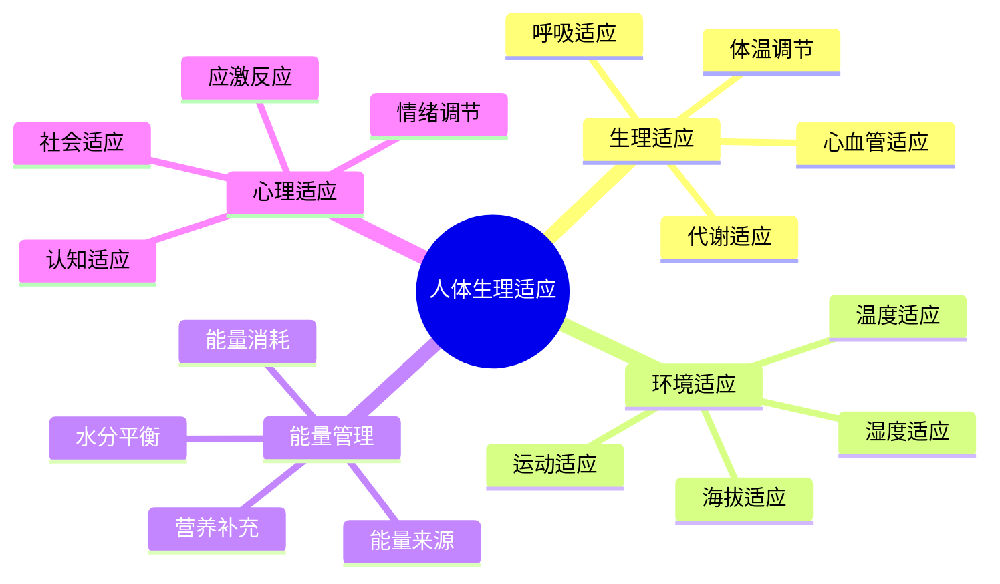

# 人体生理适应

## 🧬 生理适应机制

### 1. 体温调节机制
- **产热机制**：肌肉收缩、代谢产热、寒战反应
- **散热机制**：出汗、血管扩张、呼吸散热
- **体温中枢**：下丘脑调节、体温设定点
- **适应过程**：短期适应、长期适应、个体差异

### 2. 心血管适应
- **心率调节**：静息心率、运动心率、心率变异性
- **血压调节**：血压维持、体位性低血压、血压适应
- **血液循环**：血液重新分配、血管收缩、血管扩张
- **心脏适应**：心肌增厚、心输出量增加、效率提升

### 3. 呼吸系统适应
- **呼吸频率**：呼吸深度、呼吸效率、氧摄取
- **肺功能**：肺活量、通气量、气体交换
- **血氧饱和度**：氧分压、血红蛋白、氧运输
- **呼吸肌**：膈肌、肋间肌、呼吸肌耐力

### 4. 代谢适应
- **能量代谢**：基础代谢率、运动代谢、代谢效率
- **糖代谢**：血糖调节、糖原储备、胰岛素敏感性
- **脂肪代谢**：脂肪氧化、脂肪储备、脂肪酸利用
- **蛋白质代谢**：蛋白质合成、肌肉蛋白、氮平衡

## 🌡️ 环境因素影响

### 1. 温度适应
- **高温适应**：出汗增加、血管扩张、心率增加
- **低温适应**：血管收缩、寒战、代谢增加
- **温度梯度**：体表温度、核心温度、温度调节
- **适应时间**：急性适应、慢性适应、完全适应

### 2. 湿度适应
- **高湿度**：出汗困难、散热受阻、体温升高
- **低湿度**：水分丢失、黏膜干燥、脱水风险
- **湿度调节**：水分平衡、电解质平衡、肾脏调节
- **适应策略**：水分补充、电解质补充、环境调节

### 3. 海拔适应
- **低氧适应**：红细胞增加、血红蛋白增加、血管新生
- **气压适应**：气压变化、气体溶解、组织灌注
- **呼吸适应**：呼吸频率、呼吸深度、通气效率
- **适应阶段**：急性期、亚急性期、慢性期

### 4. 运动适应
- **有氧适应**：心肺功能、肌肉耐力、代谢效率
- **无氧适应**：肌肉力量、爆发力、乳酸耐受
- **神经适应**：运动协调、技能学习、神经效率
- **结构适应**：肌肉增粗、骨骼强化、韧带增强

## ⚡ 能量消耗与补充

### 1. 能量消耗机制
- **基础代谢**：静息代谢率、器官代谢、维持代谢
- **运动代谢**：运动强度、运动时间、运动效率
- **环境代谢**：温度调节、海拔适应、环境应激
- **总能量消耗**：TDEE计算、活动系数、个体差异

### 2. 能量来源
- **碳水化合物**：糖原储备、血糖维持、快速供能
- **脂肪**：脂肪储备、脂肪酸氧化、持续供能
- **蛋白质**：氨基酸供能、肌肉保护、氮平衡
- **能量平衡**：摄入平衡、消耗平衡、储备调节

### 3. 营养补充策略
- **运动前**：糖原储备、水分补充、电解质平衡
- **运动中**：持续供能、水分补充、电解质维持
- **运动后**：糖原恢复、蛋白质合成、水分恢复
- **长期策略**：营养计划、补充时机、个体化

### 4. 水分平衡
- **水分需求**：基础需求、运动需求、环境需求
- **水分丢失**：出汗、呼吸、尿液、粪便
- **水分补充**：饮水时机、饮水量、电解质补充
- **脱水预防**：脱水监测、预防策略、恢复方法

## 🧠 心理适应机制

### 1. 应激反应
- **应激源识别**：环境威胁、身体威胁、心理威胁
- **应激反应**：战斗反应、逃跑反应、冻结反应
- **应激激素**：肾上腺素、皮质醇、去甲肾上腺素
- **应激适应**：急性应激、慢性应激、应激耐受

### 2. 认知适应
- **注意力调节**：选择性注意、持续注意、分散注意
- **记忆适应**：工作记忆、长期记忆、记忆巩固
- **决策适应**：快速决策、风险评估、策略调整
- **学习适应**：技能学习、经验积累、适应性学习

### 3. 情绪调节
- **情绪识别**：情绪感知、情绪表达、情绪理解
- **情绪调节**：情绪控制、情绪表达、情绪管理
- **压力管理**：压力识别、压力应对、压力缓解
- **心理韧性**：抗压能力、恢复能力、成长能力

### 4. 社会适应
- **人际适应**：社交技能、沟通能力、团队合作
- **文化适应**：文化理解、文化融入、文化冲突
- **角色适应**：角色认知、角色扮演、角色转换
- **群体适应**：群体认同、群体规范、群体压力

## 📊 适应能力评估

| 适应类型 | 评估指标 | 评估方法 | 改善策略 | 时间周期 |
|----------|----------|----------|----------|----------|
| **生理适应** | 心率、血压、体温 | 生理监测 | 渐进训练 | 2-4周 |
| **心理适应** | 压力水平、情绪状态 | 心理测试 | 心理训练 | 4-8周 |
| **技能适应** | 技能熟练度 | 技能测试 | 刻意练习 | 8-12周 |
| **环境适应** | 环境耐受性 | 环境测试 | 环境暴露 | 2-6周 |

## 🎯 适应机制优化

## 🎓 费曼学习法应用

### 第一步：选择概念
选择"人体生理适应"作为学习概念

### 第二步：教授他人
用简单语言解释：
> "人体在户外环境中会自然适应：体温调节保持恒温，心血管系统适应运动需求，呼吸系统适应氧气变化，心理系统适应压力和挑战。"

### 第三步：回顾简化
- **生理适应**：体温、心血管、呼吸、代谢
- **环境适应**：温度、湿度、海拔、运动
- **能量管理**：消耗、来源、补充、平衡
- **心理适应**：应激、认知、情绪、社会

### 第四步：组织优化
建立适应与技能的关系：
- 生理适应 → [[03-应用层-实践技能/03-野外生存|野外生存]]
- 环境适应 → [[03-应用层-实践技能/04-应急处理|应急处理]]
- 能量管理 → [[03-应用层-实践技能/03-野外生存/03-食物获取技能|食物获取]]
- 心理适应 → [[04-创新层-进阶发展/03-领导力培养|领导力培养]]

## 🏃‍♂️ 刻意练习要点

### 适应能力练习
1. **渐进暴露**：逐步增加环境挑战
2. **系统训练**：系统性适应训练
3. **监测反馈**：实时监测适应状态
4. **调整优化**：根据反馈调整策略

### 实践验证
- **生理监测**：监测生理指标变化
- **环境测试**：测试环境适应能力
- **技能评估**：评估技能适应水平
- **心理评估**：评估心理适应状态

## 🔗 适应与技能的关系

### 生理适应技能
- **体温管理**：[[03-应用层-实践技能/01-装备准备/02-服装选择与搭配|服装选择]]
- **心血管训练**：[[03-应用层-实践技能/03-野外生存|野外生存]]
- **呼吸训练**：[[03-应用层-实践技能/03-野外生存/01-方向识别技能|方向识别]]
- **代谢优化**：[[03-应用层-实践技能/03-野外生存/03-食物获取技能|食物获取]]

### 环境适应技能
- **温度适应**：[[04-创新层-进阶发展/01-高级技巧/01-极端环境露营|极端环境]]
- **湿度管理**：[[03-应用层-实践技能/03-野外生存/02-水源寻找与净化|水源管理]]
- **海拔适应**：[[04-创新层-进阶发展/01-高级技巧/01-极端环境露营|极端环境]]
- **运动适应**：[[03-应用层-实践技能/03-野外生存|野外生存]]

### 能量管理技能
- **营养规划**：[[03-应用层-实践技能/03-野外生存/03-食物获取技能|食物获取]]
- **水分管理**：[[03-应用层-实践技能/03-野外生存/02-水源寻找与净化|水源管理]]
- **能量监测**：[[03-应用层-实践技能/04-应急处理|应急处理]]
- **恢复策略**：[[03-应用层-实践技能/02-营地建设|营地建设]]

### 心理适应技能
- **压力管理**：[[04-创新层-进阶发展/03-领导力培养/03-危机处理领导|危机处理]]
- **情绪调节**：[[04-创新层-进阶发展/03-领导力培养/04-沟通协调技巧|沟通协调]]
- **认知训练**：[[04-创新层-进阶发展/01-高级技巧/07-跨学科知识整合|跨学科知识]]
- **社会技能**：[[04-创新层-进阶发展/03-领导力培养|领导力培养]]

## 📋 适应能力检查清单

### 生理适应
- [ ] 体温调节正常
- [ ] 心血管功能良好
- [ ] 呼吸系统适应
- [ ] 代谢效率优化

### 环境适应
- [ ] 温度适应良好
- [ ] 湿度耐受正常
- [ ] 海拔适应能力
- [ ] 运动适应水平

### 能量管理
- [ ] 能量消耗合理
- [ ] 营养补充及时
- [ ] 水分平衡维持
- [ ] 恢复策略有效

### 心理适应
- [ ] 应激反应正常
- [ ] 认知功能良好
- [ ] 情绪调节有效
- [ ] 社会适应良好

## 🎯 适应能力提升策略

### 渐进式适应
1. **轻度挑战**：从轻度环境开始
2. **逐步增加**：逐步增加挑战强度
3. **持续训练**：持续进行适应训练
4. **全面评估**：全面评估适应效果

### 系统化训练
- **生理训练**：系统性生理适应训练
- **心理训练**：系统性心理适应训练
- **技能训练**：系统性技能适应训练
- **环境训练**：系统性环境适应训练

## 🔗 相关链接
- [[02-环境因素影响|环境因素影响]]
- [[03-能量消耗与补充|能量消耗与补充]]
- [[04-心理适应机制|心理适应机制]]
- [[03-应用层-实践技能/03-野外生存|野外生存]]