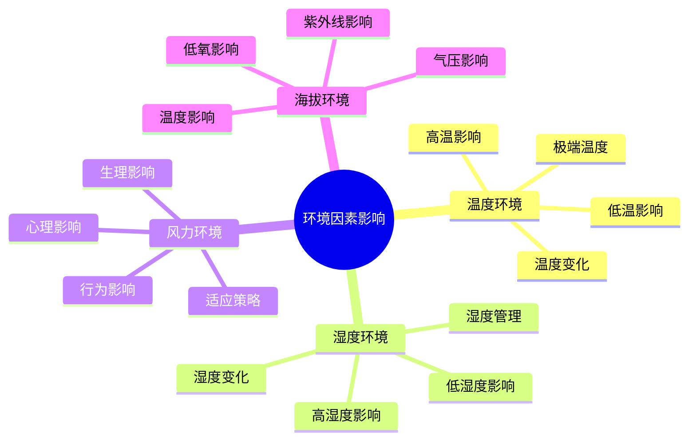

# 环境因素影响

## 🌡️ 温度环境影响

### 1. 高温环境影响
- **生理影响**：体温升高、心率增加、出汗增加、脱水风险
- **心理影响**：烦躁不安、注意力下降、判断力减弱、疲劳感
- **行为影响**：活动减少、寻找阴凉、增加饮水、调整节奏
- **适应策略**：[[01-人体生理适应|人体生理适应]]、水分补充、防晒保护、时间调整

### 2. 低温环境影响
- **生理影响**：体温下降、血管收缩、寒战反应、冻伤风险
- **心理影响**：反应迟钝、情绪低落、意志力下降、恐惧感
- **行为影响**：活动增加、寻找温暖、增加衣物、抱团取暖
- **适应策略**：保暖措施、热量补充、运动保暖、心理调节

### 3. 温度变化影响
- **昼夜温差**：体温调节、衣物调整、作息调整、适应挑战
- **季节变化**：长期适应、装备调整、技能调整、计划调整
- **海拔变化**：温度递减、适应时间、装备需求、风险增加
- **地理变化**：区域差异、气候特征、适应策略、风险评估

### 4. 极端温度
- **极高温**：热射病风险、脱水危险、器官损伤、生命威胁
- **极低温**：冻伤危险、体温过低、器官衰竭、生命威胁
- **温度冲击**：快速变化、适应困难、风险增加、应急处理
- **防护措施**：预警系统、防护装备、应急计划、救援准备

## 💧 湿度环境影响

### 1. 高湿度影响
- **散热困难**：出汗效果差、体温调节困难、热应激增加
- **呼吸影响**：呼吸阻力增加、氧气摄取困难、疲劳感增加
- **皮肤影响**：皮肤湿润、细菌滋生、感染风险、不适感
- **装备影响**：装备潮湿、功能下降、维护困难、使用寿命

### 2. 低湿度影响
- **水分丢失**：呼吸失水、皮肤失水、黏膜干燥、脱水风险
- **静电问题**：静电积累、设备故障、火灾风险、不适感
- **皮肤问题**：皮肤干燥、皲裂风险、感染风险、疼痛感
- **呼吸问题**：呼吸道干燥、咳嗽增加、感染风险、不适感

### 3. 湿度变化
- **季节变化**：湿度波动、适应需求、装备调整、健康影响
- **地理变化**：区域差异、适应策略、风险评估、预防措施
- **天气变化**：短期波动、应急准备、适应调整、风险控制
- **海拔变化**：湿度递减、适应挑战、装备需求、健康监测

### 4. 湿度管理
- **监测方法**：湿度计使用、身体感受、环境观察、预警系统
- **调节策略**：通风调节、湿度控制、个人调节、环境选择
- **防护措施**：保湿措施、干燥防护、健康保护、装备保护
- **应急处理**：湿度应急、健康应急、装备应急、环境应急

## 🌬️ 风力环境影响

### 1. 风力生理影响
- **体温影响**：风寒效应、散热增加、保温困难、体温下降
- **呼吸影响**：呼吸阻力、氧气摄取、疲劳增加、呼吸困难
- **平衡影响**：身体平衡、行走困难、装备影响、安全风险
- **听力影响**：听力下降、沟通困难、预警能力、安全风险

### 2. 风力心理影响
- **压力增加**：心理压力、焦虑感、恐惧感、情绪波动
- **注意力分散**：注意力不集中、判断力下降、决策困难
- **疲劳感**：心理疲劳、身体疲劳、意志力下降、坚持困难
- **适应挑战**：心理适应、情绪调节、压力管理、韧性培养

### 3. 风力行为影响
- **活动调整**：活动强度、活动方式、活动时间、活动地点
- **装备调整**：装备选择、装备使用、装备维护、装备安全
- **营地选择**：避风位置、防风措施、安全考虑、舒适度
- **路线规划**：路线选择、时间安排、风险评估、应急预案

### 4. 风力适应策略
- **生理适应**：体温调节、呼吸适应、平衡训练、耐力提升
- **心理适应**：压力管理、情绪调节、注意力训练、韧性培养
- **技能适应**：风力技能、平衡技能、沟通技能、安全技能
- **装备适应**：防风装备、保暖装备、安全装备、应急装备

## 🏔️ 海拔环境影响

### 1. 低氧影响
- **生理影响**：血氧饱和度下降、心率增加、呼吸频率增加、疲劳感
- **心理影响**：认知功能下降、判断力减弱、情绪波动、焦虑感
- **行为影响**：活动能力下降、反应迟钝、协调性差、安全风险
- **适应过程**：急性期、亚急性期、慢性期、完全适应

### 2. 气压影响
- **气体膨胀**：装备膨胀、身体膨胀、疼痛感、不适感
- **液体沸腾**：水沸点降低、烹饪困难、消毒困难、安全风险
- **设备影响**：设备功能、设备安全、设备维护、设备寿命
- **适应策略**：压力调节、设备调整、技能适应、安全措施

### 3. 紫外线影响
- **皮肤影响**：晒伤风险、皮肤老化、皮肤癌风险、疼痛感
- **眼睛影响**：雪盲症、视力下降、眼部疼痛、长期损伤
- **免疫影响**：免疫力下降、感染风险、恢复困难、健康风险
- **防护措施**：防晒措施、眼部保护、免疫增强、健康监测

### 4. 温度影响
- **温度递减**：海拔每升高100米，温度下降0.6°C
- **温差增大**：昼夜温差、季节温差、区域温差、适应挑战
- **极端温度**：极低温度、冻伤风险、体温过低、生命威胁
- **适应策略**：保暖措施、温度调节、装备调整、安全防护

## 📊 环境因素影响对比

| 环境因素 | 主要影响 | 适应时间 | 风险等级 | 防护措施 |
|----------|----------|----------|----------|----------|
| **温度** | 体温调节 | 2-4周 | 高 | 保暖/散热 |
| **湿度** | 水分平衡 | 1-2周 | 中 | 湿度调节 |
| **风力** | 体温/平衡 | 1-3周 | 中高 | 防风措施 |
| **海拔** | 氧气/气压 | 2-6周 | 高 | 渐进适应 |

## 🎯 环境适应机制

## 🎓 费曼学习法应用

### 第一步：选择概念
选择"环境因素影响"作为学习概念

### 第二步：教授他人
用简单语言解释：
> "户外环境会影响我们的身体和心理：温度影响体温调节，湿度影响水分平衡，风力影响体温和平衡，海拔影响氧气和气压。我们需要适应这些环境因素。"

### 第三步：回顾简化
- **温度影响**：体温调节、生理反应、心理状态
- **湿度影响**：水分平衡、散热效果、健康风险
- **风力影响**：体温影响、平衡影响、安全风险
- **海拔影响**：氧气影响、气压影响、适应挑战

### 第四步：组织优化
建立环境与技能的关系：
- 温度适应 → [[01-人体生理适应|人体生理适应]]
- 湿度管理 → [[03-应用层-实践技能/03-野外生存/02-水源寻找与净化|水源管理]]
- 风力应对 → [[03-应用层-实践技能/04-应急处理/02-恶劣天气应对|恶劣天气]]
- 海拔适应 → [[04-创新层-进阶发展/01-高级技巧/01-极端环境露营|极端环境]]

## 🏃‍♂️ 刻意练习要点

### 环境适应练习
1. **渐进暴露**：逐步暴露于不同环境
2. **监测反馈**：监测身体对环境反应
3. **技能训练**：训练环境适应技能
4. **应急演练**：演练环境应急处理

### 实践验证
- **环境测试**：测试不同环境适应能力
- **生理监测**：监测生理指标变化
- **心理评估**：评估心理适应状态
- **技能评估**：评估环境适应技能

## 🔗 环境与技能的关系

### 温度适应技能
- **体温管理**：[[03-应用层-实践技能/01-装备准备/02-服装选择与搭配|服装选择]]
- **保暖技能**：[[03-应用层-实践技能/02-营地建设/03-篝火建设与管理|篝火管理]]
- **散热技能**：[[03-应用层-实践技能/03-野外生存/04-生火技术|生火技术]]
- **应急处理**：[[03-应用层-实践技能/04-应急处理|应急处理]]

### 湿度管理技能
- **水分管理**：[[03-应用层-实践技能/03-野外生存/02-水源寻找与净化|水源管理]]
- **湿度调节**：[[03-应用层-实践技能/02-营地建设/01-营地选址原则|营地选址]]
- **健康保护**：[[03-应用层-实践技能/04-应急处理/01-常见伤病处理|伤病处理]]
- **装备保护**：[[03-应用层-实践技能/01-装备准备/06-工具与维修|装备维护]]

### 风力应对技能
- **防风技能**：[[03-应用层-实践技能/02-营地建设/02-帐篷搭建技术|帐篷搭建]]
- **平衡技能**：[[03-应用层-实践技能/03-野外生存/01-方向识别技能|方向识别]]
- **安全技能**：[[02-理解层-原理机制/03-安全防护机制/01-风险评估体系|风险评估]]
- **应急技能**：[[03-应用层-实践技能/04-应急处理/02-恶劣天气应对|恶劣天气]]

### 海拔适应技能
- **渐进适应**：[[04-创新层-进阶发展/01-高级技巧/01-极端环境露营|极端环境]]
- **氧气管理**：[[03-应用层-实践技能/03-野外生存|野外生存]]
- **压力调节**：[[02-理解层-原理机制/01-户外生存原理/04-心理适应机制|心理适应]]
- **安全防护**：[[03-应用层-实践技能/04-应急处理|应急处理]]

## 📋 环境适应检查清单

### 温度适应
- [ ] 了解温度影响机制
- [ ] 掌握体温调节技能
- [ ] 具备保暖散热能力
- [ ] 能够应对极端温度

### 湿度适应
- [ ] 了解湿度影响机制
- [ ] 掌握水分管理技能
- [ ] 具备湿度调节能力
- [ ] 能够应对湿度变化

### 风力适应
- [ ] 了解风力影响机制
- [ ] 掌握防风技能
- [ ] 具备平衡能力
- [ ] 能够应对风力变化

### 海拔适应
- [ ] 了解海拔影响机制
- [ ] 掌握渐进适应技能
- [ ] 具备低氧适应能力
- [ ] 能够应对海拔变化

## 🎯 环境适应策略

### 渐进式适应
1. **轻度环境**：从轻度环境开始
2. **逐步增加**：逐步增加环境挑战
3. **持续训练**：持续进行适应训练
4. **全面评估**：全面评估适应效果

### 系统化适应
- **生理适应**：系统性生理适应训练
- **心理适应**：系统性心理适应训练
- **技能适应**：系统性技能适应训练
- **装备适应**：系统性装备适应训练

## 🔗 相关链接
- [[01-人体生理适应|人体生理适应]]
- [[03-能量消耗与补充|能量消耗与补充]]
- [[04-心理适应机制|心理适应机制]]
- [[03-应用层-实践技能/04-应急处理/02-恶劣天气应对|恶劣天气应对]]