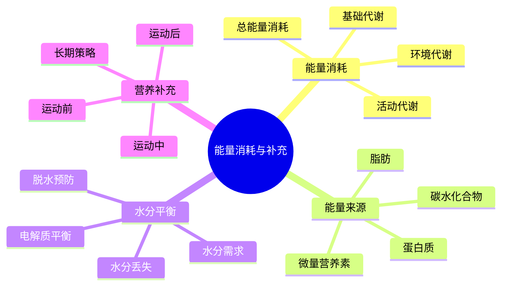

# 能量消耗与补充

## ⚡ 能量消耗机制

### 1. 基础代谢率(BMR)
- **定义**：静息状态下维持生命所需的最低能量
- **影响因素**：年龄、性别、体重、身高、肌肉量、甲状腺功能
- **计算方法**：Harris-Benedict公式、Mifflin-St Jeor公式、Katch-McArdle公式
- **户外影响**：环境温度、海拔高度、应激状态、睡眠质量

### 2. 活动代谢率(AMR)
- **定义**：日常活动和运动消耗的能量
- **活动分类**：轻度活动、中度活动、重度活动、极重度活动
- **户外活动**：徒步、登山、搭建、烹饪、探索、娱乐
- **能量消耗**：每小时200-800卡路里，取决于活动强度和体重

### 3. 环境代谢率(EMR)
- **温度调节**：高温散热、低温保暖、体温维持
- **海拔适应**：低氧适应、呼吸增加、心率增加
- **应激反应**：心理应激、生理应激、激素分泌
- **睡眠代谢**：睡眠质量、环境舒适度、恢复代谢

### 4. 总能量消耗(TDEE)
- **计算公式**：TDEE = BMR × 活动系数 + EMR
- **户外系数**：1.4-2.5倍基础代谢率
- **个体差异**：基因、训练水平、适应能力、环境经验
- **动态调整**：根据活动强度、环境条件、身体状况调整

## 🍎 能量来源与需求

### 1. 碳水化合物
- **功能**：快速供能、糖原储备、血糖维持、大脑供能
- **需求**：总能量的45-65%，户外活动需要更高比例
- **来源**：谷物、水果、蔬菜、糖类、能量棒
- **户外选择**：轻便、高能量密度、易消化、易储存

### 2. 脂肪
- **功能**：持续供能、脂溶性维生素、保温、器官保护
- **需求**：总能量的20-35%，低温环境需要更高比例
- **来源**：坚果、种子、油类、肉类、奶制品
- **户外选择**：高能量密度、耐储存、易携带、易消化

### 3. 蛋白质
- **功能**：肌肉修复、免疫支持、酶合成、激素合成
- **需求**：每公斤体重1.2-2.0克，高强度活动需要更多
- **来源**：肉类、鱼类、豆类、坚果、奶制品
- **户外选择**：轻便、易储存、易消化、氨基酸完整

### 4. 微量营养素
- **维生素**：B族维生素、维生素C、维生素D、维生素E
- **矿物质**：钠、钾、镁、钙、铁、锌
- **抗氧化剂**：维生素C、维生素E、多酚类、类胡萝卜素
- **户外需求**：应激增加、消耗增加、补充困难、储备重要

## 💧 水分平衡管理

### 1. 水分需求
- **基础需求**：每公斤体重30-35毫升，户外活动需要更多
- **活动需求**：每小时500-1000毫升，取决于强度和环境
- **环境需求**：高温、干燥、高海拔环境需求增加
- **个体差异**：体重、训练水平、适应能力、出汗率

### 2. 水分丢失
- **出汗**：主要丢失途径，每小时200-1000毫升
- **呼吸**：呼吸失水，高海拔和干燥环境增加
- **尿液**：肾脏调节，脱水时减少
- **粪便**：消化失水，腹泻时增加

### 3. 电解质平衡
- **钠**：主要电解质，出汗丢失最多
- **钾**：肌肉功能、心脏功能、神经传导
- **镁**：肌肉放松、能量代谢、骨骼健康
- **钙**：骨骼健康、肌肉收缩、神经传导

### 4. 脱水预防
- **监测指标**：尿液颜色、口渴感、体重变化、疲劳感
- **补充策略**：预防性补充、规律补充、适量补充
- **电解质补充**：运动饮料、电解质片、天然食物
- **恢复策略**：充分补充、电解质平衡、逐步恢复

## 🍽️ 营养补充策略

### 1. 运动前营养
- **时间**：运动前2-4小时
- **目标**：糖原储备、水分补充、避免饥饿
- **食物选择**：易消化、高碳水化合物、适量蛋白质
- **补充量**：200-400卡路里，500-800毫升水分

### 2. 运动中营养
- **时间**：运动开始后30-60分钟
- **目标**：持续供能、水分维持、电解质平衡
- **食物选择**：易消化、快速吸收、便携携带
- **补充量**：每小时200-400卡路里，500-1000毫升水分

### 3. 运动后营养
- **时间**：运动后30分钟内
- **目标**：糖原恢复、肌肉修复、水分恢复
- **食物选择**：高碳水化合物、优质蛋白质、易消化
- **补充量**：体重每公斤1-1.5克碳水化合物，0.3-0.5克蛋白质

### 4. 长期营养策略
- **营养计划**：个性化营养计划、营养目标设定
- **食物准备**：食物选择、储存方法、烹饪技巧
- **补充时机**：规律补充、及时补充、适量补充
- **营养监测**：体重监测、身体感受、能量水平

## 📊 能量管理对比

| 营养类型 | 主要功能 | 需求比例 | 补充时机 | 储存方式 |
|----------|----------|----------|----------|----------|
| **碳水化合物** | 快速供能 | 45-65% | 运动前后 | 糖原储备 |
| **脂肪** | 持续供能 | 20-35% | 全天 | 脂肪储备 |
| **蛋白质** | 肌肉修复 | 15-25% | 运动后 | 肌肉蛋白 |
| **水分** | 生命维持 | 2-4升/天 | 持续 | 体液平衡 |

## 🎯 能量管理机制

## 🎓 费曼学习法应用

### 第一步：选择概念
选择"能量消耗与补充"作为学习概念

### 第二步：教授他人
用简单语言解释：
> "户外活动需要大量能量：基础代谢维持生命，活动代谢支持运动，环境代谢适应环境。我们需要通过碳水化合物快速供能，脂肪持续供能，蛋白质修复肌肉，水分维持生命。"

### 第三步：回顾简化
- **能量消耗**：基础代谢、活动代谢、环境代谢
- **能量来源**：碳水化合物、脂肪、蛋白质、微量营养素
- **水分平衡**：水分需求、水分丢失、电解质平衡
- **营养补充**：运动前、运动中、运动后、长期策略

### 第四步：组织优化
建立能量与技能的关系：
- 能量消耗 → [[01-人体生理适应|人体生理适应]]
- 能量来源 → [[03-应用层-实践技能/03-野外生存/03-食物获取技能|食物获取]]
- 水分平衡 → [[03-应用层-实践技能/03-野外生存/02-水源寻找与净化|水源管理]]
- 营养补充 → [[03-应用层-实践技能/03-野外生存/03-食物获取技能|食物获取]]

## 🏃‍♂️ 刻意练习要点

### 能量管理练习
1. **能量计算**：学习能量需求计算
2. **营养规划**：制定个性化营养计划
3. **补充实践**：实践营养补充策略
4. **监测调整**：监测能量状态并调整

### 实践验证
- **能量测试**：测试不同活动能量消耗
- **营养评估**：评估营养补充效果
- **水分监测**：监测水分平衡状态
- **身体感受**：感受能量水平变化

## 🔗 能量与技能的关系

### 能量消耗技能
- **活动规划**：[[03-应用层-实践技能/03-野外生存|野外生存]]
- **强度控制**：[[03-应用层-实践技能/03-野外生存/01-方向识别技能|方向识别]]
- **环境适应**：[[02-理解层-原理机制/01-户外生存原理/02-环境因素影响|环境因素]]
- **身体监测**：[[03-应用层-实践技能/04-应急处理|应急处理]]

### 营养管理技能
- **食物选择**：[[03-应用层-实践技能/03-野外生存/03-食物获取技能|食物获取]]
- **食物储存**：[[03-应用层-实践技能/01-装备准备|装备准备]]
- **食物烹饪**：[[03-应用层-实践技能/02-营地建设/03-篝火建设与管理|篝火管理]]
- **营养补充**：[[03-应用层-实践技能/03-野外生存/03-食物获取技能|食物获取]]

### 水分管理技能
- **水源寻找**：[[03-应用层-实践技能/03-野外生存/02-水源寻找与净化|水源寻找]]
- **水源净化**：[[03-应用层-实践技能/03-野外生存/02-水源寻找与净化|水源净化]]
- **水分储存**：[[03-应用层-实践技能/01-装备准备|装备准备]]
- **水分补充**：[[03-应用层-实践技能/03-野外生存/02-水源寻找与净化|水源管理]]

### 能量监测技能
- **身体感受**：[[02-理解层-原理机制/01-户外生存原理/04-心理适应机制|心理适应]]
- **能量评估**：[[03-应用层-实践技能/04-应急处理|应急处理]]
- **营养调整**：[[03-应用层-实践技能/03-野外生存/03-食物获取技能|食物获取]]
- **健康监测**：[[03-应用层-实践技能/04-应急处理/01-常见伤病处理|伤病处理]]

## 📋 能量管理检查清单

### 能量消耗
- [ ] 了解基础代谢率
- [ ] 计算活动能量消耗
- [ ] 考虑环境能量需求
- [ ] 制定总能量计划

### 营养补充
- [ ] 规划碳水化合物补充
- [ ] 安排脂肪补充
- [ ] 计划蛋白质补充
- [ ] 准备微量营养素

### 水分管理
- [ ] 计算水分需求
- [ ] 准备水分补充
- [ ] 安排电解质补充
- [ ] 制定脱水预防策略

### 能量监测
- [ ] 监测能量水平
- [ ] 评估营养状态
- [ ] 调整补充策略
- [ ] 优化能量管理

## 🎯 能量管理策略

### 个性化策略
1. **个体评估**：评估个人能量需求
2. **环境考虑**：考虑环境因素影响
3. **活动规划**：规划活动能量需求
4. **动态调整**：根据实际情况调整

### 系统化策略
- **营养计划**：制定系统性营养计划
- **补充时机**：合理安排补充时机
- **监测反馈**：建立监测反馈机制
- **持续优化**：持续优化能量管理

## 🔗 相关链接
- [[01-人体生理适应|人体生理适应]]
- [[02-环境因素影响|环境因素影响]]
- [[04-心理适应机制|心理适应机制]]
- [[03-应用层-实践技能/03-野外生存/03-食物获取技能|食物获取技能]]