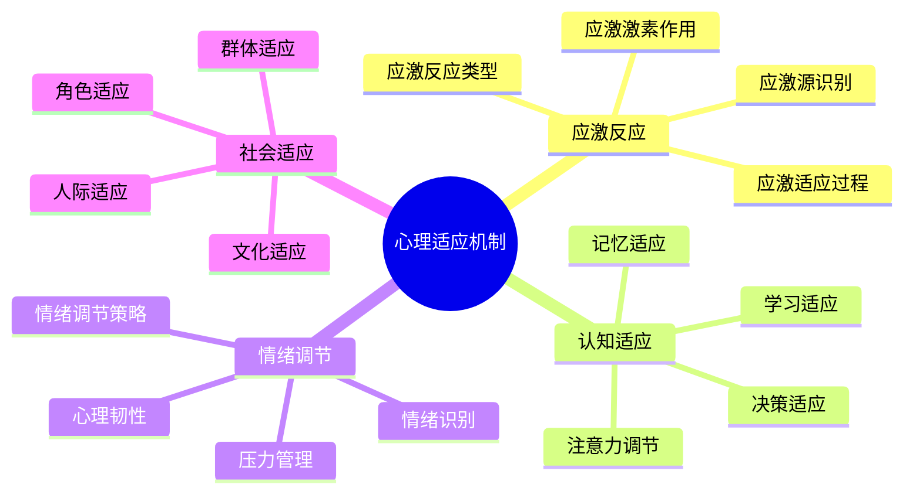

# 心理适应机制

## 🧠 应激反应机制

### 1. 应激源识别
- **环境威胁**：恶劣天气、危险地形、野生动物、自然灾害
- **身体威胁**：受伤、疾病、疲劳、饥饿、脱水
- **心理威胁**：孤独、恐惧、焦虑、压力、不确定性
- **社会威胁**：冲突、排斥、责任、期望、失败

### 2. 应激反应类型
- **战斗反应**：面对威胁、积极应对、主动解决
- **逃跑反应**：逃避威胁、寻求安全、避免冲突
- **冻结反应**：僵化反应、无法行动、被动应对
- **讨好反应**：顺从威胁、妥协退让、寻求保护

### 3. 应激激素作用
- **肾上腺素**：心跳加速、血压升高、肌肉紧张、注意力集中
- **皮质醇**：血糖升高、免疫抑制、记忆影响、情绪波动
- **去甲肾上腺素**：血管收缩、血压升高、注意力增强、警觉性提高
- **内啡肽**：疼痛缓解、情绪改善、压力缓解、愉悦感

### 4. 应激适应过程
- **急性应激**：短期反应、快速适应、即时应对
- **慢性应激**：长期反应、持续适应、累积影响
- **应激耐受**：适应能力、恢复能力、韧性培养
- **应激后成长**：经验积累、能力提升、心理成长

## 🎯 认知适应机制

### 1. 注意力调节
- **选择性注意**：关注重要信息、忽略无关信息、提高效率
- **持续注意**：长时间专注、抗干扰能力、任务坚持
- **分散注意**：多任务处理、环境监控、安全警觉
- **注意力恢复**：疲劳恢复、注意力重建、认知资源恢复

### 2. 记忆适应
- **工作记忆**：临时存储、信息处理、决策支持
- **长期记忆**：经验存储、技能记忆、知识积累
- **记忆巩固**：经验整合、技能固化、知识内化
- **记忆提取**：快速回忆、经验应用、问题解决

### 3. 决策适应
- **快速决策**：时间压力、信息有限、风险决策
- **风险评估**：危险识别、概率评估、后果分析
- **策略调整**：计划修改、方法改变、目标调整
- **决策学习**：经验总结、错误分析、决策改进

### 4. 学习适应
- **技能学习**：新技能掌握、技能提升、技能应用
- **经验积累**：经验总结、模式识别、规律发现
- **适应性学习**：环境适应、方法调整、策略优化
- **元认知学习**：学习策略、自我监控、学习调节

## 😊 情绪调节机制

### 1. 情绪识别
- **情绪感知**：情绪觉察、情绪识别、情绪理解
- **情绪表达**：情绪外显、情绪沟通、情绪分享
- **情绪理解**：情绪原因、情绪影响、情绪意义
- **情绪预测**：情绪预期、情绪准备、情绪应对

### 2. 情绪调节策略
- **认知重评**：重新解释、意义重构、视角转换
- **注意力转移**：注意力分散、焦点转移、活动转移
- **行为调节**：行为改变、活动调整、环境改变
- **生理调节**：呼吸调节、肌肉放松、身体放松

### 3. 压力管理
- **压力识别**：压力源识别、压力信号识别、压力评估
- **压力应对**：问题解决、情绪调节、社会支持
- **压力缓解**：放松技巧、冥想练习、身体活动
- **压力预防**：压力预防、压力缓冲、压力管理

### 4. 心理韧性
- **抗压能力**：压力承受、压力适应、压力恢复
- **恢复能力**：挫折恢复、失败恢复、创伤恢复
- **成长能力**：经验成长、能力成长、心理成长
- **韧性培养**：韧性训练、韧性提升、韧性维持

## 👥 社会适应机制

### 1. 人际适应
- **社交技能**：沟通技巧、表达技巧、倾听技巧
- **人际关系**：关系建立、关系维护、关系修复
- **冲突解决**：冲突识别、冲突处理、冲突预防
- **合作能力**：团队合作、协作能力、互助能力

### 2. 文化适应
- **文化理解**：文化认知、文化尊重、文化包容
- **文化融入**：文化适应、文化参与、文化贡献
- **文化冲突**：冲突识别、冲突处理、冲突解决
- **文化学习**：文化学习、文化体验、文化成长

### 3. 角色适应
- **角色认知**：角色理解、角色期望、角色责任
- **角色扮演**：角色执行、角色表现、角色调整
- **角色转换**：角色切换、角色适应、角色平衡
- **角色成长**：角色发展、角色提升、角色创新

### 4. 群体适应
- **群体认同**：群体归属、群体认同、群体忠诚
- **群体规范**：规范理解、规范遵守、规范维护
- **群体压力**：压力识别、压力应对、压力调节
- **群体贡献**：贡献意识、贡献行为、贡献价值

## 📊 心理适应对比

| 适应类型 | 主要机制 | 适应时间 | 影响因素 | 改善策略 |
|----------|----------|----------|----------|----------|
| **应激适应** | 激素调节 | 即时-数周 | 威胁程度 | 应激训练 |
| **认知适应** | 神经可塑性 | 数周-数月 | 训练强度 | 认知训练 |
| **情绪适应** | 情绪调节 | 数天-数周 | 情绪类型 | 情绪训练 |
| **社会适应** | 社交学习 | 数周-数月 | 社交环境 | 社交训练 |

## 🎯 心理适应机制

## 🎓 费曼学习法应用

### 第一步：选择概念
选择"心理适应机制"作为学习概念

### 第二步：教授他人
用简单语言解释：
> "心理适应是大脑对环境变化的调整：应激反应帮助我们应对威胁，认知适应提高我们的思维能力，情绪调节帮助我们管理情绪，社会适应帮助我们与他人相处。"

### 第三步：回顾简化
- **应激反应**：威胁应对、激素调节、适应过程
- **认知适应**：注意力、记忆、决策、学习
- **情绪调节**：情绪识别、调节策略、压力管理
- **社会适应**：人际、文化、角色、群体

### 第四步：组织优化
建立心理与技能的关系：
- 应激反应 → [[03-应用层-实践技能/04-应急处理|应急处理]]
- 认知适应 → [[04-创新层-进阶发展/01-高级技巧/07-跨学科知识整合|跨学科知识]]
- 情绪调节 → [[04-创新层-进阶发展/03-领导力培养/04-沟通协调技巧|沟通协调]]
- 社会适应 → [[04-创新层-进阶发展/03-领导力培养|领导力培养]]

## 🏃‍♂️ 刻意练习要点

### 心理适应练习
1. **应激训练**：渐进式应激暴露训练
2. **认知训练**：注意力、记忆、决策训练
3. **情绪训练**：情绪识别、调节、管理训练
4. **社交训练**：沟通、合作、领导训练

### 实践验证
- **应激测试**：测试应激反应能力
- **认知评估**：评估认知适应水平
- **情绪监测**：监测情绪调节效果
- **社交评估**：评估社交适应能力

## 🔗 心理与技能的关系

### 应激反应技能
- **威胁识别**：[[02-理解层-原理机制/03-安全防护机制/01-风险评估体系|风险评估]]
- **应急处理**：[[03-应用层-实践技能/04-应急处理|应急处理]]
- **危机管理**：[[04-创新层-进阶发展/03-领导力培养/03-危机处理领导|危机处理]]
- **安全防护**：[[02-理解层-原理机制/03-安全防护机制|安全防护]]

### 认知适应技能
- **注意力训练**：[[03-应用层-实践技能/03-野外生存/01-方向识别技能|方向识别]]
- **记忆训练**：[[04-创新层-进阶发展/01-高级技巧/07-跨学科知识整合|跨学科知识]]
- **决策训练**：[[04-创新层-进阶发展/03-领导力培养/06-责任与担当|责任担当]]
- **学习训练**：[[04-创新层-进阶发展/03-领导力培养/05-培训指导方法|培训指导]]

### 情绪调节技能
- **情绪识别**：[[04-创新层-进阶发展/03-领导力培养/04-沟通协调技巧|沟通协调]]
- **情绪调节**：[[04-创新层-进阶发展/03-领导力培养/04-沟通协调技巧|沟通协调]]
- **压力管理**：[[04-创新层-进阶发展/03-领导力培养/03-危机处理领导|危机处理]]
- **心理韧性**：[[04-创新层-进阶发展/01-高级技巧/06-领导力实践|领导力实践]]

### 社会适应技能
- **人际技能**：[[04-创新层-进阶发展/03-领导力培养/04-沟通协调技巧|沟通协调]]
- **文化技能**：[[04-创新层-进阶发展/04-文化传承|文化传承]]
- **角色技能**：[[04-创新层-进阶发展/03-领导力培养/01-团队管理技能|团队管理]]
- **群体技能**：[[04-创新层-进阶发展/03-领导力培养|领导力培养]]

## 📋 心理适应检查清单

### 应激反应
- [ ] 能够识别应激源
- [ ] 具备应激反应能力
- [ ] 掌握应激调节技巧
- [ ] 具备应激恢复能力

### 认知适应
- [ ] 具备注意力调节能力
- [ ] 掌握记忆适应技巧
- [ ] 具备决策适应能力
- [ ] 掌握学习适应方法

### 情绪调节
- [ ] 能够识别情绪状态
- [ ] 掌握情绪调节策略
- [ ] 具备压力管理能力
- [ ] 具备心理韧性

### 社会适应
- [ ] 具备人际适应能力
- [ ] 掌握文化适应技巧
- [ ] 具备角色适应能力
- [ ] 掌握群体适应方法

## 🎯 心理适应策略

### 渐进式适应
1. **轻度挑战**：从轻度心理挑战开始
2. **逐步增加**：逐步增加心理挑战强度
3. **持续训练**：持续进行心理适应训练
4. **全面评估**：全面评估心理适应效果

### 系统化训练
- **应激训练**：系统性应激适应训练
- **认知训练**：系统性认知适应训练
- **情绪训练**：系统性情绪适应训练
- **社交训练**：系统性社交适应训练

## 🔗 相关链接
- [[01-人体生理适应|人体生理适应]]
- [[02-环境因素影响|环境因素影响]]
- [[03-能量消耗与补充|能量消耗与补充]]
- [[04-创新层-进阶发展/03-领导力培养|领导力培养]]