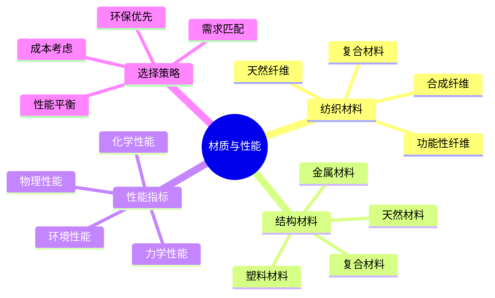

# 材质与性能

## 🧵 纺织材料

### 1. 天然纤维
- **棉纤维**：吸湿性好、透气性强、舒适度高、易干性差
- **羊毛纤维**：保暖性强、吸湿排汗、抗菌防臭、重量较重
- **丝绸纤维**：轻便柔软、吸湿排汗、保暖性好、价格昂贵
- **麻纤维**：强度高、透气性好、抗菌防臭、易皱缩

### 2. 合成纤维
- **聚酯纤维**：强度高、耐磨损、快干性好、透气性差
- **尼龙纤维**：强度极高、耐磨损、轻便、易老化
- **聚丙烯纤维**：轻便、快干、保暖、强度较低
- **弹性纤维**：弹性好、恢复性强、舒适度高、耐久性差

### 3. 功能性纤维
- **防水纤维**：防水透气、耐用性强、价格较高
- **抗菌纤维**：抗菌防臭、健康卫生、功能持久
- **保温纤维**：保温性能、轻便舒适、价格适中
- **防晒纤维**：紫外线防护、耐久性好、功能稳定

### 4. 复合材料
- **混纺材料**：性能平衡、成本适中、应用广泛
- **涂层材料**：功能增强、性能提升、维护复杂
- **层压材料**：多层结构、性能优异、重量增加
- **智能材料**：功能智能、技术先进、价格昂贵

## 🏗️ 结构材料

### 1. 金属材料
- **铝合金**：轻便坚固、耐腐蚀、导热性好、价格适中
- **钛合金**：强度极高、重量轻、耐腐蚀、价格昂贵
- **不锈钢**：强度高、耐腐蚀、重量重、价格适中
- **碳钢**：强度高、价格低、重量重、易腐蚀

### 2. 塑料材料
- **聚乙烯**：轻便、耐化学性、价格低、强度较低
- **聚丙烯**：轻便、耐化学性、价格低、强度中等
- **聚碳酸酯**：强度高、透明度好、价格高、易老化
- **ABS塑料**：强度高、耐冲击、价格适中、重量中等

### 3. 复合材料
- **碳纤维**：强度极高、重量极轻、价格昂贵、易损坏
- **玻璃纤维**：强度高、价格适中、重量中等、易老化
- **凯夫拉纤维**：强度极高、耐切割、价格昂贵、重量重
- **芳纶纤维**：强度高、耐高温、价格高、重量中等

### 4. 天然材料
- **木材**：天然环保、加工性好、重量重、易腐朽
- **竹子**：轻便坚固、天然环保、价格低、易开裂
- **皮革**：耐用性强、透气性好、重量重、维护复杂
- **橡胶**：弹性好、密封性强、重量中等、易老化

## 🔧 性能指标

### 1. 力学性能
- **强度**：抗拉强度、抗压强度、抗弯强度、抗剪强度
- **韧性**：冲击韧性、断裂韧性、疲劳韧性
- **硬度**：表面硬度、耐磨性、抗划伤性
- **弹性**：弹性模量、弹性恢复、弹性极限

### 2. 物理性能
- **密度**：材料密度、重量影响、便携性
- **导热性**：导热系数、保温性能、散热性能
- **电学性能**：导电性、绝缘性、静电性
- **光学性能**：透明度、反射率、吸收率

### 3. 化学性能
- **耐腐蚀性**：耐酸碱性、耐盐性、耐氧化性
- **耐候性**：耐紫外线、耐温度变化、耐湿度
- **耐化学性**：耐溶剂性、耐油性、耐化学品
- **稳定性**：尺寸稳定性、颜色稳定性、性能稳定性

### 4. 环境性能
- **环保性**：可回收性、可降解性、环境影响
- **可持续性**：资源消耗、生产过程、使用寿命
- **安全性**：毒性、可燃性、放射性、生物相容性
- **可维护性**：易清洁、易修复、易更换、维护成本

## 📊 材质性能对比

| 材质类型 | 强度 | 重量 | 耐用性 | 价格 | 环保性 | 适用场景 |
|----------|------|------|--------|------|--------|----------|
| **棉纤维** | 中 | 中 | 中 | 低 | 高 | 日常服装 |
| **聚酯纤维** | 高 | 低 | 高 | 低 | 中 | 户外服装 |
| **铝合金** | 高 | 低 | 高 | 中 | 高 | 装备结构 |
| **碳纤维** | 极高 | 极低 | 中 | 极高 | 中 | 高端装备 |
| **木材** | 中 | 高 | 中 | 低 | 极高 | 传统装备 |

## 🎯 材质选择策略

## 🎓 费曼学习法应用

### 第一步：选择概念
选择"材质与性能"作为学习概念

### 第二步：教授他人
用简单语言解释：
> "装备材质决定性能：天然纤维舒适但重，合成纤维轻便但透气差，金属材料坚固但重，碳纤维轻便但贵。选择时要平衡强度、重量、耐用性和价格。"

### 第三步：回顾简化
- **纺织材料**：天然纤维、合成纤维、功能性纤维
- **结构材料**：金属、塑料、复合材料、天然材料
- **性能指标**：力学、物理、化学、环境性能
- **选择策略**：需求匹配、性能平衡、成本考虑

### 第四步：组织优化
建立材质与技能的关系：
- 纺织材料 → [[03-应用层-实践技能/01-装备准备/02-服装选择与搭配|服装选择]]
- 结构材料 → [[03-应用层-实践技能/01-装备准备/03-帐篷搭建技巧|帐篷搭建]]
- 性能指标 → [[04-创新层-进阶发展/02-专业配置/01-专业装备推荐|专业装备]]
- 选择策略 → [[04-创新层-进阶发展/02-专业配置/02-定制化配置|定制配置]]

## 🏃‍♂️ 刻意练习要点

### 材质识别练习
1. **材质识别**：识别不同材质特征
2. **性能测试**：测试材质性能指标
3. **应用分析**：分析材质应用场景
4. **选择决策**：做出材质选择决策

### 实践验证
- **材质测试**：实际测试材质性能
- **使用体验**：体验材质使用效果
- **问题识别**：识别材质问题
- **改进建议**：提出材质改进建议

## 🔗 材质与技能的关系

### 纺织材料技能
- **材质识别**：[[03-应用层-实践技能/01-装备准备/02-服装选择与搭配|服装选择]]
- **性能评估**：[[04-创新层-进阶发展/02-专业配置/01-专业装备推荐|专业装备]]
- **维护保养**：[[04-创新层-进阶发展/02-专业配置/04-维护保养体系|维护保养]]
- **环保处理**：[[02-理解层-原理机制/04-环境保护理念|环境保护]]

### 结构材料技能
- **强度评估**：[[03-应用层-实践技能/01-装备准备|装备准备]]
- **重量管理**：[[02-理解层-原理机制/02-装备选择原理/03-重量与便携性|重量管理]]
- **耐用性评估**：[[04-创新层-进阶发展/02-专业配置/04-维护保养体系|维护保养]]
- **安全评估**：[[02-理解层-原理机制/03-安全防护机制|安全防护]]

### 性能测试技能
- **力学测试**：[[04-创新层-进阶发展/02-专业配置/01-专业装备推荐|专业装备]]
- **物理测试**：[[04-创新层-进阶发展/02-专业配置/03-技术装备集成|技术集成]]
- **化学测试**：[[04-创新层-进阶发展/02-专业配置/04-维护保养体系|维护保养]]
- **环境测试**：[[02-理解层-原理机制/04-环境保护理念|环境保护]]

### 选择决策技能
- **需求分析**：[[03-应用层-实践技能/01-装备准备|装备准备]]
- **性能比较**：[[04-创新层-进阶发展/02-专业配置/02-定制化配置|定制配置]]
- **成本分析**：[[04-创新层-进阶发展/02-专业配置/06-成本效益分析|成本分析]]
- **环保考虑**：[[02-理解层-原理机制/04-环境保护理念|环境保护]]

## 📋 材质选择检查清单

### 材质识别
- [ ] 识别材质类型
- [ ] 了解材质特性
- [ ] 评估材质性能
- [ ] 考虑材质应用

### 性能评估
- [ ] 测试力学性能
- [ ] 评估物理性能
- [ ] 检查化学性能
- [ ] 考虑环境性能

### 选择决策
- [ ] 匹配功能需求
- [ ] 平衡性能指标
- [ ] 考虑成本因素
- [ ] 评估环保影响

### 使用验证
- [ ] 实际使用测试
- [ ] 性能效果评估
- [ ] 问题识别记录
- [ ] 改进建议提出

## 🎯 材质选择策略

### 需求导向策略
1. **功能需求**：根据功能需求选择材质
2. **性能需求**：根据性能需求选择材质
3. **环境需求**：根据环境需求选择材质
4. **成本需求**：根据成本需求选择材质

### 平衡优化策略
- **性能平衡**：平衡各项性能指标
- **成本平衡**：平衡性能与成本
- **环保平衡**：平衡性能与环保
- **维护平衡**：平衡性能与维护

## 🔗 相关链接
- [[01-功能分类与选择|功能分类与选择]]
- [[03-重量与便携性|重量与便携性]]
- [[露营/02-理解层-原理机制/02-装备选择原理/04-性价比分析|性价比分析]]
- [[03-应用层-实践技能/01-装备准备/02-服装选择与搭配|服装选择]]