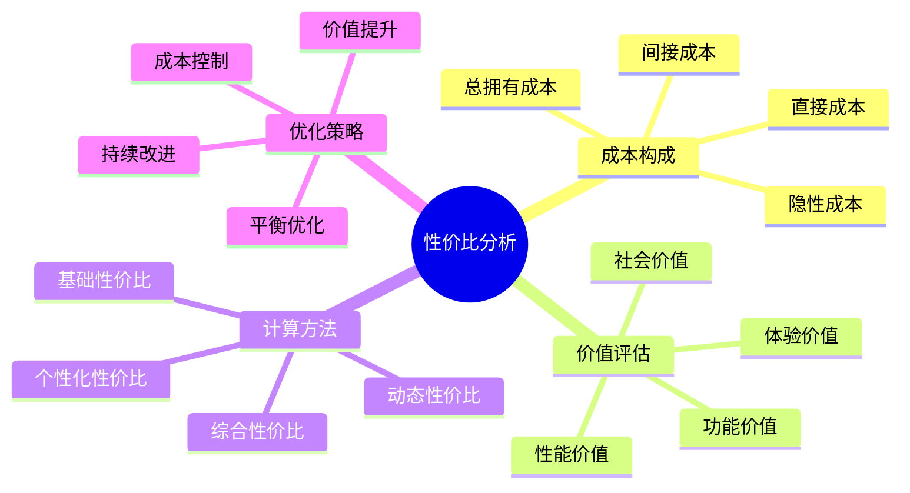

# 性价比分析

## 💰 成本构成分析

### 1. 直接成本
- **购买成本**：装备购买价格、税费、运费
- **使用成本**：燃料费用、维护费用、修理费用
- **消耗成本**：消耗品费用、磨损费用、折旧费用
- **存储成本**：存储空间费用、保险费用、管理费用

### 2. 间接成本
- **时间成本**：学习时间、使用时间、维护时间
- **机会成本**：选择此装备放弃的其他选择
- **风险成本**：装备故障风险、安全风险、损失风险
- **环境成本**：环境影响、资源消耗、生态成本

### 3. 隐性成本
- **学习成本**：学习使用技能的成本
- **适应成本**：适应装备使用的成本
- **升级成本**：装备升级换代成本
- **处置成本**：装备处置处理成本

### 4. 总拥有成本(TCO)
- **初始投资**：购买装备的初始投资
- **运营成本**：使用过程中的运营成本
- **维护成本**：维护保养的成本
- **处置价值**：装备处置时的价值

## 📈 价值评估方法

### 1. 功能价值
- **核心功能**：满足基本需求的价值
- **辅助功能**：提供额外便利的价值
- **多功能性**：一物多用的价值
- **创新功能**：技术创新带来的价值

### 2. 性能价值
- **可靠性**：装备可靠性的价值
- **耐用性**：装备耐用性的价值
- **效率性**：装备效率的价值
- **安全性**：装备安全性的价值

### 3. 体验价值
- **舒适性**：使用舒适性的价值
- **便利性**：使用便利性的价值
- **美观性**：外观美观的价值
- **品牌价值**：品牌影响力的价值

### 4. 社会价值
- **环保价值**：环保性能的价值
- **社会影响**：社会影响力的价值
- **文化价值**：文化传承的价值
- **教育价值**：教育意义的价值

## ⚖️ 性价比计算方法

### 1. 基础性价比
- **公式**：性价比 = 功能价值 / 购买价格
- **计算**：评估功能价值与价格的比值
- **比较**：与同类产品进行比较
- **优化**：寻找最佳性价比产品

### 2. 综合性价比
- **公式**：综合性价比 = 总价值 / 总成本
- **总价值**：功能价值 + 性能价值 + 体验价值
- **总成本**：直接成本 + 间接成本 + 隐性成本
- **评估**：全面评估性价比

### 3. 动态性价比
- **时间因素**：考虑时间对性价比的影响
- **使用频率**：考虑使用频率对性价比的影响
- **技术进步**：考虑技术进步对性价比的影响
- **市场变化**：考虑市场变化对性价比的影响

### 4. 个性化性价比
- **个人需求**：根据个人需求评估性价比
- **使用场景**：根据使用场景评估性价比
- **技能水平**：根据技能水平评估性价比
- **预算限制**：根据预算限制评估性价比

## 📊 性价比评估矩阵

| 装备类型 | 功能价值 | 性能价值 | 体验价值 | 总成本 | 性价比 | 推荐等级 |
|----------|----------|----------|----------|--------|--------|----------|
| **基础装备** | 高 | 中 | 中 | 低 | 高 | ⭐⭐⭐⭐⭐ |
| **中端装备** | 高 | 高 | 高 | 中 | 高 | ⭐⭐⭐⭐ |
| **高端装备** | 高 | 极高 | 极高 | 高 | 中 | ⭐⭐⭐ |
| **顶级装备** | 高 | 极高 | 极高 | 极高 | 低 | ⭐⭐ |

## 🎯 性价比优化策略

## 🎓 费曼学习法应用

### 第一步：选择概念
选择"性价比分析"作为学习概念

### 第二步：教授他人
用简单语言解释：
> "性价比是价值与成本的比值：功能价值高、性能好、体验佳，但成本要合理。要综合考虑直接成本、间接成本和隐性成本，找到最佳性价比。"

### 第三步：回顾简化
- **成本构成**：直接成本、间接成本、隐性成本
- **价值评估**：功能价值、性能价值、体验价值
- **计算方法**：基础性价比、综合性价比、动态性价比
- **优化策略**：成本控制、价值提升、平衡优化

### 第四步：组织优化
建立性价比与技能的关系：
- 成本分析 → [[04-创新层-进阶发展/02-专业配置/06-成本效益分析|成本分析]]
- 价值评估 → [[04-创新层-进阶发展/02-专业配置/01-专业装备推荐|专业装备]]
- 性价比计算 → [[04-创新层-进阶发展/02-专业配置/02-定制化配置|定制配置]]
- 优化策略 → [[04-创新层-进阶发展/02-专业配置/05-升级优化策略|升级优化]]

## 🏃‍♂️ 刻意练习要点

### 性价比分析练习
1. **成本分析**：分析装备各项成本
2. **价值评估**：评估装备各项价值
3. **性价比计算**：计算装备性价比
4. **比较分析**：比较不同装备性价比

### 实践验证
- **使用体验**：体验装备使用效果
- **成本验证**：验证实际使用成本
- **价值验证**：验证实际使用价值
- **性价比验证**：验证性价比评估

## 🔗 性价比与技能的关系

### 成本分析技能
- **成本识别**：[[04-创新层-进阶发展/02-专业配置/06-成本效益分析|成本分析]]
- **成本计算**：[[04-创新层-进阶发展/02-专业配置/06-成本效益分析|成本分析]]
- **成本控制**：[[04-创新层-进阶发展/02-专业配置/06-成本效益分析|成本分析]]
- **成本优化**：[[04-创新层-进阶发展/02-专业配置/05-升级优化策略|升级优化]]

### 价值评估技能
- **功能评估**：[[03-应用层-实践技能/01-装备准备|装备准备]]
- **性能评估**：[[04-创新层-进阶发展/02-专业配置/01-专业装备推荐|专业装备]]
- **体验评估**：[[03-应用层-实践技能/03-野外生存|野外生存]]
- **社会评估**：[[02-理解层-原理机制/04-环境保护理念|环境保护]]

### 性价比计算技能
- **基础计算**：[[04-创新层-进阶发展/02-专业配置/06-成本效益分析|成本分析]]
- **综合计算**：[[04-创新层-进阶发展/02-专业配置/02-定制化配置|定制配置]]
- **动态计算**：[[04-创新层-进阶发展/02-专业配置/05-升级优化策略|升级优化]]
- **个性计算**：[[04-创新层-进阶发展/02-专业配置/02-定制化配置|定制配置]]

### 优化决策技能
- **决策分析**：[[04-创新层-进阶发展/03-领导力培养/06-责任与担当|责任担当]]
- **比较分析**：[[04-创新层-进阶发展/02-专业配置/01-专业装备推荐|专业装备]]
- **风险评估**：[[02-理解层-原理机制/03-安全防护机制/01-风险评估体系|风险评估]]
- **优化实施**：[[04-创新层-进阶发展/02-专业配置/05-升级优化策略|升级优化]]

## 📋 性价比分析检查清单

### 成本分析
- [ ] 识别直接成本
- [ ] 计算间接成本
- [ ] 评估隐性成本
- [ ] 计算总拥有成本

### 价值评估
- [ ] 评估功能价值
- [ ] 评估性能价值
- [ ] 评估体验价值
- [ ] 评估社会价值

### 性价比计算
- [ ] 计算基础性价比
- [ ] 计算综合性价比
- [ ] 考虑动态因素
- [ ] 个性化调整

### 优化决策
- [ ] 比较不同选择
- [ ] 评估风险因素
- [ ] 制定优化策略
- [ ] 实施优化方案

## 🎯 性价比优化策略

### 成本控制策略
1. **预算控制**：制定合理预算
2. **成本监控**：监控成本变化
3. **成本优化**：优化成本结构
4. **成本预防**：预防成本增加

### 价值提升策略
- **功能提升**：提升装备功能
- **性能提升**：提升装备性能
- **体验提升**：提升使用体验
- **价值创新**：创新价值创造

### 平衡优化策略
- **成本价值平衡**：平衡成本与价值
- **短期长期平衡**：平衡短期与长期
- **个人团队平衡**：平衡个人与团队
- **性能成本平衡**：平衡性能与成本

## 🔗 相关链接
- [[01-功能分类与选择|功能分类与选择]]
- [[02-材质与性能|材质与性能]]
- [[03-重量与便携性|重量与便携性]]
- [[04-创新层-进阶发展/02-专业配置/06-成本效益分析|成本效益分析]]
