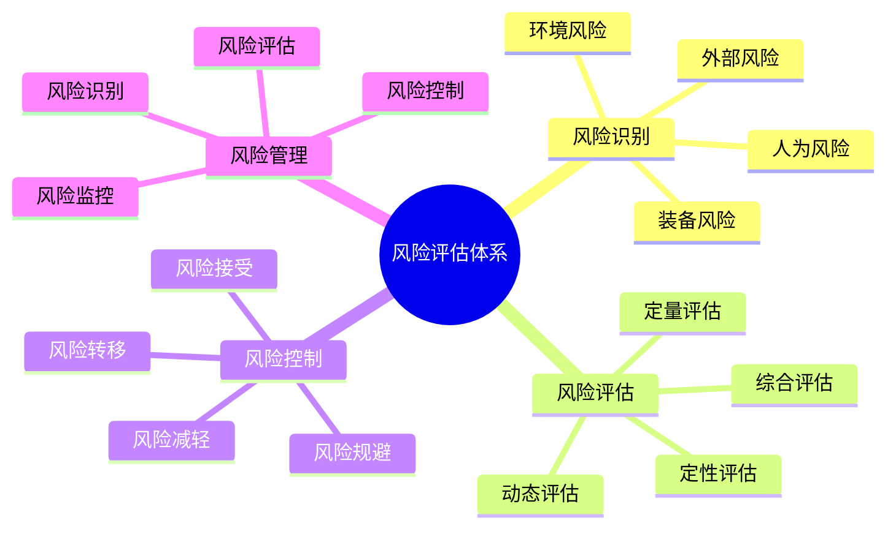

# 风险评估体系

## ⚠️ 风险识别与分类

### 1. 环境风险
- **天气风险**：恶劣天气、极端温度、强风暴雨、雷电冰雹
- **地形风险**：陡峭地形、悬崖峭壁、滑坡塌方、河流湖泊
- **生物风险**：野生动物、有毒植物、昆虫叮咬、过敏反应
- **地质风险**：地震、火山、泥石流、地面塌陷

### 2. 装备风险
- **装备故障**：装备损坏、功能失效、性能下降
- **装备丢失**：装备遗失、被盗、损坏
- **装备不当**：装备选择不当、使用不当、维护不当
- **装备老化**：装备老化、磨损、失效

### 3. 人为风险
- **技能不足**：技能缺乏、经验不足、判断错误
- **身体风险**：体力不支、疾病突发、意外受伤
- **心理风险**：恐惧焦虑、压力过大、判断失误
- **团队风险**：团队冲突、沟通不畅、责任不清

### 4. 外部风险
- **社会风险**：治安问题、人为破坏、政策变化
- **交通风险**：交通事故、交通堵塞、交通管制
- **通讯风险**：通讯中断、信号丢失、设备故障
- **救援风险**：救援延迟、救援困难、救援成本

## 📊 风险评估方法

### 1. 定性评估
- **风险等级**：低风险、中风险、高风险、极高风险
- **影响程度**：轻微影响、中等影响、严重影响、致命影响
- **发生概率**：极低、低、中、高、极高
- **可控程度**：完全可控、部分可控、难以控制、不可控

### 2. 定量评估
- **风险指数**：风险指数 = 发生概率 × 影响程度
- **风险矩阵**：概率与影响的二维矩阵
- **风险评分**：0-10分风险评分系统
- **风险排序**：按风险指数排序

### 3. 动态评估
- **实时评估**：实时监测风险变化
- **趋势分析**：分析风险发展趋势
- **预警系统**：建立风险预警系统
- **应急响应**：制定应急响应预案

### 4. 综合评估
- **多维度评估**：从多个维度评估风险
- **权重分析**：不同风险因素权重分析
- **情景分析**：不同情景下的风险分析
- **敏感性分析**：风险因素敏感性分析

## 🛡️ 风险控制策略

### 1. 风险规避
- **避免高风险**：避免高风险区域、高风险活动
- **选择安全路线**：选择安全路线、安全营地
- **避开危险时段**：避开危险时段、危险季节
- **减少风险暴露**：减少风险暴露时间、暴露程度

### 2. 风险减轻
- **降低风险概率**：通过预防措施降低风险概率
- **减少风险影响**：通过防护措施减少风险影响
- **提高应对能力**：提高风险应对能力
- **增强防护措施**：增强个人和团队防护

### 3. 风险转移
- **保险转移**：通过保险转移风险
- **责任转移**：通过协议转移责任
- **专业服务**：通过专业服务转移风险
- **团队分担**：通过团队分担风险

### 4. 风险接受
- **可接受风险**：接受可接受的风险
- **风险承受**：在承受范围内接受风险
- **风险平衡**：在风险与收益间平衡
- **风险决策**：基于风险分析做出决策

## 📋 风险管理流程

### 1. 风险识别
- **风险清单**：建立风险识别清单
- **风险扫描**：定期进行风险扫描
- **风险更新**：及时更新风险信息
- **风险记录**：记录风险识别结果

### 2. 风险评估
- **风险分析**：分析风险性质和特征
- **风险量化**：量化风险程度和影响
- **风险排序**：按重要性排序风险
- **风险评估报告**：形成风险评估报告

### 3. 风险控制
- **控制措施**：制定风险控制措施
- **控制实施**：实施风险控制措施
- **控制监督**：监督控制措施执行
- **控制调整**：根据情况调整控制措施

### 4. 风险监控
- **风险监测**：持续监测风险变化
- **风险预警**：建立风险预警机制
- **风险报告**：定期报告风险状况
- **风险改进**：持续改进风险管理

## 📊 风险评估矩阵

| 风险类型 | 发生概率 | 影响程度 | 风险等级 | 控制措施 | 优先级 |
|----------|----------|----------|----------|----------|--------|
| **天气变化** | 高 | 中 | 中高 | 天气预报、应急准备 | 高 |
| **装备故障** | 中 | 中 | 中 | 装备检查、备用方案 | 中 |
| **人员受伤** | 低 | 高 | 中 | 安全培训、防护装备 | 高 |
| **迷路走失** | 低 | 极高 | 高 | 导航技能、通讯设备 | 极高 |

## 🎯 风险管理体系

## 🎓 费曼学习法应用

### 第一步：选择概念
选择"风险评估体系"作为学习概念

### 第二步：教授他人
用简单语言解释：
> "风险评估是识别、分析和控制风险的过程：要识别各种风险，评估风险等级，制定控制措施，持续监控风险变化。目标是确保露营活动的安全性。"

### 第三步：回顾简化
- **风险识别**：环境、装备、人为、外部风险
- **风险评估**：定性、定量、动态、综合评估
- **风险控制**：规避、减轻、转移、接受
- **风险管理**：识别、评估、控制、监控

### 第四步：组织优化
建立风险与技能的关系：
- 风险识别 → [[03-应用层-实践技能/04-应急处理|应急处理]]
- 风险评估 → [[04-创新层-进阶发展/03-领导力培养/03-危机处理领导|危机处理]]
- 风险控制 → [[03-应用层-实践技能/04-应急处理/02-恶劣天气应对|恶劣天气]]
- 风险管理 → [[04-创新层-进阶发展/03-领导力培养|领导力培养]]

## 🏃‍♂️ 刻意练习要点

### 风险评估练习
1. **风险识别**：识别各种潜在风险
2. **风险评估**：评估风险等级和影响
3. **风险控制**：制定风险控制措施
4. **风险监控**：监控风险变化

### 实践验证
- **风险测试**：测试风险评估准确性
- **控制验证**：验证风险控制效果
- **应急演练**：演练风险应急处理
- **持续改进**：持续改进风险管理

## 🔗 风险与技能的关系

### 风险识别技能
- **环境观察**：[[03-应用层-实践技能/03-野外生存|野外生存]]
- **装备检查**：[[03-应用层-实践技能/01-装备准备|装备准备]]
- **人员评估**：[[04-创新层-进阶发展/03-领导力培养/01-团队管理技能|团队管理]]
- **外部监测**：[[03-应用层-实践技能/04-应急处理|应急处理]]

### 风险评估技能
- **分析技能**：[[04-创新层-进阶发展/01-高级技巧/07-跨学科知识整合|跨学科知识]]
- **判断技能**：[[04-创新层-进阶发展/03-领导力培养/06-责任与担当|责任担当]]
- **决策技能**：[[04-创新层-进阶发展/03-领导力培养/06-责任与担当|责任担当]]
- **预测技能**：[[04-创新层-进阶发展/01-高级技巧/07-跨学科知识整合|跨学科知识]]

### 风险控制技能
- **预防技能**：[[03-应用层-实践技能/04-应急处理|应急处理]]
- **防护技能**：[[03-应用层-实践技能/04-应急处理|应急处理]]
- **应急技能**：[[03-应用层-实践技能/04-应急处理|应急处理]]
- **救援技能**：[[04-创新层-进阶发展/03-领导力培养/03-危机处理领导|危机处理]]

### 风险管理技能
- **组织技能**：[[04-创新层-进阶发展/03-领导力培养/01-团队管理技能|团队管理]]
- **协调技能**：[[04-创新层-进阶发展/03-领导力培养/04-沟通协调技巧|沟通协调]]
- **监控技能**：[[04-创新层-进阶发展/03-领导力培养/02-时间管理技能|时间管理]]
- **改进技能**：[[04-创新层-进阶发展/02-专业配置/05-升级优化策略|升级优化]]

## 📋 风险评估检查清单

### 风险识别
- [ ] 识别环境风险
- [ ] 识别装备风险
- [ ] 识别人为风险
- [ ] 识别外部风险

### 风险评估
- [ ] 评估风险等级
- [ ] 评估影响程度
- [ ] 评估发生概率
- [ ] 评估可控程度

### 风险控制
- [ ] 制定控制措施
- [ ] 实施控制措施
- [ ] 监督控制执行
- [ ] 调整控制措施

### 风险监控
- [ ] 监测风险变化
- [ ] 建立预警机制
- [ ] 定期风险报告
- [ ] 持续改进管理

## 🎯 风险管理策略

### 预防为主策略
1. **风险预防**：预防风险发生
2. **早期识别**：早期识别风险
3. **及时控制**：及时控制风险
4. **持续监控**：持续监控风险

### 系统化管理
- **制度建立**：建立风险管理制度
- **流程规范**：规范风险管理流程
- **责任明确**：明确风险管理责任
- **培训教育**：加强风险管理培训

## 🔗 相关链接
- [[02-安全原则与标准|安全原则与标准]]
- [[03-应急响应机制|应急响应机制]]
- [[04-安全培训体系|安全培训体系]]
- [[03-应用层-实践技能/04-应急处理|应急处理]]