# 安全原则与标准

## 🛡️ 安全基本原则

### 1. 预防为主原则
- **主动预防**：主动识别和预防安全风险
- **早期干预**：在问题发生前进行干预
- **风险控制**：通过控制措施降低风险
- **持续改进**：持续改进安全预防措施

### 2. 安全第一原则
- **安全优先**：安全始终是第一优先级
- **生命至上**：保护生命安全是最高原则
- **安全决策**：所有决策都要考虑安全因素
- **安全文化**：建立安全至上的文化

### 3. 全员参与原则
- **人人有责**：每个人都有安全责任
- **共同参与**：所有人共同参与安全管理
- **相互监督**：相互监督安全行为
- **团队协作**：团队协作确保安全

### 4. 持续改进原则
- **经验学习**：从经验中学习改进
- **问题导向**：以问题为导向持续改进
- **标准提升**：不断提升安全标准
- **创新驱动**：通过创新提升安全水平

## 📋 安全标准体系

### 1. 国家标准
- **国家标准**：遵循国家相关安全标准
- **行业标准**：遵循户外运动行业标准
- **地方标准**：遵循地方安全标准
- **国际标准**：参考国际安全标准

### 2. 组织标准
- **组织制度**：建立组织安全制度
- **操作规程**：制定安全操作规程
- **检查标准**：建立安全检查标准
- **评估标准**：建立安全评估标准

### 3. 个人标准
- **个人规范**：建立个人安全规范
- **行为准则**：制定安全行为准则
- **技能标准**：建立安全技能标准
- **责任标准**：明确安全责任标准

### 4. 设备标准
- **设备安全**：确保设备安全标准
- **质量认证**：设备质量认证标准
- **维护标准**：设备维护安全标准
- **使用标准**：设备使用安全标准

## ⚖️ 安全责任体系

### 1. 个人责任
- **自我负责**：对自己安全负责
- **技能责任**：掌握必要安全技能
- **行为责任**：遵守安全行为规范
- **报告责任**：及时报告安全隐患

### 2. 团队责任
- **团队安全**：对团队安全负责
- **相互照顾**：相互照顾团队成员
- **信息共享**：共享安全信息
- **协作配合**：协作配合确保安全

### 3. 领导责任
- **安全领导**：承担安全领导责任
- **决策责任**：承担安全决策责任
- **培训责任**：承担安全培训责任
- **监督责任**：承担安全监督责任

### 4. 组织责任
- **制度责任**：建立安全制度责任
- **资源责任**：提供安全资源责任
- **文化责任**：建设安全文化责任
- **持续责任**：持续改进安全责任

## 🔍 安全检查体系

### 1. 检查内容
- **环境检查**：检查环境安全状况
- **装备检查**：检查装备安全状况
- **人员检查**：检查人员安全状况
- **流程检查**：检查安全流程执行

### 2. 检查方法
- **定期检查**：定期进行安全检查
- **随机检查**：随机进行安全检查
- **专项检查**：针对特定问题检查
- **全面检查**：进行全面安全检查

### 3. 检查标准
- **检查清单**：使用标准检查清单
- **检查标准**：按照标准进行检查
- **检查记录**：记录检查结果
- **检查报告**：形成检查报告

### 4. 检查处理
- **问题识别**：识别安全问题
- **问题分析**：分析问题原因
- **问题处理**：处理安全问题
- **问题跟踪**：跟踪问题处理

## 📊 安全标准对比

| 安全领域 | 国家标准 | 行业标准 | 组织标准 | 个人标准 | 执行难度 |
|----------|----------|----------|----------|----------|----------|
| **环境安全** | 高 | 高 | 中 | 中 | 中 |
| **装备安全** | 高 | 高 | 高 | 高 | 高 |
| **人员安全** | 高 | 中 | 高 | 高 | 高 |
| **流程安全** | 中 | 中 | 高 | 高 | 中 |

## 🎯 安全标准体系

```mermaid
mindmap
  root((安全原则与标准))
    安全原则
      预防为主
      安全第一
      全员参与
      持续改进
    安全标准
      国家标准
      行业标准
      组织标准
      个人标准
    安全责任
      个人责任
      团队责任
      领导责任
      组织责任
    安全检查
      检查内容
      检查方法
      检查标准
      检查处理
```

## 🎓 费曼学习法应用

### 第一步：选择概念
选择"安全原则与标准"作为学习概念

### 第二步：教授他人
用简单语言解释：
> "安全原则是安全管理的指导思想：预防为主、安全第一、全员参与、持续改进。安全标准是安全管理的具体规范，包括国家标准、行业标准、组织标准和个人标准。"

### 第三步：回顾简化
- **安全原则**：预防为主、安全第一、全员参与、持续改进
- **安全标准**：国家标准、行业标准、组织标准、个人标准
- **安全责任**：个人、团队、领导、组织责任
- **安全检查**：检查内容、方法、标准、处理

### 第四步：组织优化
建立安全与技能的关系：
- 安全原则 → [[03-应用层-实践技能/04-应急处理|应急处理]]
- 安全标准 → [[04-创新层-进阶发展/02-专业配置/01-专业装备推荐|专业装备]]
- 安全责任 → [[04-创新层-进阶发展/03-领导力培养|领导力培养]]
- 安全检查 → [[04-创新层-进阶发展/02-专业配置/04-维护保养体系|维护保养]]

## 🏃‍♂️ 刻意练习要点

### 安全原则练习
1. **原则理解**：深入理解安全原则
2. **原则应用**：在实际中应用安全原则
3. **原则传播**：向他人传播安全原则
4. **原则改进**：持续改进安全原则

### 实践验证
- **标准执行**：执行安全标准
- **责任履行**：履行安全责任
- **检查实践**：进行安全检查
- **持续改进**：持续改进安全

## 🔗 安全与技能的关系

### 安全原则技能
- **预防技能**：[[03-应用层-实践技能/04-应急处理|应急处理]]
- **决策技能**：[[04-创新层-进阶发展/03-领导力培养/06-责任与担当|责任担当]]
- **协作技能**：[[04-创新层-进阶发展/03-领导力培养/01-团队管理技能|团队管理]]
- **改进技能**：[[04-创新层-进阶发展/02-专业配置/05-升级优化策略|升级优化]]

### 安全标准技能
- **标准理解**：[[04-创新层-进阶发展/02-专业配置/01-专业装备推荐|专业装备]]
- **标准执行**：[[03-应用层-实践技能/01-装备准备|装备准备]]
- **标准制定**：[[04-创新层-进阶发展/02-专业配置/02-定制化配置|定制配置]]
- **标准改进**：[[04-创新层-进阶发展/02-专业配置/05-升级优化策略|升级优化]]

### 安全责任技能
- **个人责任**：[[03-应用层-实践技能/04-应急处理|应急处理]]
- **团队责任**：[[04-创新层-进阶发展/03-领导力培养/01-团队管理技能|团队管理]]
- **领导责任**：[[04-创新层-进阶发展/03-领导力培养|领导力培养]]
- **组织责任**：[[04-创新层-进阶发展/04-文化传承|文化传承]]

### 安全检查技能
- **检查技能**：[[04-创新层-进阶发展/02-专业配置/04-维护保养体系|维护保养]]
- **分析技能**：[[04-创新层-进阶发展/01-高级技巧/07-跨学科知识整合|跨学科知识]]
- **处理技能**：[[03-应用层-实践技能/04-应急处理|应急处理]]
- **跟踪技能**：[[04-创新层-进阶发展/03-领导力培养/02-时间管理技能|时间管理]]

## 📋 安全标准检查清单

### 安全原则
- [ ] 理解预防为主原则
- [ ] 坚持安全第一原则
- [ ] 践行全员参与原则
- [ ] 执行持续改进原则

### 安全标准
- [ ] 遵循国家标准
- [ ] 执行行业标准
- [ ] 建立组织标准
- [ ] 制定个人标准

### 安全责任
- [ ] 承担个人责任
- [ ] 履行团队责任
- [ ] 承担领导责任
- [ ] 承担组织责任

### 安全检查
- [ ] 进行环境检查
- [ ] 进行装备检查
- [ ] 进行人员检查
- [ ] 进行流程检查

## 🎯 安全标准策略

### 系统化建设
1. **制度建设**：建立安全制度体系
2. **标准制定**：制定安全标准体系
3. **责任明确**：明确安全责任体系
4. **检查完善**：完善安全检查体系

### 持续改进
- **标准更新**：持续更新安全标准
- **制度完善**：持续完善安全制度
- **责任强化**：持续强化安全责任
- **检查优化**：持续优化安全检查

## 🔗 相关链接
- [[01-风险评估体系|风险评估体系]]
- [[03-应急响应机制|应急响应机制]]
- [[04-安全培训体系|安全培训体系]]
- [[03-应用层-实践技能/04-应急处理|应急处理]]
