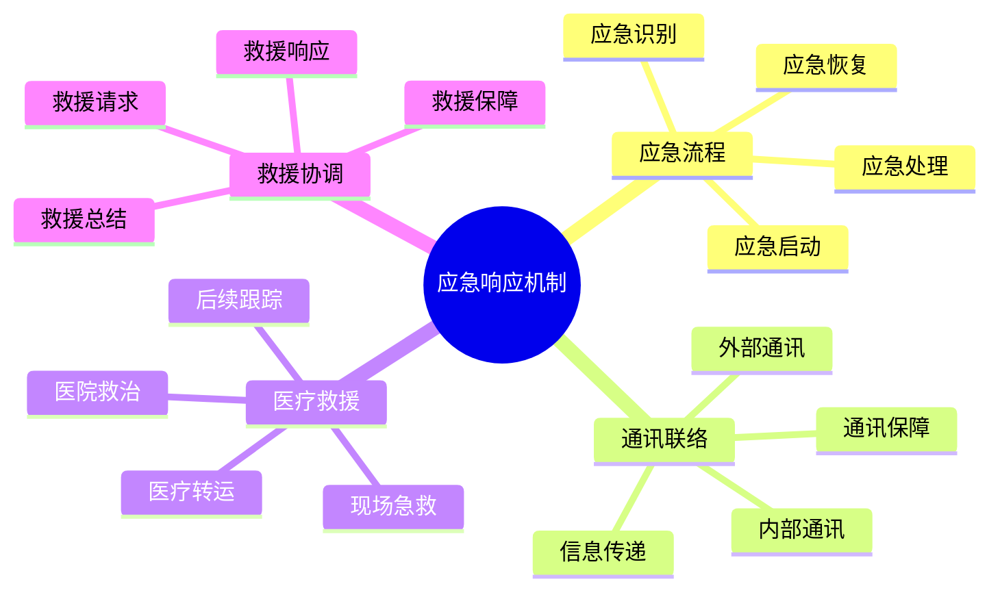

# 应急响应机制

## 🚨 应急响应流程

### 1. 应急识别
- **事件识别**：快速识别应急事件
- **严重程度**：评估事件严重程度
- **影响范围**：评估事件影响范围
- **紧急程度**：判断事件紧急程度

### 2. 应急启动
- **响应级别**：确定应急响应级别
- **人员召集**：召集应急响应人员
- **资源调配**：调配应急资源
- **信息发布**：发布应急信息

### 3. 应急处理
- **现场处置**：进行现场应急处置
- **人员救援**：实施人员救援
- **风险控制**：控制风险扩散
- **资源保障**：保障应急资源

### 4. 应急恢复
- **事件结束**：确认事件结束
- **恢复重建**：进行恢复重建
- **经验总结**：总结应急经验
- **改进完善**：改进应急机制

## 📞 通讯联络机制

### 1. 内部通讯
- **团队通讯**：团队内部通讯联络
- **对讲机**：使用对讲机通讯
- **信号联络**：使用信号联络
- **人员定位**：确定人员位置

### 2. 外部通讯
- **救援通讯**：与救援机构通讯
- **卫星电话**：使用卫星电话
- **手机通讯**：使用手机通讯
- **紧急信号**：发送紧急信号

### 3. 信息传递
- **信息收集**：收集应急信息
- **信息整理**：整理应急信息
- **信息传递**：传递应急信息
- **信息更新**：更新应急信息

### 4. 通讯保障
- **设备保障**：保障通讯设备
- **电力保障**：保障通讯电力
- **信号保障**：保障通讯信号
- **备用方案**：准备备用通讯方案

## 🏥 医疗救援机制

### 1. 现场急救
- **伤情评估**：评估伤员伤情
- **急救处理**：进行现场急救
- **生命支持**：提供生命支持
- **稳定伤情**：稳定伤员伤情

### 2. 医疗转运
- **转运准备**：准备医疗转运
- **转运方式**：选择转运方式
- **转运路线**：规划转运路线
- **转运保障**：保障转运安全

### 3. 医院救治
- **医院联系**：联系救治医院
- **医疗信息**：提供医疗信息
- **救治协调**：协调救治工作
- **家属通知**：通知伤员家属

### 4. 后续跟踪
- **治疗跟踪**：跟踪治疗情况
- **康复指导**：提供康复指导
- **心理支持**：提供心理支持
- **保险理赔**：协助保险理赔

## 🚁 救援协调机制

### 1. 救援请求
- **救援申请**：申请救援服务
- **救援信息**：提供救援信息
- **救援需求**：明确救援需求
- **救援协调**：协调救援工作

### 2. 救援响应
- **救援评估**：评估救援需求
- **救援计划**：制定救援计划
- **救援资源**：调配救援资源
- **救援执行**：执行救援任务

### 3. 救援保障
- **安全保障**：保障救援安全
- **后勤保障**：提供后勤保障
- **通讯保障**：保障通讯联络
- **医疗保障**：提供医疗保障

### 4. 救援总结
- **救援评估**：评估救援效果
- **经验总结**：总结救援经验
- **问题分析**：分析救援问题
- **改进建议**：提出改进建议

## 📊 应急响应对比

| 应急类型 | 响应时间 | 处理难度 | 资源需求 | 成功概率 | 优先级 |
|----------|----------|----------|----------|----------|--------|
| **人员受伤** | 即时 | 中 | 中 | 高 | 极高 |
| **装备故障** | 短 | 低 | 低 | 高 | 高 |
| **天气突变** | 短 | 中 | 中 | 中 | 高 |
| **迷路走失** | 中 | 高 | 高 | 中 | 极高 |

## 🎯 应急响应体系

## 🎓 费曼学习法应用

### 第一步：选择概念
选择"应急响应机制"作为学习概念

### 第二步：教授他人
用简单语言解释：
> "应急响应是处理紧急情况的机制：要快速识别应急事件，启动应急响应，进行应急处理，最后恢复重建。需要通讯联络、医疗救援和救援协调的配合。"

### 第三步：回顾简化
- **应急流程**：识别、启动、处理、恢复
- **通讯联络**：内部、外部、信息、保障
- **医疗救援**：急救、转运、救治、跟踪
- **救援协调**：请求、响应、保障、总结

### 第四步：组织优化
建立应急与技能的关系：
- 应急流程 → [[03-应用层-实践技能/04-应急处理|应急处理]]
- 通讯联络 → [[03-应用层-实践技能/03-野外生存/06-信号与求救|信号求救]]
- 医疗救援 → [[03-应用层-实践技能/04-应急处理/01-常见伤病处理|伤病处理]]
- 救援协调 → [[04-创新层-进阶发展/03-领导力培养/03-危机处理领导|危机处理]]

## 🏃‍♂️ 刻意练习要点

### 应急响应练习
1. **流程演练**：演练应急响应流程
2. **通讯练习**：练习应急通讯技能
3. **急救练习**：练习现场急救技能
4. **协调练习**：练习救援协调技能

### 实践验证
- **应急演练**：进行应急演练
- **技能测试**：测试应急技能
- **效果评估**：评估应急效果
- **持续改进**：持续改进应急能力

## 🔗 应急与技能的关系

### 应急流程技能
- **识别技能**：[[03-应用层-实践技能/04-应急处理|应急处理]]
- **启动技能**：[[04-创新层-进阶发展/03-领导力培养/03-危机处理领导|危机处理]]
- **处理技能**：[[03-应用层-实践技能/04-应急处理|应急处理]]
- **恢复技能**：[[04-创新层-进阶发展/03-领导力培养|领导力培养]]

### 通讯联络技能
- **通讯技能**：[[03-应用层-实践技能/03-野外生存/06-信号与求救|信号求救]]
- **信息技能**：[[04-创新层-进阶发展/03-领导力培养/04-沟通协调技巧|沟通协调]]
- **设备技能**：[[04-创新层-进阶发展/02-专业配置/03-技术装备集成|技术集成]]
- **协调技能**：[[04-创新层-进阶发展/03-领导力培养/04-沟通协调技巧|沟通协调]]

### 医疗救援技能
- **急救技能**：[[03-应用层-实践技能/04-应急处理/01-常见伤病处理|伤病处理]]
- **医疗技能**：[[03-应用层-实践技能/04-应急处理/01-常见伤病处理|伤病处理]]
- **转运技能**：[[03-应用层-实践技能/04-应急处理|应急处理]]
- **跟踪技能**：[[04-创新层-进阶发展/03-领导力培养/02-时间管理技能|时间管理]]

### 救援协调技能
- **协调技能**：[[04-创新层-进阶发展/03-领导力培养/04-沟通协调技巧|沟通协调]]
- **管理技能**：[[04-创新层-进阶发展/03-领导力培养/01-团队管理技能|团队管理]]
- **决策技能**：[[04-创新层-进阶发展/03-领导力培养/06-责任与担当|责任担当]]
- **总结技能**：[[04-创新层-进阶发展/03-领导力培养/05-培训指导方法|培训指导]]

## 📋 应急响应检查清单

### 应急流程
- [ ] 快速识别应急事件
- [ ] 启动应急响应机制
- [ ] 进行应急处理
- [ ] 完成应急恢复

### 通讯联络
- [ ] 建立内部通讯
- [ ] 建立外部通讯
- [ ] 传递应急信息
- [ ] 保障通讯设备

### 医疗救援
- [ ] 进行现场急救
- [ ] 准备医疗转运
- [ ] 联系医院救治
- [ ] 跟踪治疗情况

### 救援协调
- [ ] 申请救援服务
- [ ] 协调救援工作
- [ ] 保障救援资源
- [ ] 总结救援经验

## 🎯 应急响应策略

### 快速响应策略
1. **快速识别**：快速识别应急事件
2. **快速启动**：快速启动应急响应
3. **快速处理**：快速进行应急处理
4. **快速恢复**：快速完成应急恢复

### 系统化响应
- **流程规范**：规范应急响应流程
- **资源保障**：保障应急资源
- **技能培训**：培训应急技能
- **持续改进**：持续改进应急能力

## 🔗 相关链接
- [[01-风险评估体系|风险评估体系]]
- [[02-安全原则与标准|安全原则与标准]]
- [[04-安全培训体系|安全培训体系]]
- [[03-应用层-实践技能/04-应急处理|应急处理]]