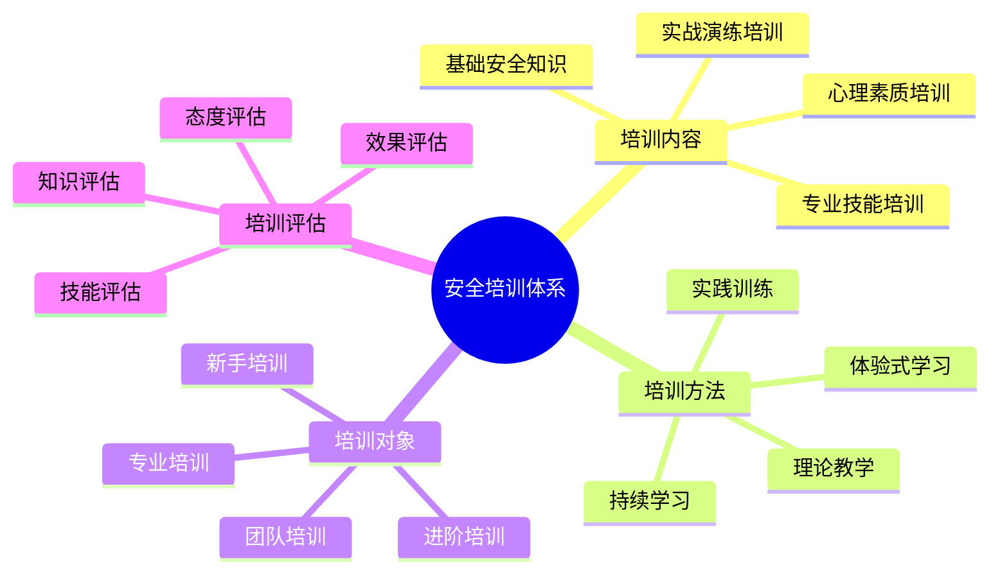

# 安全培训体系

## 📚 培训内容体系

### 1. 基础安全知识
- **安全理念**：安全第一、预防为主、全员参与
- **安全法规**：相关安全法规、标准、制度
- **安全常识**：基本安全常识、安全标识
- **安全意识**：安全意识培养、安全文化

### 2. 专业技能培训
- **装备使用**：安全使用装备、维护保养
- **环境识别**：识别环境风险、应对措施
- **应急处理**：应急处理技能、救援技能
- **通讯联络**：通讯设备使用、信号联络

### 3. 心理素质培训
- **心理准备**：心理准备、压力管理
- **情绪控制**：情绪控制、冷静应对
- **团队协作**：团队协作、相互支持
- **领导能力**：领导能力、决策能力

### 4. 实战演练培训
- **模拟演练**：模拟应急情况演练
- **实地训练**：实地安全技能训练
- **案例分析**：案例分析、经验学习
- **技能考核**：技能考核、能力评估

## 🎯 培训方法体系

### 1. 理论教学
- **课堂讲授**：系统讲授安全知识
- **案例分析**：分析安全事故案例
- **讨论交流**：讨论交流安全经验
- **知识测试**：测试安全知识掌握

### 2. 实践训练
- **技能训练**：实际操作技能训练
- **模拟演练**：模拟应急情况演练
- **实地训练**：实地安全技能训练
- **技能考核**：技能考核、能力评估

### 3. 体验式学习
- **角色扮演**：角色扮演应急情况
- **情景模拟**：情景模拟应急处理
- **团队游戏**：团队协作游戏
- **反思总结**：反思总结学习经验

### 4. 持续学习
- **定期培训**：定期进行安全培训
- **更新知识**：更新安全知识技能
- **经验分享**：分享安全经验
- **持续改进**：持续改进安全能力

## 👥 培训对象体系

### 1. 新手培训
- **基础培训**：基础安全知识培训
- **技能培训**：基本安全技能培训
- **意识培训**：安全意识培养
- **实践培训**：实践安全技能培训

### 2. 进阶培训
- **技能提升**：提升安全技能水平
- **知识深化**：深化安全知识理解
- **能力拓展**：拓展安全能力
- **经验积累**：积累安全经验

### 3. 专业培训
- **专业技能**：专业安全技能培训
- **管理能力**：安全管理能力培训
- **领导能力**：安全领导能力培训
- **培训能力**：安全培训能力培训

### 4. 团队培训
- **团队协作**：团队协作安全培训
- **沟通协调**：沟通协调安全培训
- **集体决策**：集体决策安全培训
- **团队文化**：团队安全文化培训

## 📊 培训评估体系

### 1. 知识评估
- **理论测试**：测试安全理论知识
- **知识应用**：测试知识应用能力
- **案例分析**：分析安全案例
- **知识更新**：评估知识更新情况

### 2. 技能评估
- **技能测试**：测试安全技能水平
- **实操考核**：考核实际操作能力
- **应急演练**：演练应急处理能力
- **技能提升**：评估技能提升情况

### 3. 态度评估
- **安全意识**：评估安全意识水平
- **安全态度**：评估安全态度
- **行为表现**：评估安全行为表现
- **文化认同**：评估安全文化认同

### 4. 效果评估
- **培训效果**：评估培训效果
- **能力提升**：评估能力提升情况
- **行为改变**：评估行为改变情况
- **持续改进**：评估持续改进情况

## 📊 培训体系对比

| 培训类型 | 培训内容 | 培训方法 | 培训对象 | 培训周期 | 效果评估 |
|----------|----------|----------|----------|----------|----------|
| **基础培训** | 基础知识 | 理论+实践 | 新手 | 短期 | 知识测试 |
| **技能培训** | 专业技能 | 实践为主 | 进阶者 | 中期 | 技能考核 |
| **专业培训** | 专业能力 | 综合培训 | 专业人员 | 长期 | 综合评估 |
| **团队培训** | 团队协作 | 体验式 | 团队 | 持续 | 团队评估 |

## 🎯 安全培训体系

## 🎓 费曼学习法应用

### 第一步：选择概念
选择"安全培训体系"作为学习概念

### 第二步：教授他人
用简单语言解释：
> "安全培训是系统性的安全教育：包括基础安全知识、专业技能、心理素质和实战演练。通过理论教学、实践训练、体验式学习和持续学习，提升不同层次人员的安全能力。"

### 第三步：回顾简化
- **培训内容**：基础知识、专业技能、心理素质、实战演练
- **培训方法**：理论教学、实践训练、体验式学习、持续学习
- **培训对象**：新手、进阶、专业、团队培训
- **培训评估**：知识、技能、态度、效果评估

### 第四步：组织优化
建立培训与技能的关系：
- 培训内容 → [[03-应用层-实践技能/04-应急处理|应急处理]]
- 培训方法 → [[04-创新层-进阶发展/03-领导力培养/05-培训指导方法|培训指导]]
- 培训对象 → [[04-创新层-进阶发展/03-领导力培养|领导力培养]]
- 培训评估 → [[04-创新层-进阶发展/02-专业配置/05-升级优化策略|升级优化]]

## 🏃‍♂️ 刻意练习要点

### 安全培训练习
1. **内容设计**：设计安全培训内容
2. **方法选择**：选择合适培训方法
3. **对象分析**：分析培训对象需求
4. **效果评估**：评估培训效果

### 实践验证
- **培训实施**：实施安全培训
- **效果测试**：测试培训效果
- **能力评估**：评估能力提升
- **持续改进**：持续改进培训

## 🔗 培训与技能的关系

### 培训内容技能
- **知识传授**：[[04-创新层-进阶发展/03-领导力培养/05-培训指导方法|培训指导]]
- **技能训练**：[[03-应用层-实践技能/04-应急处理|应急处理]]
- **心理训练**：[[02-理解层-原理机制/01-户外生存原理/04-心理适应机制|心理适应]]
- **实战训练**：[[03-应用层-实践技能/04-应急处理|应急处理]]

### 培训方法技能
- **教学技能**：[[04-创新层-进阶发展/03-领导力培养/05-培训指导方法|培训指导]]
- **训练技能**：[[03-应用层-实践技能/04-应急处理|应急处理]]
- **体验技能**：[[04-创新层-进阶发展/03-领导力培养|领导力培养]]
- **学习技能**：[[04-创新层-进阶发展/03-领导力培养/05-培训指导方法|培训指导]]

### 培训对象技能
- **新手指导**：[[04-创新层-进阶发展/04-文化传承/02-新手指导方法|新手指导]]
- **进阶培训**：[[04-创新层-进阶发展/03-领导力培养/05-培训指导方法|培训指导]]
- **专业培训**：[[04-创新层-进阶发展/02-专业配置/01-专业装备推荐|专业装备]]
- **团队培训**：[[04-创新层-进阶发展/03-领导力培养/01-团队管理技能|团队管理]]

### 培训评估技能
- **评估技能**：[[04-创新层-进阶发展/02-专业配置/05-升级优化策略|升级优化]]
- **测试技能**：[[04-创新层-进阶发展/03-领导力培养/05-培训指导方法|培训指导]]
- **分析技能**：[[04-创新层-进阶发展/01-高级技巧/07-跨学科知识整合|跨学科知识]]
- **改进技能**：[[04-创新层-进阶发展/02-专业配置/05-升级优化策略|升级优化]]

## 📋 安全培训检查清单

### 培训内容
- [ ] 设计基础安全知识
- [ ] 安排专业技能培训
- [ ] 组织心理素质培训
- [ ] 进行实战演练培训

### 培训方法
- [ ] 采用理论教学方法
- [ ] 进行实践训练
- [ ] 使用体验式学习
- [ ] 建立持续学习机制

### 培训对象
- [ ] 针对新手培训
- [ ] 进行进阶培训
- [ ] 组织专业培训
- [ ] 开展团队培训

### 培训评估
- [ ] 进行知识评估
- [ ] 进行技能评估
- [ ] 进行态度评估
- [ ] 进行效果评估

## 🎯 安全培训策略

### 系统化培训
1. **体系建立**：建立安全培训体系
2. **内容完善**：完善培训内容
3. **方法优化**：优化培训方法
4. **评估改进**：评估改进培训

### 个性化培训
- **需求分析**：分析个人培训需求
- **内容定制**：定制个人培训内容
- **方法选择**：选择合适培训方法
- **效果跟踪**：跟踪个人培训效果

## 🔗 相关链接
- [[01-风险评估体系|风险评估体系]]
- [[02-安全原则与标准|安全原则与标准]]
- [[03-应急响应机制|应急响应机制]]
- [[04-创新层-进阶发展/03-领导力培养/05-培训指导方法|培训指导方法]]
