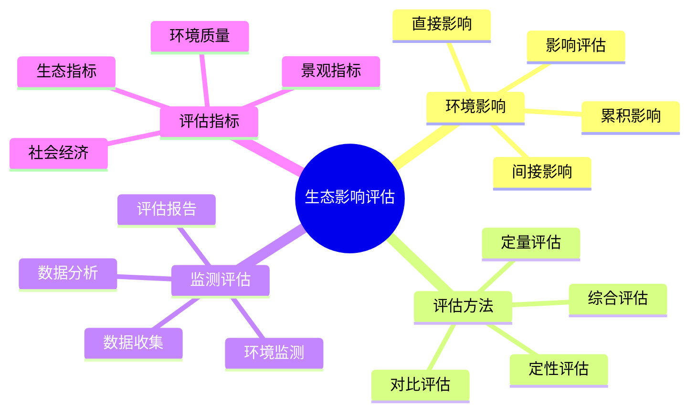

# 生态影响评估

## 🌍 环境影响识别

### 1. 直接环境影响
- **植被影响**：踩踏植被、破坏植物、改变植被结构
- **土壤影响**：土壤压实、土壤侵蚀、土壤污染
- **水源影响**：水源污染、水流改变、水质下降
- **野生动物影响**：干扰动物、改变栖息地、影响动物行为

### 2. 间接环境影响
- **生态链影响**：影响食物链、改变生态平衡
- **气候变化**：局部气候变化、微气候改变
- **生物多样性**：影响生物多样性、物种分布
- **景观影响**：改变自然景观、影响视觉环境

### 3. 累积环境影响
- **长期影响**：长期累积的环境影响
- **规模影响**：大规模活动的影响
- **频率影响**：频繁活动的影响
- **叠加影响**：多种影响的叠加效应

### 4. 环境影响评估
- **影响程度**：评估环境影响程度
- **影响范围**：评估环境影响范围
- **影响时间**：评估环境影响时间
- **影响可逆性**：评估环境影响可逆性

## 📊 影响评估方法

### 1. 定性评估
- **影响识别**：识别环境影响类型
- **影响描述**：描述环境影响特征
- **影响分级**：对环境影响进行分级
- **影响排序**：对环境影响进行排序

### 2. 定量评估
- **数据收集**：收集环境影响数据
- **指标计算**：计算环境影响指标
- **模型分析**：使用模型分析影响
- **数值评估**：进行数值化评估

### 3. 对比评估
- **基准对比**：与基准环境对比
- **历史对比**：与历史环境对比
- **标准对比**：与环境标准对比
- **同类对比**：与同类活动对比

### 4. 综合评估
- **多维度评估**：从多个维度评估
- **权重分析**：分析不同影响权重
- **情景分析**：分析不同情景影响
- **风险评估**：评估环境影响风险

## 🔍 监测与评估

### 1. 环境监测
- **监测指标**：确定环境监测指标
- **监测方法**：选择环境监测方法
- **监测频率**：确定监测频率
- **监测设备**：准备监测设备

### 2. 数据收集
- **基线数据**：收集基线环境数据
- **活动数据**：收集活动期间数据
- **影响数据**：收集环境影响数据
- **恢复数据**：收集环境恢复数据

### 3. 数据分析
- **趋势分析**：分析环境变化趋势
- **相关性分析**：分析影响因素相关性
- **影响分析**：分析环境影响
- **预测分析**：预测环境影响

### 4. 评估报告
- **评估结果**：形成评估结果
- **影响分析**：分析环境影响
- **建议措施**：提出建议措施
- **跟踪监测**：制定跟踪监测计划

## 📈 影响评估指标

### 1. 生态指标
- **植被覆盖率**：植被覆盖程度
- **物种多样性**：物种多样性指数
- **生态完整性**：生态系统完整性
- **生态服务功能**：生态服务功能

### 2. 环境质量指标
- **空气质量**：空气质量指标
- **水质指标**：水质指标
- **土壤质量**：土壤质量指标
- **噪声水平**：噪声水平指标

### 3. 景观指标
- **景观完整性**：景观完整性
- **视觉影响**：视觉影响程度
- **美学价值**：美学价值
- **文化价值**：文化价值

### 4. 社会经济指标
- **经济影响**：经济活动影响
- **社会影响**：社会活动影响
- **文化影响**：文化活动影响
- **教育影响**：教育活动影响

## 📊 生态影响对比

| 活动类型 | 植被影响 | 土壤影响 | 水源影响 | 动物影响 | 综合影响 |
|----------|----------|----------|----------|----------|----------|
| **轻度露营** | 低 | 低 | 低 | 低 | 低 |
| **中度露营** | 中 | 中 | 中 | 中 | 中 |
| **重度露营** | 高 | 高 | 高 | 高 | 高 |
| **商业开发** | 极高 | 极高 | 极高 | 极高 | 极高 |

## 🎯 生态影响评估体系

## 🎓 费曼学习法应用

### 第一步：选择概念
选择"生态影响评估"作为学习概念

### 第二步：教授他人
用简单语言解释：
> "生态影响评估是评估露营活动对环境影响的过程：要识别直接和间接影响，使用定性和定量方法评估，通过监测收集数据，用生态、环境、景观等指标来衡量影响程度。"

### 第三步：回顾简化
- **环境影响**：直接、间接、累积影响
- **评估方法**：定性、定量、对比、综合评估
- **监测评估**：监测、收集、分析、报告
- **评估指标**：生态、环境、景观、社会经济指标

### 第四步：组织优化
建立评估与技能的关系：
- 环境影响 → [[03-应用层-实践技能/02-营地建设/01-营地选址原则|营地选址]]
- 评估方法 → [[04-创新层-进阶发展/01-高级技巧/07-跨学科知识整合|跨学科知识]]
- 监测评估 → [[04-创新层-进阶发展/02-专业配置/03-技术装备集成|技术集成]]
- 评估指标 → [[04-创新层-进阶发展/02-专业配置/01-专业装备推荐|专业装备]]

## 🏃‍♂️ 刻意练习要点

### 生态评估练习
1. **影响识别**：识别环境影响类型
2. **评估方法**：学习评估方法
3. **数据收集**：收集环境数据
4. **分析评估**：分析评估结果

### 实践验证
- **实地评估**：实地进行生态评估
- **数据验证**：验证评估数据
- **方法测试**：测试评估方法
- **结果验证**：验证评估结果

## 🔗 评估与技能的关系

### 环境影响技能
- **环境观察**：[[03-应用层-实践技能/03-野外生存|野外生存]]
- **影响识别**：[[02-理解层-原理机制/04-环境保护理念/03-无痕山林原则|无痕山林]]
- **影响分析**：[[04-创新层-进阶发展/01-高级技巧/07-跨学科知识整合|跨学科知识]]
- **影响控制**：[[02-理解层-原理机制/04-环境保护理念/02-可持续露营|可持续露营]]

### 评估方法技能
- **定性分析**：[[04-创新层-进阶发展/01-高级技巧/07-跨学科知识整合|跨学科知识]]
- **定量分析**：[[04-创新层-进阶发展/02-专业配置/03-技术装备集成|技术集成]]
- **对比分析**：[[04-创新层-进阶发展/01-高级技巧/07-跨学科知识整合|跨学科知识]]
- **综合分析**：[[04-创新层-进阶发展/01-高级技巧/07-跨学科知识整合|跨学科知识]]

### 监测评估技能
- **监测技能**：[[04-创新层-进阶发展/02-专业配置/03-技术装备集成|技术集成]]
- **数据技能**：[[04-创新层-进阶发展/02-专业配置/03-技术装备集成|技术集成]]
- **分析技能**：[[04-创新层-进阶发展/01-高级技巧/07-跨学科知识整合|跨学科知识]]
- **报告技能**：[[04-创新层-进阶发展/03-领导力培养/04-沟通协调技巧|沟通协调]]

### 指标评估技能
- **生态技能**：[[02-理解层-原理机制/04-环境保护理念|环境保护]]
- **环境技能**：[[02-理解层-原理机制/04-环境保护理念|环境保护]]
- **景观技能**：[[03-应用层-实践技能/02-营地建设/01-营地选址原则|营地选址]]
- **社会技能**：[[04-创新层-进阶发展/04-文化传承|文化传承]]

## 📋 生态评估检查清单

### 环境影响
- [ ] 识别直接环境影响
- [ ] 识别间接环境影响
- [ ] 评估累积环境影响
- [ ] 评估环境影响程度

### 评估方法
- [ ] 进行定性评估
- [ ] 进行定量评估
- [ ] 进行对比评估
- [ ] 进行综合评估

### 监测评估
- [ ] 建立环境监测
- [ ] 收集环境数据
- [ ] 分析环境数据
- [ ] 形成评估报告

### 评估指标
- [ ] 使用生态指标
- [ ] 使用环境质量指标
- [ ] 使用景观指标
- [ ] 使用社会经济指标

## 🎯 生态评估策略

### 预防性评估
1. **事前评估**：活动前进行影响评估
2. **预防措施**：制定预防措施
3. **监测计划**：制定监测计划
4. **应急预案**：制定应急预案

### 系统性评估
- **全面评估**：全面评估环境影响
- **持续监测**：持续监测环境影响
- **动态调整**：动态调整评估方法
- **持续改进**：持续改进评估体系

## 🔗 相关链接
- [[02-可持续露营|可持续露营]]
- [[03-无痕山林原则|无痕山林原则]]
- [[04-环保教育推广|环保教育推广]]
- [[03-应用层-实践技能/02-营地建设/01-营地选址原则|营地选址]]