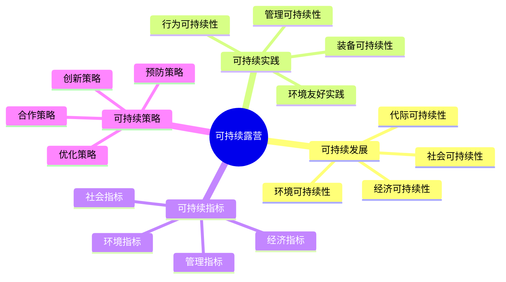

# 可持续露营

## 🌱 可持续发展理念

### 1. 环境可持续性
- **生态保护**：保护生态环境、维护生态平衡
- **资源节约**：节约自然资源、减少资源消耗
- **污染控制**：控制环境污染、减少污染排放
- **生物多样性**：保护生物多样性、维护物种平衡

### 2. 经济可持续性
- **成本效益**：平衡成本与效益、提高经济效益
- **资源利用**：高效利用资源、减少浪费
- **技术创新**：推动技术创新、提高效率
- **产业发展**：促进产业发展、创造就业

### 3. 社会可持续性
- **社会公平**：促进社会公平、减少不平等
- **文化传承**：传承文化传统、保护文化遗产
- **教育普及**：普及环保教育、提高环保意识
- **社区参与**：促进社区参与、增强社会凝聚力

### 4. 代际可持续性
- **代际公平**：保证代际公平、不损害后代利益
- **长远规划**：制定长远规划、考虑长期影响
- **责任传承**：传承环保责任、培养环保意识
- **未来保障**：保障未来环境、维护未来利益

## 🔄 可持续露营实践

### 1. 环境友好实践
- **无痕露营**：[[03-无痕山林原则|无痕山林原则]]、最小化环境影响
- **生态保护**：保护生态环境、维护生态平衡
- **资源节约**：节约水资源、能源、食物资源
- **废物管理**：妥善处理废物、减少环境污染

### 2. 装备可持续性
- **环保装备**：选择环保装备、减少环境影响
- **耐用装备**：选择耐用装备、延长使用寿命
- **可回收装备**：选择可回收装备、减少废物
- **节能装备**：选择节能装备、减少能源消耗

### 3. 行为可持续性
- **环保行为**：践行环保行为、减少环境影响
- **节约行为**：践行节约行为、减少资源消耗
- **保护行为**：践行保护行为、保护生态环境
- **教育行为**：践行教育行为、传播环保理念

### 4. 管理可持续性
- **可持续管理**：实施可持续管理、确保长期发展
- **监测评估**：监测环境影响、评估可持续性
- **持续改进**：持续改进实践、提高可持续性
- **经验分享**：分享可持续经验、推广最佳实践

## 📊 可持续性指标

### 1. 环境指标
- **碳足迹**：碳排放量、碳足迹大小
- **水足迹**：水资源消耗、水足迹大小
- **生态足迹**：生态资源消耗、生态足迹大小
- **生物多样性**：生物多样性指数、物种丰富度

### 2. 经济指标
- **成本效益**：成本效益比、经济效益
- **资源效率**：资源利用效率、资源生产率
- **创新投入**：创新投入比例、技术创新水平
- **就业创造**：就业创造数量、就业质量

### 3. 社会指标
- **社会影响**：社会影响程度、社会效益
- **文化保护**：文化保护程度、文化传承
- **教育效果**：教育效果、环保意识提升
- **社区参与**：社区参与度、社会凝聚力

### 4. 管理指标
- **管理效率**：管理效率、管理水平
- **监测覆盖**：监测覆盖率、评估准确性
- **改进效果**：改进效果、持续改进能力
- **经验推广**：经验推广范围、最佳实践应用

## 🎯 可持续性策略

### 1. 预防策略
- **预防为主**：预防环境影响、减少负面影响
- **早期干预**：早期干预、及时处理问题
- **风险控制**：控制环境风险、降低风险
- **应急预案**：制定应急预案、应对突发情况

### 2. 优化策略
- **过程优化**：优化露营过程、提高效率
- **资源优化**：优化资源配置、减少浪费
- **技术优化**：优化技术应用、提高效果
- **管理优化**：优化管理方式、提高水平

### 3. 创新策略
- **技术创新**：推动技术创新、提高效率
- **模式创新**：创新露营模式、减少影响
- **管理创新**：创新管理方式、提高效果
- **文化创新**：创新环保文化、传播理念

### 4. 合作策略
- **多方合作**：多方合作、共同推进
- **资源共享**：资源共享、提高效率
- **经验交流**：经验交流、相互学习
- **协同发展**：协同发展、共同进步

## 📊 可持续性对比

| 露营类型 | 环境友好度 | 资源效率 | 社会效益 | 经济可持续性 | 综合可持续性 |
|----------|------------|----------|----------|--------------|--------------|
| **传统露营** | 低 | 低 | 中 | 中 | 低 |
| **环保露营** | 高 | 高 | 高 | 高 | 高 |
| **生态露营** | 极高 | 极高 | 极高 | 极高 | 极高 |
| **商业露营** | 中 | 中 | 中 | 高 | 中 |

## 🎯 可持续露营体系

## 🎓 费曼学习法应用

### 第一步：选择概念
选择"可持续露营"作为学习概念

### 第二步：教授他人
用简单语言解释：
> "可持续露营是在保护环境的前提下进行露营：要平衡环境、经济、社会和代际的可持续性，通过环保实践、可持续装备、环保行为和可持续管理来实现。"

### 第三步：回顾简化
- **可持续发展**：环境、经济、社会、代际可持续性
- **可持续实践**：环境友好、装备、行为、管理可持续性
- **可持续指标**：环境、经济、社会、管理指标
- **可持续策略**：预防、优化、创新、合作策略

### 第四步：组织优化
建立可持续与技能的关系：
- 可持续发展 → [[02-理解层-原理机制/04-环境保护理念|环境保护理念]]
- 可持续实践 → [[03-应用层-实践技能/02-营地建设|营地建设]]
- 可持续指标 → [[04-创新层-进阶发展/02-专业配置/01-专业装备推荐|专业装备]]
- 可持续策略 → [[04-创新层-进阶发展/02-专业配置/05-升级优化策略|升级优化]]

## 🏃‍♂️ 刻意练习要点

### 可持续实践练习
1. **理念学习**：学习可持续发展理念
2. **实践应用**：应用可持续实践方法
3. **指标监测**：监测可持续性指标
4. **策略实施**：实施可持续性策略

### 实践验证
- **实践测试**：测试可持续实践效果
- **指标验证**：验证可持续性指标
- **策略验证**：验证可持续性策略
- **效果评估**：评估可持续性效果

## 🔗 可持续与技能的关系

### 可持续发展技能
- **环境技能**：[[02-理解层-原理机制/04-环境保护理念|环境保护]]
- **经济技能**：[[04-创新层-进阶发展/02-专业配置/06-成本效益分析|成本分析]]
- **社会技能**：[[04-创新层-进阶发展/04-文化传承|文化传承]]
- **管理技能**：[[04-创新层-进阶发展/03-领导力培养|领导力培养]]

### 可持续实践技能
- **环保技能**：[[02-理解层-原理机制/04-环境保护理念/03-无痕山林原则|无痕山林]]
- **装备技能**：[[03-应用层-实践技能/01-装备准备|装备准备]]
- **行为技能**：[[03-应用层-实践技能/02-营地建设|营地建设]]
- **管理技能**：[[04-创新层-进阶发展/03-领导力培养/01-团队管理技能|团队管理]]

### 可持续指标技能
- **监测技能**：[[04-创新层-进阶发展/02-专业配置/03-技术装备集成|技术集成]]
- **分析技能**：[[04-创新层-进阶发展/01-高级技巧/07-跨学科知识整合|跨学科知识]]
- **评估技能**：[[04-创新层-进阶发展/02-专业配置/05-升级优化策略|升级优化]]
- **报告技能**：[[04-创新层-进阶发展/03-领导力培养/04-沟通协调技巧|沟通协调]]

### 可持续策略技能
- **预防技能**：[[03-应用层-实践技能/04-应急处理|应急处理]]
- **优化技能**：[[04-创新层-进阶发展/02-专业配置/05-升级优化策略|升级优化]]
- **创新技能**：[[04-创新层-进阶发展/01-高级技巧|高级技巧]]
- **合作技能**：[[04-创新层-进阶发展/03-领导力培养/04-沟通协调技巧|沟通协调]]

## 📋 可持续露营检查清单

### 可持续发展
- [ ] 考虑环境可持续性
- [ ] 考虑经济可持续性
- [ ] 考虑社会可持续性
- [ ] 考虑代际可持续性

### 可持续实践
- [ ] 践行环境友好实践
- [ ] 使用可持续装备
- [ ] 践行环保行为
- [ ] 实施可持续管理

### 可持续指标
- [ ] 监测环境指标
- [ ] 监测经济指标
- [ ] 监测社会指标
- [ ] 监测管理指标

### 可持续策略
- [ ] 实施预防策略
- [ ] 实施优化策略
- [ ] 实施创新策略
- [ ] 实施合作策略

## 🎯 可持续露营策略

### 系统性策略
1. **理念建立**：建立可持续发展理念
2. **实践推广**：推广可持续实践
3. **指标监测**：建立指标监测体系
4. **策略实施**：实施可持续性策略

### 渐进式策略
- **逐步推进**：逐步推进可持续露营
- **持续改进**：持续改进可持续性
- **经验积累**：积累可持续经验
- **效果提升**：提升可持续效果

## 🔗 相关链接
- [[01-生态影响评估|生态影响评估]]
- [[03-无痕山林原则|无痕山林原则]]
- [[04-环保教育推广|环保教育推广]]
- [[03-应用层-实践技能/02-营地建设|营地建设]]