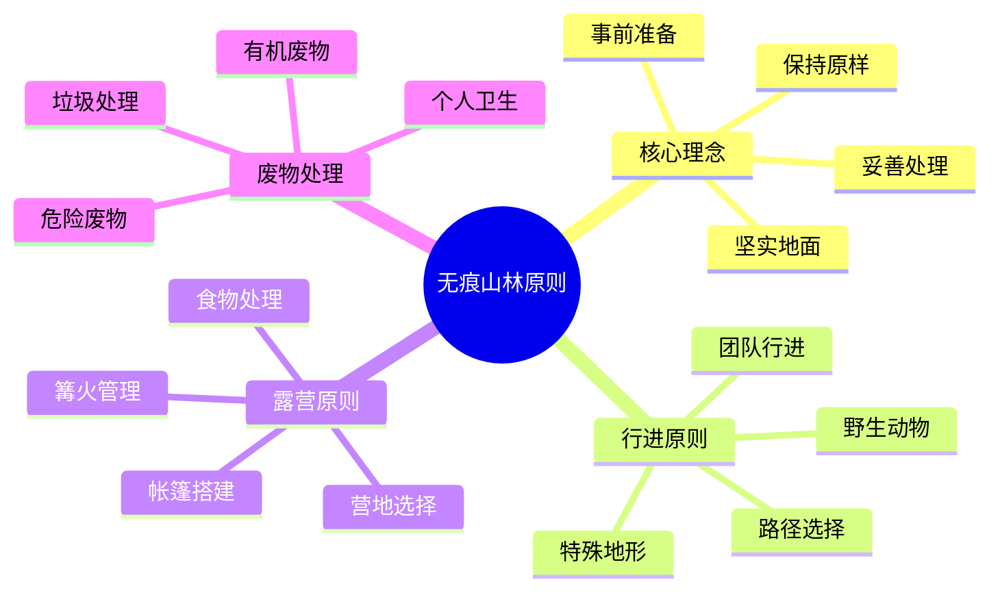

# 无痕山林原则

## 🌿 无痕山林核心理念

### 1. 事前充分准备
- **计划准备**：制定详细计划、了解目的地信息
- **技能准备**：掌握必要技能、提高应对能力
- **装备准备**：准备合适装备、减少环境影响
- **知识准备**：了解环保知识、掌握无痕原则

### 2. 在坚实的地面上行进和露营
- **选择路径**：选择已有路径、避免开辟新路
- **分散行进**：分散行进、减少对地面的压力
- **避免敏感区域**：避免脆弱区域、保护生态环境
- **使用指定区域**：使用指定露营区域、减少影响

### 3. 妥善处理废物
- **垃圾带走**：带走所有垃圾、不留任何痕迹
- **垃圾分类**：进行垃圾分类、便于处理
- **有机废物**：妥善处理有机废物、避免污染
- **危险废物**：特殊处理危险废物、确保安全

### 4. 保持原样
- **不破坏**：不破坏自然景观、不改变环境
- **不采集**：不采集植物、不伤害动物
- **不标记**：不留下标记、不破坏自然
- **不改变**：不改变地形、不破坏生态

## 🚶‍♂️ 行进无痕原则

### 1. 路径选择
- **已有路径**：优先选择已有路径、避免开辟新路
- **坚硬地面**：选择坚硬地面、避免脆弱地面
- **单列行进**：单列行进、减少对地面的压力
- **避免捷径**：避免走捷径、保护植被

### 2. 团队行进
- **团队协调**：协调团队行进、减少环境影响
- **分散压力**：分散团队压力、避免集中踩踏
- **保持距离**：保持适当距离、减少相互影响
- **轮流领队**：轮流担任领队、分散责任

### 3. 特殊地形
- **湿地保护**：保护湿地、避免破坏
- **岩石区域**：在岩石区域行进、减少植被影响
- **雪地行进**：在雪地行进、保护下层植被
- **沙漠行进**：在沙漠行进、保护脆弱生态

### 4. 野生动物
- **保持距离**：与野生动物保持距离、避免干扰
- **安静行进**：安静行进、减少对动物的干扰
- **观察学习**：观察学习、不干扰动物行为
- **保护栖息地**：保护动物栖息地、维护生态平衡

## 🏕️ 露营无痕原则

### 1. 营地选择
- **指定区域**：使用指定露营区域、避免随意选择
- **坚硬地面**：选择坚硬地面、避免脆弱地面
- **远离水源**：远离水源至少60米、保护水质
- **避免敏感区域**：避免生态敏感区域、保护环境

### 2. 帐篷搭建
- **最小化影响**：最小化对地面的影响
- **避免植被**：避免在植被上搭建、保护植物
- **合理布局**：合理布局帐篷、减少环境影响
- **及时拆除**：及时拆除帐篷、恢复原状

### 3. 篝火管理
- **使用指定区域**：使用指定篝火区域、避免随意生火
- **小型篝火**：使用小型篝火、减少木材消耗
- **完全熄灭**：完全熄灭篝火、确保安全
- **清理痕迹**：清理篝火痕迹、恢复原状

### 4. 食物处理
- **妥善储存**：妥善储存食物、避免吸引动物
- **清洁餐具**：清洁餐具、避免污染水源
- **处理残渣**：妥善处理食物残渣、避免污染
- **带走垃圾**：带走所有食物垃圾、不留痕迹

## 🚮 废物处理原则

### 1. 垃圾处理
- **全部带走**：带走所有垃圾、不留任何痕迹
- **垃圾分类**：进行垃圾分类、便于处理
- **压缩包装**：压缩包装垃圾、减少体积
- **安全储存**：安全储存垃圾、避免污染

### 2. 有机废物
- **食物残渣**：妥善处理食物残渣、避免污染
- **果皮果核**：带走果皮果核、避免吸引动物
- **厨余垃圾**：带走厨余垃圾、避免污染
- **自然分解**：让有机废物自然分解、不人为干预

### 3. 个人卫生
- **远离水源**：远离水源进行个人卫生、保护水质
- **使用肥皂**：使用环保肥皂、避免污染
- **处理废水**：妥善处理废水、避免污染
- **带走用品**：带走个人卫生用品、不留痕迹

### 4. 危险废物
- **特殊处理**：特殊处理危险废物、确保安全
- **专业回收**：专业回收危险废物、避免污染
- **安全储存**：安全储存危险废物、避免泄漏
- **及时处理**：及时处理危险废物、避免积累

## 📊 无痕原则对比

| 活动类型 | 环境影响 | 垃圾处理 | 生态保护 | 无痕程度 | 推荐指数 |
|----------|----------|----------|----------|----------|----------|
| **传统露营** | 高 | 差 | 差 | 低 | ⭐⭐ |
| **环保露营** | 中 | 好 | 好 | 中 | ⭐⭐⭐⭐ |
| **无痕露营** | 低 | 极好 | 极好 | 高 | ⭐⭐⭐⭐⭐ |
| **生态露营** | 极低 | 极好 | 极好 | 极高 | ⭐⭐⭐⭐⭐ |

## 🎯 无痕山林体系

## 🎓 费曼学习法应用

### 第一步：选择概念
选择"无痕山林原则"作为学习概念

### 第二步：教授他人
用简单语言解释：
> "无痕山林是露营的最高境界：事前充分准备，在坚实地面行进露营，妥善处理所有废物，保持自然环境原样。目标是让后来者感觉不到有人来过。"

### 第三步：回顾简化
- **核心理念**：事前准备、坚实地面、妥善处理、保持原样
- **行进原则**：路径选择、团队行进、特殊地形、野生动物
- **露营原则**：营地选择、帐篷搭建、篝火管理、食物处理
- **废物处理**：垃圾处理、有机废物、个人卫生、危险废物

### 第四步：组织优化
建立无痕与技能的关系：
- 核心理念 → [[03-应用层-实践技能/01-装备准备|装备准备]]
- 行进原则 → [[03-应用层-实践技能/03-野外生存/01-方向识别技能|方向识别]]
- 露营原则 → [[03-应用层-实践技能/02-营地建设|营地建设]]
- 废物处理 → [[03-应用层-实践技能/02-营地建设/03-篝火建设与管理|篝火管理]]

## 🏃‍♂️ 刻意练习要点

### 无痕实践练习
1. **理念学习**：深入学习无痕理念
2. **技能训练**：训练无痕技能
3. **实践应用**：应用无痕原则
4. **效果评估**：评估无痕效果

### 实践验证
- **实地实践**：实地实践无痕原则
- **效果检查**：检查无痕效果
- **技能测试**：测试无痕技能
- **持续改进**：持续改进无痕实践

## 🔗 无痕与技能的关系

### 核心理念技能
- **准备技能**：[[03-应用层-实践技能/01-装备准备|装备准备]]
- **选择技能**：[[03-应用层-实践技能/02-营地建设/01-营地选址原则|营地选址]]
- **处理技能**：[[03-应用层-实践技能/02-营地建设/03-篝火建设与管理|篝火管理]]
- **保护技能**：[[02-理解层-原理机制/04-环境保护理念|环境保护]]

### 行进原则技能
- **路径技能**：[[03-应用层-实践技能/03-野外生存/01-方向识别技能|方向识别]]
- **团队技能**：[[04-创新层-进阶发展/03-领导力培养/01-团队管理技能|团队管理]]
- **地形技能**：[[03-应用层-实践技能/03-野外生存|野外生存]]
- **动物技能**：[[03-应用层-实践技能/03-野外生存|野外生存]]

### 露营原则技能
- **选址技能**：[[03-应用层-实践技能/02-营地建设/01-营地选址原则|营地选址]]
- **搭建技能**：[[03-应用层-实践技能/02-营地建设/02-帐篷搭建技术|帐篷搭建]]
- **篝火技能**：[[03-应用层-实践技能/02-营地建设/03-篝火建设与管理|篝火管理]]
- **食物技能**：[[03-应用层-实践技能/03-野外生存/03-食物获取技能|食物获取]]

### 废物处理技能
- **垃圾技能**：[[03-应用层-实践技能/02-营地建设|营地建设]]
- **有机技能**：[[03-应用层-实践技能/03-野外生存/03-食物获取技能|食物获取]]
- **卫生技能**：[[03-应用层-实践技能/02-营地建设|营地建设]]
- **危险技能**：[[03-应用层-实践技能/04-应急处理|应急处理]]

## 📋 无痕山林检查清单

### 核心理念
- [ ] 事前充分准备
- [ ] 在坚实地面行进露营
- [ ] 妥善处理废物
- [ ] 保持原样

### 行进原则
- [ ] 选择已有路径
- [ ] 协调团队行进
- [ ] 应对特殊地形
- [ ] 保护野生动物

### 露营原则
- [ ] 选择合适营地
- [ ] 正确搭建帐篷
- [ ] 管理篝火
- [ ] 处理食物

### 废物处理
- [ ] 带走所有垃圾
- [ ] 处理有机废物
- [ ] 注意个人卫生
- [ ] 处理危险废物

## 🎯 无痕山林策略

### 渐进式策略
1. **理念建立**：建立无痕理念
2. **技能学习**：学习无痕技能
3. **实践应用**：应用无痕原则
4. **持续改进**：持续改进无痕实践

### 系统性策略
- **全面覆盖**：全面覆盖无痕原则
- **持续实践**：持续实践无痕原则
- **经验积累**：积累无痕经验
- **效果提升**：提升无痕效果

## 🔗 相关链接
- [[01-生态影响评估|生态影响评估]]
- [[02-可持续露营|可持续露营]]
- [[04-环保教育推广|环保教育推广]]
- [[03-应用层-实践技能/02-营地建设|营地建设]]