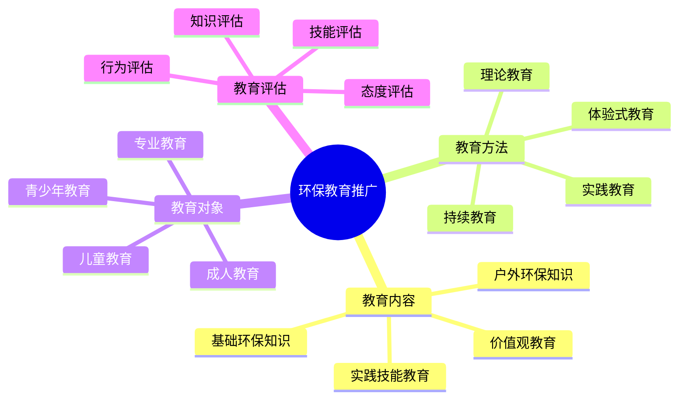

# 环保教育推广

## 📚 环保教育内容

### 1. 基础环保知识
- **生态知识**：生态系统、生物多样性、生态平衡
- **环境问题**：环境污染、气候变化、资源枯竭
- **环保理念**：可持续发展、绿色生活、环保意识
- **环保法规**：环保法规、环保标准、环保政策

### 2. 户外环保知识
- **户外影响**：户外活动对环境的影响
- **无痕山林**：[[03-无痕山林原则|无痕山林原则]]、最小化影响
- **可持续露营**：[[02-可持续露营|可持续露营]]、环保实践
- **生态保护**：生态保护、生物保护、环境保护

### 3. 实践技能教育
- **环保技能**：环保实践技能、环保操作技能
- **监测技能**：环境监测技能、影响评估技能
- **管理技能**：环境管理技能、资源管理技能
- **传播技能**：环保传播技能、教育技能

### 4. 价值观教育
- **环保价值观**：环保价值观、生态伦理
- **责任意识**：环境责任、社会责任、代际责任
- **行为习惯**：环保行为习惯、绿色生活方式
- **文化传承**：环保文化传承、生态文化

## 🎯 教育方法体系

### 1. 理论教育
- **课堂讲授**：系统讲授环保知识
- **专题讲座**：专题环保讲座、专家讲解
- **案例分析**：环保案例分析、经验分享
- **知识竞赛**：环保知识竞赛、技能比赛

### 2. 实践教育
- **实地体验**：实地环保体验、环境观察
- **实践活动**：环保实践活动、志愿服务
- **技能训练**：环保技能训练、操作练习
- **项目参与**：环保项目参与、实践项目

### 3. 体验式教育
- **角色扮演**：角色扮演、情景模拟
- **游戏互动**：环保游戏、互动体验
- **团队合作**：团队合作、协作学习
- **反思总结**：反思总结、经验分享

### 4. 持续教育
- **定期培训**：定期环保培训、持续学习
- **在线学习**：在线环保学习、远程教育
- **社区教育**：社区环保教育、邻里学习
- **家庭教育**：家庭环保教育、亲子教育

## 👥 教育对象体系

### 1. 儿童教育
- **启蒙教育**：环保启蒙教育、基础认知
- **兴趣培养**：环保兴趣培养、自然热爱
- **习惯养成**：环保习惯养成、行为培养
- **价值观建立**：环保价值观建立、意识培养

### 2. 青少年教育
- **知识深化**：环保知识深化、理论提升
- **技能培养**：环保技能培养、实践能力
- **责任意识**：环保责任意识、社会责任感
- **行动参与**：环保行动参与、志愿服务

### 3. 成人教育
- **知识更新**：环保知识更新、理念更新
- **技能提升**：环保技能提升、能力提升
- **行为改变**：环保行为改变、生活方式改变
- **传播推广**：环保传播推广、教育他人

### 4. 专业教育
- **专业培训**：环保专业培训、技能培训
- **管理培训**：环保管理培训、领导力培训
- **教育培训**：环保教育培训、教学培训
- **研究培训**：环保研究培训、学术培训

## 📊 教育效果评估

### 1. 知识评估
- **知识测试**：环保知识测试、理论考核
- **知识应用**：知识应用能力、实践应用
- **知识更新**：知识更新情况、学习效果
- **知识传播**：知识传播能力、教育能力

### 2. 技能评估
- **技能测试**：环保技能测试、操作考核
- **实践能力**：实践能力评估、应用能力
- **创新能力**：创新能力评估、改进能力
- **传播能力**：传播能力评估、教育能力

### 3. 态度评估
- **环保意识**：环保意识水平、意识强度
- **环保态度**：环保态度、价值观念
- **行为倾向**：环保行为倾向、行动意愿
- **责任感**：环保责任感、社会责任感

### 4. 行为评估
- **行为改变**：环保行为改变、行为改善
- **行为频率**：环保行为频率、行为持续性
- **行为影响**：环保行为影响、社会影响
- **行为传播**：环保行为传播、影响他人

## 📊 环保教育对比

| 教育类型 | 教育内容 | 教育方法 | 教育对象 | 教育周期 | 效果评估 |
|----------|----------|----------|----------|----------|----------|
| **基础教育** | 基础知识 | 理论+实践 | 儿童青少年 | 长期 | 知识+态度 |
| **技能教育** | 实践技能 | 实践为主 | 成人 | 中期 | 技能+行为 |
| **专业教育** | 专业知识 | 综合培训 | 专业人员 | 长期 | 综合评估 |
| **持续教育** | 更新知识 | 多种方法 | 所有人 | 持续 | 持续评估 |

## 🎯 环保教育体系

## 🎓 费曼学习法应用

### 第一步：选择概念
选择"环保教育推广"作为学习概念

### 第二步：教授他人
用简单语言解释：
> "环保教育是传播环保知识和理念的过程：包括基础环保知识、户外环保知识、实践技能和价值观教育。通过理论、实践、体验式和持续教育，培养不同人群的环保意识和能力。"

### 第三步：回顾简化
- **教育内容**：基础知识、户外知识、实践技能、价值观
- **教育方法**：理论、实践、体验式、持续教育
- **教育对象**：儿童、青少年、成人、专业教育
- **教育评估**：知识、技能、态度、行为评估

### 第四步：组织优化
建立教育与技能的关系：
- 教育内容 → [[02-理解层-原理机制/04-环境保护理念|环境保护理念]]
- 教育方法 → [[04-创新层-进阶发展/03-领导力培养/05-培训指导方法|培训指导]]
- 教育对象 → [[04-创新层-进阶发展/04-文化传承/02-新手指导方法|新手指导]]
- 教育评估 → [[04-创新层-进阶发展/02-专业配置/05-升级优化策略|升级优化]]

## 🏃‍♂️ 刻意练习要点

### 环保教育练习
1. **内容设计**：设计环保教育内容
2. **方法选择**：选择合适教育方法
3. **对象分析**：分析教育对象需求
4. **效果评估**：评估教育效果

### 实践验证
- **教育实施**：实施环保教育
- **效果测试**：测试教育效果
- **能力评估**：评估教育能力
- **持续改进**：持续改进教育

## 🔗 教育与技能的关系

### 教育内容技能
- **知识传授**：[[04-创新层-进阶发展/03-领导力培养/05-培训指导方法|培训指导]]
- **技能培养**：[[03-应用层-实践技能/04-应急处理|应急处理]]
- **价值观教育**：[[04-创新层-进阶发展/04-文化传承|文化传承]]
- **实践指导**：[[03-应用层-实践技能/02-营地建设|营地建设]]

### 教育方法技能
- **教学技能**：[[04-创新层-进阶发展/03-领导力培养/05-培训指导方法|培训指导]]
- **实践技能**：[[03-应用层-实践技能/04-应急处理|应急处理]]
- **体验技能**：[[04-创新层-进阶发展/03-领导力培养|领导力培养]]
- **传播技能**：[[04-创新层-进阶发展/04-文化传承/01-露营文化推广|文化推广]]

### 教育对象技能
- **儿童教育**：[[04-创新层-进阶发展/04-文化传承/02-新手指导方法|新手指导]]
- **青少年教育**：[[04-创新层-进阶发展/03-领导力培养/05-培训指导方法|培训指导]]
- **成人教育**：[[04-创新层-进阶发展/03-领导力培养|领导力培养]]
- **专业教育**：[[04-创新层-进阶发展/02-专业配置/01-专业装备推荐|专业装备]]

### 教育评估技能
- **评估技能**：[[04-创新层-进阶发展/02-专业配置/05-升级优化策略|升级优化]]
- **测试技能**：[[04-创新层-进阶发展/03-领导力培养/05-培训指导方法|培训指导]]
- **分析技能**：[[04-创新层-进阶发展/01-高级技巧/07-跨学科知识整合|跨学科知识]]
- **改进技能**：[[04-创新层-进阶发展/02-专业配置/05-升级优化策略|升级优化]]

## 📋 环保教育检查清单

### 教育内容
- [ ] 设计基础环保知识
- [ ] 安排户外环保知识
- [ ] 组织实践技能教育
- [ ] 进行价值观教育

### 教育方法
- [ ] 采用理论教育方法
- [ ] 进行实践教育
- [ ] 使用体验式教育
- [ ] 建立持续教育机制

### 教育对象
- [ ] 针对儿童教育
- [ ] 进行青少年教育
- [ ] 组织成人教育
- [ ] 开展专业教育

### 教育评估
- [ ] 进行知识评估
- [ ] 进行技能评估
- [ ] 进行态度评估
- [ ] 进行行为评估

## 🎯 环保教育策略

### 系统化策略
1. **体系建立**：建立环保教育体系
2. **内容完善**：完善教育内容
3. **方法优化**：优化教育方法
4. **评估改进**：评估改进教育

### 多元化策略
- **内容多元**：多元化教育内容
- **方法多元**：多元化教育方法
- **对象多元**：多元化教育对象
- **渠道多元**：多元化教育渠道

## 🔗 相关链接
- [[01-生态影响评估|生态影响评估]]
- [[02-可持续露营|可持续露营]]
- [[03-无痕山林原则|无痕山林原则]]
- [[04-创新层-进阶发展/03-领导力培养/05-培训指导方法|培训指导方法]]
