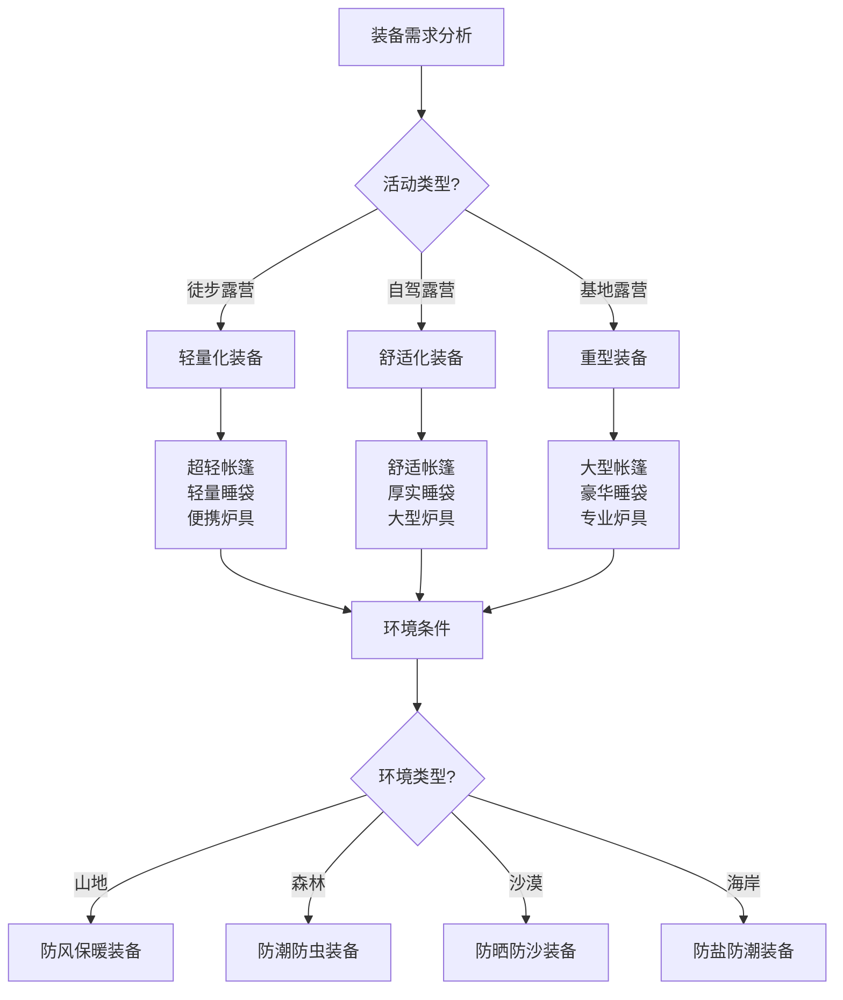

# 基础装备清单

## 🎒 核心装备清单

### 1. 庇护所装备
- **帐篷**：3-4人帐篷、双层结构、防水透气
- **睡袋**：温标-5°C至-10°C、羽绒或合成纤维
- **防潮垫**：充气垫或泡沫垫、R值3.0以上
- **地布**：防水地布、保护帐篷底部
- **天幕**：3m×3m天幕、遮阳遮雨
- **营钉**：铝合金营钉、各种规格

### 2. 炊事装备
- **炉具**：便携式气炉、燃料罐
- **锅具**：不锈钢套锅、容量2-3升
- **餐具**：不锈钢餐具、轻便耐用
- **水具**：水袋、保温杯、净水器
- **燃料**：气罐、酒精、固体燃料
- **清洁用品**：洗洁精、清洁布、垃圾袋

### 3. 照明装备
- **头灯**：LED头灯、续航8-12小时
- **手电筒**：强光手电、备用电池
- **营地灯**：LED营地灯、长时间照明
- **信号灯**：应急信号灯、求救信号
- **电池**：锂电池、充电宝
- **充电设备**：太阳能充电器、移动电源

### 4. 导航装备
- **地图**：等高线地图、地形图
- **指南针**：军用指南针、精度高
- **GPS设备**：手持GPS、轨迹记录
- **手机应用**：离线地图、导航应用
- **对讲机**：团队通讯、距离5-10公里
- **卫星电话**：应急通讯、全球覆盖

## 🧥 服装装备清单

### 1. 基础服装
- **内衣**：速干内衣、排汗透气
- **T恤**：速干T恤、长袖短袖各2件
- **裤子**：速干长裤、耐磨防刮
- **外套**：冲锋衣、防风防水
- **保暖衣**：抓绒衣、羽绒服
- **雨衣**：轻便雨衣、应急使用

### 2. 鞋袜装备
- **徒步鞋**：中帮徒步鞋、防滑耐磨
- **营地鞋**：轻便营地鞋、放松脚部
- **袜子**：羊毛袜、速干袜各3双
- **鞋垫**：缓冲鞋垫、舒适支撑
- **绑腿**：防沙绑腿、保护脚踝
- **雨鞋套**：防水鞋套、雨天使用

### 3. 配件装备
- **帽子**：遮阳帽、保暖帽
- **手套**：工作手套、保暖手套
- **围巾**：多功能围巾、保暖防晒
- **腰带**：战术腰带、多功能
- **眼镜**：太阳镜、防护眼镜
- **口罩**：防尘口罩、防护用品

## 🛠️ 工具装备清单

### 1. 基础工具
- **刀具**：多功能刀、瑞士军刀
- **锯子**：折叠锯、木材加工
- **斧头**：小型斧头、劈柴工具
- **铲子**：折叠铲、挖掘工具
- **锤子**：橡胶锤、营钉工具
- **钳子**：多功能钳、维修工具

### 2. 维修工具
- **胶带**：强力胶带、应急修复
- **绳子**：各种规格绳子、捆绑固定
- **铁丝**：细铁丝、临时固定
- **螺丝刀**：多规格螺丝刀、维修
- **扳手**：活动扳手、设备维修
- **备用零件**：常用零件、应急更换

### 3. 测量工具
- **卷尺**：软尺、测量距离
- **温度计**：环境温度计、监测
- **湿度计**：湿度监测、环境评估
- **气压计**：气压监测、天气预测
- **风速仪**：风速测量、安全评估
- **高度计**：海拔测量、导航辅助

## 📊 装备清单对比

| 装备类别 | 必需程度 | 重量等级 | 价格范围 | 使用频率 | 优先级 |
|----------|----------|----------|----------|----------|--------|
| **庇护所** | 极高 | 中-重 | 中-高 | 极高 | ⭐⭐⭐⭐⭐ |
| **炊事** | 高 | 中 | 中 | 高 | ⭐⭐⭐⭐ |
| **照明** | 高 | 轻 | 低-中 | 高 | ⭐⭐⭐⭐ |
| **导航** | 极高 | 轻 | 中-高 | 中 | ⭐⭐⭐⭐⭐ |
| **服装** | 极高 | 中 | 中-高 | 极高 | ⭐⭐⭐⭐⭐ |
| **工具** | 中 | 中-重 | 中 | 中 | ⭐⭐⭐ |

## 🎯 装备选择决策树

## 🎓 费曼学习法应用

### 第一步：选择概念
选择"基础装备清单"作为学习概念

### 第二步：教授他人
用简单语言解释：
> "露营装备分为六大类：庇护所装备提供住宿，炊事装备提供食物，照明装备提供光线，导航装备提供方向，服装装备保护身体，工具装备处理各种任务。"

### 第三步：回顾简化
- **庇护所**：帐篷、睡袋、防潮垫、地布
- **炊事**：炉具、锅具、餐具、水具
- **照明**：头灯、手电、营地灯、电池
- **导航**：地图、指南针、GPS、对讲机
- **服装**：内衣、外套、鞋袜、配件
- **工具**：刀具、锯子、绳子、维修工具

### 第四步：组织优化
建立装备与技能的关系：
- 庇护所装备 → [[02-帐篷搭建技巧|帐篷搭建]]
- 炊事装备 → [[03-篝火建设与管理|篝火管理]]
- 照明装备 → [[04-营地布局与规划|营地布局]]
- 导航装备 → [[03-野外生存/01-方向识别技能|方向识别]]

## 🏃‍♂️ 刻意练习要点

### 装备选择练习
1. **需求分析**：分析具体装备需求
2. **市场调研**：调研装备市场信息
3. **性能比较**：比较不同装备性能
4. **实际测试**：实际测试装备性能

### 实践验证
- **装备使用**：实际使用装备
- **性能评估**：评估装备性能
- **问题识别**：识别装备问题
- **改进建议**：提出改进建议

## 🔗 装备与技能的关系

### 庇护所装备技能
- **帐篷选择**：[[02-帐篷搭建技巧|帐篷搭建]]
- **睡袋使用**：[[02-服装选择与搭配|服装选择]]
- **防潮垫**：[[04-营地布局与规划|营地布局]]
- **天幕使用**：[[03-篝火建设与管理|篝火管理]]

### 炊事装备技能
- **炉具使用**：[[03-篝火建设与管理|篝火管理]]
- **锅具选择**：[[03-野外生存/03-食物获取技能|食物获取]]
- **餐具使用**：[[03-野外生存/03-食物获取技能|食物获取]]
- **水具管理**：[[03-野外生存/02-水源寻找与净化|水源管理]]

### 照明装备技能
- **头灯使用**：[[03-野外生存/01-方向识别技能|方向识别]]
- **手电使用**：[[04-应急处理|应急处理]]
- **营地灯**：[[04-营地布局与规划|营地布局]]
- **电池管理**：[[05-燃料与能源|燃料管理]]

### 导航装备技能
- **地图使用**：[[03-野外生存/01-方向识别技能|方向识别]]
- **指南针使用**：[[03-野外生存/01-方向识别技能|方向识别]]
- **GPS操作**：[[04-创新层-进阶发展/02-专业配置/03-技术装备集成|技术集成]]
- **对讲机使用**：[[03-野外生存/06-信号与求救|信号求救]]

## 📋 装备准备检查清单

### 核心装备
- [ ] 帐篷及配件
- [ ] 睡袋及防潮垫
- [ ] 炉具及燃料
- [ ] 照明设备
- [ ] 导航设备
- [ ] 基础工具

### 服装装备
- [ ] 基础服装
- [ ] 鞋袜装备
- [ ] 配件装备
- [ ] 雨具装备
- [ ] 保暖装备
- [ ] 防护装备

### 工具装备
- [ ] 基础工具
- [ ] 维修工具
- [ ] 测量工具
- [ ] 备用零件
- [ ] 应急工具
- [ ] 清洁工具

### 个人用品
- [ ] 个人卫生用品
- [ ] 药品急救包
- [ ] 食物饮水
- [ ] 娱乐用品
- [ ] 记录用品
- [ ] 其他用品

## 🎯 装备准备策略

### 系统性准备
1. **清单制定**：制定详细装备清单
2. **分类整理**：按类别整理装备
3. **检查维护**：检查维护装备状态
4. **打包优化**：优化装备打包方式

### 个性化准备
- **需求定制**：根据个人需求定制
- **技能匹配**：匹配个人技能水平
- **预算控制**：控制装备预算
- **持续优化**：持续优化装备配置

## 🔗 相关链接
- [[02-服装选择与搭配|服装选择与搭配]]
- [[03-帐篷搭建技巧|帐篷搭建技巧]]
- [[04-营地布局与规划|营地布局与规划]]
- [[05-燃料与能源|燃料与能源]]