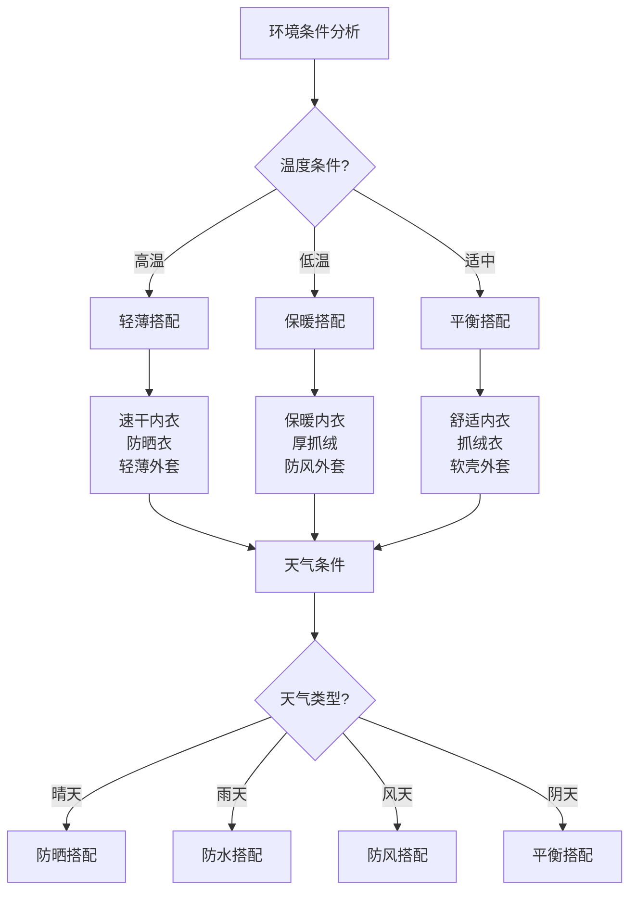

# 服装选择与搭配

## 🌡️ 分层着装系统

### 1. 基础层（排汗层）
- **功能**：排汗透气、保持干爽、调节体温
- **材质**：聚酯纤维、美利奴羊毛、竹纤维
- **特点**：贴身、速干、抗菌、无异味
- **选择**：长袖、短袖、内衣、内裤
- **颜色**：浅色系、避免深色吸热

### 2. 中间层（保暖层）
- **功能**：保温隔热、储存热量、调节温度
- **材质**：抓绒、羽绒、合成纤维、羊毛
- **特点**：轻便、保暖、透气、易压缩
- **选择**：抓绒衣、羽绒服、软壳衣
- **厚度**：根据温度选择不同厚度

### 3. 外层（防护层）
- **功能**：防风防水、保护内层、抵御恶劣天气
- **材质**：Gore-Tex、eVent、PU涂层
- **特点**：防水透气、耐磨、轻便
- **选择**：冲锋衣、雨衣、软壳外套
- **颜色**：鲜艳颜色、便于识别

## 🎯 环境适应性搭配

### 1. 高温环境
- **基础层**：轻薄速干T恤、短裤
- **中间层**：轻薄长袖、防晒衣
- **外层**：轻薄外套、防晒帽
- **配件**：遮阳帽、太阳镜、防晒霜
- **颜色**：浅色、反光材质

### 2. 低温环境
- **基础层**：厚实内衣、保暖内衣
- **中间层**：厚抓绒、羽绒服
- **外层**：防风外套、保暖外套
- **配件**：保暖帽、手套、围巾
- **颜色**：深色、吸热材质

### 3. 潮湿环境
- **基础层**：速干内衣、排汗内衣
- **中间层**：透气抓绒、快干衣
- **外层**：防水外套、雨衣
- **配件**：防水帽、防水手套
- **材质**：防水透气、快干材质

### 4. 干燥环境
- **基础层**：舒适内衣、透气内衣
- **中间层**：轻薄抓绒、透气衣
- **外层**：防风外套、防晒衣
- **配件**：遮阳帽、防晒用品
- **材质**：透气、防晒材质

## 👟 鞋袜搭配系统

### 1. 徒步鞋选择
- **低帮鞋**：轻便、透气、适合平坦地形
- **中帮鞋**：支撑好、保护脚踝、适合山地
- **高帮鞋**：保护性强、适合复杂地形
- **材质**：皮革、合成材料、混合材质
- **鞋底**：橡胶大底、防滑纹路

### 2. 袜子搭配
- **基础袜**：棉质、舒适、日常使用
- **功能袜**：羊毛、排汗、抗菌
- **厚袜**：保暖、缓冲、保护
- **薄袜**：透气、轻便、夏季使用
- **分层袜**：内层排汗、外层保暖

### 3. 鞋垫选择
- **缓冲鞋垫**：减震、舒适、保护脚部
- **支撑鞋垫**：矫正、支撑、改善步态
- **透气鞋垫**：透气、排汗、防臭
- **定制鞋垫**：个性化、专业定制
- **材质**：EVA、记忆海绵、硅胶

## 🧤 配件搭配系统

### 1. 头部保护
- **遮阳帽**：防晒、遮阳、透气
- **保暖帽**：保暖、防风、轻便
- **多功能帽**：防晒保暖、可调节
- **头巾**：多功能、防晒保暖
- **头盔**：安全保护、专业活动

### 2. 手部保护
- **工作手套**：防滑、耐磨、保护
- **保暖手套**：保暖、防风、轻便
- **防水手套**：防水、透气、灵活
- **触屏手套**：触屏功能、保暖
- **专业手套**：专业功能、特殊保护

### 3. 眼部保护
- **太阳镜**：防紫外线、护眼、时尚
- **防护眼镜**：防冲击、防尘、安全
- **护目镜**：专业保护、密封性好
- **变色镜**：自动调节、适应光线
- **偏光镜**：减少反光、清晰视野

## 📊 服装搭配对比

| 环境类型 | 基础层 | 中间层 | 外层 | 配件 | 总重量 | 舒适度 |
|----------|--------|--------|------|------|--------|--------|
| **高温** | 轻薄速干 | 防晒衣 | 轻薄外套 | 遮阳帽 | 轻 | 高 |
| **低温** | 保暖内衣 | 厚抓绒 | 防风外套 | 保暖帽 | 重 | 高 |
| **潮湿** | 速干内衣 | 透气抓绒 | 防水外套 | 防水帽 | 中 | 中 |
| **干燥** | 舒适内衣 | 轻薄抓绒 | 防风外套 | 遮阳帽 | 轻 | 高 |

## 🎯 服装搭配决策树

## 🎓 费曼学习法应用

### 第一步：选择概念
选择"服装选择与搭配"作为学习概念

### 第二步：教授他人
用简单语言解释：
> "户外服装采用分层系统：基础层排汗透气，中间层保暖隔热，外层防风防水。根据环境温度、湿度、天气条件选择合适的搭配，确保舒适和安全。"

### 第三步：回顾简化
- **分层系统**：基础层、中间层、外层
- **环境适应**：高温、低温、潮湿、干燥
- **鞋袜搭配**：徒步鞋、袜子、鞋垫
- **配件系统**：头部、手部、眼部保护

### 第四步：组织优化
建立服装与技能的关系：
- 分层系统 → [[02-理解层-原理机制/01-户外生存原理/01-人体生理适应|人体适应]]
- 环境适应 → [[02-理解层-原理机制/01-户外生存原理/02-环境因素影响|环境因素]]
- 鞋袜搭配 → [[03-野外生存|野外生存]]
- 配件系统 → [[04-应急处理|应急处理]]

## 🏃‍♂️ 刻意练习要点

### 服装搭配练习
1. **环境分析**：分析环境条件
2. **需求确定**：确定服装需求
3. **搭配选择**：选择合适搭配
4. **效果验证**：验证搭配效果

### 实践验证
- **环境测试**：在不同环境测试
- **舒适度评估**：评估穿着舒适度
- **功能测试**：测试服装功能
- **持续优化**：持续优化搭配

## 🔗 服装与技能的关系

### 分层系统技能
- **体温调节**：[[02-理解层-原理机制/01-户外生存原理/01-人体生理适应|人体适应]]
- **环境适应**：[[02-理解层-原理机制/01-户外生存原理/02-环境因素影响|环境因素]]
- **舒适管理**：[[03-野外生存|野外生存]]
- **安全保护**：[[04-应急处理|应急处理]]

### 环境适应技能
- **温度适应**：[[02-理解层-原理机制/01-户外生存原理/01-人体生理适应|人体适应]]
- **湿度管理**：[[02-理解层-原理机制/01-户外生存原理/02-环境因素影响|环境因素]]
- **天气应对**：[[04-应急处理/02-恶劣天气应对|恶劣天气]]
- **环境监测**：[[02-理解层-原理机制/04-环境保护理念/01-生态影响评估|生态评估]]

### 鞋袜搭配技能
- **脚部保护**：[[03-野外生存|野外生存]]
- **行走技能**：[[03-野外生存/01-方向识别技能|方向识别]]
- **平衡技能**：[[03-野外生存|野外生存]]
- **舒适管理**：[[03-野外生存|野外生存]]

### 配件搭配技能
- **头部保护**：[[04-应急处理|应急处理]]
- **手部保护**：[[04-应急处理|应急处理]]
- **眼部保护**：[[04-应急处理|应急处理]]
- **安全防护**：[[02-理解层-原理机制/03-安全防护机制|安全防护]]

## 📋 服装搭配检查清单

### 分层系统
- [ ] 基础层：排汗透气内衣
- [ ] 中间层：保暖隔热层
- [ ] 外层：防风防水外套
- [ ] 配件：帽子、手套、眼镜

### 环境适应
- [ ] 温度适应：高温/低温搭配
- [ ] 湿度适应：潮湿/干燥搭配
- [ ] 天气适应：晴天/雨天搭配
- [ ] 地形适应：山地/平地搭配

### 鞋袜搭配
- [ ] 徒步鞋：适合地形和活动
- [ ] 袜子：功能性和舒适性
- [ ] 鞋垫：缓冲和支撑
- [ ] 备用：备用鞋袜

### 配件系统
- [ ] 头部保护：帽子、头巾
- [ ] 手部保护：手套、护手
- [ ] 眼部保护：眼镜、护目镜
- [ ] 其他配件：围巾、腰带

## 🎯 服装搭配策略

### 系统性搭配
1. **环境分析**：分析环境条件
2. **需求确定**：确定服装需求
3. **搭配选择**：选择合适搭配
4. **效果验证**：验证搭配效果

### 个性化搭配
- **个人偏好**：考虑个人偏好
- **身体特点**：考虑身体特点
- **活动需求**：考虑活动需求
- **预算控制**：控制服装预算

## 🔗 相关链接
- [[01-基础装备清单|基础装备清单]]
- [[03-帐篷搭建技巧|帐篷搭建技巧]]
- [[04-营地布局与规划|营地布局与规划]]
- [[02-理解层-原理机制/01-户外生存原理/01-人体生理适应|人体生理适应]]
