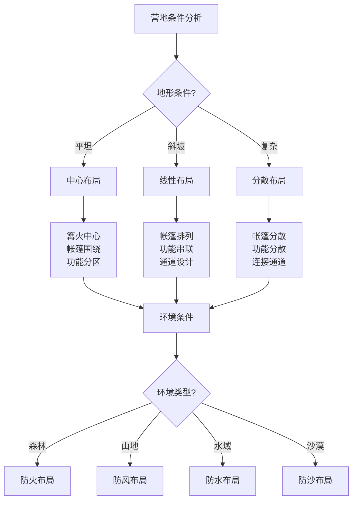

# 营地布局与规划

## 🗺️ 营地规划原则

### 1. 功能分区原则
- **休息区**：帐篷区域、睡眠区域、私密空间
- **活动区**：篝火区域、用餐区域、社交空间
- **储存区**：装备储存、食物储存、垃圾处理
- **卫生区**：厕所区域、洗漱区域、清洁区域
- **安全区**：应急通道、安全距离、避险区域

### 2. 安全距离原则
- **帐篷间距**：帐篷间保持3-5米距离
- **篝火距离**：篝火距离帐篷5-10米
- **水源距离**：距离水源60米以上
- **危险距离**：远离悬崖、陡坡、危险区域
- **通风距离**：保持良好通风、避免烟雾

### 3. 环境影响原则
- **最小影响**：最小化对环境的影响
- **生态保护**：保护生态环境、植被
- **无痕原则**：遵循无痕山林原则
- **可持续性**：考虑可持续性发展
- **恢复能力**：确保环境恢复能力

### 4. 便利性原则
- **交通便利**：便于进出、搬运装备
- **使用便利**：便于日常使用、活动
- **维护便利**：便于维护、清洁
- **应急便利**：便于应急处理、救援
- **扩展便利**：便于扩展、调整

## 🏕️ 营地布局设计

### 1. 中心布局
- **篝火中心**：以篝火为中心、辐射布局
- **帐篷围绕**：帐篷围绕篝火、形成圆形
- **功能分区**：各功能区围绕中心、有序分布
- **通道设计**：设计放射状通道、便于通行
- **安全考虑**：考虑安全距离、应急通道

### 2. 线性布局
- **帐篷排列**：帐篷线性排列、整齐有序
- **功能串联**：各功能区串联、形成动线
- **通道设计**：设计主通道、便于通行
- **安全考虑**：考虑安全距离、应急通道
- **扩展考虑**：考虑扩展空间、调整空间

### 3. 分散布局
- **帐篷分散**：帐篷分散布置、独立空间
- **功能分散**：各功能区分散、独立使用
- **通道设计**：设计连接通道、便于通行
- **安全考虑**：考虑安全距离、应急通道
- **隐私考虑**：考虑隐私保护、独立空间

### 4. 混合布局
- **功能混合**：功能区域混合、灵活使用
- **空间混合**：空间布局混合、适应需求
- **时间混合**：时间使用混合、错峰使用
- **安全考虑**：考虑安全距离、应急通道
- **灵活考虑**：考虑灵活调整、适应变化

## 🔥 篝火区域规划

### 1. 篝火位置选择
- **安全位置**：远离帐篷、植被、易燃物
- **风向考虑**：考虑风向、避免烟雾影响
- **地面条件**：选择坚硬地面、避免草地
- **排水条件**：考虑排水、避免积水
- **扩展空间**：预留扩展空间、便于调整

### 2. 篝火区域设计
- **火坑设计**：设计合适火坑、控制火势
- **防风设计**：设计防风措施、保护火源
- **安全设计**：设计安全措施、防止意外
- **功能设计**：设计多功能、满足需求
- **美观设计**：设计美观、提升体验

### 3. 篝火区域设施
- **火坑**：石砌火坑、金属火盆
- **座位**：木桩座位、折叠椅
- **工具**：火钳、火铲、灭火器
- **储存**：木材储存、工具储存
- **照明**：篝火照明、辅助照明

### 4. 篝火区域管理
- **火源管理**：管理火源、控制火势
- **安全监控**：监控安全、防止意外
- **环境保护**：保护环境、减少影响
- **清洁维护**：清洁维护、保持整洁
- **应急处理**：应急处理、快速响应

## 🚿 卫生区域规划

### 1. 厕所区域
- **位置选择**：远离水源、帐篷、活动区
- **距离要求**：距离水源60米以上
- **隐私保护**：提供隐私保护、遮挡视线
- **卫生处理**：妥善处理废物、避免污染
- **环境友好**：环境友好、可降解材料

### 2. 洗漱区域
- **位置选择**：远离水源、帐篷、活动区
- **距离要求**：距离水源60米以上
- **排水处理**：妥善处理废水、避免污染
- **清洁用品**：使用环保清洁用品
- **环境友好**：环境友好、可降解材料

### 3. 垃圾处理区域
- **位置选择**：远离水源、帐篷、活动区
- **距离要求**：距离水源60米以上
- **分类处理**：垃圾分类处理、便于回收
- **密封储存**：密封储存、防止异味
- **定期清理**：定期清理、保持整洁

### 4. 清洁区域
- **位置选择**：远离水源、帐篷、活动区
- **距离要求**：距离水源60米以上
- **清洁用品**：使用环保清洁用品
- **废水处理**：妥善处理废水、避免污染
- **环境友好**：环境友好、可降解材料

## 📊 营地布局对比

| 布局类型 | 空间利用率 | 隐私性 | 安全性 | 便利性 | 环境影响 | 推荐指数 |
|----------|------------|--------|--------|--------|----------|----------|
| **中心布局** | 高 | 中 | 高 | 高 | 中 | ⭐⭐⭐⭐ |
| **线性布局** | 中 | 中 | 中 | 高 | 低 | ⭐⭐⭐ |
| **分散布局** | 低 | 高 | 中 | 中 | 低 | ⭐⭐⭐ |
| **混合布局** | 高 | 高 | 高 | 高 | 中 | ⭐⭐⭐⭐⭐ |

## 🎯 营地规划决策树

## 🎓 费曼学习法应用

### 第一步：选择概念
选择"营地布局与规划"作为学习概念

### 第二步：教授他人
用简单语言解释：
> "营地布局要考虑功能分区、安全距离、环境影响和便利性。可以设计成中心布局、线性布局、分散布局或混合布局，确保各功能区合理分布，既安全又便利。"

### 第三步：回顾简化
- **规划原则**：功能分区、安全距离、环境影响、便利性
- **布局设计**：中心、线性、分散、混合布局
- **篝火区域**：位置选择、区域设计、设施配置、区域管理
- **卫生区域**：厕所、洗漱、垃圾、清洁区域

### 第四步：组织优化
建立布局与技能的关系：
- 规划原则 → [[02-理解层-原理机制/04-环境保护理念/03-无痕山林原则|无痕山林]]
- 布局设计 → [[03-篝火建设与管理|篝火管理]]
- 篝火区域 → [[03-篝火建设与管理|篝火管理]]
- 卫生区域 → [[02-理解层-原理机制/04-环境保护理念/02-可持续露营|可持续露营]]

## 🏃‍♂️ 刻意练习要点

### 布局规划练习
1. **环境分析**：分析营地环境条件
2. **需求确定**：确定营地功能需求
3. **布局设计**：设计营地布局方案
4. **效果验证**：验证布局效果

### 实践验证
- **实地规划**：实地进行营地规划
- **布局测试**：测试布局效果
- **功能验证**：验证功能分区
- **持续改进**：持续改进布局

## 🔗 布局与技能的关系

### 规划原则技能
- **功能分析**：[[03-野外生存|野外生存]]
- **安全评估**：[[02-理解层-原理机制/03-安全防护机制/01-风险评估体系|风险评估]]
- **环境评估**：[[02-理解层-原理机制/04-环境保护理念/01-生态影响评估|生态评估]]
- **便利设计**：[[04-创新层-进阶发展/02-专业配置/02-定制化配置|定制配置]]

### 布局设计技能
- **空间设计**：[[04-创新层-进阶发展/02-专业配置/02-定制化配置|定制配置]]
- **功能设计**：[[03-野外生存|野外生存]]
- **安全设计**：[[02-理解层-原理机制/03-安全防护机制|安全防护]]
- **美观设计**：[[04-创新层-进阶发展/04-文化传承|文化传承]]

### 篝火区域技能
- **火源管理**：[[03-篝火建设与管理|篝火管理]]
- **安全防护**：[[02-理解层-原理机制/03-安全防护机制|安全防护]]
- **环境保护**：[[02-理解层-原理机制/04-环境保护理念|环境保护]]
- **应急处理**：[[04-应急处理|应急处理]]

### 卫生区域技能
- **卫生管理**：[[03-野外生存|野外生存]]
- **环境保护**：[[02-理解层-原理机制/04-环境保护理念|环境保护]]
- **废物处理**：[[02-理解层-原理机制/04-环境保护理念/03-无痕山林原则|无痕山林]]
- **清洁维护**：[[04-创新层-进阶发展/02-专业配置/04-维护保养体系|维护保养]]

## 📋 营地布局检查清单

### 规划原则
- [ ] 功能分区合理
- [ ] 安全距离适当
- [ ] 环境影响最小
- [ ] 便利性良好

### 布局设计
- [ ] 选择合适的布局类型
- [ ] 设计合理的功能分区
- [ ] 规划适当的通道
- [ ] 考虑扩展空间

### 篝火区域
- [ ] 选择安全的篝火位置
- [ ] 设计合适的篝火区域
- [ ] 配置必要的篝火设施
- [ ] 建立篝火管理制度

### 卫生区域
- [ ] 规划厕所区域
- [ ] 规划洗漱区域
- [ ] 规划垃圾处理区域
- [ ] 规划清洁区域

## 🎯 营地布局策略

### 系统性策略
1. **环境分析**：分析营地环境条件
2. **需求分析**：分析功能需求
3. **布局设计**：设计营地布局
4. **效果验证**：验证布局效果

### 适应性策略
- **环境适应**：适应不同环境
- **需求适应**：适应不同需求
- **团队适应**：适应团队特点
- **持续改进**：持续改进布局

## 🔗 相关链接
- [[01-基础装备清单|基础装备清单]]
- [[02-服装选择与搭配|服装选择与搭配]]
- [[03-帐篷搭建技巧|帐篷搭建技巧]]
- [[03-篝火建设与管理|篝火建设与管理]]
