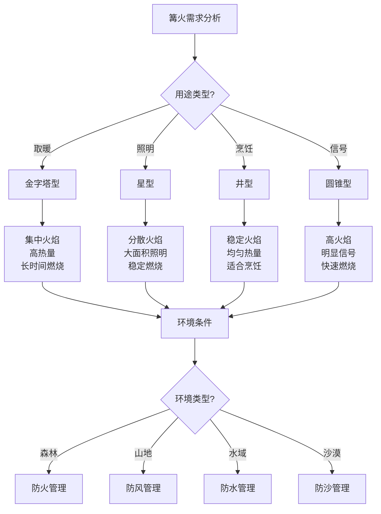

# 篝火建设与管理

## 🔥 篝火类型与选择

### 1. 篝火结构类型
- **金字塔型**：火焰集中、热量集中、适合取暖
- **星型**：火焰分散、热量分散、适合照明
- **井型**：火焰稳定、热量稳定、适合烹饪
- **长条形**：火焰长、热量分布、适合多人
- **圆锥型**：火焰高、热量集中、适合信号
- **反射型**：火焰反射、热量集中、适合取暖

### 2. 燃料类型选择
- **木材燃料**：干柴、树枝、木块
- **煤炭燃料**：木炭、煤炭、焦炭
- **液体燃料**：酒精、汽油、柴油
- **固体燃料**：固体酒精、蜡烛、蜡块
- **气体燃料**：丙烷、丁烷、天然气
- **生物燃料**：秸秆、草料、粪便

### 3. 篝火用途分类
- **取暖篝火**：提供热量、保持温暖
- **照明篝火**：提供光线、夜间照明
- **烹饪篝火**：提供热量、烹饪食物
- **信号篝火**：发送信号、求救信号
- **驱虫篝火**：驱赶蚊虫、保护安全
- **社交篝火**：社交活动、团队建设

## 🛠️ 篝火建设准备

### 1. 场地选择
- **安全位置**：远离帐篷、植被、易燃物
- **风向考虑**：考虑风向、避免烟雾影响
- **地面条件**：选择坚硬地面、避免草地
- **排水条件**：考虑排水、避免积水
- **扩展空间**：预留扩展空间、便于调整
- **应急通道**：预留应急通道、便于撤离

### 2. 工具准备
- **点火工具**：打火机、火柴、火石
- **引火材料**：报纸、干草、木屑
- **燃料准备**：干柴、木炭、燃料
- **控制工具**：火钳、火铲、灭火器
- **防护工具**：手套、围裙、防护用品
- **清洁工具**：扫帚、铲子、清洁用品

### 3. 安全检查
- **环境检查**：检查周围环境、识别风险
- **工具检查**：检查工具完整性、功能正常
- **燃料检查**：检查燃料质量、干燥程度
- **防护检查**：检查防护用品、确保安全
- **应急检查**：检查应急设备、确保可用
- **人员检查**：检查人员状态、确保安全

## 🔥 篝火建设步骤

### 1. 基础建设
- **清理场地**：清理地面、去除易燃物
- **挖掘火坑**：挖掘合适火坑、控制火势
- **铺设基础**：铺设防火基础、保护地面
- **准备引火**：准备引火材料、便于点火
- **堆放燃料**：堆放燃料、形成结构
- **预留空间**：预留操作空间、便于管理

### 2. 点火过程
- **引火点火**：使用引火材料、点燃火源
- **逐步加柴**：逐步添加燃料、控制火势
- **调整结构**：调整篝火结构、优化燃烧
- **控制火势**：控制火势大小、确保安全
- **稳定燃烧**：稳定燃烧状态、持续供热
- **监控管理**：监控燃烧状态、及时调整

### 3. 维护管理
- **添加燃料**：及时添加燃料、维持燃烧
- **调整结构**：调整篝火结构、优化燃烧
- **控制火势**：控制火势大小、确保安全
- **清理灰烬**：清理燃烧灰烬、保持清洁
- **安全监控**：监控安全状态、防止意外
- **环境保护**：保护周围环境、减少影响

## 🛡️ 篝火安全管理

### 1. 防火安全
- **火源控制**：控制火源、防止蔓延
- **燃料管理**：管理燃料、防止意外
- **人员管理**：管理人员、确保安全
- **环境监控**：监控环境、识别风险
- **应急准备**：准备应急设备、快速响应
- **撤离预案**：制定撤离预案、确保安全

### 2. 烟雾管理
- **风向考虑**：考虑风向、避免烟雾影响
- **通风设计**：设计通风、减少烟雾积累
- **人员位置**：调整人员位置、避免烟雾
- **时间控制**：控制燃烧时间、减少烟雾
- **燃料选择**：选择低烟燃料、减少烟雾
- **环境适应**：适应环境条件、减少影响

### 3. 应急处理
- **火势失控**：火势失控、立即灭火
- **人员受伤**：人员受伤、立即救治
- **环境危险**：环境危险、立即撤离
- **设备故障**：设备故障、立即处理
- **天气变化**：天气变化、立即调整
- **其他意外**：其他意外、立即处理

## 🌱 篝火环境保护

### 1. 环境影响控制
- **最小影响**：最小化对环境的影响
- **生态保护**：保护生态环境、植被
- **土壤保护**：保护土壤、避免破坏
- **空气保护**：保护空气质量、减少污染
- **水源保护**：保护水源、避免污染
- **生物保护**：保护生物、避免伤害

### 2. 废物处理
- **灰烬处理**：妥善处理燃烧灰烬
- **燃料残渣**：处理未燃燃料残渣
- **包装废物**：处理燃料包装废物
- **清洁废物**：处理清洁产生的废物
- **分类处理**：垃圾分类处理、便于回收
- **环境友好**：使用环境友好材料

### 3. 恢复措施
- **场地恢复**：恢复篝火场地、消除痕迹
- **植被恢复**：恢复植被、促进生长
- **土壤恢复**：恢复土壤、改善条件
- **环境恢复**：恢复环境、减少影响
- **生态恢复**：恢复生态、促进平衡
- **持续监测**：持续监测、确保恢复

## 📊 篝火类型对比

| 篝火类型 | 点火难度 | 燃烧时间 | 热量输出 | 安全性 | 环境影响 | 推荐指数 |
|----------|----------|----------|----------|--------|----------|----------|
| **金字塔型** | 简单 | 长 | 高 | 高 | 中 | ⭐⭐⭐⭐ |
| **星型** | 中 | 中 | 中 | 中 | 低 | ⭐⭐⭐ |
| **井型** | 中 | 长 | 中 | 高 | 中 | ⭐⭐⭐⭐ |
| **长条形** | 简单 | 中 | 中 | 中 | 低 | ⭐⭐⭐ |
| **圆锥型** | 中 | 短 | 高 | 中 | 中 | ⭐⭐⭐ |
| **反射型** | 复杂 | 长 | 高 | 高 | 中 | ⭐⭐⭐⭐ |

## 🎯 篝火管理决策树

## 🎓 费曼学习法应用

### 第一步：选择概念
选择"篝火建设与管理"作为学习概念

### 第二步：教授他人
用简单语言解释：
> "篝火建设需要选择合适的类型和燃料，按照正确的步骤建设：清理场地、挖掘火坑、准备引火、堆放燃料、点火燃烧。管理时要控制火势、确保安全、保护环境。"

### 第三步：回顾简化
- **篝火类型**：金字塔、星型、井型、圆锥型
- **建设准备**：场地选择、工具准备、安全检查
- **建设步骤**：基础建设、点火过程、维护管理
- **安全管理**：防火安全、烟雾管理、应急处理

### 第四步：组织优化
建立篝火与技能的关系：
- 篝火类型 → [[01-基础装备清单|基础装备]]
- 建设准备 → [[02-营地布局与规划|营地布局]]
- 建设步骤 → [[03-野外生存|野外生存]]
- 安全管理 → [[04-应急处理|应急处理]]

## 🏃‍♂️ 刻意练习要点

### 篝火技能练习
1. **理论学习**：学习篝火理论知识
2. **模拟练习**：模拟篝火建设过程
3. **实地练习**：实地建设篝火
4. **环境适应**：适应不同环境

### 实践验证
- **建设测试**：测试篝火建设技能
- **管理测试**：测试篝火管理技能
- **安全测试**：测试篝火安全技能
- **持续改进**：持续改进技能

## 🔗 篝火与技能的关系

### 篝火类型技能
- **结构设计**：[[04-创新层-进阶发展/02-专业配置/02-定制化配置|定制配置]]
- **燃料选择**：[[05-燃料与能源|燃料管理]]
- **用途设计**：[[03-野外生存|野外生存]]
- **环境适应**：[[02-理解层-原理机制/01-户外生存原理/02-环境因素影响|环境因素]]

### 建设准备技能
- **场地选择**：[[02-营地布局与规划|营地布局]]
- **工具使用**：[[06-工具与维修|工具维修]]
- **安全检查**：[[02-理解层-原理机制/03-安全防护机制/01-风险评估体系|风险评估]]
- **环境评估**：[[02-理解层-原理机制/04-环境保护理念/01-生态影响评估|生态评估]]

### 建设步骤技能
- **操作技能**：[[03-野外生存|野外生存]]
- **协调技能**：[[04-创新层-进阶发展/03-领导力培养/04-沟通协调技巧|沟通协调]]
- **调整技能**：[[04-创新层-进阶发展/02-专业配置/05-升级优化策略|升级优化]]
- **监控技能**：[[04-创新层-进阶发展/02-专业配置/04-维护保养体系|维护保养]]

### 安全管理技能
- **防火技能**：[[02-理解层-原理机制/03-安全防护机制|安全防护]]
- **应急技能**：[[04-应急处理|应急处理]]
- **环境技能**：[[02-理解层-原理机制/04-环境保护理念|环境保护]]
- **管理技能**：[[04-创新层-进阶发展/03-领导力培养|领导力培养]]

## 📋 篝火建设检查清单

### 建设前准备
- [ ] 选择合适的篝火类型
- [ ] 选择合适的建设场地
- [ ] 准备必要的工具
- [ ] 进行安全检查

### 建设过程
- [ ] 清理建设场地
- [ ] 挖掘合适火坑
- [ ] 准备引火材料
- [ ] 堆放燃料结构
- [ ] 点燃篝火
- [ ] 调整燃烧状态

### 建设后管理
- [ ] 监控燃烧状态
- [ ] 控制火势大小
- [ ] 添加必要燃料
- [ ] 清理燃烧灰烬
- [ ] 确保安全状态
- [ ] 保护周围环境

## 🎯 篝火管理策略

### 系统性策略
1. **计划制定**：制定篝火建设计划
2. **环境分析**：分析环境条件
3. **工具准备**：准备必要工具
4. **步骤执行**：按步骤执行建设

### 安全性策略
- **安全第一**：安全始终是第一优先级
- **预防为主**：预防为主、防治结合
- **应急准备**：准备应急设备、快速响应
- **持续监控**：持续监控、及时调整

## 🔗 相关链接
- [[01-基础装备清单|基础装备清单]]
- [[02-服装选择与搭配|服装选择与搭配]]
- [[03-帐篷搭建技巧|帐篷搭建技巧]]
- [[04-营地布局与规划|营地布局与规划]]
