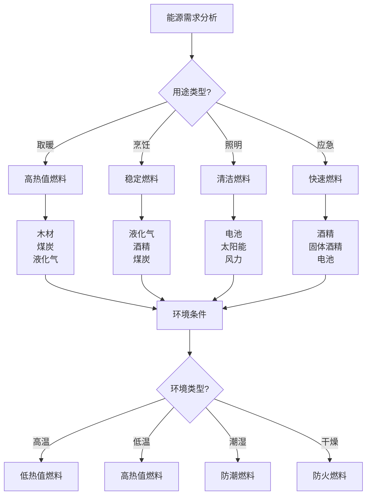

# 燃料与能源

## ⛽ 燃料类型与特性

### 1. 固体燃料
- **木材燃料**：干柴、树枝、木块、木屑
- **煤炭燃料**：木炭、煤炭、焦炭、煤球
- **生物燃料**：秸秆、草料、粪便、果壳
- **合成燃料**：固体酒精、蜡烛、蜡块
- **特点**：燃烧稳定、热量持久、易于储存
- **适用**：篝火、取暖、烹饪、照明

### 2. 液体燃料
- **酒精燃料**：乙醇、甲醇、异丙醇
- **石油燃料**：汽油、柴油、煤油
- **生物燃料**：生物柴油、乙醇汽油
- **特点**：燃烧快速、热量集中、易于控制
- **适用**：炉具、照明、应急、信号

### 3. 气体燃料
- **液化气**：丙烷、丁烷、混合气
- **天然气**：甲烷、压缩天然气
- **特点**：燃烧清洁、热量稳定、易于调节
- **适用**：炉具、取暖、照明、烹饪

### 4. 电力能源
- **电池**：锂电池、铅酸电池、镍氢电池
- **太阳能**：太阳能板、太阳能充电器
- **风力**：风力发电机、风力充电器
- **特点**：清洁环保、易于使用、可重复利用
- **适用**：照明、通讯、导航、娱乐

## 🔥 燃料选择原则

### 1. 用途匹配原则
- **取暖用途**：选择高热值、持久燃烧燃料
- **烹饪用途**：选择稳定燃烧、易于控制燃料
- **照明用途**：选择清洁燃烧、无烟燃料
- **应急用途**：选择易于储存、快速点燃燃料
- **信号用途**：选择高亮度、明显信号燃料

### 2. 环境适应原则
- **高温环境**：选择低热值、快速燃烧燃料
- **低温环境**：选择高热值、持久燃烧燃料
- **潮湿环境**：选择防潮、易点燃燃料
- **干燥环境**：选择防火、安全燃料
- **高海拔**：选择易点燃、燃烧充分燃料

### 3. 安全考虑原则
- **易燃性**：考虑燃料易燃性、储存安全
- **毒性**：考虑燃料毒性、使用安全
- **爆炸性**：考虑燃料爆炸性、运输安全
- **腐蚀性**：考虑燃料腐蚀性、设备安全
- **环境影响**：考虑燃料环境影响、生态安全

### 4. 经济性原则
- **成本效益**：考虑燃料成本、使用效益
- **可获得性**：考虑燃料可获得性、采购便利
- **储存成本**：考虑燃料储存成本、维护费用
- **运输成本**：考虑燃料运输成本、物流费用
- **使用效率**：考虑燃料使用效率、节能效果

## ⚡ 能源管理系统

### 1. 能源规划
- **需求分析**：分析能源需求、确定用量
- **供应计划**：制定供应计划、确保充足
- **储存计划**：制定储存计划、确保安全
- **使用计划**：制定使用计划、提高效率
- **备用计划**：制定备用计划、应急保障

### 2. 能源储存
- **储存容器**：选择合适的储存容器
- **储存环境**：控制储存环境、确保安全
- **储存期限**：了解储存期限、及时更新
- **储存数量**：确定储存数量、平衡供需
- **储存安全**：确保储存安全、防止意外

### 3. 能源使用
- **使用效率**：提高使用效率、减少浪费
- **使用安全**：确保使用安全、防止意外
- **使用控制**：控制使用量、节约能源
- **使用监控**：监控使用状态、及时调整
- **使用记录**：记录使用情况、分析优化

### 4. 能源回收
- **废料回收**：回收废料、再利用
- **热量回收**：回收热量、提高效率
- **能量回收**：回收能量、节约资源
- **循环利用**：循环利用、可持续发展
- **环保处理**：环保处理、减少污染

## 🔋 电力能源管理

### 1. 电池管理
- **电池选择**：选择合适的电池类型
- **电池储存**：正确储存电池、延长寿命
- **电池使用**：合理使用电池、提高效率
- **电池充电**：正确充电、保护电池
- **电池更换**：及时更换、确保性能

### 2. 太阳能管理
- **太阳能板**：选择合适的太阳能板
- **安装位置**：选择最佳安装位置
- **角度调整**：调整角度、提高效率
- **清洁维护**：清洁维护、保持性能
- **储存系统**：配置储存系统、稳定供电

### 3. 风力能源管理
- **风力发电机**：选择合适的风力发电机
- **安装位置**：选择最佳安装位置
- **风向调整**：调整风向、提高效率
- **维护保养**：维护保养、保持性能
- **储存系统**：配置储存系统、稳定供电

### 4. 电力系统
- **系统设计**：设计电力系统、满足需求
- **设备配置**：配置电力设备、确保功能
- **安全保护**：设置安全保护、防止意外
- **监控管理**：监控管理、确保稳定
- **维护保养**：维护保养、延长寿命

## 📊 燃料性能对比

| 燃料类型 | 热值 | 燃烧时间 | 安全性 | 环保性 | 成本 | 推荐指数 |
|----------|------|----------|--------|--------|------|----------|
| **木材** | 中 | 长 | 中 | 中 | 低 | ⭐⭐⭐⭐ |
| **煤炭** | 高 | 长 | 中 | 低 | 低 | ⭐⭐⭐ |
| **酒精** | 中 | 短 | 高 | 高 | 中 | ⭐⭐⭐⭐ |
| **液化气** | 高 | 中 | 高 | 高 | 中 | ⭐⭐⭐⭐⭐ |
| **电池** | 低 | 长 | 高 | 高 | 高 | ⭐⭐⭐⭐ |

## 🎯 能源管理决策树

## 🎓 费曼学习法应用

### 第一步：选择概念
选择"燃料与能源"作为学习概念

### 第二步：教授他人
用简单语言解释：
> "燃料分为固体、液体、气体和电力四大类，每种都有不同的特性和用途。选择燃料要考虑用途、环境、安全和成本，建立能源管理系统，提高使用效率。"

### 第三步：回顾简化
- **燃料类型**：固体、液体、气体、电力
- **选择原则**：用途匹配、环境适应、安全考虑、经济性
- **能源管理**：规划、储存、使用、回收
- **电力管理**：电池、太阳能、风力、系统管理

### 第四步：组织优化
建立能源与技能的关系：
- 燃料类型 → [[01-基础装备清单|基础装备]]
- 选择原则 → [[02-理解层-原理机制/02-装备选择原理/04-性价比分析|性价比分析]]
- 能源管理 → [[04-创新层-进阶发展/02-专业配置/05-升级优化策略|升级优化]]
- 电力管理 → [[04-创新层-进阶发展/02-专业配置/03-技术装备集成|技术集成]]

## 🏃‍♂️ 刻意练习要点

### 能源管理练习
1. **需求分析**：分析能源需求
2. **燃料选择**：选择合适的燃料
3. **系统设计**：设计能源管理系统
4. **效率优化**：优化能源使用效率

### 实践验证
- **系统测试**：测试能源管理系统
- **效率测试**：测试能源使用效率
- **安全测试**：测试能源使用安全
- **持续改进**：持续改进能源管理

## 🔗 能源与技能的关系

### 燃料类型技能
- **燃料知识**：[[01-基础装备清单|基础装备]]
- **性能分析**：[[02-理解层-原理机制/02-装备选择原理/02-材质与性能|材质性能]]
- **环境适应**：[[02-理解层-原理机制/01-户外生存原理/02-环境因素影响|环境因素]]
- **安全防护**：[[02-理解层-原理机制/03-安全防护机制|安全防护]]

### 选择原则技能
- **需求分析**：[[03-野外生存|野外生存]]
- **环境评估**：[[02-理解层-原理机制/01-户外生存原理/02-环境因素影响|环境因素]]
- **安全评估**：[[02-理解层-原理机制/03-安全防护机制/01-风险评估体系|风险评估]]
- **成本分析**：[[02-理解层-原理机制/02-装备选择原理/04-性价比分析|性价比分析]]

### 能源管理技能
- **系统设计**：[[04-创新层-进阶发展/02-专业配置/02-定制化配置|定制配置]]
- **储存管理**：[[04-创新层-进阶发展/02-专业配置/04-维护保养体系|维护保养]]
- **使用控制**：[[04-创新层-进阶发展/03-领导力培养/02-时间管理技能|时间管理]]
- **效率优化**：[[04-创新层-进阶发展/02-专业配置/05-升级优化策略|升级优化]]

### 电力管理技能
- **电池管理**：[[04-创新层-进阶发展/02-专业配置/03-技术装备集成|技术集成]]
- **太阳能管理**：[[04-创新层-进阶发展/02-专业配置/03-技术装备集成|技术集成]]
- **风力管理**：[[04-创新层-进阶发展/02-专业配置/03-技术装备集成|技术集成]]
- **系统管理**：[[04-创新层-进阶发展/02-专业配置/03-技术装备集成|技术集成]]

## 📋 能源管理检查清单

### 燃料选择
- [ ] 分析能源需求
- [ ] 选择合适的燃料类型
- [ ] 考虑环境适应性
- [ ] 评估安全性和经济性

### 能源规划
- [ ] 制定能源需求计划
- [ ] 制定燃料供应计划
- [ ] 制定储存计划
- [ ] 制定使用计划

### 能源储存
- [ ] 选择合适的储存容器
- [ ] 控制储存环境
- [ ] 确保储存安全
- [ ] 定期检查储存状态

### 能源使用
- [ ] 提高使用效率
- [ ] 确保使用安全
- [ ] 控制使用量
- [ ] 监控使用状态

## 🎯 能源管理策略

### 系统性策略
1. **需求分析**：分析能源需求
2. **燃料选择**：选择合适的燃料
3. **系统设计**：设计能源管理系统
4. **效率优化**：优化能源使用效率

### 可持续策略
- **节能优先**：节能优先、提高效率
- **环保考虑**：环保考虑、减少污染
- **循环利用**：循环利用、可持续发展
- **持续改进**：持续改进、优化管理

## 🔗 相关链接
- [[01-基础装备清单|基础装备清单]]
- [[02-服装选择与搭配|服装选择与搭配]]
- [[03-帐篷搭建技巧|帐篷搭建技巧]]
- [[04-营地布局与规划|营地布局与规划]]
