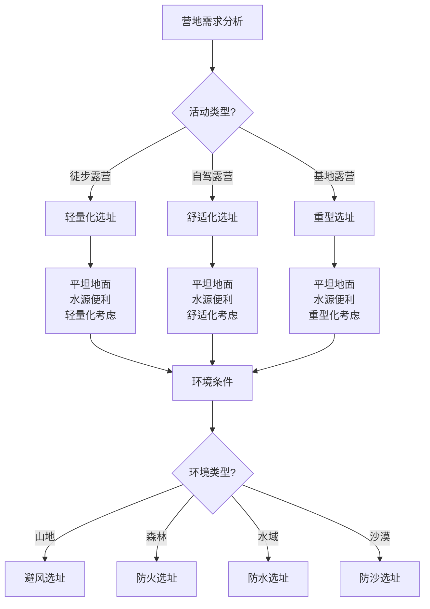

# 营地选址原则

## 🗺️ 选址基本原则

### 1. 安全性原则
- **地形安全**：避开悬崖、陡坡、滑坡区域
- **地质安全**：避开地震带、火山区域、不稳定地质
- **气象安全**：避开雷区、风口、易积水区域
- **生物安全**：避开野生动物栖息地、有毒植物区域
- **人为安全**：避开危险区域、军事区域、管制区域
- **应急安全**：确保应急通道、救援可达性

### 2. 环境适应性原则
- **气候适应**：适应当地气候条件、季节变化
- **地形适应**：适应地形特点、坡度、高度
- **植被适应**：适应植被类型、密度、分布
- **水源适应**：适应水源分布、水质、水量
- **土壤适应**：适应土壤类型、排水性、稳定性
- **生态适应**：适应生态系统、生物多样性

### 3. 便利性原则
- **交通便利**：便于到达、搬运装备、撤离
- **水源便利**：便于取水、用水、排水
- **燃料便利**：便于获取燃料、储存燃料
- **通讯便利**：便于通讯、信号接收、应急联系
- **生活便利**：便于日常生活、卫生处理、垃圾处理
- **活动便利**：便于户外活动、探险、娱乐

### 4. 环保性原则
- **生态保护**：保护生态环境、减少破坏
- **植被保护**：保护植被、避免踩踏
- **水源保护**：保护水源、避免污染
- **土壤保护**：保护土壤、避免压实
- **生物保护**：保护野生动物、避免干扰
- **景观保护**：保护自然景观、避免破坏

## 🌍 地形条件评估

### 1. 平坦度评估
- **水平度**：评估地面水平度、倾斜角度
- **平整度**：评估地面平整度、凹凸程度
- **稳定性**：评估地面稳定性、沉降风险
- **排水性**：评估地面排水性、积水风险
- **承载力**：评估地面承载力、支撑能力
- **可塑性**：评估地面可塑性、改造难度

### 2. 坡度评估
- **坡度测量**：测量地面坡度、倾斜角度
- **坡向分析**：分析坡向、阳光照射、风向
- **坡面稳定性**：评估坡面稳定性、滑坡风险
- **排水条件**：评估坡面排水条件、径流方向
- **植被覆盖**：评估坡面植被覆盖、保护作用
- **改造难度**：评估坡面改造难度、工程量

### 3. 高度评估
- **海拔高度**：测量海拔高度、气压变化
- **相对高度**：测量相对高度、地形起伏
- **气候影响**：评估高度对气候的影响
- **氧气含量**：评估氧气含量、呼吸影响
- **温度变化**：评估温度变化、保暖需求
- **视野条件**：评估视野条件、观察范围

### 4. 地质评估
- **岩石类型**：识别岩石类型、地质构造
- **土壤类型**：识别土壤类型、肥力状况
- **地质稳定性**：评估地质稳定性、地震风险
- **地下水**：评估地下水分布、水位变化
- **矿物资源**：评估矿物资源、开采价值
- **环境风险**：评估环境风险、污染风险

## 💧 水源条件评估

### 1. 水源类型
- **地表水**：河流、湖泊、池塘、溪流
- **地下水**：泉水、井水、地下河
- **降水**：雨水、雪水、露水
- **人工水**：水库、水塔、管道水
- **海水**：海水、咸水湖、盐湖
- **特殊水**：温泉、矿泉、冰川水

### 2. 水质评估
- **物理指标**：颜色、透明度、温度、气味
- **化学指标**：pH值、硬度、矿物质、污染物
- **生物指标**：细菌、病毒、寄生虫、藻类
- **放射性**：放射性物质、辐射水平
- **毒性**：有毒物质、重金属、农药
- **适用性**：饮用性、灌溉性、工业性

### 3. 水量评估
- **流量**：测量流量、水量变化
- **储量**：评估储量、可持续性
- **季节性**：评估季节性变化、干旱风险
- **年际变化**：评估年际变化、长期趋势
- **极端情况**：评估极端情况、应急需求
- **供需平衡**：评估供需平衡、保障能力

### 4. 取水便利性
- **距离**：测量取水距离、运输成本
- **高度差**：测量高度差、提水难度
- **道路条件**：评估道路条件、通行能力
- **设备需求**：评估设备需求、技术要求
- **时间成本**：评估时间成本、效率影响
- **安全风险**：评估安全风险、意外可能

## 🌿 植被条件评估

### 1. 植被类型
- **森林**：针叶林、阔叶林、混交林
- **草原**：高草草原、矮草草原、荒漠草原
- **灌木**：常绿灌木、落叶灌木、多肉植物
- **湿地**：沼泽、湿地、水生植物
- **荒漠**：沙漠、戈壁、盐碱地
- **人工林**：经济林、防护林、观赏林

### 2. 植被密度
- **覆盖度**：测量植被覆盖度、密度
- **层次结构**：分析层次结构、垂直分布
- **空间分布**：分析空间分布、聚集程度
- **季节变化**：分析季节变化、生长周期
- **年际变化**：分析年际变化、长期趋势
- **人为影响**：分析人为影响、干扰程度

### 3. 植被功能
- **生态功能**：生态平衡、生物多样性
- **环境功能**：净化空气、调节气候
- **防护功能**：防风、防沙、防侵蚀
- **经济功能**：木材、果实、药用价值
- **景观功能**：美化环境、观赏价值
- **文化功能**：文化象征、精神寄托

### 4. 植被保护
- **保护价值**：评估保护价值、重要性
- **保护措施**：制定保护措施、管理方案
- **影响评估**：评估人类活动影响
- **恢复能力**：评估恢复能力、再生能力
- **监测方案**：制定监测方案、跟踪变化
- **管理策略**：制定管理策略、可持续发展

## 📊 选址条件对比

| 选址条件 | 重要性 | 评估难度 | 影响程度 | 可控性 | 优先级 |
|----------|--------|----------|----------|--------|--------|
| **安全性** | 极高 | 中 | 极高 | 中 | ⭐⭐⭐⭐⭐ |
| **环境适应** | 高 | 高 | 高 | 低 | ⭐⭐⭐⭐ |
| **便利性** | 中 | 低 | 中 | 高 | ⭐⭐⭐ |
| **环保性** | 高 | 中 | 中 | 高 | ⭐⭐⭐⭐ |

## 🎯 选址决策树

## 🎓 费曼学习法应用

### 第一步：选择概念
选择"营地选址原则"作为学习概念

### 第二步：教授他人
用简单语言解释：
> "营地选址要考虑四个原则：安全性、环境适应性、便利性和环保性。要评估地形、水源、植被等条件，选择既安全又便利，既适应环境又保护生态的合适位置。"

### 第三步：回顾简化
- **选址原则**：安全性、环境适应、便利性、环保性
- **地形评估**：平坦度、坡度、高度、地质
- **水源评估**：水源类型、水质、水量、取水便利性
- **植被评估**：植被类型、密度、功能、保护

### 第四步：组织优化
建立选址与技能的关系：
- 选址原则 → [[02-理解层-原理机制/03-安全防护机制/01-风险评估体系|风险评估]]
- 地形评估 → [[02-理解层-原理机制/01-户外生存原理/02-环境因素影响|环境因素]]
- 水源评估 → [[03-野外生存/02-水源寻找与净化|水源管理]]
- 植被评估 → [[02-理解层-原理机制/04-环境保护理念/01-生态影响评估|生态评估]]

## 🏃‍♂️ 刻意练习要点

### 选址技能练习
1. **环境观察**：观察环境条件
2. **条件评估**：评估各种条件
3. **风险评估**：评估安全风险
4. **决策制定**：制定选址决策

### 实践验证
- **实地选址**：实地进行选址
- **条件验证**：验证评估条件
- **风险验证**：验证风险评估
- **效果验证**：验证选址效果

## 🔗 选址与技能的关系

### 选址原则技能
- **安全评估**：[[02-理解层-原理机制/03-安全防护机制/01-风险评估体系|风险评估]]
- **环境适应**：[[02-理解层-原理机制/01-户外生存原理/02-环境因素影响|环境因素]]
- **便利设计**：[[04-创新层-进阶发展/02-专业配置/02-定制化配置|定制配置]]
- **环保保护**：[[02-理解层-原理机制/04-环境保护理念|环境保护]]

### 地形评估技能
- **地形识别**：[[03-野外生存/01-方向识别技能|方向识别]]
- **坡度测量**：[[04-创新层-进阶发展/02-专业配置/03-技术装备集成|技术集成]]
- **高度测量**：[[04-创新层-进阶发展/02-专业配置/03-技术装备集成|技术集成]]
- **地质分析**：[[04-创新层-进阶发展/01-高级技巧/07-跨学科知识整合|跨学科知识]]

### 水源评估技能
- **水源寻找**：[[03-野外生存/02-水源寻找与净化|水源管理]]
- **水质检测**：[[04-创新层-进阶发展/02-专业配置/03-技术装备集成|技术集成]]
- **水量评估**：[[03-野外生存/02-水源寻找与净化|水源管理]]
- **取水技能**：[[03-野外生存/02-水源寻找与净化|水源管理]]

### 植被评估技能
- **植被识别**：[[03-野外生存/03-食物获取技能|食物获取]]
- **密度测量**：[[04-创新层-进阶发展/02-专业配置/03-技术装备集成|技术集成]]
- **功能分析**：[[02-理解层-原理机制/04-环境保护理念/01-生态影响评估|生态评估]]
- **保护管理**：[[02-理解层-原理机制/04-环境保护理念|环境保护]]

## 📋 营地选址检查清单

### 安全性评估
- [ ] 避开危险地形
- [ ] 避开不稳定地质
- [ ] 避开恶劣天气区域
- [ ] 避开野生动物栖息地
- [ ] 确保应急通道
- [ ] 确保救援可达性

### 环境适应性
- [ ] 适应气候条件
- [ ] 适应地形特点
- [ ] 适应植被类型
- [ ] 适应水源分布
- [ ] 适应土壤条件
- [ ] 适应生态系统

### 便利性评估
- [ ] 交通便利
- [ ] 水源便利
- [ ] 燃料便利
- [ ] 通讯便利
- [ ] 生活便利
- [ ] 活动便利

### 环保性评估
- [ ] 保护生态环境
- [ ] 保护植被
- [ ] 保护水源
- [ ] 保护土壤
- [ ] 保护野生动物
- [ ] 保护自然景观

## 🎯 营地选址策略

### 系统性策略
1. **需求分析**：分析营地需求
2. **环境调查**：调查环境条件
3. **条件评估**：评估各种条件
4. **决策制定**：制定选址决策

### 综合性策略
- **多因素考虑**：综合考虑多种因素
- **权重分析**：分析各因素权重
- **平衡决策**：平衡各种需求
- **持续优化**：持续优化选址

## 🔗 相关链接
- [[02-帐篷搭建技巧|帐篷搭建技巧]]
- [[03-篝火建设与管理|篝火建设与管理]]
- [[04-营地布局与规划|营地布局与规划]]
- [[02-理解层-原理机制/03-安全防护机制/01-风险评估体系|风险评估体系]]