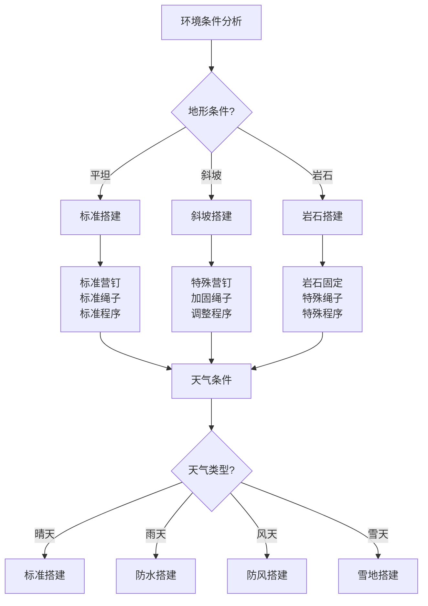

# 帐篷搭建技术

## 🏕️ 帐篷类型与结构

### 1. 帐篷结构分类
- **圆顶帐篷**：结构稳定、空间大、搭建简单
- **隧道帐篷**：抗风性强、空间利用率高、重量轻
- **金字塔帐篷**：轻量化、抗风性好、搭建快速
- **A字帐篷**：传统结构、空间大、稳定性好
- **单层帐篷**：轻量化、透气性好、适合干燥环境
- **双层帐篷**：防水性好、保暖性强、适合潮湿环境

### 2. 帐篷材质特性
- **外帐材质**：聚酯纤维、尼龙、硅化尼龙
- **内帐材质**：聚酯纤维、尼龙、网纱
- **地布材质**：聚乙烯、聚酯纤维、尼龙
- **杆架材质**：铝合金、碳纤维、玻璃纤维
- **拉链材质**：YKK拉链、防水拉链
- **扣件材质**：塑料扣件、金属扣件

### 3. 帐篷规格选择
- **人数容量**：1人、2人、3人、4人、多人
- **季节适用**：三季帐、四季帐、冬季帐
- **重量等级**：超轻、轻量、标准、重型
- **价格区间**：入门级、中端、高端、专业级
- **功能特点**：防水、透气、抗风、保暖
- **使用环境**：山地、森林、沙漠、海岸

## 🛠️ 搭建前准备

### 1. 场地准备
- **地面清理**：清理地面、去除尖锐物
- **地面平整**：平整地面、确保水平
- **排水处理**：处理排水、避免积水
- **防风考虑**：考虑风向、选择避风位置
- **阳光考虑**：考虑阳光、选择合适位置
- **安全距离**：保持安全距离、避免危险

### 2. 工具准备
- **营钉**：各种规格营钉、备用营钉
- **锤子**：橡胶锤、石头、木棍
- **绳子**：防风绳、固定绳、备用绳
- **地布**：防水地布、保护帐篷
- **测量工具**：卷尺、水平仪
- **清洁工具**：刷子、清洁布

### 3. 检查清单
- **帐篷完整性**：检查帐篷、杆架、配件
- **配件齐全**：营钉、绳子、地布、说明书
- **功能正常**：拉链、扣件、通风口
- **清洁状态**：清洁帐篷、去除污垢
- **干燥状态**：确保帐篷干燥、避免发霉
- **备用配件**：准备备用配件、应急使用

## 🏗️ 搭建步骤详解

### 1. 基础搭建
- **清理场地**：清理地面、去除尖锐物
- **铺设地布**：铺设防水地布、保护帐篷
- **展开帐篷**：展开帐篷、检查方向
- **组装杆架**：组装帐篷杆、检查完整性
- **插入杆架**：将杆架插入帐篷套管
- **固定基础**：固定帐篷基础、确保稳定

### 2. 主体搭建
- **立起帐篷**：立起帐篷主体、调整位置
- **固定营钉**：固定四角营钉、确保稳定
- **调整张力**：调整帐篷张力、确保紧绷
- **固定侧边**：固定侧边营钉、增强稳定
- **调整形状**：调整帐篷形状、确保美观
- **检查结构**：检查整体结构、确保安全

### 3. 细节完善
- **固定防风绳**：固定防风绳、增强抗风
- **调整通风口**：调整通风口、确保透气
- **固定内帐**：固定内帐、确保舒适
- **整理内部**：整理内部空间、摆放物品
- **检查密封**：检查帐篷密封、确保防水
- **最终检查**：最终检查、确保完美

## 🌬️ 特殊环境搭建

### 1. 强风环境
- **选择位置**：选择避风位置、利用地形
- **加固固定**：加固营钉、增加防风绳
- **降低高度**：降低帐篷高度、减少受风面
- **增加重量**：增加帐篷重量、提高稳定性
- **备用方案**：准备备用搭建方案
- **安全监控**：持续监控、及时调整

### 2. 雪地环境
- **压实雪地**：压实雪地、形成平台
- **增加保温**：增加保温层、提高温度
- **防风处理**：加强防风处理、抵御寒风
- **排水处理**：处理融雪排水、避免积水
- **安全考虑**：考虑雪崩风险、选择安全位置
- **保暖措施**：采取保暖措施、确保舒适

### 3. 沙地环境
- **固定方式**：使用沙袋、石头固定
- **防风处理**：加强防风处理、抵御沙尘
- **清洁维护**：及时清洁、避免沙尘积累
- **通风考虑**：考虑通风、避免闷热
- **防沙措施**：采取防沙措施、保护装备
- **环境适应**：适应沙地环境、调整策略

### 4. 岩石环境
- **固定方式**：使用岩石、特殊固定
- **保护措施**：保护帐篷、避免磨损
- **调整策略**：调整搭建策略、适应环境
- **安全考虑**：考虑安全风险、选择安全位置
- **工具使用**：使用特殊工具、提高效率
- **环境适应**：适应岩石环境、调整方法

## 🔧 维护与保养

### 1. 日常维护
- **清洁帐篷**：定期清洁、去除污垢
- **检查配件**：检查营钉、绳子、拉链
- **干燥储存**：确保干燥储存、避免发霉
- **功能测试**：定期测试功能、确保正常
- **磨损检查**：检查磨损情况、及时更换
- **记录维护**：记录维护情况、跟踪状态

### 2. 故障处理
- **拉链故障**：润滑拉链、更换拉链
- **破洞修补**：使用修补贴、专业修补
- **杆架断裂**：使用备用杆、临时固定
- **营钉丢失**：使用替代品、临时固定
- **绳子断裂**：更换绳子、临时固定
- **防水失效**：重新防水、专业处理

### 3. 储存保养
- **清洁干燥**：彻底清洁、完全干燥
- **折叠储存**：正确折叠、避免折痕
- **分类存放**：分类存放、便于取用
- **环境控制**：控制储存环境、避免损坏
- **定期检查**：定期检查、及时处理
- **更新换代**：及时更新、保持性能

## 📊 帐篷搭建对比

| 帐篷类型 | 搭建难度 | 抗风性 | 空间利用率 | 重量 | 价格 | 推荐指数 |
|----------|----------|--------|------------|------|------|----------|
| **圆顶帐篷** | 简单 | 中 | 高 | 中 | 中 | ⭐⭐⭐⭐ |
| **隧道帐篷** | 中 | 高 | 极高 | 轻 | 中 | ⭐⭐⭐⭐⭐ |
| **金字塔帐篷** | 简单 | 极高 | 中 | 极轻 | 高 | ⭐⭐⭐⭐ |
| **A字帐篷** | 复杂 | 中 | 高 | 重 | 低 | ⭐⭐⭐ |

## 🎯 帐篷搭建决策树

## 🎓 费曼学习法应用

### 第一步：选择概念
选择"帐篷搭建技术"作为学习概念

### 第二步：教授他人
用简单语言解释：
> "帐篷搭建需要选择合适的类型，按照正确的步骤搭建：清理场地、铺设地布、组装杆架、固定营钉、调整张力。不同环境需要不同的搭建技巧和防护措施。"

### 第三步：回顾简化
- **帐篷类型**：圆顶、隧道、金字塔、A字帐篷
- **搭建准备**：场地准备、工具准备、检查清单
- **搭建步骤**：基础搭建、主体搭建、细节完善
- **特殊环境**：强风、雪地、沙地、岩石环境

### 第四步：组织优化
建立搭建与技能的关系：
- 帐篷类型 → [[01-装备准备/01-基础装备清单|基础装备]]
- 搭建准备 → [[01-营地选址原则|营地选址]]
- 搭建步骤 → [[03-篝火建设与管理|篝火管理]]
- 特殊环境 → [[04-应急处理/02-恶劣天气应对|恶劣天气]]

## 🏃‍♂️ 刻意练习要点

### 搭建技能练习
1. **理论学习**：学习搭建理论知识
2. **模拟练习**：模拟搭建过程
3. **实地练习**：实地搭建练习
4. **环境适应**：适应不同环境

### 实践验证
- **搭建测试**：测试搭建技能
- **环境测试**：测试不同环境
- **故障处理**：练习故障处理
- **持续改进**：持续改进技能

## 🔗 搭建与技能的关系

### 帐篷类型技能
- **装备知识**：[[01-装备准备/01-基础装备清单|基础装备]]
- **材质知识**：[[02-理解层-原理机制/02-装备选择原理/02-材质与性能|材质性能]]
- **环境知识**：[[02-理解层-原理机制/01-户外生存原理/02-环境因素影响|环境因素]]
- **成本分析**：[[02-理解层-原理机制/02-装备选择原理/04-性价比分析|性价比分析]]

### 搭建准备技能
- **场地选择**：[[01-营地选址原则|营地选址]]
- **工具使用**：[[06-工具与维修|工具维修]]
- **安全检查**：[[02-理解层-原理机制/03-安全防护机制/01-风险评估体系|风险评估]]
- **环境评估**：[[02-理解层-原理机制/04-环境保护理念/01-生态影响评估|生态评估]]

### 搭建步骤技能
- **操作技能**：[[03-野外生存|野外生存]]
- **协调技能**：[[04-创新层-进阶发展/03-领导力培养/04-沟通协调技巧|沟通协调]]
- **调整技能**：[[04-创新层-进阶发展/02-专业配置/05-升级优化策略|升级优化]]
- **检查技能**：[[04-创新层-进阶发展/02-专业配置/04-维护保养体系|维护保养]]

### 特殊环境技能
- **环境适应**：[[02-理解层-原理机制/01-户外生存原理/02-环境因素影响|环境因素]]
- **应急处理**：[[04-应急处理/02-恶劣天气应对|恶劣天气]]
- **安全防护**：[[02-理解层-原理机制/03-安全防护机制|安全防护]]
- **创新应对**：[[04-创新层-进阶发展/01-高级技巧|高级技巧]]

## 📋 帐篷搭建检查清单

### 搭建前准备
- [ ] 选择合适的帐篷类型
- [ ] 选择合适的搭建场地
- [ ] 准备必要的工具
- [ ] 检查帐篷完整性

### 搭建过程
- [ ] 清理搭建场地
- [ ] 铺设防水地布
- [ ] 组装帐篷杆架
- [ ] 固定帐篷营钉
- [ ] 调整帐篷张力
- [ ] 固定防风绳子

### 搭建后检查
- [ ] 检查帐篷稳定性
- [ ] 检查帐篷密封性
- [ ] 检查通风透气性
- [ ] 检查内部空间
- [ ] 检查外部环境
- [ ] 准备应急方案

## 🎯 帐篷搭建策略

### 系统性策略
1. **计划制定**：制定搭建计划
2. **环境分析**：分析环境条件
3. **工具准备**：准备必要工具
4. **步骤执行**：按步骤执行搭建

### 适应性策略
- **环境适应**：适应不同环境
- **条件适应**：适应不同条件
- **团队适应**：适应团队协作
- **持续改进**：持续改进技能

## 🔗 相关链接
- [[01-营地选址原则|营地选址原则]]
- [[03-篝火建设与管理|篝火建设与管理]]
- [[04-营地布局与规划|营地布局与规划]]
- [[05-户外烹饪技巧|户外烹饪技巧]]