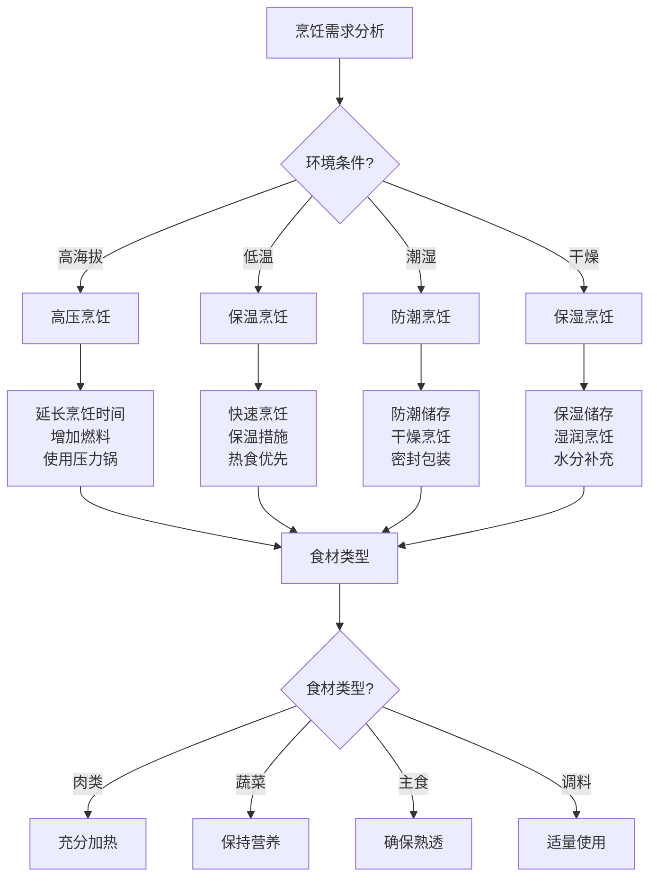

# 户外烹饪技巧

## 🍳 烹饪设备选择

### 1. 炉具类型
- **气炉**：便携式气炉、火力稳定、易于控制
- **酒精炉**：轻量化、燃料易得、适合轻装
- **柴火炉**：燃料丰富、火力强劲、适合重装
- **固体燃料炉**：轻量化、燃料稳定、适合应急
- **太阳能炉**：环保节能、无燃料消耗、适合晴天
- **电炉**：清洁环保、易于控制、需要电源

### 2. 锅具选择
- **套锅**：不锈钢套锅、容量多样、便于收纳
- **单锅**：轻量化单锅、适合简单烹饪
- **平底锅**：煎炒专用、受热均匀、易于操作
- **深锅**：炖煮专用、容量大、适合多人
- **压力锅**：烹饪快速、节省燃料、适合高海拔
- **蒸锅**：蒸煮专用、保持营养、适合健康饮食

### 3. 餐具选择
- **不锈钢餐具**：耐用、易清洁、导热性好
- **钛合金餐具**：轻量化、耐腐蚀、价格较高
- **塑料餐具**：轻量化、不易碎、适合轻装
- **木质餐具**：环保、美观、需要保养
- **陶瓷餐具**：美观、易清洁、易碎
- **折叠餐具**：便携、节省空间、功能多样

### 4. 辅助工具
- **点火工具**：打火机、火柴、火石
- **燃料**：气罐、酒精、固体燃料
- **清洁用品**：洗洁精、清洁布、垃圾袋
- **储存容器**：密封盒、保鲜袋、调料瓶
- **测量工具**：量杯、量勺、温度计
- **安全工具**：灭火器、防护手套、急救包

## 🔥 燃料与火源管理

### 1. 燃料选择
- **气体燃料**：丙烷、丁烷、混合气
- **液体燃料**：酒精、汽油、煤油
- **固体燃料**：木柴、木炭、固体酒精
- **生物燃料**：秸秆、草料、粪便
- **电力燃料**：电池、太阳能、风力
- **混合燃料**：多种燃料组合、提高效率

### 2. 火源控制
- **火力调节**：调节火力大小、控制温度
- **燃烧效率**：提高燃烧效率、节省燃料
- **安全控制**：控制火源、防止意外
- **环境适应**：适应环境条件、调整策略
- **燃料管理**：管理燃料、避免浪费
- **应急处理**：应急处理、快速响应

### 3. 燃料储存
- **储存容器**：选择合适的储存容器
- **储存环境**：控制储存环境、确保安全
- **储存期限**：了解储存期限、及时更新
- **储存数量**：确定储存数量、平衡供需
- **储存安全**：确保储存安全、防止意外
- **储存管理**：管理储存、提高效率

### 4. 燃料使用
- **使用效率**：提高使用效率、减少浪费
- **使用安全**：确保使用安全、防止意外
- **使用控制**：控制使用量、节约燃料
- **使用监控**：监控使用状态、及时调整
- **使用记录**：记录使用情况、分析优化
- **使用优化**：优化使用、提高效率

## 🍽️ 烹饪技巧与方法

### 1. 基础烹饪技巧
- **火候控制**：控制火候、掌握温度
- **时间控制**：控制时间、确保熟度
- **调味技巧**：掌握调味、提升口感
- **刀工技巧**：掌握刀工、提高效率
- **食材处理**：处理食材、保持新鲜
- **营养搭配**：搭配营养、均衡饮食

### 2. 烹饪方法
- **煮**：水煮、汤煮、粥煮
- **炒**：爆炒、滑炒、干炒
- **炖**：清炖、红烧、焖炖
- **烤**：明火烤、炭火烤、烤箱烤
- **蒸**：水蒸、汽蒸、隔水蒸
- **炸**：油炸、煎炸、干炸

### 3. 特殊环境烹饪
- **高海拔烹饪**：调整火候、延长时间
- **低温环境**：保温措施、快速烹饪
- **潮湿环境**：防潮措施、干燥储存
- **干燥环境**：保湿措施、防止干燥
- **强风环境**：防风措施、稳定火源
- **雨雪环境**：防雨措施、保护设备

### 4. 应急烹饪
- **简单烹饪**：简化烹饪、快速制作
- **应急食材**：使用应急食材、维持生存
- **工具替代**：使用替代工具、应急制作
- **燃料替代**：使用替代燃料、应急使用
- **时间控制**：控制时间、快速完成
- **安全考虑**：考虑安全、防止意外

## 🥘 食材处理与储存

### 1. 食材选择
- **新鲜度**：选择新鲜食材、确保质量
- **营养性**：选择营养食材、均衡饮食
- **便携性**：选择便携食材、便于携带
- **储存性**：选择易储存食材、延长保质期
- **适应性**：选择适应环境食材、提高成功率
- **经济性**：选择经济食材、控制成本

### 2. 食材处理
- **清洗处理**：清洗食材、去除污垢
- **切割处理**：切割食材、便于烹饪
- **腌制处理**：腌制食材、增加风味
- **脱水处理**：脱水食材、延长保质期
- **包装处理**：包装食材、便于储存
- **预处理**：预处理食材、提高效率

### 3. 食材储存
- **储存容器**：选择合适的储存容器
- **储存环境**：控制储存环境、确保质量
- **储存温度**：控制储存温度、延长保质期
- **储存湿度**：控制储存湿度、防止变质
- **储存时间**：控制储存时间、及时使用
- **储存安全**：确保储存安全、防止污染

### 4. 食材管理
- **库存管理**：管理库存、避免浪费
- **使用计划**：制定使用计划、合理安排
- **质量监控**：监控质量、及时处理
- **安全监控**：监控安全、防止意外
- **效率优化**：优化效率、提高利用率
- **持续改进**：持续改进、提高管理水平

## 📊 烹饪设备对比

| 设备类型 | 便携性 | 火力 | 燃料消耗 | 安全性 | 价格 | 推荐指数 |
|----------|--------|------|----------|--------|------|----------|
| **气炉** | 高 | 高 | 中 | 高 | 中 | ⭐⭐⭐⭐⭐ |
| **酒精炉** | 极高 | 中 | 低 | 中 | 低 | ⭐⭐⭐⭐ |
| **柴火炉** | 低 | 极高 | 低 | 中 | 低 | ⭐⭐⭐ |
| **固体燃料炉** | 高 | 低 | 中 | 高 | 中 | ⭐⭐⭐ |
| **太阳能炉** | 中 | 中 | 无 | 极高 | 高 | ⭐⭐⭐⭐ |
| **电炉** | 中 | 中 | 无 | 极高 | 中 | ⭐⭐⭐ |

## 🎯 烹饪技巧决策树

## 🎓 费曼学习法应用

### 第一步：选择概念
选择"户外烹饪技巧"作为学习概念

### 第二步：教授他人
用简单语言解释：
> "户外烹饪需要选择合适的设备、燃料和食材，掌握基础烹饪技巧，适应不同环境条件。要控制火候、时间、调味，确保食物安全营养，同时考虑便携性和储存性。"

### 第三步：回顾简化
- **烹饪设备**：炉具、锅具、餐具、辅助工具
- **燃料管理**：燃料选择、火源控制、储存使用
- **烹饪技巧**：基础技巧、烹饪方法、特殊环境、应急烹饪
- **食材管理**：食材选择、处理、储存、管理

### 第四步：组织优化
建立烹饪与技能的关系：
- 烹饪设备 → [[01-装备准备/01-基础装备清单|基础装备]]
- 燃料管理 → [[01-装备准备/06-燃料与能源|燃料管理]]
- 烹饪技巧 → [[03-野外生存|野外生存]]
- 食材管理 → [[03-野外生存/03-食物获取技能|食物获取]]

## 🏃‍♂️ 刻意练习要点

### 烹饪技能练习
1. **设备使用**：练习设备使用技能
2. **火源控制**：练习火源控制技能
3. **烹饪技巧**：练习烹饪技巧
4. **食材处理**：练习食材处理技能

### 实践验证
- **烹饪测试**：测试烹饪技能
- **环境测试**：测试不同环境
- **安全测试**：测试烹饪安全
- **持续改进**：持续改进技能

## 🔗 烹饪与技能的关系

### 烹饪设备技能
- **设备选择**：[[01-装备准备/01-基础装备清单|基础装备]]
- **设备使用**：[[03-野外生存|野外生存]]
- **设备维护**：[[04-创新层-进阶发展/02-专业配置/04-维护保养体系|维护保养]]
- **设备优化**：[[04-创新层-进阶发展/02-专业配置/05-升级优化策略|升级优化]]

### 燃料管理技能
- **燃料选择**：[[01-装备准备/06-燃料与能源|燃料管理]]
- **火源控制**：[[03-篝火建设与管理|篝火管理]]
- **燃料储存**：[[01-装备准备/06-燃料与能源|燃料管理]]
- **燃料使用**：[[01-装备准备/06-燃料与能源|燃料管理]]

### 烹饪技巧技能
- **基础技巧**：[[03-野外生存|野外生存]]
- **环境适应**：[[02-理解层-原理机制/01-户外生存原理/02-环境因素影响|环境因素]]
- **应急处理**：[[04-应急处理|应急处理]]
- **创新技巧**：[[04-创新层-进阶发展/01-高级技巧|高级技巧]]

### 食材管理技能
- **食材选择**：[[03-野外生存/03-食物获取技能|食物获取]]
- **食材处理**：[[03-野外生存/03-食物获取技能|食物获取]]
- **食材储存**：[[03-野外生存/03-食物获取技能|食物获取]]
- **食材管理**：[[04-创新层-进阶发展/03-领导力培养/02-时间管理技能|时间管理]]

## 📋 户外烹饪检查清单

### 烹饪设备
- [ ] 选择合适的炉具
- [ ] 选择合适的锅具
- [ ] 选择合适的餐具
- [ ] 准备必要的辅助工具

### 燃料管理
- [ ] 选择合适的燃料
- [ ] 控制火源
- [ ] 储存燃料
- [ ] 使用燃料

### 烹饪技巧
- [ ] 掌握基础烹饪技巧
- [ ] 掌握烹饪方法
- [ ] 适应特殊环境
- [ ] 掌握应急烹饪

### 食材管理
- [ ] 选择合适的食材
- [ ] 处理食材
- [ ] 储存食材
- [ ] 管理食材

## 🎯 户外烹饪策略

### 系统性策略
1. **需求分析**：分析烹饪需求
2. **设备选择**：选择合适的设备
3. **技巧掌握**：掌握烹饪技巧
4. **持续改进**：持续改进技能

### 适应性策略
- **环境适应**：适应不同环境
- **食材适应**：适应不同食材
- **设备适应**：适应不同设备
- **持续优化**：持续优化烹饪

## 🔗 相关链接
- [[01-营地选址原则|营地选址原则]]
- [[02-帐篷搭建技术|帐篷搭建技术]]
- [[03-篝火建设与管理|篝火建设与管理]]
- [[04-营地布局与规划|营地布局与规划]]
