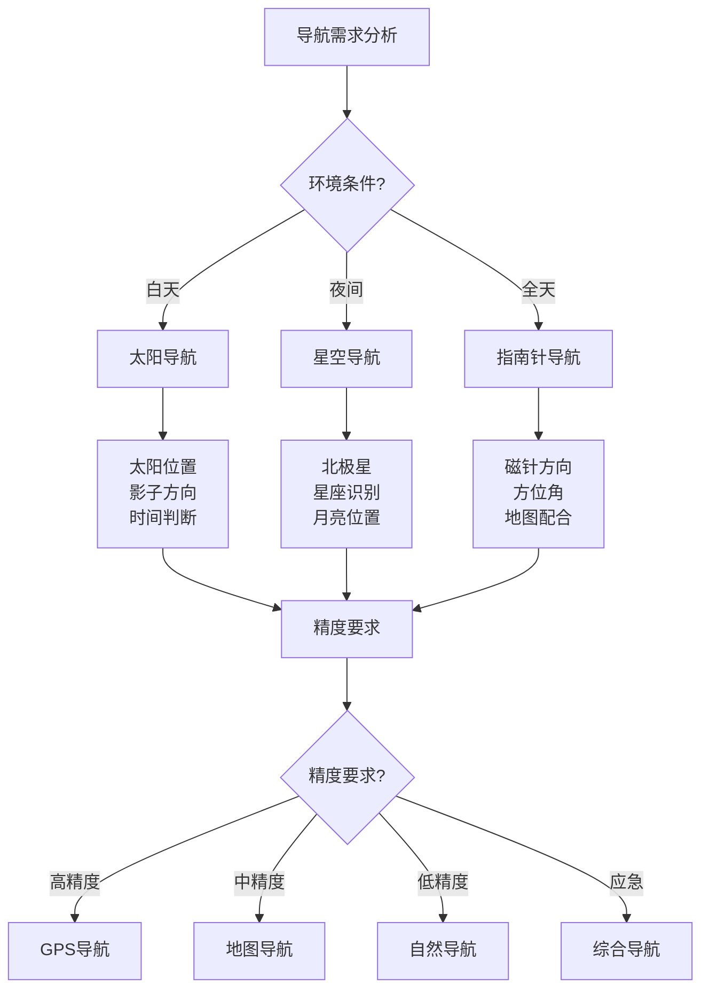

# 方向识别技能

## 🧭 基础导航原理

### 1. 地球磁场原理
- **磁极概念**：地球磁极、磁偏角、磁倾角
- **磁场特性**：磁场强度、磁场方向、磁场变化
- **磁偏角**：真北与磁北的差异、地区差异
- **磁倾角**：磁场倾斜角度、纬度影响
- **磁场干扰**：金属干扰、电磁干扰、地质干扰
- **磁场应用**：指南针原理、导航应用

### 2. 天体导航原理
- **太阳导航**：太阳位置、影子方向、时间判断
- **月亮导航**：月亮位置、月相变化、夜间导航
- **星星导航**：北极星、星座识别、方向判断
- **天体运动**：天体轨迹、季节变化、时间计算
- **天文历法**：天文历、节气变化、时间推算
- **导航精度**：导航精度、误差分析、校正方法

### 3. 地形导航原理
- **地形特征**：山峰、河流、湖泊、森林
- **地形识别**：地形识别、特征分析、位置判断
- **等高线**：等高线原理、地形图阅读、高度判断
- **地形变化**：地形变化、地质构造、地貌特征
- **地形记忆**：地形记忆、路径识别、方向判断
- **地形应用**：地形导航、路径规划、位置确定

### 4. 自然导航原理
- **植物导航**：植物生长、阳光方向、风向判断
- **动物导航**：动物行为、迁徙路线、方向判断
- **风向导航**：风向变化、季节风向、方向判断
- **水流导航**：水流方向、河流走向、方向判断
- **声音导航**：声音传播、距离判断、方向识别
- **气味导航**：气味传播、风向判断、位置识别

## 🧭 指南针使用技巧

### 1. 指南针类型
- **磁针指南针**：传统磁针、精度高、易受干扰
- **电子指南针**：数字显示、功能丰富、需要电源
- **军用指南针**：精度极高、功能全面、价格昂贵
- **户外指南针**：轻量化、防水、适合户外
- **手机指南针**：便携、功能多、精度一般
- **手表指南针**：集成设计、方便使用、精度中等

### 2. 指南针操作
- **水平放置**：保持水平、避免倾斜、确保精度
- **远离干扰**：远离金属、电子设备、磁场干扰
- **稳定读取**：稳定读取、避免晃动、准确记录
- **校正偏差**：校正磁偏角、调整方向、提高精度
- **重复测量**：重复测量、验证结果、确保准确
- **记录数据**：记录数据、建立档案、便于分析

### 3. 方向测量
- **基本方向**：东、南、西、北四个基本方向
- **精确方向**：360度方位角、精确测量、详细记录
- **相对方向**：相对方向、角度计算、位置关系
- **目标方向**：目标方向、距离估算、路径规划
- **返回方向**：返回方向、反向计算、安全返回
- **备用方向**：备用方向、多方案、应急准备

### 4. 导航应用
- **地图配合**：与地图配合、位置确定、路径规划
- **GPS配合**：与GPS配合、精度提高、功能增强
- **团队导航**：团队导航、协调配合、安全行进
- **应急导航**：应急导航、快速定位、救援指导
- **夜间导航**：夜间导航、特殊技巧、安全考虑
- **恶劣天气**：恶劣天气导航、特殊处理、安全第一

## 🌞 太阳导航技巧

### 1. 太阳位置判断
- **日出日落**：日出方向、日落方向、时间判断
- **正午太阳**：正午太阳、最高位置、方向判断
- **影子方向**：影子方向、太阳位置、方向判断
- **季节变化**：季节变化、太阳轨迹、方向调整
- **纬度影响**：纬度影响、太阳高度、方向变化
- **时间计算**：时间计算、太阳位置、方向推算

### 2. 影子导航法
- **立杆测影**：立杆测影、影子方向、方向判断
- **手表测影**：手表测影、时间计算、方向判断
- **身体测影**：身体测影、影子方向、方向判断
- **物体测影**：物体测影、影子长度、方向判断
- **影子变化**：影子变化、时间推移、方向跟踪
- **精度提高**：精度提高、多次测量、平均计算

### 3. 时间判断
- **日出时间**：日出时间、季节变化、地区差异
- **日落时间**：日落时间、季节变化、地区差异
- **正午时间**：正午时间、太阳最高、方向判断
- **时间计算**：时间计算、太阳位置、方向推算
- **季节调整**：季节调整、时间变化、方向修正
- **地区调整**：地区调整、时区差异、方向修正

### 4. 太阳导航应用
- **方向确定**：方向确定、太阳位置、方向判断
- **时间估算**：时间估算、太阳位置、时间推算
- **季节判断**：季节判断、太阳轨迹、季节识别
- **纬度估算**：纬度估算、太阳高度、纬度推算
- **导航辅助**：导航辅助、其他方法、综合导航
- **应急使用**：应急使用、快速判断、安全导航

## ⭐ 星空导航技巧

### 1. 北极星识别
- **北极星位置**：北极星位置、星座识别、方向判断
- **大熊座**：大熊座、北斗七星、北极星定位
- **小熊座**：小熊座、北极星、方向判断
- **星座变化**：星座变化、季节变化、位置调整
- **精度考虑**：精度考虑、误差分析、校正方法
- **应用技巧**：应用技巧、快速识别、方向判断

### 2. 星座识别
- **主要星座**：主要星座、季节星座、方向星座
- **星座特征**：星座特征、形状识别、位置记忆
- **季节变化**：季节变化、星座位置、时间调整
- **方向判断**：方向判断、星座位置、方向推算
- **文化背景**：文化背景、星座故事、记忆辅助
- **实用技巧**：实用技巧、快速识别、方向判断

### 3. 月亮导航
- **月相变化**：月相变化、月亮形状、时间判断
- **月亮位置**：月亮位置、月亮轨迹、方向判断
- **月亮时间**：月亮时间、月亮升起、月亮落下
- **月亮方向**：月亮方向、月亮位置、方向推算
- **季节调整**：季节调整、月亮轨迹、时间修正
- **精度考虑**：精度考虑、月亮变化、误差分析

### 4. 星空导航应用
- **夜间导航**：夜间导航、星空识别、方向判断
- **时间判断**：时间判断、星座位置、时间推算
- **季节识别**：季节识别、星座变化、季节判断
- **方向确定**：方向确定、星空位置、方向推算
- **导航辅助**：导航辅助、其他方法、综合导航
- **应急使用**：应急使用、快速判断、安全导航

## 🗺️ 地图导航技巧

### 1. 地图类型
- **地形图**：地形图、等高线、地形特征
- **交通图**：交通图、道路网络、交通信息
- **卫星图**：卫星图、实景图像、详细地形
- **专题图**：专题图、特定信息、专业用途
- **历史地图**：历史地图、变化对比、时间分析
- **数字地图**：数字地图、电子地图、功能丰富

### 2. 地图阅读
- **比例尺**：比例尺、距离计算、面积估算
- **方向标**：方向标、地图方向、方向判断
- **图例**：图例、符号含义、信息解读
- **等高线**：等高线、地形高度、地形特征
- **颜色含义**：颜色含义、地形类型、信息区分
- **标注信息**：标注信息、地名、地标、重要信息

### 3. 定位技巧
- **地标定位**：地标定位、特征识别、位置确定
- **交叉定位**：交叉定位、多方向、位置确定
- **距离定位**：距离定位、距离测量、位置推算
- **角度定位**：角度定位、角度测量、位置计算
- **GPS定位**：GPS定位、卫星信号、精确位置
- **综合定位**：综合定位、多种方法、位置确定

### 4. 路径规划
- **路线选择**：路线选择、最优路径、安全考虑
- **距离计算**：距离计算、路径长度、时间估算
- **难度评估**：难度评估、地形难度、体力要求
- **安全考虑**：安全考虑、风险因素、应急预案
- **时间规划**：时间规划、行进时间、休息安排
- **备用路线**：备用路线、应急方案、安全返回

## 📊 导航方法对比

| 导航方法 | 精度 | 适用环境 | 技术要求 | 设备需求 | 可靠性 | 推荐指数 |
|----------|------|----------|----------|----------|--------|----------|
| **指南针** | 高 | 通用 | 中 | 低 | 高 | ⭐⭐⭐⭐⭐ |
| **太阳导航** | 中 | 晴天 | 低 | 无 | 中 | ⭐⭐⭐⭐ |
| **星空导航** | 中 | 夜间 | 高 | 无 | 中 | ⭐⭐⭐ |
| **地图导航** | 高 | 通用 | 高 | 中 | 高 | ⭐⭐⭐⭐⭐ |
| **GPS导航** | 极高 | 通用 | 低 | 高 | 极高 | ⭐⭐⭐⭐⭐ |

## 🎯 方向识别决策树

## 🎓 费曼学习法应用

### 第一步：选择概念
选择"方向识别技能"作为学习概念

### 第二步：教授他人
用简单语言解释：
> "方向识别是野外生存的基本技能：可以用指南针测量磁场方向，用太阳影子判断方向，用星星月亮导航，用地图定位。不同环境要用不同方法，多种方法结合最可靠。"

### 第三步：回顾简化
- **基础原理**：地球磁场、天体导航、地形导航、自然导航
- **指南针**：类型选择、操作技巧、方向测量、导航应用
- **太阳导航**：位置判断、影子导航、时间判断、导航应用
- **星空导航**：北极星识别、星座识别、月亮导航、导航应用

### 第四步：组织优化
建立导航与技能的关系：
- 基础原理 → [[02-理解层-原理机制/01-户外生存原理/02-环境因素影响|环境因素]]
- 指南针 → [[01-装备准备/01-基础装备清单|基础装备]]
- 太阳导航 → [[02-理解层-原理机制/01-户外生存原理/02-环境因素影响|环境因素]]
- 星空导航 → [[03-野外生存/02-水源寻找与净化|水源管理]]

## 🏃‍♂️ 刻意练习要点

### 导航技能练习
1. **理论学习**：学习导航理论知识
2. **设备使用**：练习设备使用技能
3. **实地练习**：实地进行导航练习
4. **环境适应**：适应不同环境条件

### 实践验证
- **导航测试**：测试导航技能
- **精度测试**：测试导航精度
- **环境测试**：测试不同环境
- **持续改进**：持续改进技能

## 🔗 导航与技能的关系

### 基础原理技能
- **物理知识**：[[04-创新层-进阶发展/01-高级技巧/07-跨学科知识整合|跨学科知识]]
- **地理知识**：[[04-创新层-进阶发展/01-高级技巧/07-跨学科知识整合|跨学科知识]]
- **天文知识**：[[04-创新层-进阶发展/01-高级技巧/07-跨学科知识整合|跨学科知识]]
- **环境知识**：[[02-理解层-原理机制/01-户外生存原理/02-环境因素影响|环境因素]]

### 指南针技能
- **设备使用**：[[01-装备准备/01-基础装备清单|基础装备]]
- **操作技巧**：[[03-野外生存|野外生存]]
- **精度控制**：[[04-创新层-进阶发展/02-专业配置/05-升级优化策略|升级优化]]
- **故障处理**：[[04-创新层-进阶发展/02-专业配置/04-维护保养体系|维护保养]]

### 太阳导航技能
- **观察技能**：[[03-野外生存|野外生存]]
- **计算技能**：[[04-创新层-进阶发展/01-高级技巧/07-跨学科知识整合|跨学科知识]]
- **时间技能**：[[04-创新层-进阶发展/03-领导力培养/02-时间管理技能|时间管理]]
- **判断技能**：[[04-创新层-进阶发展/03-领导力培养/06-责任与担当|责任担当]]

### 星空导航技能
- **识别技能**：[[03-野外生存|野外生存]]
- **观察技能**：[[03-野外生存|野外生存]]
- **记忆技能**：[[04-创新层-进阶发展/01-高级技巧/07-跨学科知识整合|跨学科知识]]
- **应用技能**：[[03-野外生存|野外生存]]

## 📋 方向识别检查清单

### 基础原理
- [ ] 了解地球磁场原理
- [ ] 了解天体导航原理
- [ ] 了解地形导航原理
- [ ] 了解自然导航原理

### 指南针使用
- [ ] 选择合适的指南针
- [ ] 掌握指南针操作
- [ ] 学会方向测量
- [ ] 应用导航技巧

### 太阳导航
- [ ] 学会太阳位置判断
- [ ] 掌握影子导航法
- [ ] 学会时间判断
- [ ] 应用太阳导航

### 星空导航
- [ ] 学会北极星识别
- [ ] 掌握星座识别
- [ ] 学会月亮导航
- [ ] 应用星空导航

## 🎯 方向识别策略

### 系统性策略
1. **理论学习**：学习导航理论知识
2. **设备掌握**：掌握导航设备使用
3. **技能练习**：练习导航技能
4. **综合应用**：综合应用导航技能

### 适应性策略
- **环境适应**：适应不同环境
- **条件适应**：适应不同条件
- **精度适应**：适应不同精度要求
- **持续改进**：持续改进技能

## 🔗 相关链接
- [[02-水源寻找与净化|水源寻找与净化]]
- [[03-食物获取技能|食物获取技能]]
- [[04-生火技术|生火技术]]
- [[05-高海拔适应|高海拔适应]]